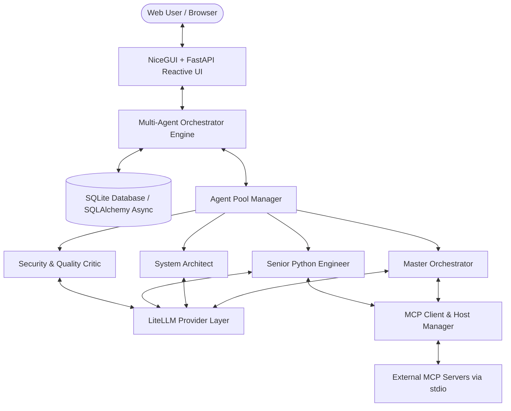

# 🤖 MADO — Multi-Agent Debate & Orchestration Platform

`v1.2` · `LGPL-3.0-or-later` · `Python 3.11+`

> **MCP 도구를 활용하는 반응형 멀티 에이전트 협업 & 토론 웹 애플리케이션**  
> Dynamic Agent Profiling via `conf.json`, MCP Tool Integration, Multi-Model LLM Abstraction (LiteLLM), StateGraph Orchestration, and NiceGUI + FastAPI Reactive Web Interface.

```
Author: Ha, Jaehee, Email: lovesm135@naver.com, Version: v1.2
```

동일한 내용을 웹 UI 우측 상단의 **ⓘ** 버튼을 통해서도 확인하실 수 있습니다.

---

## 🌟 주요 특징 (Key Features)

1. **`conf.json` 기반 동적 에이전트 프로파일링**:
   - 시스템 기동 시 `conf.json` 설정 파일로부터 에이전트 풀(Agent Pool)과 MCP 서버를 동적으로 등록합니다.
   - `${OPENAI_API_KEY}`, `${ANTHROPIC_API_KEY}` 등 환경 변수의 동적 치환을 완벽히 지원합니다.
2. **Model Context Protocol (MCP) 내장 호스트 & 도구 연동**:
   - Filesystem · Memory(지식 그래프) · Git · Python 코드 실행 샌드박스 MCP 서버와 JSON-RPC stdio 통신을 수행합니다.
   - 공식 레퍼런스 서버(Node/Python)와 자체 샌드박스를 **번들로 동봉**하여 폐쇄망 환경에서도 도구를 바로 사용하실 수 있습니다.
   - 도구 검색 및 Function Calling 스키마 자동 변환, 실행 결과(Observation) 피드백 루프를 지원합니다.
   - **도구 호출 예산 안전가드**: 남은 호출 횟수를 에이전트에게 사전에 단계별로 안내하고(한계에 근접할수록 빈번하게 고지), 상한에 도달하면 발언을 폐기하는 대신 **사용자에게 상한 확장을 문의하거나 즉시 마무리하도록 유도**합니다.
   - **컨텍스트 창 포화 안전가드**: 남은 컨텍스트 여유를 사용량 구간별로 미리 안내하고, Memory MCP가 활성화되어 있으면 **토큰 한도로 잘리기 전에 중요 내용을 지식 그래프로 이전**하도록 안내합니다. 컨텍스트 한도를 초과할 경우 임의로 내용을 유실시키지 않고 사용자에게 상향 여부를 문의합니다.
   - **스킬 (필요 시 동적으로 참조하는 작업 지침 및 스크립트)**: `skills/<이름>/SKILL.md` 폴더 하나가 독립적인 스킬 하나에 대응합니다. 에이전트는 평소에 스킬 이름과 설명만 인지하다가, 수행할 작업이 부합할 때 본문 지침을 불러와 따릅니다. 에이전트별로 사용할 스킬을 지정할 수 있으며(`allowed_skills`), 스킬의 추가·수정 및 활성화/비활성화 변경 사항은 진행 중인 대화 세션에도 다음 발언부터 즉시 반영됩니다. Python 스크립트가 포함된 스킬은 실행 도구를 보유한 에이전트가 호출할 때 작업 공간(`.mado/skills/<이름>/`)으로 복사되어 샌드박스 환경에서 실행되며, 도구 보안 정책을 동일하게 거칩니다. Mermaid 다이어그램 작성 규칙을 담은 `mermaid-diagrams`와 CSV 프로파일링 스크립트를 제공하는 `csv-profile` 스킬이 기본 탑재되어 있습니다.
   - **도구 보안 (허용 · 묻기 · 거부)**: 도구 호출을 `read(경로)`·`write(경로)`·`exec(코드)`·`net(호스트)` 같은 **행위 단위**로 변환하여 판정하므로, `read(**/.env)` 차단 규칙 하나로 파일 도구와 샌드박스 코드 내 `open('.env')` 시도를 동시에 방어합니다. 세션별로 보안 모드(읽기 전용·기본·검토·자동)를 선택할 수 있으며, "묻기" 대상 호출은 사용자 승인 카드(이번만 허용·이 세션에서 허용·항상 허용·사유를 입력한 거부) 형태로 표시됩니다. 응답이 없으면 기본적으로 호출을 거부합니다. MADO 자체 설정·비밀 정보·다른 대화의 기억에는 어떤 설정으로도 도구가 접근할 수 없습니다.
3. **다양한 LLM 프로바이더 추상화 (LiteLLM)**:
   - OpenAI (`gpt-4o`), Anthropic (`claude-3-5-sonnet`), Google (`gemini-1.5-pro`), Ollama 등을 통합 지원합니다.
   - `llm` 전역 설정에서 **API URL(`api_base`), 모델명, API 버전, 프로바이더(provider), 타임아웃/재시도 횟수, 커스텀 헤더**를 지정하면 모든 에이전트가 이를 기본적으로 상속합니다.
   - 사내 OpenAI 호환 게이트웨이, vLLM, LM Studio, Ollama 등 **API 키가 필요 없는 로컬 엔드포인트도 원활하게 사용 가능**합니다.
   - **Sequential Thinking(단계적 사고)**을 `prompt` / `native` / `mcp` 3가지 모드로 에이전트별로 설정할 수 있습니다.
   - 엔드포인트 연결에 실패할 경우 **임의의 대체 답변을 생성하지 않고**, 해당 발언 자리에 연결 실패 사실을 명확하게 기록합니다.
4. **브라우저와 독립된 백그라운드 토론 오케스트레이션**:
   - 페이지를 새로고침하거나 페르소나 설정 화면으로 이동해도 백그라운드에서 진행 중인 토론이 중단되지 않습니다.
   - 화면으로 복귀하면 그동안 진행된 발언 내역과 진행률이 즉시 복원되어 표시되며, 현재 생성 중인 발언은 실시간 스트리밍으로 이어집니다.
   - 사이드바의 세션 목록과 페르소나 화면에 "진행 중" 상태가 표시됩니다.

5. **세션별 페르소나 & 시스템 프롬프트 (첫 대화 시 고정)**:
   - `/personas/{session_id}` 편집 페이지에서 에이전트의 이름·역할·시스템 프롬프트를 세션마다 독립적으로 지정할 수 있습니다.
   - 첫 번째 사용자 메시지가 전송되는 순간 전체 에이전트의 페르소나가 데이터베이스에 스냅샷 형태로 저장되며 잠금 처리됩니다.
   - 세션을 추후 다시 열더라도 해당 시점에 저장된 페르소나를 유지하여 토론을 이어갑니다 (`conf.json` 설정이 변경되어도 기존 세션 유지).
   - **카드 색상과 아이콘** 역시 세션별로 설정할 수 있습니다. 아이콘은 머티리얼 아이콘을 선택하거나 **원하는 이미지 파일을 직접 업로드**할 수 있으며, 업로드된 이미지는 `data/agent_icons/` 디렉터리로 복사되어 `conf.json`에는 상대 경로만 저장됩니다. 이미지 파일을 찾을 수 없는 경우 기본 아이콘으로 안전하게 대체됩니다.
6. **멀티 에이전트 토론 & 상태 머신 오케스트레이션**:
   - **Master Orchestrator**: 목표 분해, 발언자 선정, 토론 중재, 합의 검증 및 최종 산출물 합성을 수행합니다.
   - **4가지 토론 전략 지원**: 순차 토론 (`sequential_debate`), 디베이트 (`adversarial_debate`), 오케스트레이터 지명 (`orchestrator_led`), 병렬 지시 (`parallel_dispatch`).
   - 발언 순서와 진영 정보는 에이전트 설정(`debate_priority` · `debate_stance`)에 유지되며, 로스터 화면에서 카드를 드래그하여 순서를 직관적으로 변경할 수 있습니다.
   - 무한 루프 방지를 위한 `max_rounds` 제한 및 `is_consensus_reached` 조건을 통한 명확한 토론 종료를 보장합니다.
   - **계획 승인**: 오케스트레이터의 계획이 나오면 토론을 시작하기 전에 승인 카드가 열립니다. 전문가별 태스크와 완료 기준을 카드에서 직접 고쳐 그대로 승인할 수 있고, 의견을 적으면 오케스트레이터가 계획을 다시 씁니다. 승인하기 전에는 어떤 전문가도 발언하지 않으며, 승인된 분담은 모든 발언자의 맥락과 최종 보고서의 태스크별 완료 확인에 실립니다 ([계획 승인 `plan_approval`](#계획-승인-plan_approval)).
7. **반응형 모던 Web GUI (FastAPI + NiceGUI)**:
   - **좌측 사이드바**: 대화 세션 히스토리 탐색, 새 대화 생성(`+ New Chat`), 세션 이름 변경, 삭제, 그리고 대화 전체를 마크다운 파일로 내보내는 저장(💾) 기능을 제공합니다.
   - **상단 제어 패널**: 에이전트 활성화/비활성화 토글, 라운드 제한 슬라이더, 토론 전략 선택, 동시 실행 상한 제어(병렬 지시 전략 전용), 세션별 커스텀 지침 입력, 그리고 애플리케이션 재기동 없이 `conf.json`을 다시 읽어 에이전트 목록을 갱신하는 새로고침 기능을 제공합니다.
   - **메인 토론 피드**: 에이전트별 전용 색상 및 아바타가 적용된 대화창과 접이식(Accordion) MCP 도구 호출 로그를 제공합니다. 사용자 정의 색상을 지정한 에이전트는 카드 테두리에도 해당 색상이 반영됩니다.
   - **입력창 @멘션 지원**: `@` 입력 시 작업 공간 내 파일·폴더 목록 및 이번 토론에 참여하는 전문가 목록이 자동완성됩니다. 파일은 **본문 전체가 아닌 경로 참조 정보만** 전달되어 토큰 낭비를 방지하며(PDF·오피스 문서 포함, 실제 파일 읽기는 전용 MCP가 담당), 지목된 전문가는 명시적 참조 대상으로 전달됩니다. 입력창 좌측 버튼을 통해 **작업 공간으로 파일을 즉시 업로드**할 수 있습니다.
   - **우측 산출물 뷰어**: 최종 종합 보고서(Markdown), 소스 코드(Code), Mermaid 아키텍처 다이어그램 탭과 원클릭 복사 및 다운로드 기능을 지원합니다.
8. **비엔지니어 화면 (`/trial/easy`)**:
   - AI를 단순 챗봇으로만 접해본 비엔지니어를 위해 **에이전트가 생각 → 행동(도구) → 관찰의 순환 고리를 반복하며 과제를 완수하는 과정**을 직관적으로 시각화합니다. 홈 화면에서는 동일한 질문에 대한 챗봇과 에이전트의 응답 방식 차이, 작업 실행 루프, 에이전트를 구성하는 4대 요소(페르소나·업무 지시서·도구·스킬)를 안내합니다.
   - 실제 LLM 및 MCP 도구 기반으로 예제 과제를 실행하면, 에이전트의 발언마다 생각·행동·관찰 단계가 실시간으로 분류되어 표시됩니다. 보안 정책상 차단된 도구 호출 또한 '관찰' 단계에서 확인할 수 있습니다.
   - **대화형 에이전트 제작(Builder)**: 도우미와의 인터뷰를 통해 원하는 업무를 전달하면 에이전트 설계도(이름, 역할, 업무 지시서, 도구, 스킬)가 자동으로 완성됩니다. 사용자가 직접 편집할 수 있으며, 시스템 소유자가 저장하면 `conf.json`에 즉시 반영됩니다 (상세 내용은 아래 [비엔지니어 화면](#비엔지니어-화면-trialeasy) 참조).
9. **SQLite 영구 저장소 (SQLAlchemy Async)**:
   - 대화 세션, 메시지, 도구 호출 기록, 최종 아티팩트를 데이터베이스에 영구 보존합니다.

---

## 🏗️ 시스템 아키텍처 (Architecture)



---

## 📁 프로젝트 구조 (Directory Structure)

```
MultiAgentDebateOrchestration/
├── conf.example.json         # 설정 템플릿 (저장소에 커밋되는 원본)
├── setup_mcp.py              # 개발 PC용 MCP 서버 일괄 설치 스크립트
├── package_offline.py        # 폐쇄망 배포 번들 패키징 스크립트 (런타임 + MCP 서버 동봉)
├── package_source.py         # 소스·설정 패키징 스크립트 (런타임 제외, 갱신 반입용)
├── conf.json                 # 시스템 설정 파일 (로컬 전용, .gitignore 대상)
├── .env.example              # 환경 변수 템플릿
├── requirements.txt          # 파이썬 의존성 패키지 목록
├── README.md                 # 프로젝트 통합 설명서
├── LICENSE.md                # 라이선스 (LGPL-3.0 전문 + 제3자 고지)
├── docs/                     # 사용 설명서 (한국어)
│   ├── user_manual/          # 마크다운 원본 (기술 스택 · 핵심 기술 · 워크플로우)
│   ├── user_manual_html/     # HTML 렌더링 산출물 (.gitignore 대상)
│   └── render_user_manual.py # 마크다운 → 정적 HTML 렌더러 (표준 라이브러리 사용)
├── mcp_node/                 # 공식 Node MCP 서버 (npm install로 생성, .gitignore 대상)
├── mcp_sandbox/              # AirgappedPySandbox (git clone으로 생성, .gitignore 대상)
├── workspace/                # 에이전트 공용 작업 공간 (.gitignore 대상)
├── trial_templates/          # 체험 서버 공식 템플릿 모음 (*.json, 형식은 해당 디렉터리의 README.md 참조)
├── skills/                   # 스킬 디렉터리 (<이름>/SKILL.md, 에이전트가 필요 시 참조하는 작업 지침)
├── data/                     # 사용자 업로드 데이터 (에이전트 아이콘 등, .gitignore 대상)
│   ├── agent_icons/          # 업로드된 에이전트 아이콘 이미지
│   └── trial/secret.key      # 체험 방문자 로그인 세션 서명 키 (초기 1회 자동 생성)
├── app/
│   ├── main.py               # FastAPI + NiceGUI 실행 엔트리포인트
│   ├── about.py              # 애플리케이션 메타데이터 (이름·버전·저작자 단일 출처)
│   ├── config.py             # JSON 로더/저장기, 환경변수 치환 및 Pydantic 검증
│   ├── workspace_files.py    # 작업 공간 파일 목록·@멘션 해석·업로드 처리 (경로 안전장치)
│   ├── diagnostics.py        # 이벤트 루프 정체 스택·브라우저 끊김 보고 기록 (data/diagnostics/)
│   ├── database/             # SQLite & SQLAlchemy 비동기 ORM
│   │   ├── models.py         # Session, Message, ToolCallRecord, Artifact, SessionAgent 모델
│   │   └── session.py        # Async Engine 및 세션 관리
│   ├── mcp/                  # MCP Host & Tool Integration
│   │   ├── client.py         # Stdio MCP Client 프로세스 관리자
│   │   ├── manager.py        # 도구 검색 및 Function Calling 디스패치, 고정 보호
│   │   ├── policy.py         # 도구 보안 판정 (행위 · 규칙 · 모드 · 고정 보호)
│   │   └── exec_scan.py      # 샌드박스 코드 사전 보안 검사기
│   ├── agents/               # 에이전트 및 LLM 계층
│   │   ├── base.py           # Agent 모델, 카드 색상·아이콘 해석 및 폴백
│   │   ├── personas.py       # 세션별 페르소나 해석·저장·고정
│   │   ├── skills.py         # 스킬 디렉터리 스캔 및 에이전트별 스킬 도구 (skills__load_skill 등)
│   │   ├── llm.py            # LiteLLM 호출기, Tool 루프, LLMUnavailableError
│   │   ├── llm_gate.py       # 서버 전역 LLM 동시 요청 상한 제어 및 대기열 관리 (app.llm_concurrency)
│   │   └── pool.py           # 동적 에이전트 풀 레지스트리
│   ├── orchestration/        # 멀티 에이전트 토론 상태 머신
│   │   ├── state.py          # DebateState, DebateMessage, ArtifactItem
│   │   ├── strategies.py     # 순차 토론, 디베이트, 오케스트레이터 지명, 병렬 지시 전략
│   │   ├── engine.py         # 오케스트레이션 엔진 & 산출물 합성기
│   │   ├── tool_gate.py      # 도구 보안 게이트 (판정 · 승인 카드 · 세션별 허용)
│   │   ├── plan_gate.py      # 계획 승인 (분담표 · 승인 · 수정 요청 · 완료 확인, ADR-028)
│   │   └── runner.py         # 세션별 백그라운드 토론 태스크 & 재접속 스냅샷
│   ├── trial/                # 체험 서버 모듈 (방문자 로그인·템플릿·세션 격리·운영자 콘솔, /trial)
│   ├── easy/                 # 비엔지니어 화면 (웰컴·대화로 에이전트 만들기·생각/행동/관찰 실행 화면, /trial/easy, ADR-029)
│   └── ui/                   # NiceGUI 반응형 웹 UI
│       ├── app.py            # UI 페이지 레이아웃 및 반응형 바인딩
│       ├── personas_page.py  # /personas/{session_id} 페르소나 편집 페이지
│       ├── theme.py          # Quasar CSS 스타일 & 컬러 팔레트
│       ├── mention_input.py  # 입력창 @멘션 자동완성 (브라우저 스크립트)
│       ├── diagnostics_script.py # 긴 작업·연결 끊김을 서버로 보고 (브라우저 스크립트)
│       ├── math_markdown.py  # 발언·결론의 LaTeX 수식을 MathML 로 렌더링 (ui.markdown 대체)
│       └── components/       # UI 컴포넌트
│           ├── sidebar.py    # 세션 히스토리 사이드바
│           ├── roster.py     # 에이전트 로스터 및 토론 제어판
│           ├── chat_feed.py  # 대화 타임라인 & MCP 도구 아코디언
│           ├── agent_appearance.py # 카드 색상·아이콘 편집기 (추가 모달 / 페르소나 편집 공용)
│           └── artifact_viewer.py # 탭형 산출물 뷰어 (Code, Markdown, Mermaid)
├── mcp_servers/              # 자체 내장 MCP 서버
│   └── memory_scoped/        # 공식 memory 서버 포크 (세션별 지식 그래프 격리)
└── tests/                    # 자동화 테스트 스위트
    ├── test_config.py
    ├── test_personas.py       # 페르소나 편집 → 고정 → 재개 수명주기
    ├── test_agent_appearance.py # 카드 색상·아이콘 (업로드 → conf.json → 화면 → 스냅샷, 폴백)
    ├── test_agent_admin.py    # 에이전트 추가/비활성화/삭제 → conf.json 편집 및 잠금 규칙
    ├── test_session_snapshot.py # 세션 구성 스냅샷 (삭제·키 교체 시의 자기완결성)
    ├── test_speaker_selection.py # 오케스트레이터 지명 전략 (지명·해석·실패 시 폴백)
    ├── test_parallel_dispatch.py # 병렬 지시 전략 (동시 실행·태스크 분배·취합·상한)
    ├── test_abort_turn.py       # 긴급 중단 (해당 턴 정리, 시작 전 상태 롤백)
    ├── test_workspace_mentions.py # @멘션 (경로 전달·경로 안전·코드 블록 제외) & 업로드
    ├── test_skill_mentions.py     # @전문가 @스킬 지정 (짝짓기·이번 턴 한정·발언 첫머리 불러오기·재개)
    ├── test_diagnostics.py        # 루프 정체 스택 기록·브라우저 보고 (Connection lost 원인 진단)
    ├── test_math_markdown.py      # 수식 렌더링 (MathML 변환·가격/코드 제외·맨몸 명령·대체 표시·이스케이프)
    ├── test_remote_mcp.py       # 원격(HTTP) MCP 서버 (설정 규칙·전송 방식·토큰 보관)
    ├── test_tool_security_policy.py # 도구 보안 판정 (코드 검사·규칙·모드·고정 보호·비밀 환경변수)
    ├── test_tool_security_gate.py   # 승인 카드·게이트·도구 루프·매니저·러너·설정 기록
    ├── test_llm_settings.py   # llm 상속, 엔드포인트/단계적 사고 설정
    ├── test_llm_gate.py       # 서버 전역 LLM 동시 요청 상한 제어 (요청 순서·대기열 순위·취소 처리)
    ├── test_trial_gate.py     # 체험 방문자 접근 제어 (허용 경로·차단 경로·관리자 권한 유지 검증)
    ├── test_trial_auth.py     # 이름 + PIN 인증, 서명 쿠키, 계정 잠금, PIN 초기화
    ├── test_trial_templates.py # 템플릿 포맷 검증·스키마 검사·스냅샷, 템플릿 대화 완주 테스트
    ├── test_trial_store.py    # 사용자별 대화 세션 격리, 템플릿 복제·피드백 평가, 운영자 통계 집계
    ├── test_easy_loop.py      # 이벤트 → 생각·행동·관찰 단계, 다시 연 기록, 계획 승인 기록, 도구 이름의 쉬운 말
    ├── test_easy_builder.py   # 설계도 읽기·거르기·키, 주인 저장(conf.json 주석 보존·풀 반영·잠금), 방문자 저장
    ├── test_easy_sessions.py  # 방문자 읽기 전용·도구 제한·전용 폴더, 접근 격리, 엔진 완주 → 단계 나누기
    ├── test_db.py
    ├── test_mcp.py
    └── test_orchestrator.py
```

---

## 🚀 시작하기 (Getting Started)

### 1. 의존성 설치
```bash
pip install -r requirements.txt
```

### 1-1. MCP 서버 준비
`conf.json`에서 기본적으로 활성화되는 MCP 서버들을 한 번에 준비합니다 (인터넷 연결 필요, 최초 1회).
```bash
python setup_mcp.py
```
- `./workspace` 디렉터리 생성 및 **git 저장소 초기화**를 수행합니다 — git MCP 서버는 유효한 git 저장소가 아니면 기동에 실패합니다.
- `./mcp_node` 디렉터리에 공식 Node MCP 서버를 설치하고 (filesystem / memory / sequential-thinking, Node.js 필요), 포크된 memory 서버(대화 세션별 지식 그래프 격리) 사본을 배치합니다.
- `./mcp_sandbox` 디렉터리에 [AirgappedPySandbox](https://github.com/HaJaehee/AirgappedPySandbox) 저장소를 체크아웃합니다.

Node.js 환경을 사용하지 않거나 샌드박스가 필요하지 않은 경우 `--skip-node` / `--skip-sandbox` 옵션을 추가하시고, 해당 서버는 `conf.json`에서 `"enabled": false`로 비활성화하십시오.

### 2. 설정 파일 준비
`conf.json`은 로컬 전용 설정 파일이므로 저장소에 포함되어 있지 않습니다. 예제 템플릿을 복사하여 생성하십시오.
```bash
cp conf.example.json conf.json
```

### 3. 환경 변수 설정 (선택 사항)
`.env.example` 파일을 복사하여 `.env`를 생성하고 엔드포인트 주소와 API 키를 입력하십시오.
```bash
cp .env.example .env
```
```dotenv
LLM_API_BASE=http://localhost:1234/v1     # 사내 게이트웨이 / vLLM / LM Studio / Ollama
LLM_MODEL=openai/qwen2.5-coder-32b        # 모델명
LLM_API_KEY=                              # API 키가 필요 없는 로컬 서버의 경우 비워 두십시오
```
*(엔드포인트가 설정되어 있지 않으면 에이전트는 발언을 생성하지 못하며, 해당 위치에 "연결 끊김" 오류가 기록됩니다. 임의의 대체 답변을 생성하지 않습니다.)*

### 4. 애플리케이션 실행
```bash
python -m app.main
```
접속 주소는 기동 로그의 `Web UI: http://...` 항목에 표시됩니다. 주소는 `conf.json`의 `app.host` / `app.port` 설정을 따르며, 이 값은 `.env`의 `APP_HOST` / `APP_PORT` 환경 변수로도 재정의할 수 있습니다. 실행 스크립트에 주소가 하드코딩되어 있지 않으므로, 포트를 변경할 때 한 곳만 수정하시면 됩니다.

```json
"app": {
  "host": "${APP_HOST:-127.0.0.1}",
  "port": "${APP_PORT:-8000}"
}
```

#### 원격 접속 토큰 (외부 PC 접속 설정)

MADO는 기본적으로 로컬 루프백(`127.0.0.1`)에서만 접속을 허용합니다. 동일 네트워크 상의 다른 PC에서 접속하려면 `APP_HOST=0.0.0.0`으로 실행하고, **서버 관리자가 발급한 인증 토큰을 통해 로그인**하도록 설정합니다.

| 접속 유형 | 규칙 |
| :--- | :--- |
| 서버 호스트 PC (`127.0.0.1`, `::1`) | 인증 토큰 없이 바로 접속할 수 있습니다. 우측 상단 정보(ⓘ) 버튼 옆에 **열쇠 아이콘**이 표시됩니다. |
| 원격 PC | `/login` 페이지에서 유효한 토큰을 입력해야 하며, 세션은 **7일간** 유지됩니다. 로그인 후 우측 상단에 로그아웃 버튼이 표시됩니다. |
| 토큰 미설정 또는 형식 오류 | 원격 PC의 접속 시도를 **전면 차단**합니다 (토큰 미설정 상태에서 호스트가 외부에 노출되더라도 안전하게 보호됩니다). |

**하위 호환성 — 외부에 개방된 서버의 `.env`에 토큰이 누락된 경우:**  
토큰 기능 도입 이전부터 `0.0.0.0`으로 운영되던 서버는 업데이트 직후 토큰이 설정되어 있지 않을 수 있습니다. 이때 서버 호스트 PC에서 **첫 화면을 여는 즉시** 새 토큰을 자동으로 생성하여 `.env`에 저장 및 적용하고 팝업 안내를 표시합니다: *"외부 유저 인증 토큰이 없어 새 토큰(`토큰값`)으로 서버를 시작했습니다. `.env`에 저장하였습니다."* 토큰이 발급되기 전까지 원격 PC의 접속은 모두 차단됩니다. 단, `127.0.0.1`로만 바인딩된 서버, 이미 유효한 토큰이 존재하는 경우, `.env`에 **값이 지정되어 있으나 형식이 올바르지 않은 경우**(사용자가 명시적으로 입력한 값은 임의로 덮어쓰지 않으며, 키가 누락되었거나 빈 값일 때만 자동 생성함), OS 환경 변수로 토큰이 제공된 경우에는 자동으로 생성하지 않습니다. 여러 브라우저 창이 동시에 열리더라도 한 번만 생성하며, 파일 저장에 실패한 경우에는 적용하지 않고 오류를 안내합니다.

- **토큰 규격**: `.env`의 `MADO_ACCESS_TOKEN` 항목에 설정하며, 영문 대소문자 및 숫자로 구성된 **정확히 24자리** 문자열이어야 합니다. 길이와 문자 구성만 검증합니다(예: `0`이 24개인 문자열도 유효함). `.env` 파일은 git 커밋 및 폐쇄망 배포 번들에서 제외됩니다.
- **열쇠 버튼 (서버 호스트 PC 전용)**: ① `.env` 토큰 즉시 적용 — 파일에서 직접 수정한 값을 서버 재기동 없이 반영합니다(형식이 올바르지 않은 경우 적용을 취소하고 기존 토큰을 유지합니다). ② 새 토큰 생성 및 `.env` 저장 — 암호학적으로 안전한 난수를 생성하여 파일 저장에 성공한 경우에만 적용하며, 해당 모달 창에서만 1회 노출합니다. 어느 방식을 사용하든 **기존의 모든 원격 로그인 세션이 즉시 만료**되며 열려 있던 원격 브라우저는 로그인 페이지로 리다이렉트됩니다.
- **잠긴 IP 해제 (서버 호스트 PC 전용)**: 열쇠 설정 모달 하단에 연속 로그인 실패로 인해 접속이 차단된 IP 목록과 잔여 잠금 시간이 표시되며, `해제`(다수인 경우 `모두 해제`) 버튼을 눌러 15분을 기다리지 않고 즉시 차단을 해제할 수 있습니다. 이때 누적 실패 횟수도 함께 초기화되므로 1회 추가 실패 시 바로 다시 차단되지 않습니다.
- **감사 로그 기록**: IP 잠금 및 해제 내역은 `data/security/login_audit.jsonl` 파일에 한 줄씩 기록되어 서버 재기동 후에도 감사 추적이 가능합니다. 잠금 로그에는 접속 IP, 시각, 누적 실패 횟수, 최초/최종 실패 시각, 차단 만료 시각, User-Agent 정보가 기록되며, 해제 로그에는 대상 IP, 시각, 잔여 시간이 기록됩니다. **사용자가 입력한 토큰 원문은 일체 기록되지 않습니다.** 파일 크기가 5MB를 초과하면 `.1` 확장자로 백업 로테이션된 후 새 파일이 생성됩니다. 열쇠 설정 창의 "최근 잠금·해제 기록"에서 최근 20건의 내역과 로그 파일 경로를 확인하실 수 있습니다. `data/` 디렉터리는 git 및 배포 번들에 포함되지 않습니다.
- **보안 차단 메커니즘**: 일반 웹 페이지, WebSocket, `/api/*` 엔드포인트, 파일 다운로드를 포함한 모든 인바운드 트래픽을 관할하는 최외곽 보안 미들웨어(`app/security.py`)에서 검증을 수행합니다. 토큰은 POST 요청 본문으로만 수신하며(URL 쿼리 파라미터 제외), 세션 쿠키에는 토큰 원문 대신 토큰 기반 파생 키로 서명된 발급 시각 정보만 저장됩니다(`HttpOnly`, `SameSite=Strict`). 동일 IP에서 5회 연속 인증 실패 시 15분간 해당 IP의 접속을 차단합니다. 또한 서버 호스트 PC의 브라우저에서 실행된 악성 웹 페이지가 루프백 권한을 오용하지 못하도록 **루프백 접속 요청에 대해서도 Host 및 Origin 헤더를 철저히 검증**합니다.

> ⚠️ **HTTPS 미지원 안내**: 기본 통신 프로토콜은 HTTP이므로, 동일 네트워크 상에서 패킷 스니핑이 가능한 환경에서는 인증 순간의 토큰 및 쿠키가 노출될 위험이 있습니다. 암호화 통신이 요구되는 환경에서는 `ssh -L 8000:127.0.0.1:8000 서버주소`와 같이 SSH 터널링을 구성하여 접속하십시오. 이 경우 애플리케이션은 `127.0.0.1`로 안전하게 제한한 상태에서 터널을 통한 루프백 접속으로 처리할 수 있습니다.
>
> ⚠️ **리버스 프록시 뒤 배치 주의**: 리버스 프록시를 사용할 경우 모든 클라이언트의 접속 주소가 프록시 서버의 루프백 주소(`127.0.0.1`)로 변환되어 관리자 권한을 획득하게 될 위험이 있습니다. 인증 토큰은 단일 관리자 권한을 의미하므로, 타인에게 토큰을 공유할 경우 모든 대화 내역에 대한 열람 권한이 부여된다는 점에 유의하십시오.

#### 체험 서버 (다중 사용자 URL 체험 모드)

사내 서버 또는 가상 머신에 MADO를 실행해 두고, 별도의 클라이언트 설치 없이 웹 URL 접속만으로 누구나 멀티 에이전트 토론을 손쉽게 체험할 수 있도록 지원합니다.  
`conf.json`의 `trial.enabled` 설정을 활성화하면 **인증 토큰이 없는 원격 접속 요청이 즉시 차단되는 대신 체험 방문자 권한으로 자동 전환**됩니다.

| 접속 유형 | 접근 허용 범위 |
| :--- | :--- |
| 서버 호스트 PC 또는 원격 관리자 (인증 토큰으로 로그인) | MADO의 모든 기본 관리 기능(주인 권한) + `/trial/admin` 운영자 대시보드 접근 허용 |
| 일반 원격 접속자 (체험 방문자) | `/trial` 경로만 허용합니다. 루트(`/`) 접속 시 체험 시작 페이지로 리다이렉트되며, 관리자 화면, `/api/*` 엔드포인트, 작업 공간 파일 다운로드는 안전하게 차단됩니다. |

1. `conf.json`에서 `"trial": { "enabled": true }`, `app.host: "0.0.0.0"`, 그리고 사내 LLM 서버의 처리 용량에 맞추어 `app.llm_concurrency` (예: `4`)를 지정한 후 애플리케이션을 재기동합니다.
2. 방문자는 웹 브라우저로 `http://<서버IP>:<포트>/`에 접속하여 **이름(또는 사번)과 PIN 번호**를 입력하여 로그인합니다. 최초 접속한 사용자의 경우 PIN 번호를 한 번 더 확인 입력하여 즉시 등록됩니다. PIN 번호는 단방향 scrypt 해시로만 안전하게 저장되며, 5회 연속 입력 실패 시 해당 계정은 15분간 잠금 처리됩니다.
3. 방문자는 **템플릿 갤러리**에서 원하는 토론 주제를 선택하고 필요한 입력 항목만 채워 즉시 토론을 시작할 수 있습니다. 토론 과정은 실시간 스트리밍으로 표시되며, 토론 완료 시 종합 결과(최종 결론 요약 및 "합의 사항 / 이견 쟁점" 결정 장부)가 우선적으로 제공됩니다. 동일한 대화 세션에서 추가 요청을 이어갈 수 있으며, 템플릿을 **개인 세션으로 복제**하여 참여 에이전트 구성과 세부 지침을 자유롭게 수정하실 수도 있습니다.

- **체험 방문자 도구 접근 제한:** 템플릿 기반 토론에 참여하는 에이전트는 `conf.json`에 정의된 모델 설정만 참조하며, `allowed_mcp_servers` 도구 권한은 기본적으로 비활성화됩니다. 다중 사용자가 접근하는 공용 서버 환경에서 파일 시스템, 샌드박스, Git 도구 등으로 인한 사용자 간 자원 침범을 원천 방지하기 위함입니다.
- **세션 격리 보장:** 방문자는 자신이 생성한 대화 세션만 열람할 수 있습니다. 타인의 대화 세션 URL을 직접 입력하더라도 "존재하지 않는 대화"로 처리됩니다. 단, **시스템 운영자(관리자)는 전체 체험 세션 내역을 열람 및 관리할 수 있으며**, 이 사항은 체험 화면 하단 공지(`trial.notice`)를 통해 사용자에게 상시 고지됩니다.
- **서버 전역 LLM 동시 요청 제어:** 서버 전역 동시 호출 상한(`app.llm_concurrency`)을 초과하는 요청은 큐에서 순서대로 대기하며, 방문자 화면에 "LLM 서버 순서 대기 중 · 대기 순번: N번째" 안내 배너가 표시됩니다 (0으로 설정할 경우 동시 요청을 제한하지 않습니다).
- **공식 템플릿 관리:** 기본 제공 템플릿은 `trial_templates/*.json` 파일로 관리됩니다 (세부 규격은 [trial_templates/README.md](trial_templates/README.md) 참조). 템플릿 파일을 수정하면 서버 재시작 없이 차기 화면 로드 시 즉시 반영됩니다. 단, 소스 갱신 패키지 반입 시 해당 디렉터리가 통째로 교체되므로, 커스텀 템플릿을 보존하고자 하실 때는 `trial.templates_dir` 설정을 다른 독립 디렉터리로 분리하십시오.
- **운영자 전용 대시보드 (`/trial/admin`):** 템플릿별 실행 및 완료 건수, 평균 소요 시간, 사용자 만족도 평가, 최근 피드백 의견, 방문자별 대화 세션 수, 계정 PIN 초기화 및 잠금 해제, 템플릿 문법 오류 점검, 실시간 LLM 대기열 현황 등을 한눈에 확인하고 제어할 수 있습니다.

> ⚠️ **체험 서버 통신 보안 안내:** 기본 환경에서는 체험 서버 역시 HTTPS 암호화가 적용되지 않습니다. 동일 네트워크 상에서 패킷 감청이 가능한 환경에서는 방문자의 PIN 번호와 세션 쿠키가 노출될 위험이 있으므로, 방문자에게 **타 시스템에서 사용하는 중요 비밀번호를 PIN으로 등록하지 않도록 사전 안내**하시기 바랍니다.

#### 비엔지니어 화면 (`/trial/easy`)

AI를 단순 챗봇으로만 접해본 입문자를 위한 사용자 친화적 화면입니다. 전문가 화면(`/`)과 일반 체험 화면(`/trial`)의 기능은 그대로 유지되며, 시스템 소유자는 전문가 화면 상단의 `쉬운 화면` 버튼(또는 서버 PC에서 `http://127.0.0.1:<포트>/trial/easy`)으로, 방문자는 체험 서버 활성화 시 로그인 후 체험 화면 상단의 `쉬운 화면` 버튼으로 접속합니다. 쉬운 화면 상단의 `체험 화면` 버튼을 누르면 체험 화면으로 돌아갑니다.

| 화면 | 주요 기능 |
| :--- | :--- |
| `/trial/easy` | 챗봇과 에이전트 비교, 생각 → 행동 → 관찰 루프 안내, 에이전트 4대 구성 요소 설명, 내 실행 기록 및 에이전트 목록 |
| `/trial/easy/build` | 도우미 인터뷰를 통한 에이전트 설계도 생성, 사용자 직접 수정 및 저장 |
| `/trial/easy/run` | 에이전트 선택 및 과제 실행 (`?demo=1` 접속 시 '자료 탐색가' 시연 모드) |
| `/trial/easy/s/{id}` | 생각·행동·관찰 단계별 실시간 시각화 화면. '전체 기록' 탭에서 승인 카드 확인 및 추가 대화 가능 |

| 항목 | 소유자(로컬) | 체험 방문자(원격) |
| :--- | :--- | :--- |
| 생성한 에이전트 | `conf.json`에 즉시 반영 (모델·API 키는 기본 `llm` 설정 상속, 세션 진행 중에는 변경 거부) | 본인 전용 '내 에이전트'(DB 저장, `conf.json` 불변) |
| 실행 도구 | 설정된 모든 도구 사용 가능 (`tool_security.mode` 정책 적용) | `filesystem` 도구만 제공 (안전한 읽기 전용 `read_only`) |
| 작업 디렉터리 | `workspace/easy` | `workspace/easy-guest` |

- 작업 디렉터리는 최초 실행 시 `app/easy/examples/`의 예제 파일(매출 CSV·회의록·고객 문의)을 자동 복사하여 초기화합니다.
- 빌더 도우미 및 세션 실행은 기본 오케스트레이터의 LLM 연결 설정을 그대로 공유하므로 별도의 모델 설정이 필요하지 않습니다.
- ⚠️ `tool_security.allow` 화이트리스트 규칙은 읽기 전용 모드보다 우선 적용됩니다. 파일 쓰기를 명시적으로 허용하는 규칙이 존재할 경우 방문자 세션에서도 `workspace/easy-guest` 내 파일 저장이 가능해질 수 있으니 주의하십시오 (코드 실행 도구는 방문자에게 제공되지 않습니다).
- 방문자에게는 전문가 화면(`/`)으로 가는 링크가 어디에도 표시되지 않습니다 (쉬운 화면 상단의 '전문가 화면' 링크는 소유자에게만 보입니다). 방문자가 `/` 주소를 직접 입력하더라도 접속 미들웨어가 체험 화면(`/trial`)으로 되돌려 보내므로, 전문가 화면에 표시되는 다른 사용자의 대화 내역은 노출되지 않습니다.

---

## 🧪 테스트 실행 (Running Tests)

```bash
pytest -v tests/
```

---

## ℹ️ 정보 (About)

| 항목 | 값 |
|------|-----|
| Author | Ha, Jaehee |
| Email | lovesm135@naver.com |
| Version | **v1.2** |
| License | LGPL-3.0-or-later ([LICENSE.md](LICENSE.md)) |

버전 문자열의 기준 위치(Single Source of Truth)는 [`app/about.py`](app/about.py) 파일 한 곳입니다. FastAPI 메타데이터, `GET /api/health` 응답, 웹 UI 헤더 뱃지, 정보 모달이 모두 이 값을 참조하므로, 버전을 올릴 때 한 곳만 수정하시면 됩니다.

```bash
curl -s localhost:8000/api/health | python -m json.tool
```

```json
{
  "status": "healthy",
  "version": "v1.2",
  "author": { "name": "Ha, Jaehee", "email": "lovesm135@naver.com" }
}
```

---

## 📚 문서 (Documentation)

| 위치 | 언어 | 내용 |
|------|------|------|
| [`docs/user_manual/`](docs/user_manual/README.md) | 한국어 | **사용 설명서** — 기술 스택, 핵심 기술(모듈별 원리), 워크플로우, 레퍼런스 |
| [`wiki/`](wiki/README.md) | 영어 | 기술 위키 — 설계 배경과 세부 구현 사양 |
| `CLAUDE.md` | 한국어 | 프로젝트 명세서 |

사용 설명서를 정적 HTML로 변환하여 열람하려면 다음 명령을 실행하십시오:

```bash
python docs/render_user_manual.py
```

`docs/user_manual_html/index.html` 파일이 생성됩니다. 사이드바에 문서 트리 네비게이션이 포함되며, 문서 간 하이퍼링크가 정상적으로 연결됩니다. 변환 렌더러는 **파이썬 표준 라이브러리만 사용**하며 생성 산출물에 외부 네트워크 요청이 전혀 포함되어 있지 않으므로, 폐쇄망 환경으로 폴더 전체를 복사하더라도 즉시 열람하실 수 있습니다.

---

## ⚙️ `conf.json` 커스텀 가이드

### 설정 파일의 문법

설정 파일 형식은 표준 JSON입니다. 파이썬 표준 라이브러리 `json` 모듈을 통해 읽고 쓰므로 웹 UI에서 수정한 설정값이 파일에 즉시 반영되며, 문법 오류 발생 시 **오류가 발생한 줄 번호와 함께** 상세 정보가 보고됩니다. JSON 표준 사양에서 지원하지 않는 주석 및 여러 줄 텍스트는 다음과 같은 규칙을 통해 지원합니다.

| 지원 기능 | 작성 규칙 |
|---|---|
| 주석 | 키 이름을 `//`로 시작하면 주석으로 인식하여 로드 시 자동으로 제외합니다. 값은 단일 문자열 또는 여러 줄을 표현하는 문자열 배열로 작성할 수 있습니다. |
| 여러 줄 텍스트 | `system_prompt`, `prompt_template` 등의 필드는 **문자열 배열**로 작성할 수 있으며, 시스템에서 읽어올 때 줄바꿈(`\n`)으로 자동 결합합니다. |

```json
"// filesystem": [
  "공용 작업 공간 파일 I/O (공식 서버, 도구 14종).",
  "지정한 디렉터리 밖 경로는 서버가 자체적으로 차단합니다."
],
"filesystem": { "command": "${NODE_BIN:-node}", "args": ["..."], "enabled": true }
```

주석 내용은 데이터의 일부로 온전히 관리되므로, 웹 UI에서 에이전트를 추가하거나 삭제하더라도 파일 내 주석이 유실되지 않고 유지됩니다.

### 전역 LLM 설정 `llm`

`llm` 객체에 정의된 설정값은 개별 에이전트가 동일 항목을 자체적으로 오버라이드하지 않는 한 **모든 에이전트에 기본적으로 상속**됩니다. 따라서 사내 LLM 게이트웨이나 로컬 LLM 서버를 연동할 때는 `llm` 설정 한 곳만 수정하시면 됩니다.

```json
"llm": {
  "model": "openai/qwen2.5-coder-32b",
  "// api_base": "LLM API URL (api_url / base_url 도 동일)",
  "api_base": "https://llm-gateway.mycorp.com/v1",
  "// api_key": "로컬 모델이면 비워두어도 됩니다",
  "api_key": "${CORP_LLM_TOKEN}",
  "// api_version": "Azure OpenAI 전용",
  "api_version": "2024-10-21",
  "// provider": "LiteLLM provider 강제 지정 (선택)",
  "provider": "openai",
  "temperature": 0.4,
  "max_tokens": 16000,
  "// max_context_window": [
    "엔드포인트의 실제 한도로 맞추세요.",
    "전사가 이 값에 맞춰 잘립니다. 실제보다 크게 잡으면 잘리지 않은 채 나가 400 을 받습니다."
  ],
  "max_context_window": 128000,
  "// timeout": "응답 조각 사이를 기다리는 최대 초. 긴 파일 쓰기 도구 호출은 인자를 다 만들 때까지 조용하니 max_tokens ÷ 초당 생성 토큰보다 크게",
  "timeout": 600,
  "// num_retries": "재시도 횟수",
  "num_retries": 2,
  "// drop_params": "엔드포인트가 모르는 파라미터 자동 제거 (로컬 모델 호환성)",
  "drop_params": true,
  "// max_tool_iterations": "한 턴에서 허용할 MCP 도구 루프 횟수 (1~100)",
  "max_tool_iterations": 30,
  "extra_headers": { "X-Org-Id": "${MY_ORG_ID}" },
  "extra_body": { "user": "multiagent-orchestrator" }
}
```

> **호출 모드 판정 기준**: `api_base` 또는 `api_key` 중 하나라도 지정되어 있거나(또는 모델명이 `ollama/`, `ollama_chat/`, `lm_studio/`로 시작하는 경우) 실제 LLM 엔드포인트를 호출합니다.  
> 두 항목이 모두 누락된 경우 해당 에이전트는 발언 차례에 응답하지 못하며, 토론 기록에 연결 실패 사유가 기록됩니다.  
> 별도의 API 키가 필요 없는 로컬 LLM 서버의 경우 `api_base`만 지정하시면 즉시 사용하실 수 있습니다.

### Sequential Thinking (단계적 사고)

`llm.sequential_thinking` (또는 `agents.<key>.sequential_thinking`) 설정에 기술합니다.

```json
"sequential_thinking": {
  "enabled": true,
  "// mode": "\"prompt\" | \"native\" | \"mcp\"",
  "mode": "prompt",
  "max_steps": 5,
  "// show_steps": "false 면 최종 결론만 피드에 노출",
  "show_steps": true,
  "// reasoning_effort": "native 모드: minimal | low | medium | high",
  "reasoning_effort": "high",
  "// thinking_budget_tokens": "native 모드: 확장 사고 토큰 예산 (Anthropic 계열)",
  "thinking_budget_tokens": 8192,
  "// mcp_server": "mcp 모드에서 사용할 MCP 서버 키",
  "mcp_server": "sequential_thinking",
  "// prompt_template": "프로토콜 문구 직접 작성. {max_steps} 치환자를 쓸 수 있습니다"
}
```

| mode | 동작 방식 | 적용 대상 |
|---|---|---|
| `prompt` | 단계적 사고 프로토콜을 시스템 프롬프트에 주입합니다. | 모든 모델 (로컬 모델 포함) |
| `native` | `reasoning_effort` 또는 `thinking` 파라미터를 실제 API 요청에 전달합니다. | 추론 기능을 지원하는 모델 |
| `mcp` | `@modelcontextprotocol/server-sequential-thinking` 도구를 강제로 호출합니다. | MCP 서버 활성화 필요 |

개별 에이전트의 `agents.<key>.sequential_thinking` 설정은 전역 `llm.sequential_thinking` 설정과 **키 단위로 병합**되므로, 재정의가 필요한 항목만 선언하면 나머지 속성은 전역 설정값을 그대로 상속합니다.

### 에이전트 페르소나 (세션별 오버라이드)

`conf.json` 파일의 `agents` 설정은 **서버 전역 기본값**을 정의합니다. 대화 세션마다 서로 다른 성격이나 페르소나를 부여하기 위해 서버를 재기동할 필요는 없습니다.

로스터 패널의 **페르소나 편집** 버튼을 클릭하거나 `/personas/{session_id}` 경로로 접속하여 에이전트별 **이름 · 역할 · 시스템 프롬프트**를 세션에 맞게 수정하실 수 있습니다. 모델, 엔드포인트 주소, 도구 접근 권한은 시스템 운영 설정에 해당하므로 `conf.json`에서 일괄 관리됩니다.

| 시점 | 상태 | 동작 방식 |
|---|---|---|
| 세션 생성 ~ 첫 메시지 전송 전 | 🟢 편집 가능 | 수정한 설정은 해당 세션에만 국한되어 적용됩니다. 수정하지 않은 에이전트는 `conf.json`의 기본값을 유지합니다. |
| 첫 번째 사용자 메시지 전송 시 | 🔒 잠금 (고정) | 해당 시점의 최종 유효 설정이 **전체 에이전트**에 대해 `session_agents` 테이블에 스냅샷으로 영구 기록되며 `personas_locked = true`로 전환됩니다. |
| 세션 재개 시 | 🔒 잠금 유지 | 기 저장된 스냅샷 값을 그대로 불러옵니다. 이후 `conf.json` 파일의 내용이 변경되더라도 기존 세션은 잠금 당시의 페르소나를 그대로 유지합니다. |

### 대화 세션의 독립성 및 자기완결적 아키텍처

첫 메시지가 전송될 때 보존되는 것은 에이전트의 페르소나뿐만이 아닙니다. `AgentConfig`의 **전체 구성 정보** — 모델, 엔드포인트, API 키, 샘플링 파라미터, 도구 권한, Sequential Thinking 설정, 카드 테두리 색상 및 아바타 아이콘 — 가 `session_agents.config_snapshot` (JSON) 컬럼에 온전히 직렬화되어 저장됩니다. 따라서 한 번 시작된 대화는 이후 `conf.json` 파일의 수정 여부에 영향을 받지 않고 독립적으로 동작합니다.

| `conf.json` 변경 사항 | 이미 시작된 대화 세션 | 신규 생성 대화 세션 |
| :--- | :--- | :--- |
| 에이전트 추가 | 기존 세션에는 영향이 없습니다 (비활성화 상태로 표시되며 필요 시 수동 활성화 가능). | 활성화 상태로 토론에 참여합니다. |
| 에이전트 삭제 또는 비활성화 | **영향 없음** — 해당 에이전트는 스냅샷에 고정된 구성을 바탕으로 토론에 계속 참여하며, 로스터에 `이 대화 전용` 뱃지가 표시됩니다. | 에이전트 풀에서 완전히 제외됩니다. |
| 모델 · 엔드포인트 · API 키 변경 | 영향 없음 | 즉시 반영됩니다. |
| 카드 색상 · 아이콘 변경 | 영향 없음 — 기존 발언 카드의 스타일이 온전히 유지됩니다. | 즉시 반영됩니다. |
| 도구 권한(`allowed_mcp_servers`) 변경 | 영향 없음 | 즉시 반영됩니다. |
| MCP 서버 활성화/비활성화/삭제 | **영향 있음** — 백그라운드 MCP 서버 프로세스는 애플리케이션 전체에서 공유합니다. | 즉시 반영됩니다. |

마지막 항목인 MCP 서버 상태는 유일한 예외입니다. 스냅샷은 "해당 에이전트가 어떤 서버에 접근할 수 있는가"에 대한 권한 정보만 보유하며, 해당 MCP 서버 프로세스가 실제로 호스트 상에서 구동 중인지는 시스템 전역 런타임 상태에 의존하기 때문입니다.

**설정 갱신 기능 (스냅샷 동기화):** 스냅샷이 영구 고정됨에 따라 사내 게이트웨이 주소가 이전되거나 API 키가 만료된 경우, 과거 대화 세션이 유효하지 않은 엔드포인트를 계속 호출하는 문제가 발생할 수 있습니다. 이를 해결하기 위해 잠긴 세션의 로스터 패널에 **설정 갱신** 버튼을 제공합니다. 이 버튼을 클릭하면 에이전트의 고유 페르소나는 그대로 보존한 채, 최신 `conf.json`의 연결 정보만 스냅샷에 다시 동기화합니다. 단, `conf.json`에서 이미 삭제된 에이전트의 구성은 안전을 위해 임의로 변경하지 않고 유지합니다.

> **보안 주의사항 (DB 내 API 키 저장):** 세션의 자기완결성을 보장하기 위해 `config_snapshot` 내에 API 키가 포함될 수 있습니다. `multiagent.db`는 암호화되지 않은 SQLite 데이터베이스 파일이므로, 다중 사용자 또는 운영 환경에 배포할 경우 파일 시스템 접근 권한 관리에 유의하시기 바랍니다. `GET /api/sessions/{id}/personas` API는 이름, 역할, 시스템 프롬프트 정보만 반환하며 스냅샷의 민감한 연결 정보는 외부에 노출하지 않습니다.

`config_snapshot` 컬럼이 `NULL`인 레코드는 스냅샷 기능이 도입되기 이전에 생성된 구형 대화 세션입니다. 이러한 세션은 기존과 동일하게 현재 `conf.json`의 전역 설정을 동적으로 참조합니다 (기존 DB 스키마는 앱 기동 시 자동으로 마이그레이션됩니다).

토론 도중에 페르소나가 변경되면 전후 발언의 일관성이 훼손되어 대화 맥락을 신뢰할 수 없게 됩니다. 따라서 첫 메시지 전송 이후에는 웹 UI의 페르소나 편집 기능이 읽기 전용으로 잠기며, 백엔드 API 역시 수정 요청을 거부합니다 (`PersonasLockedError`). 다른 페르소나 설정을 적용하여 토론을 진행하고자 하실 때는 새로운 대화 세션을 생성하십시오.

"기본값과 다름" 뱃지는 **단순 레코드 존재 유무가 아닌 실제 필드값 비교**를 통해 판정합니다. 세션이 잠길 때 사용자가 수정하지 않은 에이전트 정보까지 전체 스냅샷으로 저장되므로, 행의 존재 여부만으로는 사용자의 명시적 커스텀 여부를 판별할 수 없기 때문입니다.

현재 세션의 페르소나 정보 및 잠금 상태는 `GET /api/sessions/{session_id}/personas` 엔드포인트를 통해서도 조회하실 수 있습니다.

### 발언 순서와 진영 — 누가 언제 말하는가

한 번의 토론 턴(Turn)은 **오케스트레이터의 계획 수립 → N 라운드 전문가 토론 → 오케스트레이터의 최종 합성** 순서로 전개됩니다. 오케스트레이터는 라운드 외곽에서 전체 흐름을 관장하며, 라운드 내부의 직접적인 토론에는 참여하지 않습니다.

라운드 내부에서의 발언 순서는 두 가지 설정값에 의해 결정됩니다. 두 값 모두 `conf.json`의 `agents.<key>`에 정의되어 있으며, 로스터 패널에서 직접 조정할 수 있고, 대화가 시작되면 세션 스냅샷에 함께 고정됩니다.

| 설정값 | 의미 | UI 조작 방식 |
|---|---|---|
| `debate_priority` | 라운드 내 발언 순서입니다. 값이 낮을수록 우선 발언하며, 동일할 경우 `conf.json`에 기술된 순서를 따릅니다. | 로스터 카드를 **드래그 앤 드롭**하여 배치합니다. |
| `debate_stance` | 디베이트 전략에서의 논쟁 진영입니다: `proponent`(찬성/제안) · `critic`(반대/비판) · `neutral`(중립). | 카드의 **⋮ 메뉴**에서 선택합니다. |

로스터 패널에 정렬된 카드 순서가 곧 실제 발언 순서가 됩니다. 카드를 드래그하여 순서를 변경하면 `debate_priority`가 10, 20, 30 단위로 자동 재부여됩니다 (추후 에이전트를 중간에 삽입할 수 있도록 간격을 두고 부여하므로 전체 순서를 매번 다시 쓰지 않습니다).

| 전략 | 발언 순서 | 발언 프롬프트 지침 |
|---|---|---|
| 순차 토론 (`sequential_debate`) | `debate_priority` 오름차순, 전원 참여 | **직전 발언자를 명시적으로 지목**하여 그 논리적 결론을 계승 및 검증하도록 지시합니다. |
| 디베이트 (`adversarial_debate`) | `proponent` ↔ `critic` 교차 발언, 진영 내 우선순위 순, `neutral` 후순위 | 각 진영 역할에 부합하는 지침을 부여합니다 (제안·논리 방어 / 반례 제시·취약점 검증). |
| 오케스트레이터 지명 (`orchestrator_led`) | 매 라운드 오케스트레이터가 동적으로 결정 | 오케스트레이터가 제시한 지명 사유 및 과제를 최우선으로 해결하도록 지시합니다. |
| 병렬 지시 (`parallel_dispatch`) | 매 라운드 오케스트레이터가 에이전트별 세부 태스크를 할당하여 **동시 실행** | 개별 분할 태스크 및 동시에 수행되는 동료 에이전트들의 태스크 요약 목록을 제공합니다. |

> **전략 명칭 통합 배경:** 과거에는 '자유 토론'과 '순차 검증' 전략이 분리되어 있었습니다. 발언 순서가 에이전트 키로 하드코딩되어 있던 시절에는 두 전략의 순서가 서로 달랐으나, 우선순위가 `debate_priority` 단일 필드로 체계화되면서 두 전략은 실질적으로 동일한 순서로 에이전트를 호출하게 되었습니다. 명칭과 달리 '자유 토론' 역시 정의된 우선순위에 따라 순차적으로 진행되는 방식이었으므로, 이를 통합하여 본래 동작에 걸맞은 **순차 토론**으로 일원화하였습니다. 과거 `free_debate` 또는 `sequential_review`로 저장된 대화 세션은 별칭(Alias) 처리를 통해 호환성을 유지합니다.

**오케스트레이터 지명 전략 (`orchestrator_led`):** 매 라운드마다 오케스트레이터에게 현재까지의 대화 맥락과 참여 에이전트 목록을 전달하고, "이번 라운드에 반드시 필요한 에이전트"를 선별하도록 요청합니다. 전원이 매 라운드 발언하는 다른 전략과 달리 **지명된 에이전트만** 발언에 참여하며, 사안에 따라 단 한 명의 전문가만 호출될 수도 있습니다. 지명 결과와 선정 사유, 그리고 이번 라운드에서 제외된 에이전트 목록은 토론 피드에 상세 기록으로 남습니다.

- 오케스트레이터의 발언자 지명 호출은 **도구 및 Sequential Thinking이 비활성화된 경량 설정**으로 수행됩니다. 발언자 선정을 위한 단순 JSON 응답을 얻는 과정에서 불필요한 파일 접근이나 다단계 추론 루프가 발생하는 것을 방지하기 위함입니다.
- 응답이 엄격한 JSON 형식을 따르지 않더라도 응답 본문에서 기 등록된 에이전트 키를 추출하여 지명을 처리합니다. 단순한 포맷 차이로 인해 동적 지명 전략이 무효화되는 것을 방지하기 위한 조치입니다.
- 엔드포인트 연결에 실패하거나 유효한 키를 식별할 수 없는 경우, `debate_priority` 순서에 따른 기본 순차 발언으로 안전하게 대체(fallback)됩니다. **대체 방식으로 전환된 사실은 토론 피드에 명확히 기록**되어, 의도치 않은 순서 변경을 사용자가 인지할 수 있도록 보장합니다.

**병렬 지시 전략 (`parallel_dispatch`):** 매 라운드마다 오케스트레이터가 에이전트별로 **상호 중복되지 않는 개별 태스크**을 생성하여 분배하고, 지명된 에이전트들이 **동시에 병렬로** 각자의 태스크를 수행합니다. 순차적으로 발언을 이어가는 방식과 달리, 1개 라운드 소요 시간은 에이전트 발언 시간의 합이 아닌 가장 오래 걸리는 에이전트의 실행 시간으로 단축됩니다.

- 각 에이전트는 **자신에게 할당된 개별 태스크**과 **동료 에이전트들의 태스크 분배 현황**을 전달받지만, 동일 라운드 내 동료들의 **발언 결과는 참조하지 않습니다.** 라운드 프롬프트는 병렬 호출이 시작되기 전에 사전에 구성되므로, 먼저 완료된 발언이 늦게 완료되는 발언의 맥락에 개입하는 비대칭성을 차단합니다.
- 라운드 종료 시 오케스트레이터가 **종합 취합 발언**을 작성합니다 (통합 결론, 의견 대립 지점 및 판정, 미검증 가설, 차기 라운드 과제). 병렬 실행 중에는 상호 참조가 배제되므로, 이 취합 단계를 통해 각 에이전트의 독립적 산출물을 체계적으로 통합하고 논리적 모순이 최종 합성 단계까지 전파되는 것을 방지합니다.
- **동시 실행 상한**(로스터 패널 내 concurrency 설정, 기본값 3)을 통해 한 번에 실행되는 요청 수를 안전하게 제어합니다. 상한을 초과하는 작업은 큐에서 순차적으로 대기 후 실행됩니다. 단일 로컬 LLM 엔드포인트(Ollama 등)에 과도한 동시 요청이 유입되어 메모리 고갈이나 응답 타임아웃이 발생하는 문제를 사전에 방지합니다.
- 태스크 분배 생성에 실패할 경우 **개별 세부 태스크 없이 전원 동시 병렬 실행**으로 대체되며, 대체 전환 사실을 피드에 기록합니다. 사용자 개입 및 정지 요청은 **라운드 단위 경계에서만** 안전하게 처리됩니다 (라운드 진행 중에는 모든 대상 에이전트가 이미 병렬로 실행 중이기 때문입니다).

> 과거에는 에이전트 순서가 `{"architect": 0, "coder": 1, "critic": 2}`와 같이 고정 키 기반으로 하드코딩되어 있었습니다. 웹 UI에서 동적으로 에이전트를 추가할 수 있게 됨에 따라 기존 방식은 유연성을 제공하기 어려웠으며, 목록에 없는 신규 에이전트는 항상 최하위 우선순위로 밀리거나 디베이트에서 중립(`others`)으로 분류되는 한계가 있었습니다. 현재 오케스트레이션 로직에 남아 있는 유일한 고정 키는 `orchestrator`뿐이며, 이는 특정 역할이 아닌 플랫폼의 기반 오케스트레이션 엔진을 의미합니다.

### 에이전트 구성 편집 (추가 · 진영 · 순서 · 삭제)

로스터 패널을 통해 `conf.json`의 `agents` 구성을 웹 UI에서 직접 수정할 수 있으며, 애플리케이션을 재기동할 필요가 없습니다.

| 조작 항목 | 접근 위치 | 반영되는 설정 키 |
|---|---|---|
| 에이전트 추가 | 헤더의 **에이전트 추가** 버튼 | `agents` 내 신규 `<key>` 항목 생성 |
| 카드 색상 · 아이콘 | **에이전트 추가** 다이얼로그 / **페르소나 편집** 화면 | `card_color` / `icon` |
| 발언 순서 변경 | 카드를 **드래그 앤 드롭**하여 재배치 | `debate_priority` |
| 디베이트 진영 지정 | 카드의 **⋮ 메뉴** | `debate_stance` |
| 비활성화 및 삭제 | 카드의 **⋮ 메뉴** | `enabled` 플래그 / 섹션 제거 |
| MCP 도구 할당 | 카드의 **도구 N** 버튼 | `allowed_mcp_servers` |
| 스킬 할당 | 카드의 **스킬 N** 버튼 | `allowed_skills` |

페르소나 편집과 에이전트 구성 편집은 **적용되는 생명주기 및 범위가 다릅니다.** 페르소나(이름·역할·시스템 프롬프트)는 대화 세션별 독립 오버라이드인 반면, 상기 구성 항목들은 `conf.json`에 영구 저장되는 시스템 전역 설정으로 차기 애플리케이션 기동 시에도 유지됩니다.

위의 구성 조작들은 **단일 통합 잠금 메커니즘**의 제어를 받습니다. 편집 도중 불일치가 발생하는 것을 방지하기 위함입니다.

| 상태 조건 | 편집 허용 여부 |
|---|---|
| 현재 세션이 시작되지 않았고, 다른 어떤 세션에서도 토론이 진행 중이지 않은 경우 | 🟢 전체 수정 가능 |
| 현재 세션에 이미 첫 번째 메시지가 전송된 경우 | 🔒 잠금 — 해당 세션의 에이전트 구성이 영구 고정되었습니다. |
| 다른 세션에서 토론이 실행 중인 경우 | 🔒 잠금 — 에이전트 풀은 프로세스 전체에서 공유하므로 안전을 위해 수정을 제한합니다. |

**에이전트 추가:** 추가 모달의 LLM 관련 필드(모델명, API URL, API 키, 프로바이더, 온도, 컨텍스트 창, 최대 토큰 수, 타임아웃, 재시도 횟수, 도구 루프 상한 등)는 `.env` 및 전역 `llm` 설정에서 확인된 **현재 유효 기본값**으로 자동 완성됩니다. 사용자가 기본값을 변경하지 않고 그대로 유지한 항목은 `conf.json`에 **명시적으로 기록되지 않습니다.** UI에 표시된 값은 이미 환경 변수가 치환된 상태이므로, 이를 그대로 저장할 경우 민감한 API 키가 평문으로 저장되거나 `.env` 환경 변수를 변경했을 때 연동되지 않는 문제가 발생하기 때문입니다. 명시되지 않은 필드는 상위 `llm` 설정을 지속적으로 상속하므로, 향후 `.env` 설정을 변경하면 해당 에이전트에도 즉시 반영됩니다. 페르소나(시스템 프롬프트), MCP 도구 접근 권한, Sequential Thinking 설정 역시 동일한 대화상자에서 지정하실 수 있습니다.

**비활성화 vs 삭제:** 두 조작 모두 에이전트 풀에서 제외한다는 점은 동일하지만, 비활성화(`enabled = false`)는 설정과 시스템 프롬프트를 파일에 그대로 보존하여 '비활성 에이전트' 탭에서 언제든지 복원할 수 있습니다. 반면 삭제는 해당 섹션 및 하위 블록(`agents.<key>.sequential_thinking` 등)을 파일에서 완전히 제거합니다. 단, `orchestrator`는 토론 진행 및 종합 합성을 담당하는 핵심 엔진이므로 비활성화하거나 삭제할 수 없습니다.

**진행 중인 세션에 대한 영향 없음:** 첫 메시지 전송과 동시에 참여 에이전트 및 구성 전체가 세션 스냅샷으로 영구 보존되므로([대화 세션의 독립성 및 자기완결적 아키텍처](#대화-세션의-독립성-및-자기완결적-아키텍처) 참조), `conf.json`에서 에이전트를 삭제하더라도 기존 세션에서는 스냅샷에 기록된 구성을 바탕으로 정상적으로 발언을 이어갑니다. 이 경우 로스터 패널에 `이 대화 전용` 뱃지가 표시됩니다. 반대로 세션 시작 이후 신규 추가된 에이전트는 기존 세션에서 비활성화 상태로 표시됩니다 (`sessions.known_agents`를 통해 사용자가 명시적으로 비활성화한 것인지, 세션 시작 이후 추가된 것인지를 정확히 구분합니다). 신규 에이전트를 기존 토론에 참여시키려면 해당 세션의 로스터에서 직접 체크박스를 활성화하십시오.

`conf.json` 파일을 텍스트 에디터로 직접 수정한 경우 상단의 **conf.json 다시 읽기** 버튼을 클릭하여 동일하게 설정을 갱신할 수 있습니다. 어떤 경로로 편집하든 파일 내 주석과 `${VAR}` 환경 변수 템플릿 표기는 줄 단위 보존 알고리즘을 통해 안전하게 유지됩니다.

### 계획 승인 `plan_approval`

오케스트레이터의 계획(0라운드)이 나온 뒤, 토론을 시작하기 **전에** 사람의 승인을 받습니다. 요청을 잘못 읽은 계획이 여러 라운드를 돈 뒤에야 드러나는 일을 막기 위한 단계입니다 ([ADR-028](lectures/05-adr/ADR-028-plan-approval-gate.md)).

```json
"plan_approval": {
  "enabled": true,
  "timeout": 600
}
```

| 키 | 기본값 | 설명 |
|---|---|---|
| `enabled` | `true` | `false` 이면 예전처럼 계획 직후 곧바로 토론을 시작합니다. |
| `timeout` | `600` | 승인 카드에 답이 없으면 이 시간(초) 뒤 턴을 멈춰 둡니다 (30 ~ 86400). |

승인 카드에서 할 수 있는 일은 다음과 같습니다.

- **승인** — 전문가별 태스크와 완료 기준을 카드에서 직접 고친 뒤 승인하면, 고친 내용 그대로 토론이 시작됩니다. 대안이 붙은 태스크는 고른 대안이 태스크가 됩니다.
- **수정 요청** — 의견 칸(계획 전체 또는 태스크별)에 글을 적으면 승인 버튼 대신 수정 요청 버튼이 나타납니다. 오케스트레이터가 의견을 반영하여 계획을 다시 쓰고, 다시 쓴 계획으로 카드가 한 번 더 열립니다. 카드에서 고치신 태스크와 완료 기준도 함께 전달됩니다.
- **거부** — 요청과 계획을 기록에서 지우고 요청 내용을 입력창으로 되돌립니다 (긴급 종료와 동일합니다).

알아 두실 점은 다음과 같습니다.

- 승인 카드에 답이 없으면 **아무것도 실행하지 않고** 턴을 멈춰 둡니다. 안내 줄의 **이어서 진행** 을 누르면 같은 계획으로 카드가 다시 열립니다. 서버가 재시작된 경우에도 동일합니다.
- 승인을 기다리는 중에 **정지** 를 누르면 토론 없이 지금까지의 내용(계획)만으로 합성합니다.
- 승인된 분담은 모든 발언자의 맥락에 고정되고, 최종 보고서에는 **태스크별 완료 확인**이 추가됩니다. 누가 발언했고 누가 응답하지 못했는지는 엔진이 기록에서 센 값을 사용합니다.
- 켜면 계획마다 LLM 호출이 한 번 늘어납니다 (계획을 전문가별 태스크로 옮기는 호출).
- 설정은 진행 중인 대화에도 다음 요청부터 바로 적용됩니다.

### 스킬 `skills`

스킬은 에이전트가 필요할 때 동적으로 불러와 참조하는 작업 지침 및 보조 스크립트 묶음입니다. `skills/` 디렉터리 하위에 폴더를 배치하면 즉시 설치되며, 에이전트는 평소에 이름과 요약 설명만 인지하다가 적합한 작업이 주어지면 `skills__load_skill` 도구로 본문 지침을 불러와 준수합니다.

```json
"skills": { "dir": "${SKILLS_DIR:-skills}", "disabled": [] },
"agents": { "architect": { "allowed_skills": ["mermaid-diagrams"] } }
```

- 스킬 활성화/비활성화는 로스터 패널의 **스킬** 영역 스위치(`skills.disabled`)를 통해 설정하며, 토론 진행 중에도 자유롭게 전환할 수 있습니다. 스킬 파일 수정과 함께 **진행 중인 대화 세션에도 다음 발언부터** 즉시 반영됩니다.
- 에이전트별 스킬 할당(`allowed_skills`)은 로스터 카드의 **스킬 N** 버튼으로 지정하며, MCP 도구 할당과 마찬가지로 대화 세션이 시작될 때 스냅샷으로 고정됩니다.
- 스킬 도구는 외부 MCP 서버가 아니라 MADO 호스트 엔진이 직접 제공하는 도구이므로 `mcp_servers`에 `skills`라는 이름은 사용할 수 없습니다.
- 스크립트(`*.py`)가 포함된 스킬은 `run_python_file` 실행 도구를 보유한 에이전트가 호출할 때 작업 공간의 `.mado/skills/<이름>/` 디렉터리로 복사되며, 에이전트는 해당 경로를 지정하여 샌드박스에서 실행합니다. 스크립트는 인자 없이 실행되므로 입력 및 출력은 작업 공간 내의 파일로 주고받습니다.

자세한 규격과 작성 방법은 [스킬 매뉴얼](docs/user_manual/03-core/09-skills.md)을 참조하십시오.

### MCP 도구 구성 `mcp_servers`

기본 구성에는 아래와 같은 MCP 서버들이 등록되어 있습니다. 모든 서버는 실행 진입점을 `node` 또는 `python`으로 **직접 실행**합니다 — `npx` 명령은 패키지가 로컬 캐시에 존재하지 않을 경우 npm 중앙 레지스트리에 접속을 시도하므로 폐쇄망 환경에서 정상 동작하지 않습니다.

| 서버명 | 구동 환경 | 도구 수 | 기본 상태 | 주요 역할 |
|---|---|---|---|---|
| `filesystem` | Node (공식) | 14 | 활성 | 공용 작업 공간 파일 I/O를 담당합니다. 지정된 작업 디렉터리 외부 경로에 대한 접근은 서버 차원에서 차단됩니다. |
| `memory` | Node (포크 버전) | 9 | 활성 | 합의된 사실을 지식 그래프로 축적합니다 (컨텍스트가 축소되더라도 보존됨). 지식 그래프는 **대화 세션별로 엄격히 분리**됩니다. |
| `git` | Python (공식) | 12 | 활성 | 산출물 버전 관리를 담당합니다. 라운드별 변경 사항을 git diff로 추적합니다. |
| `sandbox` | Python ([AirgappedPySandbox](https://github.com/HaJaehee/AirgappedPySandbox)) | 5 | 활성 | 파이썬 코드를 독립된 환경에서 실행합니다. 에이전트의 주장을 실제 코드 실행을 통해 검증합니다. |
| `sequential_thinking` | Node (공식) | 1 | 비활성 | `mode = "mcp"` 모드를 사용할 때만 활성화합니다. |
| `fetch` | Python (공식) | 1 | 비활성 | 웹 URL 조회 및 콘텐츠 추출을 담당합니다. **폐쇄망 환경에서는 활성화하지 마십시오.** |

> `@modelcontextprotocol/server-brave-search` 패키지는 공식 레포지토리에서 `servers-archived`로 이관되어 더 이상 유지보수되지 않으므로 기본 구성에서 제외하였습니다. 웹 검색 기능이 필요한 경우 `conf.example.json` 하단의 DuckDuckGo 또는 SearXNG 연동 예시를 참고하시기 바랍니다.

기본 도구 배분 구성은 다음과 같습니다. Critic 에이전트에게 `sandbox` 접근 권한을 부여하는 것이 핵심 설계로, 제안된 코드를 직접 실행하여 반박 및 검증할 수 있어야 비판적 검토 역할이 실질적으로 기능하기 때문입니다.

| 에이전트 | 도구 |
|---|---|
| `orchestrator` | `filesystem`, `memory` |
| `architect` | `filesystem`, `memory`, `fetch` |
| `coder` | `filesystem`, `sandbox`, `git` |
| `critic` | `filesystem`, `sandbox`, `git`, `memory` |

#### 도구 실행 실패 처리 메커니즘

MCP 프로토콜은 실패 상황을 두 가지 범주로 명확히 구분합니다.

| 오류 유형 | 전달 방식 | MADO 플랫폼의 처리 방식 |
|---|---|---|
| 프로토콜 오류 | JSON-RPC error → SDK 예외 발생 | `status = "error"`, 예외 유형 및 상세 메시지 표시 |
| 도구 실행 오류 | 정상 응답 내 `isError: true` 반환 | `status = "error"`, **서버의 원본 에러 메시지를 그대로 전달** |

도구 실행 오류 시 서버가 반환한 원본 메시지를 보존하는 것은 매우 중요합니다. 도구 실행 오류는 정상 결과와 마찬가지로 LLM의 컨텍스트에 주입되므로, 모델이 "지정된 경로를 찾을 수 없음" 또는 "권한 부족" 등의 구체적 실패 사유를 직접 파악해야 인자를 수정하여 재시도할 수 있기 때문입니다. 오류를 추상화하거나 래핑하여 원문을 감추면 모델은 동일한 오류를 반복하게 됩니다.

도구 실행 실패가 발생하더라도 대화 세션이 중단되지는 않습니다. 프로세스 재연결은 stdio 통신 스트림이 비정상 종료된 경우에만 수행됩니다.

텍스트 파일 쓰기 도구를 사용하여 `.pptx`, `.xlsx`, `.docx`, `.pdf`와 같은 바이너리 또는 ZIP 기반 오피스 문서를 생성하려는 호출 역시 동일한 방식으로 사전 차단됩니다. 해당 포맷들은 단순 텍스트가 아닌 복합 구조를 가지므로, 텍스트 쓰기 도구로 작성할 경우 도구 자체는 성공을 반환하더라도 열리지 않는 손상된 파일이 생성되기 때문입니다. 따라서 호출이 실제 서버로 전달되기 전에 게이트웨이(`app/mcp/guards.py`)에서 이를 선제적으로 차단하고, 해당 포맷을 지원하는 전용 도구가 연동되어 있다면 그 이름을 안내하며, 연동된 도구가 없다면 마크다운 형식으로 작성하고 사용자에게 바이너리 생성 불가 사실을 안내하도록 피드백을 반환합니다.

> 일부 MCP 서버는 실행 실패를 `isError`로 반환하지 않고 자체 페이로드 본문에 포함하여 전달하기도 합니다. 예를 들어 `sandbox` 서버는 실행 코드가 예외를 발생시키더라도 "도구 호출 자체는 정상 완료되었으며 코드 실행 결과가 ERROR"인 것으로 간주하여 `isError = false`와 함께 `execution_status: ERROR`를 본문에 반환합니다. 이는 해당 서버의 고유 설계 방식이며 클라이언트 차원에서 임의로 수정할 수 없습니다.

#### 도구 호출 예산 안전가드

단일 에이전트가 1회 발언 과정에서 수행할 수 있는 최대 도구 호출 횟수는 `max_tool_iterations` (기본값 30, 하드 리밋 130)로 제한됩니다. 이 상한은 다단계 안전장치와 연계되어 유연하게 동작합니다.

**① 잔여 호출 횟수 사전 고지:** 도구 호출 직전마다 남은 호출 가능 횟수를 시스템 프롬프트에 포함하여 전달합니다. 잔여 한도에 근접할수록 알림 빈도가 촘촘해집니다.

| 잔여 횟수 구간 | 고지 내용 |
|---|---|
| 발언 시작 시 | 총 가용 횟수(`총 30회`) 및 "결론 도출에 필요한 여유를 확보하라"는 지침 부여 |
| 100 · 80 · 60 · 50 · 40 · 30 · 20 · 10 | 잔여 횟수 안내 및 작업 계획 조정 요청 |
| 5 · 4 · 3 · 2 | 잔여 횟수 안내 및 최종 마무리 준비 요청 |
| 1 | **마지막 호출 기회** 경고 전달 |

남은 예산을 사전에 인지해야 모델이 도구 탐색을 적절한 시점에 종료하고 결론을 기술할 토큰을 스스로 확보할 수 있습니다. 알림 간격이 너무 넓으면 모델이 아직 충분한 여유가 있다고 판단하여 탐색을 지속하다가 마지막 단계에서 결론 없이 갑자기 중단되는 문제가 발생합니다.

**② 상한 도달 시 작업 보존 및 연장 옵션:** 호출 상한에 도달하더라도 생성된 발언을 폐기하지 않고 채팅창 상단에 대화형 승인 배너를 표시합니다.

> 🔧 *Senior Python Engineer가 도구 호출 상한 30회를 모두 소진하였습니다 (도구 44건 실행).*  
> *상한을 확장하시겠습니까, 아니면 지금까지의 결과를 바탕으로 발언을 마무리하시겠습니까?* `178초 후 자동 마무리`  
> **`+15회 확장`** | `지금 마무리`

| 구분 | 상한 확장 선택 | 지금 마무리 선택 | 무응답 (3분 경과 시) |
|---|---|---|---|
| 진행 중인 발언 | 중단된 지점에서 즉시 실행을 재개합니다. | 추가 도구 호출 없이 결론 도출로 전환합니다. | 추가 도구 호출 없이 결론 도출로 전환합니다. |
| 기존 텍스트 및 도구 로그 | 온전히 유지됩니다. | 온전히 유지됩니다. | 온전히 유지됩니다. |
| 호출 상한 | `+15회` 확장 (최대 130회) | 기존 상한 유지 | 기존 상한 유지 |

과거에는 상한에 도달하면 해당 발언 전체가 실패로 간주되어, 실시간 스트리밍된 텍스트와 도구 실행 결과가 모두 유실되는 문제가 있었습니다. 그러나 이는 외부 엔드포인트 장애가 아닌 내부 설정 상한에 도달한 것이므로, 무한 루프나 과도한 자원 소모를 차단하되 이미 수행된 유의미한 작업 결과는 안전하게 보존되어야 합니다. 현재 구현에서는 사용자가 어떤 선택을 하든 이전 기록이 완전히 보존되며, 상한 도달로 인해 중단된 사유가 발언 하단에 명확하게 첨부됩니다.

사용자가 정지 버튼을 클릭하면 대기 중인 모든 연장 승인 요청은 자동으로 "확장 안 함"으로 처리됩니다. 사용자가 토론 중단을 명시적으로 요청한 상태에서 도구 확장 승인을 불필요하게 대기할 필요가 없기 때문입니다.

#### 컨텍스트 창 포화 안전가드

토론 라운드가 누적되면 대화 전사(Transcript)가 점진적으로 증가하고, 도구 출력 결과가 추가되면서 모델의 최대 컨텍스트 창 한도에 도달하게 됩니다. 한도를 초과할 경우 LLM 엔드포인트가 HTTP 400 오류를 반환하며 이전 발언이 유실될 수 있습니다. 이를 방지하기 위해 도구 예산과 마찬가지로 2단계 보호 메커니즘을 적용합니다.

**① 컨텍스트 사용량 사전 단계별 고지:** 토큰 사용량이 정의된 임계 구간을 최초로 돌파할 때마다 경고 및 대응 지침을 전달합니다.

| 사용률 구간 | 고지 내용 |
|---|---|
| 50% | 핵심 요점 위주로 간결하게 작성하도록 권고 |
| 70% | 대량의 출력을 유발하는 도구 호출을 자제하도록 권고 |
| 85% | 컨텍스트 생략이 임박했음을 경고하고 **메모리 오프로딩(Memory Offloading)** 수행 지시 (하단 참조) |
| 95% | 추가 도구 호출을 전면 중단하고 즉시 최종 결론을 기술하도록 지시 |

**②-a 컨텍스트 초과 전 지식 그래프로 정보 이전:** Memory MCP는 대화 세션 단위로 단일 지식 그래프를 구성하여 모든 에이전트가 공유합니다. 사용률이 85%에 도달했을 때 해당 에이전트가 메모리 쓰기 도구를 보유하고 있다면, "지금까지의 핵심 결론, 근거, 미해결 쟁점을 단일 `add_observations` 호출을 통해 지식 그래프에 저장한 후 토론을 지속하라"는 지침이 부여되며, 컨텍스트 생략 안내문 역시 "필요한 경우 `search_nodes` 도구를 사용하여 지식 그래프에서 과거 맥락을 검색하십시오"로 전환됩니다. 이를 통해 최종 종합 합성 단계에서도 축소된 초기 라운드의 핵심 논점을 지식 그래프를 통해 온전히 복원할 수 있습니다.

> 메모리에 저장하더라도 대화 메시지 자체가 즉시 축소되는 것은 아니며 메시지 기록은 온전히 유지됩니다. 이 작업의 핵심은 **컨텍스트 창 한도로 인해 이전 대화가 잘리더라도 중요한 지식을 유실 없이 보존**하는 데 있습니다.

메모리 도구가 부여되지 않은 에이전트(기본 설정의 `coder` 등)에게는 지원하지 않는 도구 호출을 요구하지 않습니다. 또한 메모리 오프로딩 역시 도구 호출 횟수를 소모하므로, 잔여 도구 예산이 5회 이하인 경우에는 결론 도출에 필요한 호출을 보장하기 위해 오프로딩을 지시하지 않습니다.

**②-b 컨텍스트 생략 전 사용자 확인:** 대화 내용이 실제로 생략되는 최초 시점에 확인 배너를 표시합니다.

| 구분 | 컨텍스트 상향 선택 | 지금 마무리 선택 | 무응답 (3분 경과 시) |
|---|---|---|---|
| 진행 중인 발언 | 확장된 컨텍스트 한도를 적용하여 실행을 재개합니다. | 도구 호출을 중단하고 결론만 작성합니다. | 이전 내용을 안전하게 생략하고 **토론을 계속 진행**합니다. |
| 기존 텍스트 및 도구 로그 | 온전히 유지됩니다. | 온전히 유지됩니다. | 온전히 유지됩니다. |

도구 예산과 달리 무응답 시 자동 마무리가 아닌 '생략 후 계속 진행'으로 처리됩니다. 사용자가 자리를 비웠더라도 전체 토론 워크플로우가 중단되는 것을 방지하기 위함입니다. 확인 배너는 **1개 턴당 최대 1회**만 노출됩니다.

> 도구 상한과 달리 컨텍스트 창은 **해당 모델이 지원하는 실제 하드웨어/아키텍처 한도를 초과하여 확장할 수 없습니다.** LiteLLM 메타데이터를 통해 모델의 최대 지원 한도를 사전에 조회하여 그 이상은 제안하지 않으며, 실제 한도를 조회할 수 없는 모델(사내 프라이빗 게이트웨이, vLLM, 커스텀 별칭 등)의 경우 해당 제약 사항을 안내 배너에 명시합니다.

영구적으로 컨텍스트 한도를 증액하려면 에이전트 로스터 패널의 **컨텍스트 창** 설정값(`max_context_window`)을 수정하십시오. 안내 배너를 통한 상향 조정은 해당 턴에만 임시로 적용됩니다.

#### 서버 연결 상태 모니터링

에이전트 로스터 패널에서 서버별 연결 상태가 상태 뱃지(칩) 형태로 실시간 표시됩니다. 연결 실패 상태의 뱃지에 마우스 커서를 올리면 실행 명령어와 함께 **서버 프로세스가 stderr로 출력한 실제 실패 원인**을 확인할 수 있습니다 (예: `No module named mcp_server_fetch` 등). anyio 라이브러리가 출력하는 일반적인 "unhandled errors in a TaskGroup" 메시지는 구체적인 원인을 담지 못하므로, 서버의 stderr 출력을 파이프로 가로채어 마지막 로그 라인들을 안전하게 보관합니다.

| 상태 뱃지 | 의미 |
|---|---|
| 🟢 `filesystem 도구 14` | 정상 연결됨 · 등록된 도구 개수 |
| 🟠 `연결 끊김` | 세션 연결이 끊어진 상태. 다음 도구 호출 시 자동으로 재연결을 시도합니다. |
| 🔴 `연결 실패` | 서버 프로세스 기동 실패. 마우스 오버 시 툴팁에 상세 원인이 표시됩니다. |
| ⚪ `비활성` | `conf.json`에서 `"enabled": false`로 비활성화된 상태 |

상단 헤더의 새로고침 버튼을 클릭하면 비정상 상태인 서버만 선별하여 다시 기동합니다. 동일한 상태 정보를 `GET /api/mcp` 엔드포인트를 통해서도 확인하실 수 있습니다.

#### 폐쇄망 배포 번들의 런타임 의존성 관리

`package_offline.py` 스크립트는 파이썬 wheel 패키지들을 `wheels/` 디렉터리에 수집할 뿐만 아니라, **번들 런타임 환경 내에 직접 설치**한 후 필수 모듈들이 정상적으로 import되는지 자체 검증을 수행하며 누락된 항목이 발견될 경우 패키징 작업을 즉각 중단합니다. 포터블 파이썬 환경은 패키징을 수행하는 호스트 머신의 파이썬 환경을 복제하는 구조이므로, 명시적인 사전 설치 및 검증 단계가 없으면 개발 머신에 설치되어 있지 않던 패키지가 배포 번들에서도 누락되어 반입되는 위험이 발생하기 때문입니다.

패키지 버전 정합성은 `constraints.txt`를 통해 엄격하게 강제합니다. 번들링된 샌드박스의 `requirements-server.txt`에 `mcp>=1.2.0`과 같이 상한선이 정의되어 있지 않아 제약이 없을 경우 pip가 `mcp` 2.x 버전을 설치하게 됩니다. 그러나 **`mcp` 2.x에서는 `mcp.server.fastmcp` 모듈이 제거되고 `MCPServer`로 전면 개편**되었으므로 샌드박스 서버가 기동하지 못하는 치명적인 문제가 발생합니다. 따라서 `requirements.txt` 역시 동일한 이유로 `mcp>=1.29.0,<2` 범위로 엄격히 고정되어 있습니다.

이미 생성된 배포 번들에서 모듈 누락이 발생한 경우 번들 루트 디렉터리에서 `install_wheels_offline.bat` 스크립트를 실행하십시오. 번들 내부 런타임을 대상으로 오프라인 재설치 및 무결성 검증을 수행합니다.

#### MCP 세션 생명주기 아키텍처

MCP 세션은 애플리케이션 기동 시 서버별로 1회 초기화되며 **애플리케이션이 종료될 때까지 영구 유지**됩니다. 도구 호출이 발생할 때마다 프로세스를 매번 새로 띄울 경우 서버 프로세스가 메모리에 유지하던 상태가 완전히 초기화되기 때문입니다. 특히 `sandbox` 서버는 네임스페이스별 IPython 커널에 메모리 변수 및 데이터프레임 객체를 적재하여 관리하므로, 프로세스가 재기동되면 "대용량 데이터를 1회만 로드하고 이후 분석에 활용한다"는 핵심 전제가 무너지게 됩니다. 또한 매 호출마다 프로세스를 재시작하는 오버헤드를 방지하여 성능을 대폭 개선합니다 (파일 쓰기 5회 기준 약 1.36초 → 0.02초로 단축).

stdio 연결 세션은 서버마다 할당된 전용 비동기 태스크가 단독으로 소유 및 관리합니다. anyio의 cancel scope는 태스크 단위로 결속되어 있어, 컨텍스트를 오픈한 태스크가 아닌 다른 태스크에서 종료할 경우 런타임 예외가 발생하기 때문입니다. 서버 프로세스가 예기치 않게 종료된 경우 다음 도구 호출 시점에 **1회에 한하여** 자동 재연결을 시도합니다. 단, 도구 실행 자체가 실패한 경우에는 재시도하지 않습니다. 파일 쓰기나 코드 실행과 같은 부작용(Side Effect)이 중복 발생할 위험을 방지하기 위함입니다.

서버별 세션 연결 상태는 `MCPManager.connection_status()` 메서드를 통해 조회할 수 있습니다.

#### 개발 환경 준비 (최초 1회, 인터넷 연결 필요)

```bash
pip install -r requirements.txt   # mcp-server-git, jupyter_client, ipykernel 포함
python setup_mcp.py               # workspace(git init) + mcp_node + mcp_sandbox
```

`setup_mcp.py` 스크립트가 수행하는 작업을 수동으로 진행하고자 하실 때는 다음 명령을 실행하십시오:
```bash
npm install --omit=dev --prefix ./mcp_node \
  @modelcontextprotocol/server-filesystem \
  @modelcontextprotocol/server-memory \
  @modelcontextprotocol/server-sequential-thinking
git clone --depth 1 https://github.com/HaJaehee/AirgappedPySandbox ./mcp_sandbox
git init ./workspace              # git MCP 서버는 유효한 git 저장소를 요구합니다
```

> **파이썬 MCP 서버의 인터프리터 호환성:** 파이썬 기반 MCP 서버는 기본적으로 애플리케이션 본체와 동일한 파이썬 인터프리터로 실행됩니다. `PYTHON_BIN` 환경 변수를 별도로 지정하지 않으면 `sys.executable`이 기본값으로 사용됩니다. 시스템 PATH에 등록된 `python` 명령을 사용할 경우, 가상환경 내에서 애플리케이션을 구동할 때 필수 의존성이 없는 시스템 기본 인터프리터가 호출되어 서버 기동에 실패할 수 있으므로 주의하십시오.

#### 통합 작업 공간 (모든 도구의 디렉터리 동기화)

`filesystem` · `git` · `memory` · `sandbox` MCP 서버는 **단일 통합 작업 공간**을 공유합니다. 기본 경로는 프로젝트 루트 디렉터리의 `workspace/`이며, 애플리케이션이 기동할 때 **절대 경로(Absolute Path)로 표준화**되어 각 서버에 전달됩니다.

경로를 절대 경로로 정규화하여 전달하는 것은 아키텍처상 매우 중요합니다. 상대 경로(`./workspace`)를 그대로 전달할 경우 각 프로세스가 자신의 현재 작업 디렉터리(CWD)를 기준으로 해석하게 되는데, `filesystem`은 Node.js 프로세스이고 `sandbox`는 별도의 Python 프로세스이므로 동일한 상대 경로를 지정하더라도 서로 완전히 다른 디렉터리를 참조할 수 있습니다. 실제로 샌드박스 서버는 전달받은 경로를 `Path(v).resolve()`를 통해 자신의 CWD 기준으로 해석하여, 상대 경로 지정 시 **샌드박스 패키지 설치 디렉터리 하위**를 참조하는 치명적인 불일치가 발생한 바 있습니다.

```bash
# 확인
python -c "import os, app.config; print(os.environ['WORKSPACE_DIR'])"
```

#### 대화 세션별 작업 공간 격리 (런타임 동적 전환)

에이전트 제어 패널의 **작업 공간** 입력란에 원하는 디렉터리 경로를 지정하고 적용 버튼을 누르면 해당 대화 세션에서 사용할 작업 디렉터리가 즉시 변경됩니다. 설정값은 **해당 대화 세션에 영구 저장되며 `conf.json` 전역 설정은 변경되지 않습니다.** 값을 비워 두면 전역 기본 작업 공간을 참조합니다.

각 MCP 서버는 허용된 디렉터리 경로를 프로세스 기동 시점에 주입받으므로(`filesystem`은 커맨드라인 인자, `sandbox`는 `SANDBOX_WORKSPACE` 환경 변수), **작업 디렉터리별로 독립된 MCP 서버 묶음이 별도로 구동**됩니다. 경로를 변경하더라도 현재 실행 중인 타 세션의 서버를 중단시키지 않으며, 해당 세션의 후속 토론은 새로 바인딩된 디렉터리 전용 서버 풀을 할당받습니다.

따라서 **서로 다른 작업 디렉터리를 사용하는 대화 세션들은 동시에 병렬로 토론을 수행할 수 있습니다.** 반면 동일한 작업 디렉터리를 공유하는 세션들은 단일 서버 묶음을 효율적으로 공유하며, 그 내부의 지식 그래프와 샌드박스 커널 네임스페이스는 세션별로 철저히 격리됩니다.

동시에 유지할 수 있는 런타임 묶음 수에는 상한이 존재합니다(`MCP_MAX_RUNTIMES`, 기본값 4). 런타임 묶음 하나마다 전체 MCP 서버 프로세스가 기동되므로, 이는 동시 세션 수가 아닌 호스트 시스템의 메모리 보호를 위한 안전장치입니다. 가용 슬롯이 모두 소진되면 유휴 상태인 묶음부터 자동으로 회수하며, 전체 묶음이 모두 사용 중인 경우 현재 점유 중인 세션 정보를 안내하고 변경 요청을 안전하게 거부합니다. 사용이 완료된 작업 디렉터리는 마지막 대화가 종료된 이후에도 5분간(`MCP_RUNTIME_IDLE_TTL`) 메모리에 유지되므로, 연속적인 토론 수행 시 재기동 지연 없이 즉각 실행됩니다.

토론이 실제로 진행 중인 동안에는 안전을 위해 해당 세션의 작업 공간 변경이 제한됩니다.

#### 파일 @멘션 및 작업 공간 업로드 기능

입력창에서 `@` 문자를 입력하면 **해당 세션의 작업 공간**에 존재하는 파일·폴더 목록과 이번 토론에 참여하는 전문가 에이전트 목록이 팝업으로 표시됩니다. 방향키(↑/↓)로 탐색하고 Enter 또는 Tab 키로 자동 완성할 수 있으며, Esc 키로 창을 닫을 수 있습니다. 자동완성 팝업이 활성화되어 있는 동안의 Enter 키는 메시지 전송이 아닌 항목 선택으로 동작합니다. 경로에 공백이 포함된 경우 `@"docs/요구사항 정의서.pdf"`와 같이 따옴표로 감싸서 입력됩니다.

메시지 전송 시 시스템이 @멘션을 자동으로 해석하여 메시지 하단에 정형화된 참조 블록을 부착합니다.

```text
[@참조]
참조 파일 — 작업 공간: D:\work\proj
- docs/요구사항 정의서.pdf (1.2 MB · 큼, 필요한 부분만 읽으세요)
- src/ (폴더)
파일 내용은 붙이지 않았습니다. 필요하면 그 형식을 다루는 파일 도구로 이 경로를 직접 읽으세요.

지목한 전문가
- System Architect (High-Level Architecture & Tech Stack)
```

- **파일 본문이 아닌 경로 정보만 전달:** 사용자 입력 메시지는 모든 발언자의 프롬프트와 최종 종합 합성 단계마다 반복적으로 복사되므로, 파일 전체 내용을 본문에 첨부하면 토큰 한도가 급격히 소진됩니다. 파일 형식에는 제한이 없으며, PDF나 오피스 문서 등 비텍스트 파일의 경우 해당 포맷을 지원하는 전용 MCP 도구를 에이전트에 연동하여 활용하십시오.
- **경로 탐색 안전장치:** 작업 공간 외부를 가리키는 경로(절대 경로, 상위 디렉터리 참조 `..`, 외부 심볼릭 링크 등)는 참조 대상에서 자동으로 제외됩니다. 존재하지 않는 경로나 토론에 참여하지 않는 전문가는 제외 처리된 후 알림을 통해 사용자에게 안내됩니다. 마크다운 코드 블록이나 인라인 코드 내부의 `@` 기호(데코레이터 등) 및 이메일 주소는 멘션으로 인식하지 않습니다. 파일 탐색기는 `.git`, `node_modules`, 가상환경 디렉터리 및 최상위 `.gitignore`의 제외 규칙을 준수하며, 최대 20,000개 파일 탐색 시 안전하게 중단하고 결과는 5초간 캐싱됩니다.
- **전문가 지목은 자연어 프롬프트로 전달:** 오케스트레이터와 발언자 에이전트들이 사용자 메시지에 첨부된 참조 블록을 읽고 맥락을 파악하여 반영합니다. 단, 에이전트의 구조적 발언 순서를 강제로 변경하지는 않습니다.

입력창 좌측의 **작업 공간 파일 업로드** 버튼을 사용하면 선택한 파일을 `<작업 공간>/uploads/` 디렉터리에 자동으로 저장하고 입력창에 `@경로`를 즉시 삽입합니다. 업로드 즉시 파일 목록 캐시를 무효화하므로 방금 추가한 파일이 멘션 팝업에 바로 나타납니다. 동일한 파일명이 존재할 경우 덮어쓰지 않고 `파일명 (2).확장자` 형태로 안전하게 넘버링하여 저장하며, 단일 파일 크기는 최대 100MB까지 지원합니다.

#### 작업 공간 산출물 파일 다운로드

토론 과정에서 에이전트들이 작업 공간에 생성하거나 수정한 파일은 두 곳에서 다운로드하실 수 있습니다 — 에이전트 설정 패널의 **작업 공간 입력란 하단** `작업 공간 파일 다운로드` 버튼, 그리고 산출물 뷰어 **보고서 탭**의 `작업 공간 파일` 버튼(보고서 최하단에도 다운로드 링크가 제공됩니다). 어느 위치에서 열든 현재 대화 세션에 바인딩된 작업 공간의 파일 목록을 표시합니다.

- 파일 목록은 **최근 수정된 파일 순서로 정렬**되어 표시되며, 검색창을 통해 경로명에 특정 키워드가 포함된 파일을 신속히 필터링할 수 있습니다.
- 단일 파일을 선택하면 해당 파일을 직접 내려받고, 복수 파일을 선택하면 디렉터리 구조와 한글 파일명을 온전히 보존한 채 **zip 압축 파일**로 묶어서 다운로드합니다 (최대 5,000개 파일, 압축 전 용량 기준 최대 1GB 지원).
- 다운로드 직전에 선택된 경로를 서버가 재검증하여 작업 공간 외부를 벗어나는 경로(상위 디렉터리 참조, 절대 경로, 외부 링크 등)는 압축 대상에서 철저히 제외합니다. 임시 압축 파일은 `data/downloads/` 디렉터리에 생성되며 1시간 경과 후 자동으로 정리됩니다.
- 다운로드 요청 시마다 **1회성 일회용 토큰 URL**을 발급하며 브라우저 캐싱을 방지합니다. 따라서 에이전트가 파일 내용을 수정한 후 다시 다운로드하더라도 캐시된 구버전이 다운로드되는 문제를 원천 차단합니다.

> 원격 PC에서 접속 중인 경우 보안을 위해 인증 토큰으로 로그인된 관리자 세션에서만 다운로드가 허용됩니다 (상단 "원격 접속 토큰" 섹션 참조).

#### 대화 세션별 격리형 지식 그래프

MADO에서 사용하는 `memory` MCP 서버는 공식 구현체가 아닌 자체 커스텀 포크 버전(`mcp_servers/memory_scoped/`)입니다.

공식 Memory MCP 서버는 단일 프로세스 내에서 하나의 공용 그래프 파일(`MEMORY_FILE_PATH`)만 지원합니다. 그러나 백그라운드 MCP 서버 프로세스는 모든 대화 세션이 공유하므로, **이후 대화 세션이 이전 대화의 지식 그래프 기록을 그대로 읽어들이는 심각한 맥락 오염 문제**가 발생하였습니다. 이 서버를 도입한 본래 목적은 토론이 길어져 컨텍스트 창이 축소되더라도 해당 세션 내의 합의 사항을 보존하기 위함이었으므로, 기존의 동작은 본래 목적과 정반대로 동작하는 치명적인 결함이었습니다.

커스텀 포크는 데이터 격리 기준을 프로세스 수명이 아닌 **클라이언트 요청 메타데이터(`_meta`)에 포함된 세션 스코프** 단위로 재설계하였습니다. 지식 그래프는 `workspace/.memory-graphs/<대화 id>.jsonl` 경로로 세션마다 완전히 분리되어 저장되며, 열람할 그래프 파일의 위치는 애플리케이션 호스트가 매 JSON-RPC 호출 시 메타데이터를 통해 서버에 직접 전달합니다.

세션 스코프를 모델이 도구 인자로 직접 지정하도록 하지 않고 시스템 메타데이터로 전달하도록 설계한 것이 핵심입니다. 모델이 인자 지정을 누락하거나 조작할 경우 다른 세션의 메모리를 침범하는 위험이 발생할 수 있으나, 세션의 주체는 호스트 애플리케이션이 이미 명확히 인지하고 있으므로 호스트가 제어하는 것이 안전하기 때문입니다. 모델이 도구 호출 인자로 다른 `graph_id`를 임의로 전달하더라도 시스템 `_meta` 헤더의 설정이 항상 우선 적용됩니다.

세션 스코프가 전혀 명시되지 않은 비정상 호출은 공용 그래프에 병합되지 않고 `unscoped-<pid>.jsonl` 임시 파일로 격리되며 서버 stderr에 경고 로그가 기록됩니다. 공용 저장소로 폴백할 경우 메타데이터 전달 실패 시 과거의 메모리 오염 문제가 다시 재발할 수 있기 때문입니다.

실행 번들 사본(`mcp_node/memory-scoped.mjs`)은 애플리케이션 기동 시 최신 상태로 자동 동기화되므로, 포크 소스를 수정한 후 별도의 수동 배포 명령을 실행할 필요가 없습니다.

#### 자원 공유 경계와 격리 정책

각 자원의 격리 경계는 서버 특성에 따라 차별화되며, 호스트 애플리케이션이 이를 엄격히 제어합니다.

| 자원 종류 | 공유 경계 | 설계 이유 |
|---|---|---|
| 작업 공간 디렉터리 | 세션 내 전체 에이전트 공유 | 에이전트 간의 작업 인계 채널 역할을 수행합니다. filesystem 조작, git diff 내역, 산출물 뷰어에 온전히 보존됩니다. |
| 지식 그래프 | 대화 세션 단위 격리 | 도출된 합의 사항은 해당 토론에 참여하는 에이전트들만 공유해야 합니다. |
| IPython 커널 네임스페이스 | 대화 세션 × 발언자 단위 격리 | 커널 메모리 상태는 영구 저장되지 않으며 발언자 간 격리가 필수적입니다. |

샌드박스 커널 네임스페이스를 세션뿐만 아니라 개별 발언자 단위로 격리한 데에는 중요한 기술적 이유가 있습니다. 다음 발언자의 컨텍스트에는 이전 발언의 **순수 텍스트 본문만** 전달되며 이전 발언자가 수행한 도구 호출의 내부 런타임 로그는 전달되지 않습니다 (`_build_context_for_agent`). 만약 커널 상태를 공유할 경우 Critic 에이전트는 생성 과정도 알지 못하는 런타임 변수를 그대로 물려받게 되며, 여러 라운드 전의 과거 `df`(데이터프레임)를 최신 상태로 착각하여 부정확한 비판 리뷰를 작성할 위험이 있습니다. 무엇보다 Critic에게 샌드박스를 부여한 본질적 목적은 "코드를 독립적으로 실행하여 결과를 반박 및 검증"하는 것인데, Coder가 메모리에 대화형으로 생성해 둔 객체를 들여다보는 것은 코드 자체의 검증이 아니라 Coder의 실행 결과에 종속되는 행위에 불과하기 때문입니다.

따라서 에이전트 간의 산출물 인계는 파일 시스템을 매개로 수행됩니다. Coder 에이전트가 `write_workspace_file` 도구로 코드를 온전히 저장하면, Critic 에이전트가 `run_python_file` 도구로 해당 파일을 완전히 새로운 프로세스 컨텍스트에서 재실행하여 검증합니다. 의존성 누락이나 미정의 변수가 존재할 경우 명확하게 `NameError` 등의 오류가 발생하므로, 파일 수정을 통해 근본적인 코드 문제를 식별하고 해결할 수 있습니다. 반면 단일 에이전트가 라운드를 거듭하며 자신의 코드를 수정 및 보완하는 과정에서의 실행 상태 연속성은 안정적으로 유지됩니다.

`sandbox` 서버는 본래 `namespace` 인자를 통해 격리를 지원하면서도 메타데이터가 주어질 경우 이를 우선하도록 구현되어 있었으나, 기존 애플리케이션이 메타데이터를 전송하지 않아 격리 경로가 정상적으로 동작하지 않던 문제를 이번 개선을 통해 완전히 정상화하였습니다.

유지해야 할 커널 인스턴스 수는 `(동시 토론 세션 수 × 샌드박스를 사용하는 에이전트 수)` 공식으로 산정됩니다. 기본 구성에서는 coder와 critic 두 에이전트가 샌드박스를 사용하므로 `SANDBOX_MAX_NAMESPACES` 기본값을 16으로 책정하였습니다 (최대 8개 동시 세션 처리 가능). 상한을 초과할 경우 가장 오랫동안 사용되지 않은 커널(LRU)부터 순차적으로 메모리에서 회수됩니다.

#### 경량 소스 패키징 및 폐쇄망 반입 가이드

포터블 파이썬, Node.js 런타임, wheel 파일 모음, 외부 MCP 서버가 포함된 전체 배포 번들은 초기 1회 반입 이후 버전 업그레이드 전까지 계속해서 재사용할 수 있습니다. 애플리케이션 소스 코드만 수정한 경우 수백 MB에 달하는 전체 런타임을 매번 다시 반입하는 것은 대역폭 낭비일 뿐만 아니라, **매 배포마다 까다로운 보안 반입 심사를 처음부터 다시 거쳐야 하는 심각한 비효율**을 초래합니다.

```bash
python package_source.py   # dist/MultiAgentDebateOrchestration_source_YYYYMMDD.zip (약 600KB)
```

패키징 산출물에는 **운영 중인 애플리케이션을 갱신하는 데 필요한 핵심 소스 코드만** 선별되어 포함됩니다.

| 포함 대상 항목 | 제외 대상 항목 |
|---|---|
| `app/`, `mcp_servers/` | `python_runtime/`, `node_runtime/`, `wheels/`, `mcp_sandbox/` |
| `mcp_node/memory-scoped.mjs` (포크 서버 실행 사본) | `workspace/`, `multiagent.db`, `conf.json` |
| `conf.example.json`, `.env.example`, `requirements.txt` | `tests/`, `wiki/`, `CLAUDE.md` |
| `docs/` (사용 설명서 원본 마크다운 + 렌더러) | `docs/user_manual_html/` (렌더링 산출물) |
| `LICENSE.md` | |
| `setup_mcp.py`, `open_browser.py`, `README.md` | 패키징 스크립트류 (`package_*.py|ps1`) |

패키징 대상 파일은 제외 목록(Blacklist) 방식이 아닌 **허용 목록(Whitelist) 방식**으로 엄격히 선별됩니다. 제외 목록 방식은 향후 프로젝트에 새로 생성된 임시 디렉터리가 의도치 않게 패키지에 포함될 위험이 있으나, 허용 목록 방식은 명시적으로 검증된 파일만 안전하게 포함하기 때문입니다.

스크립트가 자동으로 검증 및 거부하는 3대 정책은 다음과 같습니다:

1. **기존 `conf.json` 덮어쓰기 방지:** 로컬의 `conf.json` 파일은 패키지에 일체 포함되지 않습니다. 실제 배포 환경의 `conf.json`에는 해당 망 전용 엔드포인트와 인증 정보가 설정되어 있으므로, 신규 설정 항목은 `conf.example.json`과 대조하여 수동으로 이관하도록 설계되었습니다.
2. **대용량 파일 포함 차단:** `--max-file-mb` (기본값 2MB)를 초과하는 파일이 감지되면 패키징을 즉각 중단합니다. 소스 코드 패키지에 메가바이트 단위의 파일이 포함되어 있다면 빌드 산출물이나 런타임 데이터가 잘못 유입되었을 가능성이 높기 때문입니다.
3. **비밀 키 및 토큰 유출 방지:** API 키, 인증 토큰, 개인키(Private Key) 헤더 패턴을 검사하여 민감 정보가 포함되어 있을 경우 작업을 중단합니다 (필요 시 `--allow-secrets` 옵션으로 강제 가능). `conf.json`은 `.gitignore` 대상이므로 개발자가 실제 키를 입력해 두었을 위험이 있으며, 이것이 반입 심사 과정에서 적발되는 문제를 사전에 방지합니다.

반입 대상 시스템에서는 압축을 해제한 소스 코드를 기존 설치 디렉터리에 덮어씁니다. 이때 `app/` 디렉터리는 파일 단위로 개별 병합하지 마시고 **디렉터리 전체를 교체**하십시오. 이번 업데이트에서 삭제되거나 리팩토링된 구형 모듈이 대상 환경에 남아 있을 경우 의도치 않게 계속 import되는 문제를 방지하기 위함입니다. `conf.json`은 패키지에 포함되어 있지 않으므로 기존 설정이 안전하게 보존됩니다. 동봉된 `MANIFEST.txt` 파일에 수록된 파일별 SHA-256 체크섬을 활용하여 반입 심사 및 무결성 검증을 수행하실 수 있습니다.

```powershell
Get-Content MANIFEST.txt | Where-Object { $_ -notmatch '^#' } | ForEach-Object {
    $sha, $size, $rel = ($_ -split '\s+', 3)
    if ((Get-FileHash $rel -Algorithm SHA256).Hash -ne $sha.ToUpper()) { "다름: $rel" }
}
```

> `requirements.txt` 내용이 이전 반입 버전과 상이한 경우, 기존 런타임 환경에 존재하지 않는 신규 라이브러리가 추가된 것이므로 단순 소스 갱신만으로는 구동되지 않습니다. 이러한 경우에는 `package_offline.py`를 실행하여 전체 오프라인 번들을 다시 제작하여 반입하셔야 합니다.

#### 실행 파일 경로 및 환경 변수 재정의

`conf.json`의 `command` 및 `args` 항목 역시 환경 변수 동적 치환을 지원하므로, 개발 환경과 폐쇄망 배포 환경이 동일한 `conf.json` 설정을 수정 없이 그대로 공유할 수 있습니다. 환경 변수를 비워 둘 경우 괄호 안의 기본값이 적용됩니다.

| 환경 변수 | 기본값 | 주요 용도 |
|---|---|---|
| `NODE_BIN` | `node` | Node.js 실행 바이너리 경로 |
| `PYTHON_BIN` | 앱 실행 인터프리터 (`sys.executable`) | Python 실행 바이너리 경로 |
| `MCP_NODE_HOME` | `./mcp_node` | Node MCP 서버 패키지 설치 디렉터리 |
| `MCP_SANDBOX_HOME` | `./mcp_sandbox` | 샌드박스 서버 디렉터리 경로 |
| `WORKSPACE_DIR` | `<프로젝트 루트>/workspace` | 에이전트 공용 작업 공간 경로. 기동 시 절대 경로로 자동 정규화되며 filesystem·git·memory·sandbox가 모두 이 경로를 공유합니다. |
| `SANDBOX_KERNEL_PYTHON` | `PYTHON_BIN` | 샌드박스 IPython 커널 인터프리터 경로 |

폐쇄망 배포 번들의 경우 `run_mado.bat` 또는 `run_mado.ps1` 실행 스크립트가 위의 환경 변수들을 자동으로 감지하여 주입합니다. 두 스크립트는 서버가 정상적으로 기동하여 응답하기 시작하면 **기본 웹 브라우저를 통해 MADO UI를 자동으로 호출**합니다. 브라우저 자동 실행을 비활성화하려면 `MADO_NO_BROWSER=1` 환경 변수를 설정한 후 실행하십시오 (기본 대기 시간: `MADO_BROWSER_TIMEOUT`, 기본값 90초).

### 로컬 / 사내 엔드포인트 연동 예시

`conf.json`의 `agents` 블록 내 대상 에이전트에 다음과 같이 엔드포인트 정보를 설정합니다:

```json
"agents": {
  "// coder": "Ollama (API 키 불필요)",
  "coder": {
    "model": "ollama_chat/qwen2.5-coder:14b",
    "api_base": "http://localhost:11434"
  },

  "// coder (LM Studio / vLLM, OpenAI 호환)": [
    "\"model\": \"openai/local-model\",",
    "\"api_base\": \"http://localhost:1234/v1\",",
    "\"api_key\": \"lm-studio\""
  ],

  "// orchestrator": "Azure OpenAI",
  "orchestrator": {
    "model": "azure/my-gpt4o-deployment",
    "api_base": "https://my-resource.openai.azure.com",
    "api_version": "2024-10-21",
    "api_key": "${AZURE_OPENAI_API_KEY}"
  }
}
```

환경 변수는 `${VAR}` 형태 외에도 기본값을 지정하는 `${VAR:-기본값}`, 그리고 다중 폴백을 지원하는 중첩 구조(`${A:-${B:-기본값}}`)까지 완벽하게 지원합니다. 빈 값으로 해석된 항목은 "미설정"으로 간주되어 상위 `llm` 전역 설정을 자동으로 상속합니다.

### 에이전트 추가 및 확장

새로운 전문 에이전트를 추가하거나 MCP 서버 할당을 확장하려면 `conf.json`의 `agents` 항목에 아래와 같이 설정을 추가하기만 하면 시스템에 자동으로 등록됩니다 (생략한 항목은 `llm` 전역 설정을 상속하며, `"enabled": false`를 지정하여 임시로 비활성화할 수 있습니다):

```json
"data_scientist": {
  "name": "Data Scientist",
  "role": "Data Analysis & ML Pipeline",
  "model": "openai/gpt-4o",
  "api_key": "${OPENAI_API_KEY}",
  "temperature": 0.2,
  "card_color": "#0097a7",
  "icon": "query_stats",
  "allowed_mcp_servers": ["filesystem"],
  "system_prompt": "데이터 파이프라인 설계 및 머신러닝 모델 아키텍처 검토를 전담합니다.",
  "sequential_thinking": {
    "enabled": true,
    "max_steps": 8
  }
}
```

현재 각 에이전트가 어떤 모델 및 엔드포인트로 바인딩되었는지는 `GET /api/agents` API 또는 웹 UI 로스터 카드의 툴팁을 통해 손쉽게 확인하실 수 있습니다.

#### 에이전트 카드 색상 및 아이콘 커스터마이징 (`card_color` · `icon`)

웹 UI에 표시되는 에이전트의 시각적 외형을 설정합니다. 두 항목 모두 **지정하지 않아도 무방**하며, 생략할 경우 기존과 동일하게 에이전트 고유 키를 기반으로 자동 결정됩니다 (`orchestrator`, `architect`, `coder`, `critic`은 고정 대표 색상이 할당되며, 기타 사용자 정의 키는 키 해시 기반 팔레트 색상이 부여되어 어느 PC에서 접속하더라도 일관된 색상이 유지됩니다).

| 설정 키 | 설정값 예시 | 적용 위치 |
|---|---|---|
| `card_color` | `"#0097a7"` 또는 Quasar 색상명(`"teal-8"`) | 아바타 배경색, 역할 뱃지, **로스터 및 채팅 카드 테두리** |
| `icon` | 머티리얼 아이콘명(`"query_stats"`) 또는 이미지 파일 경로 | 아바타 아이콘 |

- 두 설정값 모두 **에이전트 추가** 대화상자 및 **페르소나 편집** 화면에서 직관적으로 선택할 수 있으며, 선택한 값이 `conf.json` 파일에 자동으로 저장됩니다. 색상은 12가지 프리셋 견본 중에서 선택하거나 컬러 피커를 통해 자유롭게 지정할 수 있습니다.
- **이미지 업로드 기능**을 이용할 경우 업로드된 이미지 파일이 프로젝트 루트의 `data/agent_icons/` 디렉터리로 복사되며(디렉터리가 없으면 자동 생성), `icon` 설정에는 `data/agent_icons/<키>-<내용해시>.png` 형태의 **상대 경로**만 기록됩니다. 따라서 프로젝트 폴더 전체를 다른 머신으로 복사하더라도 경로가 어긋나지 않고 완벽히 호환됩니다 (png, jpg, gif, webp, svg, bmp, ico 지원, 최대 용량 2MB).
- 설정된 이미지 파일을 찾을 수 없는 경우(파일 삭제, 잘못된 경로 지정, 설정 파일만 단독 이전한 경우 등) **기본 머티리얼 아이콘으로 안전하게 대체(fallback)**됩니다. 따라서 아바타 이미지가 깨진 상태로 표시되지 않습니다.
- 이 시각적 스타일 속성들 역시 **대화 세션이 시작되는 순간 스냅샷으로 함께 고정**됩니다. 따라서 향후 `conf.json`에서 색상이나 아이콘을 변경하더라도 이미 진행된 대화 세션의 카드는 당시의 색상과 아이콘을 그대로 유지합니다 (`session_agents.card_color` 및 `icon_path`에 보존됨).
