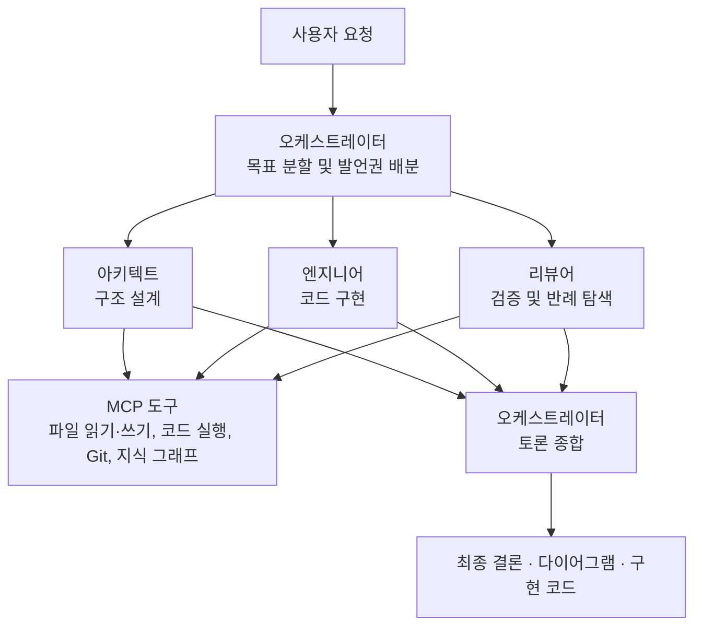
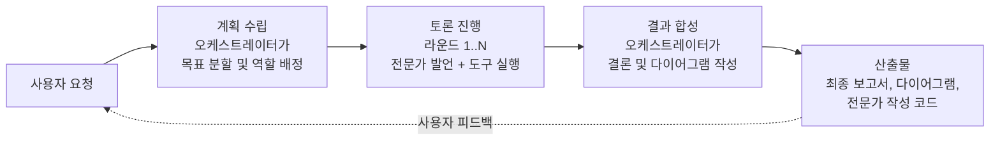
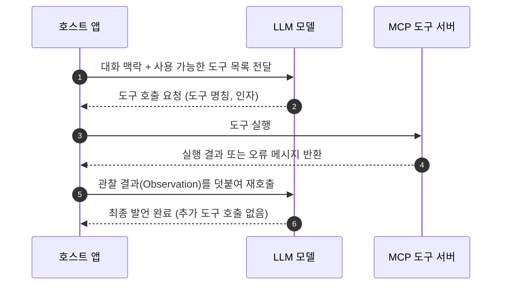

# 1강. 여러 LLM이 토론하는 시스템

> 이전: [강의 안내](README.md) · 다음: [2강. 기술 스택](02-tech-stack.md)

이번 강의에서는 MADO가 어떠한 문제를 해결하고자 하는 시스템인지부터 정리합니다. 시스템에 등장하는 주요 역할과 핵심 용어를 익히고, 시스템 전체를 관통하는 5가지 설계 원칙을 살펴봅니다. 마지막으로 약 한 달간의 개발 연표를 살펴보면서, 이후에 다룰 아키텍처와 결정 기록들이 어떤 맥락과 순서로 도출되었는지 파악해 보겠습니다.

---

## 1. 단일 모델 질의의 한계

단일 LLM에게 "주문 관리 시스템을 설계해 줘"라고 요청하면 그럴듯한 답변이 빠르게 도출됩니다. 하지만 문제는 그 답변을 아무도 비판적으로 검증하지 않았다는 점입니다. 답변에 소스 코드가 포함되어 있더라도, 그 코드가 실제로 정상 동작하는지 테스트된 바가 없습니다. LLM은 동일한 컨텍스트 내에서 일관된 추론 흐름을 이어가기 때문에, 자신이 생성한 답변의 결함이나 한계를 스스로 의심하는 데 취약합니다.

실제 소프트웨어 조직에서는 이러한 문제를 역할 분리를 통해 해결합니다. 아키텍트가 초안을 작성하면 엔지니어가 이를 구현하고, 리뷰어가 다른 관점에서 취약점을 찾아 공격합니다. 이때 리뷰어는 "이 코드는 동작합니다"라는 말만 믿지 않고 직접 실행하여 검증합니다.

MADO는 이러한 현실 조직의 협업 구조를 LLM 환경에 맞게 구현한 시스템입니다. 핵심 설계 사상은 바로 **'주장과 검증의 분리'**입니다. 엔지니어 에이전트가 코드를 작성하면, 리뷰어 에이전트는 Python 샌드박스 환경에서 해당 코드를 직접 실행하여 반례를 탐색합니다. 단순한 텍스트 주장이 아니라 실제 도구 실행 기록을 바탕으로 검증하고 반박합니다.

## 2. 시스템에 등장하는 핵심 역할

| 역할 | 담당 업무 | 주요 특징 |
| :--- | :--- | :--- |
| **사용자** | 시스템에 요청을 전달하고, 토론 진행 중 실시간으로 개입하며, 산출물에 피드백을 제공합니다. | 사람의 명시적 지시는 그 어떤 LLM 요약 내용보다도 항상 최우선으로 반영됩니다. |
| **오케스트레이터** | 목표를 세분화하고, 발언 순서를 조율하며, 최종 결론을 종합합니다. | 토론 라운드 내부에서는 직접 발언하지 않습니다. 계획 수립과 결과 합성에 전념하며 라운드 외부에 위치합니다. |
| **전문가 에이전트** | 아키텍트, 엔지니어, 리뷰어처럼 고유한 역할을 부여받아 토론에 참여합니다. | 설정 파일이나 사용자 화면에서 자유롭게 추가하거나 삭제할 수 있습니다. |
| **MCP 도구 서버** | 파일 시스템, 지식 그래프, Git, Python 샌드박스 등의 도구 기능을 제공합니다. | 메인 애플리케이션과 격리된 독립 프로세스로 구동됩니다. |

시스템에서 필수로 요구되는 구성 요소는 오케스트레이터뿐입니다. 나머지 에이전트의 명칭, 역할, 연동 모델, 접근 가능한 도구는 모두 설정을 통해 유연하게 정의할 수 있습니다. 예를 들어 아키텍트는 Claude, 엔지니어는 사내 vLLM 환경의 Qwen, 리뷰어는 Gemini로 각각 다르게 구성할 수 있습니다. 서로 다른 아키텍처와 특성을 지닌 모델들이 토론을 진행함으로써, 단일 모델의 편향이나 맹점을 효과적으로 상호 보완할 수 있습니다.

## 3. 세션, 턴, 라운드, 발언의 개념

본격적인 내용에 앞서, 본 강의 전반에서 계속 사용될 핵심 용어들을 먼저 정의하겠습니다.

| 용어 | 정의 |
| :--- | :--- |
| **세션(대화)** | 사이드바에 표시되는 하나의 독립된 대화 단위입니다. 여러 번의 턴이 누적되어 구성됩니다. |
| **턴 (Turn)** | 사용자 요청 하나가 입력되어 계획 수립, 토론, 합성을 거쳐 최종 산출물이 도출될 때까지의 1사이클입니다. |
| **라운드 (Round)** | 한 턴 내부에서 참여 전문가들이 순서대로 한 차례씩 발언하는 단위입니다. `max_rounds` 설정을 통해 상한을 둡니다. |
| **발언 (Utterance)** | 단일 에이전트가 1회 발언하는 단위입니다. 발언 도중 필요한 도구를 여러 번 호출할 수 있습니다. |
| **도구 루프 (Tool Loop)** | 발언 하나 안에서 "모델의 도구 호출 요청 → 호스트의 도구 실행 → 관찰 결과(Observation)의 모델 반환"이 반복되는 과정입니다. |

모든 턴은 항상 일관된 3단계를 거칩니다.

사용자가 결과를 확인하고 추가 피드백을 전달하면 새로운 턴이 시작됩니다. 이전 턴의 대화 기록과 맥락이 유지되므로, 에이전트들은 "이전 턴에서 Redis는 사용하지 말라는 제약이 주어졌다"는 사실을 인지한 상태에서 후속 토론을 이어갑니다. 장기 대화에서도 이러한 핵심 맥락을 유실하지 않고 보존하는 기법은 4강에서 자세히 다룹니다.

## 4. 에이전트가 도구를 활용하는 방식

에이전트의 도구 호출(Tool Calling)은 다음과 같은 절차로 수행됩니다. 호스트 앱은 모델에게 "사용 가능한 도구 목록"과 "각 도구의 인자 스키마"를 함께 전달합니다. 모델은 답변 텍스트를 바로 출력하는 대신, "`filesystem__read_text_file` 도구를 특정 인자로 호출해 달라"는 구조화된 요청을 반환할 수 있습니다. 호스트 앱은 이 요청을 받아 실제 도구를 실행하고, 그 실행 결과(관찰 결과, Observation)를 모델에게 다시 반환합니다. 모델은 전달받은 관찰 결과를 바탕으로 다음 행동을 결정합니다. 더 이상 호출할 도구가 없다고 판단하면 비로소 발언을 마칩니다.

MADO에서 이러한 도구들은 오픈 표준 규격인 MCP(Model Context Protocol)를 따르는 별도의 독립 프로세스로 동작합니다. 애플리케이션 내부에 도구 기능을 직접 하드코딩하지 않고, 규격에 맞는 서버를 설정 파일에 등록하기만 하면 에이전트가 즉시 도구를 사용할 수 있습니다. 에이전트별로 접근 가능한 도구 서버를 독립적으로 지정할 수 있으므로, 리뷰어 에이전트에게는 코드 실행 샌드박스를 부여하고 오케스트레이터에게는 제한하는 등의 세밀한 권한 설계가 가능합니다.

## 5. MADO의 5대 아키텍처 설계 원칙

MADO의 거의 모든 아키텍처 결정은 아래의 5가지 설계 원칙을 바탕으로 이루어졌습니다. 초기부터 명확히 수립된 원칙도 있고, 실제 장애를 겪으며 확립된 원칙도 있습니다.

### 원칙 1. 설정이 곧 시스템 구성입니다

에이전트, 모델, 엔드포인트, 자격 증명, 도구 권한, 발언 순서, 토론 진영 등의 모든 정보가 단일 설정 파일에 정의됩니다. 새로운 전문가를 추가할 때 애플리케이션 코드를 전혀 수정할 필요가 없습니다. 웹 화면에서 에이전트를 추가하거나 수정한 결과 역시 설정 파일에 즉시 동기화되어 기록됩니다. 즉, 설정 파일은 시스템의 입력이자 동시에 출력이 됩니다. 이러한 설계 특성은 차후 설정 파일 형식을 TOML에서 JSON으로 변경하게 된 주요 배경이 되었습니다([ADR-013](05-adr/ADR-013-json-config.md)).

### 원칙 2. 시작된 대화는 자기완결성을 유지합니다

사용자가 첫 메시지를 전송하는 순간, 해당 대화에 참여하는 에이전트들의 전체 설정 정보가 데이터베이스에 스냅샷 형태로 영구 보존됩니다. 이후 전역 설정 파일에서 에이전트가 삭제되거나 모델 정보가 변경되더라도, 이미 시작된 대화는 생성 당시의 설정 구성을 그대로 유지하며 진행됩니다. 한 달 전의 대화를 다시 열더라도 당시의 화자 구성과 모델 설정 그대로 일관되게 발언합니다([ADR-011](05-adr/ADR-011-session-config-snapshot.md)).

### 원칙 3. 가상의 응답을 임의로 생성하지 않습니다

초기 개발 버전에는 LLM 엔드포인트 연결에 실패할 경우 정상 응답을 흉내 내는 시뮬레이터 기능이 포함되어 있었습니다. 개발 초기에는 편리했으나, 실제 환경에서는 API 서버가 500 오류를 반환해도 토론이 정상 진행되는 것처럼 착각을 불러일으키는 치명적인 부작용을 낳았습니다. 이렇게 임의로 생성된 허위 발언이 다음 에이전트의 입력으로 들어가고 최종 보고서에까지 반영되는 문제가 발생했습니다. 현재는 연결 실패 시 명확하게 실패 사실을 기록하며, 합성 단계에서도 "해당 에이전트가 발언하지 못했다"는 객관적 사실을 인지하고 결론을 도출합니다([ADR-007](05-adr/ADR-007-no-simulated-answers.md)).

### 원칙 4. 장애는 발생 계층에서 격리합니다

단일 도구 실행 중 오류가 발생하더라도 전체 발언이 중단되지 않습니다. 특정 에이전트가 응답하지 못하더라도 전체 토론이 비정상 종료되지 않으며, 일시적으로 데이터베이스가 잠기더라도 최종 생성된 보고서를 유실하지 않습니다. 시스템의 모든 장애는 그것이 발생한 계층 내부에서 기록되며, 상위 계층으로는 단지 "관찰 결과"의 형태로만 안전하게 전달됩니다. 유일한 예외는 사용자의 명시적인 취소 명령뿐입니다. 사용자가 작업을 중단하라고 지시했을 때에만 해당 취소 신호가 모든 계층을 관통하여 즉시 전파됩니다([ADR-014](05-adr/ADR-014-tool-failure-is-observation.md)).

### 원칙 5. 인터넷이 차단된 폐쇄망 환경을 기본으로 지원합니다

MADO는 초기 기획 단계부터 외부 인터넷 접속이 불가능한 폐쇄망 환경 반입을 전제로 설계되었습니다. 포터블 Python, `node.exe`, 오프라인 Wheel 패키지, 사전 빌드된 MCP 서버 설치본을 하나의 번들로 묶어주는 패키징 스크립트를 제공하며, 웹 UI에서 사용하는 JavaScript 라이브러리 역시 외부 CDN에 의존하지 않고 애플리케이션 내부에 포함하여 배포합니다. 또한 설정 파일 내의 모든 경로는 환경변수로 치환 가능하도록 구현하여, 개발 환경과 실제 배포 환경에서 동일한 설정 파일을 그대로 활용할 수 있습니다([ADR-006](05-adr/ADR-006-airgap-first-packaging.md)).

## 6. 화면 구성 한눈에 보기

| 영역 | 주요 기능 및 역할 |
| :--- | :--- |
| **왼쪽 사이드바** | 대화 목록 조회, 신규 대화 생성, 세션 이름 변경, 대화 삭제, 세션 분기(이어받기, ⑂) 기능 제공 |
| **상단 로스터 패널** | 에이전트 카드(참여 여부 토글, 드래그를 통한 발언 순서 조정), 토론 전략 선택, 최대 라운드 수 설정, MCP 서버 상태 모니터링, 작업 공간 폴더 지정 |
| **중앙 토론 피드** | 사용자, 오케스트레이터, 전문가 에이전트의 발언을 고유 색상과 아바타로 구분하여 표시. 도구 호출 및 실행 결과는 접이식 아코디언 UI로 제공 |
| **우측 산출물 뷰어** | 턴마다 생성된 최종 결론 문서, 아키텍처 다이어그램, 전문가 작성 코드를 탭 형태로 누적 보존. 원클릭 복사 및 다운로드 지원 |

화면 디자인 자체는 본 강의의 주된 주제가 아니지만, 한 가지 중요한 아키텍처 원칙은 반드시 기억해 두시기 바랍니다. 로스터 패널에는 "현재 대화에만 국한되는 세션 설정"과 "모든 대화에 공통 적용되는 전역 설정"이 공존하며, 두 설정이 잠기는(Locking) 시점과 규칙이 서로 다릅니다. 이 구분은 3강 정적 뷰에서 다룰 "두 종류의 상태" 개념으로 직결됩니다.

## 7. MADO 개발 연표

MADO는 2026년 8월 26일 첫 커밋 이후 약 한 달간의 집중적인 개발을 통해 v0.9.1까지 진화해 왔습니다. 버전별 단순 기능 추가 목록보다는, 실제 개발 과정에서 어떤 문제와 한계에 직면했고 이를 해결하기 위해 어떤 설계를 결정했는지에 주목하여 살펴보시기 바랍니다.

| 날짜 | 버전 | 주요 마일스톤 및 아키텍처 개선 사항 |
| :--- | :--- | :--- |
| 08-26 | 초기 구현 | 첫 커밋. MCP 서버 오프라인 번들링 구조 확립. 도구 호출 시마다 프로세스를 새로 띄우던 비효율을 개선하여 장기 세션 유지 체계 구축 |
| 08-28 | | 토론 실행 흐름을 브라우저 렌더링 루프에서 분리하여 백그라운드 태스크로 이관. 시뮬레이터 제거. 대화별 작업 공간 격리 및 발언자별 도구 상태 분리. 사용자 실시간 개입 및 정지 기능 도입 |
| 08-30 | v0.1 | 웹 UI 기반 에이전트 추가·삭제 기능 지원. 대화 구성 스냅샷 체계 구축. 발언 우선순위를 에이전트 고유 속성으로 내재화. 설정 파일 형식을 TOML에서 JSON으로 전환 |
| 08-31 | v0.2 | 병렬 지시 토론 전략 추가. 원격 스트리머블 HTTP 기반 MCP 서버 연결 지원 |
| 09-02 | v0.3 | 다이어그램 다중 포맷(SVG, PNG 등) 내보내기 지원 |
| 09-07 | v0.4 | 에이전트 발언당 도구 호출 예산 제한 및 컨텍스트 윈도우 포화 방지 안전장치 도입 |
| 09-08 ~ 09 | v0.5 | 도구 실패가 백엔드 프로세스를 중단시키지 않도록 계층별 예외 격리 경계 수립. 세션 이어받기(분기) 기능. 다이어그램 구문 오류 자기 수리 메커니즘 도입 |
| 09-09 ~ 10 | v0.6 | 작업 공간별 독립 MCP 런타임 풀 구축으로 다중 세션 동시 실행 지원. 컨텍스트 길이 초과로 잘린 LLM 응답 연속 생성 처리 |
| 09-11 ~ 14 | v0.7 | `max_tokens` 및 컨텍스트 윈도우 관련 6가지 핵심 버그 해결. SQLite 파일 잠금에 따른 보고서 유실 방지(WAL 및 임시 보존). 웹 UI 실시간 스트리밍 렌더링 성능 최적화 |
| 09-14 ~ 17 | v0.8 | 입력창 `@멘션` 기반 발언자 지정 및 파일 업로드 지원. 원격 접근 보안 토큰 인증 미들웨어 도입. 3단계 대화 기억 보존 체계(사용자 발언 핀 고정, 결정 장부, 자동 요약) 구축 |
| 09-17 ~ 19 | v0.9 | 유향 비순환 그래프(DAG) 기반 그래프 토론 엔진 및 인앱 오프라인 시각화 편집기 도입 |

이 개발 연표를 살펴보면 한 가지 명확한 기술적 흐름을 확인할 수 있습니다. 초기 단계에는 기능을 빠르게 확장하는 데 집중했으나, 9월 이후부터는 겉으로 에러를 뿜지 않으면서 "조용히 오동작하던 잠재적 결함"을 바로잡는 데 집중했습니다.

길이 제한으로 잘린 도구 호출 응답을 모델에 그대로 되돌려 보내던 문제, 긴 대화 맥락 속에서 초기에 부여한 핵심 제약 조건을 모델이 망각하던 문제, 데이터베이스 일시 잠금으로 인해 생성된 보고서가 디스크에 기록되지 못하던 문제 등이 대표적입니다. 이러한 결함들은 뚜렷한 오류 로그 없이 결과물의 품질을 점진적으로 떨어뜨리는 특성이 있어, 근본 원인을 파악하는 데 소요된 시간이 실제 코드를 수정하는 시간보다 훨씬 길었습니다. 4강과 5강을 통해 이러한 실제 장애 사례와 해결 설계를 상세히 다루겠습니다.

---

## 핵심 요약

- MADO는 여러 LLM 에이전트가 역할을 나누어 상호 토론하고, 도구를 활용해 주장을 검증하며, 오케스트레이터가 그 결과를 종합하는 시스템입니다.
- 한 턴은 계획 수립, 토론 라운드, 결과 합성의 3단계를 거쳐 실행됩니다.
- 도구는 MCP 표준 규격을 따르는 독립 프로세스로 동작하며, 에이전트별로 차등화된 권한을 부여할 수 있습니다.
- 시스템 전반을 지탱하는 5대 설계 원칙은 **설정 중심 구성**, **대화의 자기완결성**, **가상 응답 배제**, **장애의 국지적 격리**, **폐쇄망 우선 지원**입니다.

## 학습 점검 과제

1. 동일한 베이스 모델을 사용하는 에이전트 3개로 토론을 구성하는 것과, 서로 다른 아키텍처의 모델 3개로 토론을 구성하는 것은 토론 결과물에 어떠한 차이를 가져올까요? 동일 모델이라 할지라도 시스템 프롬프트(페르소나)를 다르게 부여한다면 충분한 다양성을 확보할 수 있을지 고민해 보십시오.
2. 개발 초기 단계에서 시뮬레이터는 분명한 개발 편의성을 제공했습니다. 시뮬레이터 기능을 완전히 제거하지 않고도 "원칙 3(가상의 응답을 임의로 생성하지 않는다)"을 준수할 수 있는 방안은 없었을지, 만약 도입한다면 어떤 안전장치가 필요했을지 검토해 보십시오.
3. 오케스트레이터가 라운드 내부에서 직접 토론에 참여하지 않고 조율과 합성에만 전념하도록 설계했을 때의 장점과 한계점을 각각 한 가지씩 도출해 보십시오.
