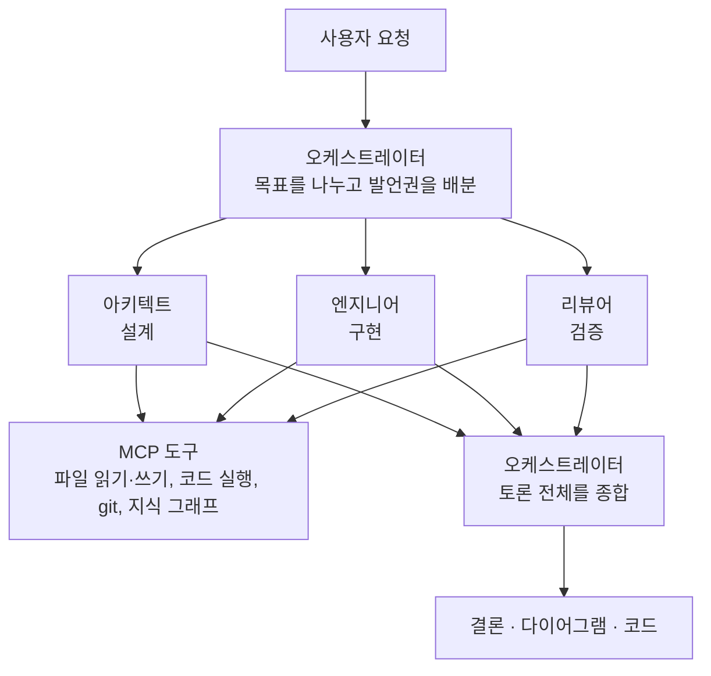
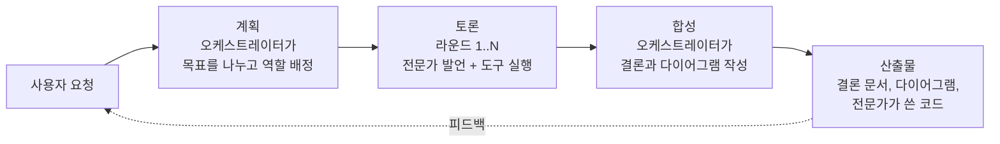
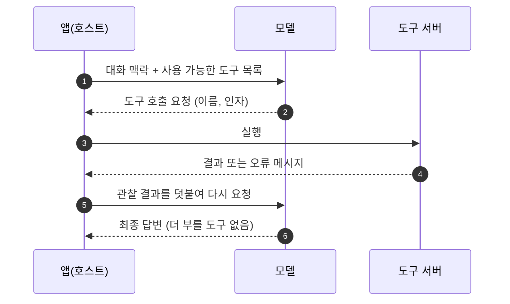

# 1강. 여러 LLM이 토론하는 시스템

> 이전: [강의 안내](README.md) · 다음: [2강. 기술 스택](02-tech-stack.md)

이번 강에서는 MADO가 무엇을 하려는 시스템인지부터 정리합니다. 등장하는 역할과 용어를 익히고,
이 시스템 전체를 관통하는 설계 원칙 다섯 가지를 살펴봅니다. 마지막으로 한 달 남짓한 개발 연표를
훑어서, 뒤에 나올 아키텍처와 결정 기록이 어떤 순서로 생겨났는지 감을 잡습니다.

---

## 1. 모델 하나에게 묻는 것의 한계

LLM에게 "주문 관리 시스템을 설계해 줘"라고 하면 그럴듯한 답이 금방 나옵니다. 문제는 그 답을
아무도 검토하지 않았다는 점입니다. 코드가 들어 있다면 그 코드가 실제로 도는지 확인한 적도
없습니다. 모델은 자기 답을 의심하는 데 서툽니다. 같은 맥락에서 같은 추론을 이어 가기 때문입니다.

사람 조직은 이 문제를 역할 분리로 풉니다. 설계자가 초안을 내면 구현자가 만들고, 리뷰어가 다른
관점에서 공격합니다. 리뷰어는 "이 코드는 동작합니다"라는 말을 믿지 않고 직접 돌려 봅니다.

MADO는 이 조직 구조를 LLM으로 옮긴 시스템입니다. 핵심 아이디어는 **주장과 검증의 분리**입니다.
엔지니어 에이전트가 코드를 쓰면, 리뷰어 에이전트가 파이썬 샌드박스에서 그 코드를 실제로 실행해
반례를 찾습니다. 말이 아니라 실행 기록으로 반박합니다.

## 2. 등장하는 역할

| 역할 | 하는 일 | 특징 |
| :--- | :--- | :--- |
| 사용자 | 요청을 보내고, 토론 중에 끼어들고, 결과에 피드백을 줌 | 사람의 말은 어떤 LLM 요약보다 우선합니다 |
| 오케스트레이터 | 목표를 나누고, 발언 순서를 정하고, 마지막에 결론을 종합 | 라운드 안에서는 발언하지 않습니다. 계획과 합성을 맡고 라운드 밖에 섭니다 |
| 전문가 에이전트 | 아키텍트, 엔지니어, 리뷰어처럼 역할을 맡아 발언 | 설정 파일이나 화면에서 얼마든지 추가·삭제할 수 있습니다 |
| MCP 도구 서버 | 파일 시스템, 지식 그래프, git, 파이썬 샌드박스 | 앱과 분리된 별도 프로세스로 돕니다 |

오케스트레이터만 필수입니다. 나머지 에이전트의 이름, 역할, 모델, 쓸 수 있는 도구는 전부 설정으로
정합니다. 예를 들어 아키텍트는 Claude, 엔지니어는 사내 vLLM에 올린 Qwen, 리뷰어는 Gemini로
구성할 수 있습니다. 서로 다른 모델이 토론하면 한 모델의 맹점을 다른 모델이 짚을 가능성이
높아집니다.

## 3. 턴, 라운드, 발언

용어부터 맞춰 두겠습니다. 뒤에서 계속 나옵니다.

| 용어 | 뜻 |
| :--- | :--- |
| **세션(대화)** | 사이드바에 보이는 대화 하나. 여러 턴이 쌓입니다 |
| **턴** | 사용자 요청 하나가 들어와서 최종 결론이 나올 때까지의 한 사이클 |
| **라운드** | 한 턴 안에서 전문가들이 한 바퀴 발언하는 단위. `max_rounds`로 상한을 둡니다 |
| **발언** | 에이전트 하나가 한 번 말하는 것. 그 안에서 도구를 여러 번 부를 수 있습니다 |
| **도구 루프** | 발언 하나 안에서 "모델이 도구 호출 요청 → 앱이 실행 → 결과를 모델에게 돌려줌"을 반복하는 과정 |

한 턴은 늘 같은 세 단계를 거칩니다.

사용자가 결과를 보고 피드백을 주면 새 턴이 시작됩니다. 이전 턴의 기록은 그대로 이어지므로
에이전트는 "지난번에 레디스는 쓰지 말라고 하셨다"는 것을 기억한 채로 다시 토론합니다. 이 기억을
긴 대화에서도 잃지 않게 하는 방법은 4강에서 따로 다룹니다.

## 4. 에이전트가 도구를 쓴다는 것

도구 호출은 이렇게 돌아갑니다. 앱이 모델에게 "이런 도구들을 쓸 수 있다"며 도구 이름과 인자
스키마를 함께 보냅니다. 모델은 답을 바로 쓰는 대신 "`filesystem__read_text_file`을 이 인자로
불러 달라"고 응답할 수 있습니다. 앱이 그 도구를 실제로 실행하고, 결과를 다시 모델에게 돌려줍니다.
모델은 그 결과(관찰, observation)를 보고 다음 행동을 정합니다. 도구 호출이 더 없으면 발언이
끝납니다.

MADO에서 이 도구들은 MCP(Model Context Protocol)라는 공개 규격을 따르는 별도 프로세스입니다.
앱 안에 도구를 직접 구현하지 않고, 규격에 맞는 서버를 설정에 한 줄 추가하면 에이전트가 쓸 수
있게 됩니다. 에이전트마다 쓸 수 있는 서버를 따로 정하므로, 리뷰어에게는 샌드박스를 주고
오케스트레이터에게는 주지 않는 식의 권한 설계가 가능합니다.

## 5. 설계 원칙 다섯 가지

MADO의 거의 모든 결정은 아래 다섯 원칙 중 하나로 설명됩니다. 처음부터 정해 둔 것도 있고, 장애를
겪으면서 굳어진 것도 있습니다.

### 원칙 1. 설정이 곧 시스템 구성

에이전트, 모델, 엔드포인트, 자격증명, 도구 권한, 발언 순서, 토론 진영이 모두 설정 파일 하나에
있습니다. 새 전문가를 들이는 데 코드를 고치지 않습니다. 화면에서 에이전트를 추가하면 그 결과도
다시 설정 파일에 기록됩니다. 그래서 설정 파일은 입력이면서 출력입니다. 이 점이 나중에 설정 형식을
TOML에서 JSON으로 바꾸는 결정으로 이어집니다([ADR-013](05-adr/ADR-013-json-config.md)).

### 원칙 2. 시작한 대화는 자기완결적이다

첫 메시지를 보내는 순간, 참여한 에이전트들의 설정 전체가 데이터베이스에 스냅샷으로 굳습니다.
이후 설정 파일에서 에이전트를 지우거나 모델을 바꿔도, 이미 시작한 대화는 시작할 때 구성 그대로
이어집니다. 한 달 전 대화를 다시 열어도 그때의 화자가 그때의 설정으로 말합니다
([ADR-011](05-adr/ADR-011-session-config-snapshot.md)).

### 원칙 3. 없는 것을 지어내지 않는다

초기 버전에는 LLM 엔드포인트에 연결되지 않으면 그럴듯한 답을 흉내 내는 시뮬레이터가 있었습니다.
개발할 때는 편했지만, 실제로는 서버가 500을 돌려줘도 토론이 멀쩡히 굴러가는 것처럼 보였습니다.
지어낸 발언은 다음 에이전트의 입력이 되고 최종 보고서에까지 섞여 들어갔습니다. 지금은 연결에
실패하면 실패했다고 기록하고, 합성 단계도 "이 에이전트는 발언하지 못했다"는 사실을 알고
결론을 씁니다([ADR-007](05-adr/ADR-007-no-simulated-answers.md)).

### 원칙 4. 실패는 그 자리에서 멈춘다

도구 하나가 오류를 내도 발언이 끝나지 않습니다. 에이전트 하나가 응답하지 못해도 토론이 끝나지
않습니다. 데이터베이스가 잠겨도 최종 보고서를 잃지 않습니다. 실패는 그것이 일어난 층에서
기록되고, 위층으로는 "관찰 결과"로만 전달됩니다. 예외는 취소 하나뿐입니다. 사용자가 멈추라고
하면 그 명령만은 모든 층을 뚫고 올라가야 합니다([ADR-014](05-adr/ADR-014-tool-failure-is-observation.md)).

### 원칙 5. 인터넷 없는 망에서 돈다

이 시스템은 처음부터 폐쇄망 반입을 전제로 만들어졌습니다. 포터블 파이썬, `node.exe`, 오프라인
wheel, MCP 서버 설치본을 한 번에 묶는 패키징 스크립트가 있고, 화면에 쓰는 자바스크립트
라이브러리도 CDN이 아니라 앱 안에 동봉합니다. 설정 파일의 경로는 모두 환경변수로 치환되므로
개발 PC와 배포 번들이 같은 설정 파일을 씁니다([ADR-006](05-adr/ADR-006-airgap-first-packaging.md)).

## 6. 화면 한눈에 보기

| 영역 | 하는 일 |
| :--- | :--- |
| 왼쪽 사이드바 | 대화 목록, 새 대화, 이름 변경, 삭제, 이어받기(⑂) |
| 위쪽 로스터 패널 | 에이전트 카드(참여 여부, 드래그로 발언 순서 변경), 토론 전략, 최대 라운드, MCP 서버 상태, 작업 공간 폴더 |
| 가운데 토론 피드 | 사용자, 오케스트레이터, 전문가 발언을 색과 아바타로 구분. 도구 실행은 접었다 펼 수 있게 표시 |
| 산출물 뷰어 | 턴마다 결론, 다이어그램, 코드를 탭으로 쌓음. 복사와 다운로드 |

화면 설계 자체는 이 강의의 주제가 아니지만, 한 가지는 기억해 두세요. 로스터 패널에는 "이 대화에만
적용되는 설정"과 "모든 대화에 적용되는 전역 설정"이 함께 있고, 둘은 잠기는 규칙이 다릅니다.
이 구분이 3강 정적 뷰의 "두 종류의 상태"로 이어집니다.

## 7. 개발 연표

MADO는 2026년 8월 26일 첫 커밋 이후 한 달이 안 되는 기간에 v0.9.1까지 왔습니다. 버전마다 무엇이
바뀌었는지보다, 어떤 문제를 겪고 무엇을 결정했는지에 주목해서 보세요.

| 날짜 | 버전 | 주요 사건 |
| :--- | :--- | :--- |
| 08-26 | 초기 | 첫 커밋. MCP 서버 오프라인 번들링. 도구 호출마다 서버를 다시 띄우던 문제를 고쳐 세션을 유지 |
| 08-28 | | 토론을 브라우저에서 떼어 백그라운드로. 시뮬레이터 제거. 대화별 작업 공간, 대화·발언자별 도구 상태 분리. 사람의 개입과 정지 |
| 08-30 | v0.1 | 화면에서 에이전트 추가·삭제. 대화 구성 스냅샷. 발언 순서를 에이전트 속성으로. 설정 TOML → JSON |
| 08-31 | v0.2 | 병렬 지시 전략. 원격 MCP 서버 연결 |
| 09-02 | v0.3 | 다이어그램 여러 형식 내보내기 |
| 09-07 | v0.4 | 도구 호출 예산과 컨텍스트 창 포화 안전장치 |
| 09-08 ~ 09 | v0.5 | 도구 실패가 에이전트와 백엔드를 죽이지 않도록 계층별 경계. 세션 이어받기. 다이어그램 자기 수리 |
| 09-09 ~ 10 | v0.6 | 작업 공간별 MCP 런타임 풀로 여러 대화 동시 실행. 잘린 답변 이어 쓰기 |
| 09-11 ~ 14 | v0.7 | `max_tokens`와 컨텍스트 창을 둘러싼 여섯 가지 문제. DB 잠김으로 보고서를 잃던 문제. 스트리밍 성능 |
| 09-14 ~ 17 | v0.8 | 입력창 `@언급`과 파일 업로드. 원격 접속 토큰. 대화 기억(사용자 발언 고정, 결정 장부, 요약) |
| 09-17 ~ 19 | v0.9 | 그래프 토론 엔진과 오프라인 그래프 편집기 |

연표에서 한 가지 흐름이 보입니다. 초반에는 기능을 넓히는 커밋이 많고, 9월부터는 "조용히 틀리던
것"을 고치는 커밋이 늘어납니다. 잘린 도구 호출을 그대로 되돌려 보내던 문제, 한 번 준 제약을 긴
대화에서 잊어버리던 문제, 저장에 실패한 보고서가 화면에만 남던 문제 같은 것들입니다. 대부분
오류 메시지 없이 결과만 조금씩 나빠지는 종류였고, 원인을 찾는 데 드는 시간이 고치는 시간보다
훨씬 길었습니다. 4강과 5강에서 이 사례들을 자세히 봅니다.

---

## 정리

- MADO는 여러 LLM 에이전트가 역할을 나눠 토론하고, 도구로 주장을 검증하고, 오케스트레이터가
  결과를 종합하는 시스템입니다.
- 한 턴은 계획, 토론 라운드, 합성의 세 단계로 이루어집니다.
- 도구는 MCP 규격을 따르는 별도 프로세스이고, 에이전트마다 쓸 수 있는 도구가 다릅니다.
- 설계 원칙은 설정 중심, 자기완결적 대화, 지어내지 않기, 실패의 국지화, 폐쇄망 우선입니다.

## 생각해 볼 문제

1. 같은 모델을 쓰는 에이전트 셋이 토론하는 것과, 서로 다른 모델 셋이 토론하는 것은 결과가 어떻게
   다를까요? 같은 모델이라도 역할(시스템 프롬프트)이 다르면 효과가 있을까요?
2. 시뮬레이터는 개발 초기에 분명히 쓸모가 있었습니다. 시뮬레이터를 없애지 않고 원칙 3을 지킬
   방법은 없었을까요? 있었다면 어떤 조건이 필요했을까요?
3. 오케스트레이터가 라운드 안에서 발언하지 않는 설계의 장점과 단점을 하나씩 들어 보세요.
