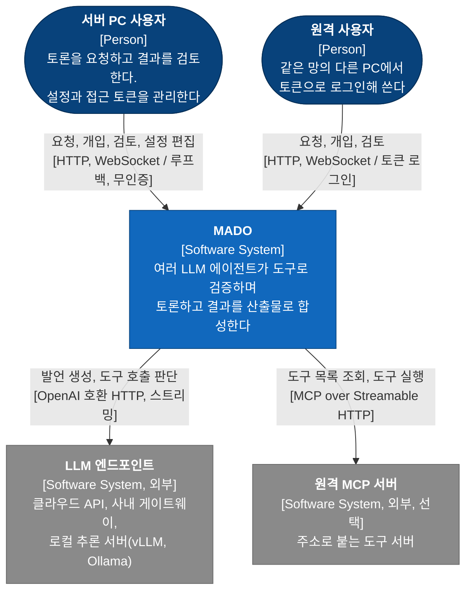
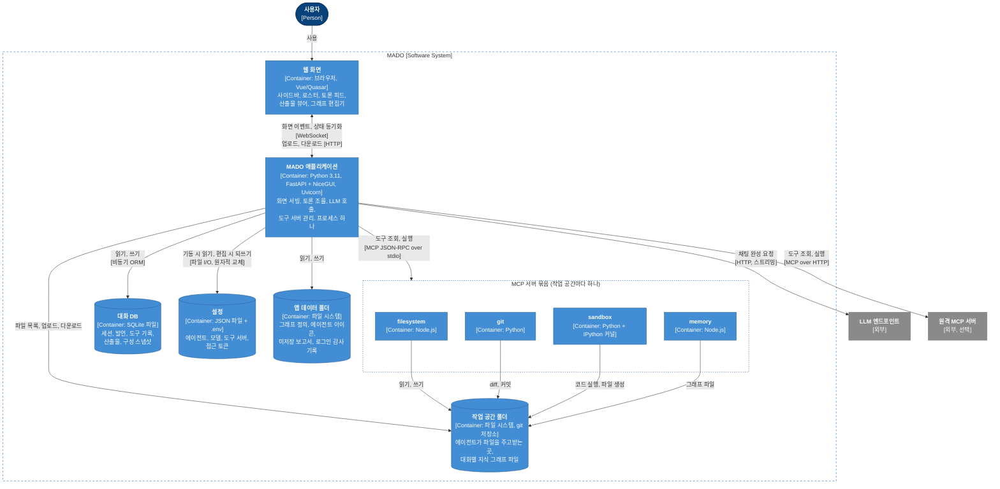
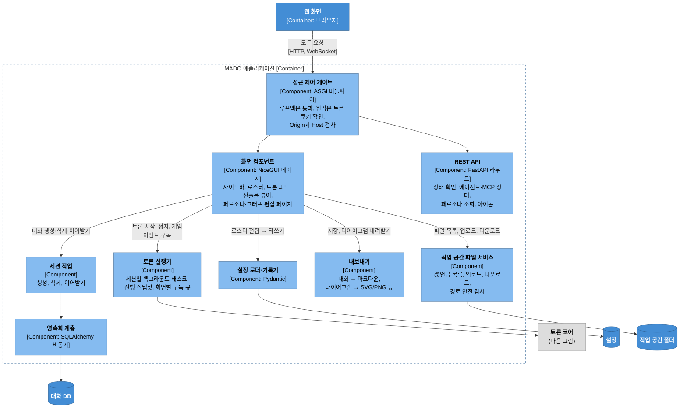
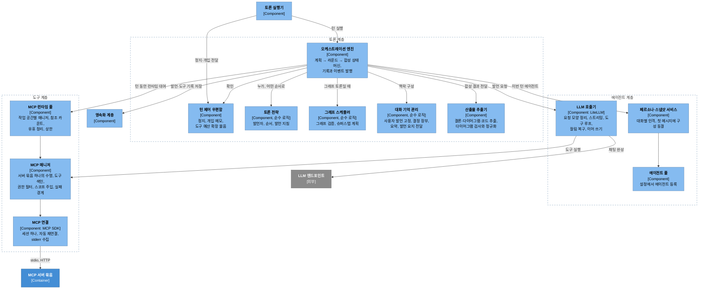
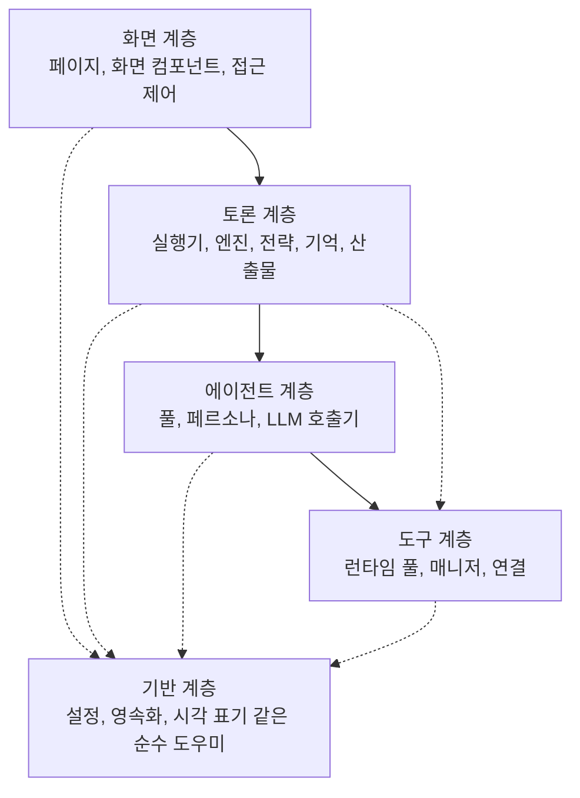
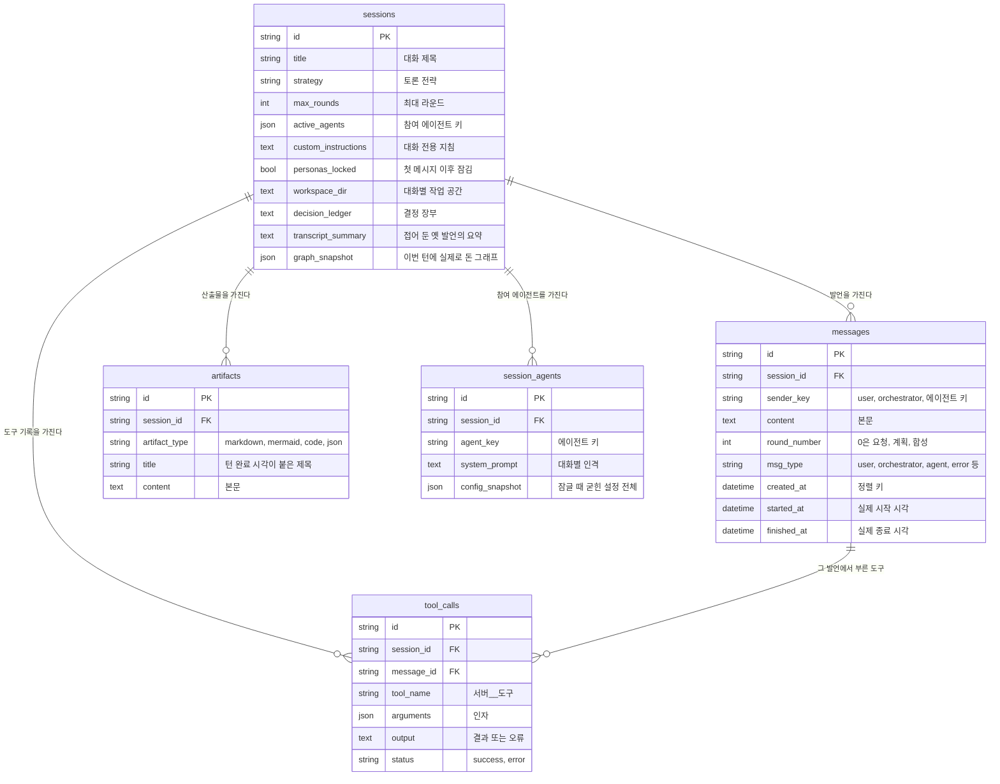
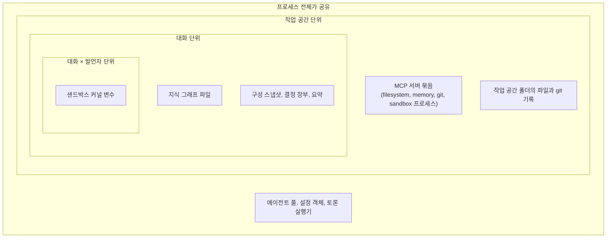

# 3-1. 정적 뷰: 무엇이 있고, 무엇이 무엇에 기대는가

> 상위: [3강. 아키텍처](README.md) · 다음: [3-2. 동적 뷰](02-dynamic-view.md)

정적 뷰는 시스템을 멈춰 놓고 본 모습입니다. 어떤 구성 요소가 있는지, 각자 무엇을 책임지는지, 누가
누구에게 의존하는지, 데이터가 어디에 저장되는지를 다룹니다. C4의 1~3단계 그림을 차례로 확대해
가며 보고, 마지막에 상태와 격리 경계를 정리합니다.

---

## 1. C4 1단계: 시스템 컨텍스트

가장 멀리서 본 그림입니다. MADO는 상자 하나이고, 주변에 누가 있는지만 봅니다.



그림에서 읽어 낼 점이 몇 가지 있습니다.

- **사용자가 두 종류입니다.** 서버 PC 앞에 앉은 주인과, 같은 망의 다른 PC에서 접속하는 사람입니다.
  둘은 같은 기능을 쓰지만 들어오는 문이 다릅니다. 주인은 인증 없이 들어오고, 원격 사용자는 주인이
  발급한 토큰으로 로그인해야 합니다. 사용자별 계정은 없습니다. 이 결정은
  [ADR-019](../05-adr/ADR-019-owner-token-remote-access.md)에서 다룹니다.
- **LLM은 바깥에 있습니다.** MADO는 모델을 직접 돌리지 않습니다. 어떤 엔드포인트든 OpenAI 호환
  형식으로 말할 수 있으면 붙습니다. 폐쇄망에서는 사내 게이트웨이나 로컬 추론 서버가 이 자리에
  옵니다.
- **기본 도구 서버는 이 그림에 없습니다.** 파일 시스템, git, 샌드박스 같은 기본 도구는 MADO가 직접
  띄우고 관리하므로 시스템 경계 안쪽에 있습니다. 경계 밖에 있는 것은 이미 다른 곳에서 떠 있어서
  주소로만 붙는 원격 도구 서버뿐입니다.

## 2. C4 2단계: 컨테이너

MADO 상자를 열어 봅니다. 따로 실행되거나 따로 데이터를 담는 단위가 컨테이너입니다.



### 컨테이너별 설명

| 컨테이너 | 책임 | 눈여겨볼 점 |
| :--- | :--- | :--- |
| 웹 화면 | 사용자가 보는 모든 것 | 화면 상태의 원본은 서버에 있고 브라우저는 그 사본을 그립니다. 그래프 편집기만 예외로, 편집 중 상태를 브라우저가 들고 있다가 저장할 때 서버에 보냅니다 |
| MADO 애플리케이션 | 화면 서빙, 토론 조율, LLM 호출, 도구 서버 관리 | API와 화면이 한 프로세스, 한 이벤트 루프에서 돕니다 |
| 대화 DB | 대화의 모든 기록 | 단일 파일. 대화를 시작한 뒤에는 설정 파일 대신 여기 있는 구성 스냅샷이 정본이 됩니다 |
| 설정 | 배포 단위의 구성 | 읽기 전용이 아닙니다. 화면에서 에이전트나 도구 서버를 고치면 여기에 되씁니다 |
| 앱 데이터 폴더 | 앱이 만드는 부수 파일 | DB에 끝내 저장하지 못한 보고서가 여기에 마크다운으로 남습니다 |
| 작업 공간 폴더 | 에이전트 사이의 인계 채널 | git 저장소입니다. 대화마다 다른 폴더를 지정할 수 있습니다 |
| MCP 서버 묶음 | 에이전트가 쓰는 도구 | 서버가 볼 폴더는 기동할 때 정해지므로, 작업 공간마다 묶음이 따로 뜹니다 |

### 왜 도구 서버를 컨테이너로 그리는가

도구 서버를 앱 안의 모듈로 그리지 않고 별도 컨테이너로 그린 것이 이 그림의 핵심입니다. 도구
서버는 자기 메모리와 자기 작업 디렉터리를 가진 별개 프로세스이고, 앱과는 표준 입출력으로만
대화합니다. 이 경계 덕분에 다음이 가능합니다.

- 샌드박스에서 무한 루프가 돌거나 커널이 죽어도 앱은 멀쩡합니다.
- 파일 시스템 서버는 허용된 폴더 밖 경로를 스스로 거부합니다. 앱이 경로 검사를 빠뜨려도 한 겹이
  더 있습니다.
- Node로 만든 서버와 Python으로 만든 서버를 섞어 쓸 수 있습니다.

대신 프로세스 경계는 공짜가 아닙니다. 프로세스가 죽거나, 응답하지 않거나, 다른 폴더를 보고
있을 수 있습니다. 이런 문제를 다루는 방법은 [4-3. MCP 호스트](../04-core-techniques/03-mcp-host.md)에서
봅니다.

## 3. C4 3단계: 컴포넌트

MADO 애플리케이션 컨테이너를 다시 열어 봅니다. 구성 요소가 많아서 두 장으로 나눴습니다. 첫 장은
요청이 들어오는 쪽, 둘째 장은 토론이 실제로 도는 쪽입니다.

### 3.1 진입과 화면 쪽



이 그림에서 가장 중요한 선은 **화면 컴포넌트 → 토론 실행기** 하나입니다. 화면은 토론을 직접
실행하지 않습니다. 실행기에게 "이 세션에서 이 요청으로 토론을 시작하라"고 넘기고, 진행 상황은
이벤트로 구독합니다. 브라우저를 새로고침해도 토론이 계속되는 이유가 이 분리입니다
([ADR-008](../05-adr/ADR-008-background-debate-runner.md)).

접근 제어 게이트는 모든 요청 앞에 한 겹으로 서 있습니다. 화면 페이지, 화면 동기화용 WebSocket,
REST API, 파일 다운로드가 모두 이 게이트를 지납니다. 문이 여러 개면 하나쯤은 잠그는 걸 잊기 마련입니다.
게이트를 하나로 두고 "가장 바깥"에 있다는 사실을 테스트로 고정해 두었습니다.

### 3.2 토론 코어



### 컴포넌트의 책임과 "모르는 것"

좋은 컴포넌트는 무엇을 아는지만큼 무엇을 모르는지도 분명합니다. 아래 표의 셋째 열은 각 컴포넌트가
일부러 모르게 만든 것입니다. 이 경계가 무너졌을 때 실제로 어떤 사고가 났는지도 함께 적었습니다.

| 컴포넌트 | 책임 | 일부러 모르는 것 | 경계가 없었을 때 |
| :--- | :--- | :--- | :--- |
| 토론 실행기 | 세션마다 토론 태스크 하나를 소유하고, 이벤트를 화면들에 나눠 준다 | 화면(UI 요소) | 토론이 클릭 핸들러 안에서 돌던 시절, 새로고침 한 번에 토론이 죽었습니다 |
| 오케스트레이션 엔진 | 한 턴의 전 과정을 진행하고 기록한다 | 누가 어떤 순서로 말할지(전략에 묻는다) | 발언 순서가 엔진과 전략 여러 곳에 흩어져 있으면 화면의 순서 미리보기와 실제 순서가 어긋납니다 |
| 토론 전략 | 라운드마다 발언자, 순서, 지침을 정한다 | LLM 호출, 특정 에이전트 이름 | 순서가 `architect`, `coder`, `critic` 키로 하드코딩되어 있어 새로 만든 에이전트가 늘 맨 뒤로 밀렸습니다 |
| 그래프 스케줄러 | 그래프를 검증하고 어느 노드가 언제 도는지 계산한다 | LLM 호출, DB | 순수 로직이라 LLM 없이 테스트할 수 있습니다 |
| 대화 기억 관리 | 무엇을 고정하고, 무엇을 요약하고, 무엇을 요지로 줄일지 계산한다 | LLM 호출(엔진이 대신 한다) | 같은 이유로 LLM 없이 테스트합니다 |
| LLM 호출기 | 요청을 공급자가 받아 줄 모양으로 만들고, 도구 루프를 돌린다 | DB, 화면 | 기록과 화면 갱신은 콜백과 이벤트로 엔진에 넘깁니다 |
| MCP 런타임 풀 | 작업 공간마다 서버 묶음을 하나씩 빌려 준다 | 어떤 도구가 있는지 | |
| MCP 매니저 | 서버 묶음 하나를 관리하고, 어떤 실패도 "오류 결과"로 바꿔 돌려준다 | 다른 작업 공간 | 매니저가 전역 환경변수를 고쳐 쓰던 시절에는 매니저를 둘 이상 둘 수 없었습니다 |
| 설정 로더·기록기 | 설정을 검증하고, 화면에서 고친 값을 원문에 되쓴다 | 해석이 끝난 값(되쓸 때는 원문만 만진다) | 해석된 값을 되쓰면 API 키가 설정 파일에 평문으로 박힙니다 |

"순수 로직"이라고 표시한 세 컴포넌트는 LLM도 DB도 부르지 않습니다. 입력을 받아 계산만 합니다.
LLM이 필요한 판단(예: 오케스트레이터가 이번 라운드 발언자를 지명)은 전략이 "LLM에게 물어봐야
한다"는 표시만 하고, 실제 호출과 실패 시 대체 순서는 엔진이 맡습니다. 덕분에 가장 복잡한 규칙들을
가짜 LLM 없이도 빠르게 테스트할 수 있습니다.

## 4. 계층과 의존 방향

컴포넌트를 계층으로 묶으면 의존 방향이 한눈에 보입니다.



규칙은 하나입니다. **의존은 위에서 아래로만 흐른다.** 위 계층이 한 단계를 건너뛰어 더 아래 계층을
부르는 것(점선)은 허용하지만, 아래에서 위를 부르는 일은 없습니다.

이 규칙이 가장 크게 효과를 보는 곳이 토론 계층과 화면 계층의 관계입니다. 토론 계층은 화면 계층을
전혀 모릅니다. 그래서 토론 태스크가 실수로라도 화면 요소를 건드릴 수 없고, 브라우저가 사라져도
토론은 살아남습니다. 화면에 알릴 일이 있으면 이벤트를 발행할 뿐이고, 누가 그 이벤트를 받는지는
토론 계층의 관심사가 아닙니다.

### 순환 의존이 숨어 있던 사례

v0.6.1.2에서 발언 시각 표기 도우미 함수들을 처음에 "대화 내보내기" 모듈 안에 만들었습니다. 그런데
엔진도 이 함수들이 필요했습니다. 그 결과 다음과 같은 고리가 생겼습니다.

```text
내보내기 → 토론 전략 → 토론 계층 패키지 → 엔진 → 내보내기(아직 절반만 로드됨)
```

이 고리는 **무언가가 내보내기 모듈을 제일 먼저 import할 때만** 터졌습니다. 앱 진입점은 우연히 안전한
순서로 import하고 있었기 때문에 당장은 아무 문제가 없었고, 그래서 더 위험했습니다. 나중에 import
순서가 바뀌는 순간 기동 오류로 나타났을 것입니다.

해결은 시각 표기 도우미를 **앱의 어떤 모듈도 import하지 않는** 독립 모듈로 옮기는 것이었습니다.
화면, 저장 문서, 보고서가 모두 이 모듈을 거치므로 시각 표기가 서로 어긋날 일도 없어졌습니다.
여러 계층이 함께 쓰는 순수 도우미는 가장 아래 계층에, 아무것에도 기대지 않는 모양으로 두어야 합니다.

## 5. 데이터 모델

대화 DB의 구조입니다. 테이블은 다섯 개이고, 모두 세션에 매달려 있어 세션을 지우면 함께 지워집니다.



그림만 봐서는 알 수 없는 설계 의도가 몇 가지 있습니다.

**정렬 키와 시각을 나눴습니다.** 발언의 생성 시각 컬럼은 이름과 달리 발언 시각이 아니라 **정렬
키**입니다. 발언 행은 LLM 응답이 끝난 뒤에 삽입되므로 그 값은 대략 종료 시각이고, 병렬 라운드에서는
"라운드 기준 시각 + 지시 순서(밀리초)"로 덮어써서 새로고침해도 지시한 순서대로 다시 그려지게 합니다.
실제 시작과 종료 시각은 별도 컬럼에 둡니다. 한 컬럼에 두 가지 의미를 싣지 않는다는 원칙입니다.

**구성 스냅샷은 설정 전체입니다.** 참여 에이전트 테이블에는 이름, 역할, 시스템 프롬프트뿐 아니라
모델, 엔드포인트, API 키, 도구 권한까지 담긴 설정 전체가 JSON으로 들어갑니다. 대화가 시작된 뒤에는
이것이 정본이고, 설정 파일은 더 이상 읽지 않습니다([ADR-011](../05-adr/ADR-011-session-config-snapshot.md)).
그 대가로 API 키가 평문 SQLite에 들어가므로, 페르소나 조회 API는 스냅샷을 절대 내보내지 않습니다.

**NULL에도 뜻이 있습니다.** 구성 스냅샷 컬럼이 NULL이면 "이 컬럼이 생기기 전에 잠긴 대화"라는 뜻이고,
그런 대화는 예전처럼 살아 있는 설정 파일을 따릅니다. 반면 카드 색 컬럼은 빈 문자열이 기본값입니다.
"고르지 않음"과 "행이 없음"이 같은 동작을 원하기 때문입니다. 기본값을 정할 때는 그 값이 어떤 동작을
뜻하는지부터 정해야 합니다.

**마이그레이션 도구 없이 스키마를 키웁니다.** 테이블 생성 기능은 없는 테이블만 만들고, 이미 있는
테이블에 컬럼을 더하지는 않습니다. 그래서 기동할 때 "나중에 추가된 컬럼" 목록을 실제 테이블과
비교해 빠진 컬럼만 추가합니다. 몇 번을 실행해도 결과가 같고, 옛 DB 파일을 들고 업그레이드해도
그대로 열립니다. 폐쇄망에서 마이그레이션 도구를 하나 더 반입하지 않아도 되는 방법입니다. 단, 컬럼
이름 변경이나 타입 변경은 이 방식으로 할 수 없으므로 컬럼은 더하기만 합니다.

## 6. 상태의 종류와 정본

이 시스템에는 성격이 다른 상태가 여럿 있고, 각각 정본(source of truth)이 다릅니다. 이 표를 머리에
넣어 두면 "이 값을 바꾸면 어디에 반영되는가"라는 질문 대부분에 답할 수 있습니다.

| 상태 | 정본 | 범위 | 예 | 바꾸면 |
| :--- | :--- | :--- | :--- | :--- |
| 배포 설정 | 설정 파일 | 프로세스 전체 | 에이전트 목록, 모델, 도구 권한, MCP 서버 | 아직 시작하지 않은 대화에만 적용 |
| 대화 구성 | 대화 DB의 스냅샷 | 대화 하나 | 첫 메시지 시점의 에이전트 설정 전체 | 바뀌지 않음(명시적 "설정 갱신"만 예외) |
| 대화 기록 | 대화 DB | 대화 하나 | 발언, 도구 기록, 산출물, 결정 장부 | 그 대화에만 |
| 진행 중인 턴 | 실행기의 메모리 스냅샷 | 턴 하나 | 스트리밍 중인 발언, 현재 상태 문구 | 턴이 끝나면 DB가 정본이 됨 |
| 도구 쪽 상태 | 작업 공간과 도구 서버 | 다음 절 참고 | 파일, 지식 그래프, 커널 변수 | |

"진행 중인 턴" 줄은 특히 주의해서 보세요. 토론이 도는 동안에는 아직 DB에 기록되지 않은 발언(스트리밍
중인 발언)이 있으므로, 새로고침한 화면은 DB 기록 위에 실행기의 스냅샷을 겹쳐 그립니다. 그런데 턴이
끝난 뒤에도 스냅샷을 믿으면, 지난 턴의 산출물이 DB 기록을 덮어쓰는 일이 생깁니다. 그래서 끝난 턴의
스냅샷은 무시합니다. **정본은 시점에 따라 바뀔 수 있고, 그 전환 시점을 코드가 알고 있어야 합니다.**

## 7. 격리 경계

여러 대화가 동시에 돌 때 무엇을 공유하고 무엇을 나누는지 정리합니다.



| 경계 | 무엇이 여기서 나뉘는가 | 왜 이 단위인가 |
| :--- | :--- | :--- |
| 프로세스 | 나뉘지 않음 | 기동 시점에 고정되는 바인딩이 없는 순수 파이썬 상태라 공유해도 안전합니다 |
| 작업 공간 | 도구 서버 프로세스 | 도구 서버는 볼 폴더를 기동할 때 받습니다. 폴더가 다르면 프로세스가 달라야 합니다 |
| 대화 | 지식 그래프 | 합의된 사실은 그 토론의 참가자 모두가 함께 봐야 합니다 |
| 대화 × 발언자 | 샌드박스 커널 | 커널 변수는 어디에도 기록되지 않습니다. 남이 만든 변수를 물려받으면 출처 모를 값으로 판단하게 됩니다 |

커널을 발언자 단위로 나눈 이유는 조금 더 설명이 필요합니다. 다음 발언자에게 넘어가는 것은 앞
발언의 본문뿐이고, 도구 실행 기록은 화면의 접이식 영역에만 남습니다. 커널을 공유하면 리뷰어는
자기가 모르는 변수를 물려받습니다. 세 라운드 전의 낡은 데이터프레임을 지금 것으로 알고 자신 있게
틀린 리뷰를 쓰는 일이 생깁니다. 게다가 리뷰어가 샌드박스를 가진 이유는 엔지니어의 **코드**를
직접 실행해 보기 위해서인데, 엔지니어가 대화형으로 만들어 둔 객체를 들여다보는 것은 엔지니어의
**결과**를 보는 것입니다. 그래서 에이전트끼리는 작업 공간의 파일로 넘겨받습니다. 파일을 안 열고
변수를 쓰면 `NameError`로 시끄럽게 실패하고, 파일을 열면 해결됩니다.

이 경계를 누가 정하는지도 따져 봐야 합니다. 도구 서버는 자기가 받은 호출이 어느 대화의 것인지 스스로
알 수 없습니다. 그렇다고 모델에게 "대화 ID를 인자로 넣어라"라고 시키면 언젠가는 잊습니다. 그래서
**앱(호스트)이 모든 도구 호출에 대화 ID를 실어 보냅니다.** 모델이 인자로 다른 대화의 ID를 적어도
호스트가 보낸 값이 이깁니다([ADR-010](../05-adr/ADR-010-host-defined-tool-scope.md)).

---

## 정리

- 컨텍스트 수준에서 MADO는 두 종류의 사용자와 외부 LLM, 선택적인 원격 도구 서버 사이에 있습니다.
- 컨테이너 수준에서 가장 중요한 경계는 앱과 도구 서버 사이의 프로세스 경계입니다.
- 컴포넌트는 무엇을 모르는지로 정의됩니다. 실행기는 화면을, 전략은 LLM을, 호출기는 DB를 모릅니다.
- 의존은 위에서 아래로만 흐르고, 여러 계층이 함께 쓰는 도우미는 가장 아래에 아무것에도 기대지 않게 둡니다.
- 상태마다 정본이 다르고, 진행 중인 턴처럼 정본이 시점에 따라 바뀌는 경우도 있습니다.
- 격리 경계는 프로세스, 작업 공간, 대화, 대화 × 발언자의 네 겹이고, 그 경계를 정하는 것은 호스트입니다.

## 생각해 볼 문제

1. 설정 파일을 컨테이너로 그렸습니다. 읽기만 하는 설정 파일이었다면 컨테이너로 그릴 필요가
   있었을까요?
2. LLM 호출기가 DB를 모르게 만든 대가로 무엇이 복잡해졌을지 추측해 보세요. 예를 들어 도구 실행
   기록을 그 도구를 부른 발언에 연결하려면 누가 무엇을 알아야 할까요?
3. 커널을 대화 단위로만 나누고 발언자끼리는 공유하게 했다면, 어떤 종류의 버그가 생길지 시나리오를
   하나 만들어 보세요.
