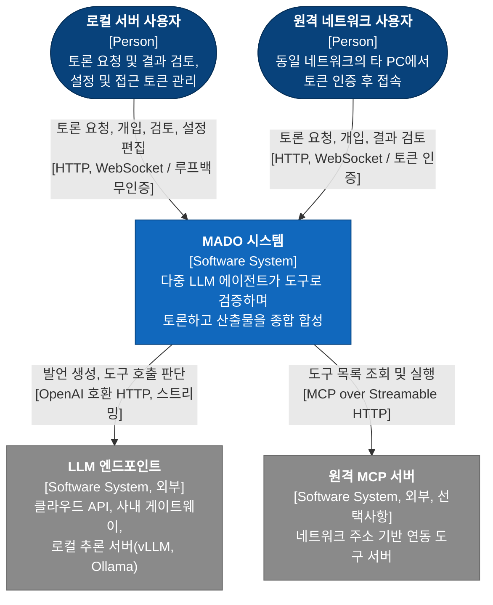
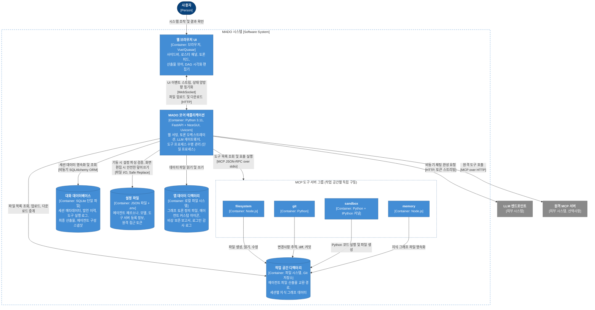
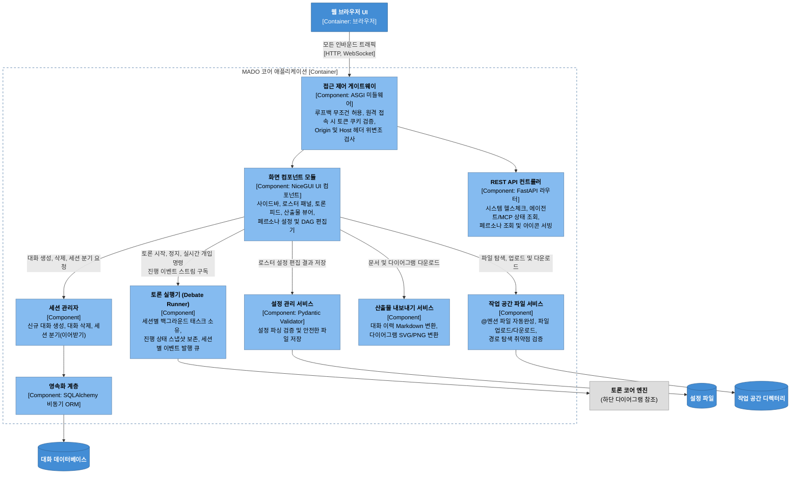
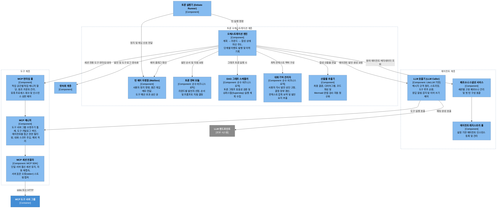
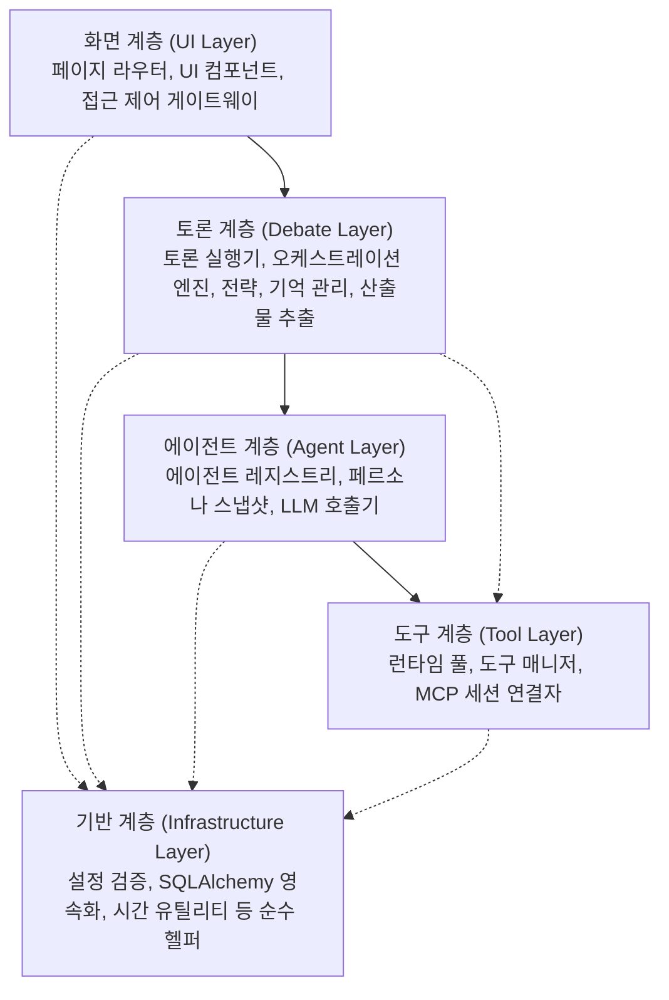
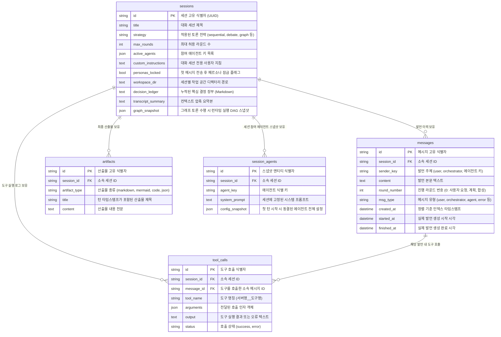
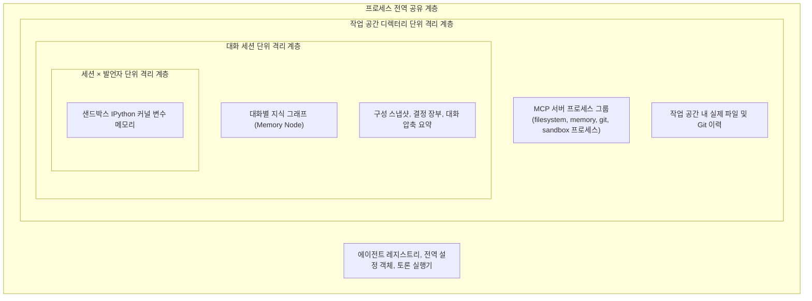

# 3-1. 정적 뷰: 시스템 구성 요소와 의존 관계 분석

> 상위: [3강. 아키텍처](README.md) · 다음: [3-2. 동적 뷰](02-dynamic-view.md)

정적 뷰(Static View)는 시스템이 정지된 상태에서 바라본 구조적 모습입니다. 시스템에 어떤 구성 요소가 존재하는지, 각 요소가 어떠한 책임을 담당하는지, 상호 간의 의존 관계와 데이터 영속화 위치는 어디인지를 다룹니다. C4 모델의 1단계부터 3단계 다이어그램을 차례대로 심층 분석하고, 마지막으로 시스템 상태의 종류와 격리 경계를 정리합니다.

---

## 1. C4 1단계: 시스템 컨텍스트

가장 거시적인 관점에서 시스템 경계를 파악하는 다이어그램입니다. MADO를 단일 소프트웨어 시스템 상자로 두고, 주변의 사용자와 외부 연동 시스템 간의 상호작용을 표현합니다.



이 다이어그램에서 주목해야 할 핵심 설계 사항은 다음과 같습니다.

- **사용자가 두 가지 유형으로 구분됩니다.** 서버 머신 본체에서 직접 사용하는 로컬 관리자(Host Owner)와, 사내 동일 서브넷의 다른 PC에서 브라우저로 접속하는 원격 사용자입니다. 두 사용자는 동일한 UI 기능을 활용하지만 진입 인증 절차가 다릅니다. 로컬 사용자는 루프백 주소(`127.0.0.1`)를 통해 별도 인증 없이 접속하며, 원격 사용자는 관리자가 발급한 보안 토큰을 통해 로그인해야 합니다. 복잡한 다중 계정 체계 대신 단일 소유자 기반 토큰 인증 모델을 채택했습니다([ADR-019](../05-adr/ADR-019-owner-token-remote-access.md)).
- **LLM은 외부 시스템으로 격리되어 있습니다.** MADO는 LLM 추론 모델을 프로세스 내부에 직접 내장하지 않습니다. OpenAI 표준 규격을 지원하는 엔드포인트라면 클라우드 상용 API든, 폐쇄망 사내 게이트웨이든, vLLM/Ollama 같은 로컬 GPU 추론 서버든 자유롭게 연동할 수 있습니다.
- **기본 도구 서버는 컨텍스트 경계 내부에 포함됩니다.** 파일 시스템 접근, Git, Python 샌드박스와 같은 표준 도구 서버는 MADO가 자식 프로세스로 직접 생성하고 생명주기를 통제하므로 시스템 경계 내부에 위치합니다. 컨텍스트 다이어그램의 외부에 표현된 원격 MCP 서버는 이미 사내 인프라에 별도로 구동 중인 외부 서비스에 주소 기반으로 연동하는 경우에 해당합니다.

## 2. C4 2단계: 컨테이너

MADO 시스템 내부를 구성하는 주요 실행 단위와 저장소 컨테이너들을 살펴봅니다.



### 컨테이너별 역할 정의

| 컨테이너 | 핵심 책임 | 주요 아키텍처 특징 |
| :--- | :--- | :--- |
| **웹 브라우저 UI** | 사용자가 접하는 모든 시각적 인터랙션 제공 | 화면 상태의 원본(Single Source of Truth)은 서버 메모리에 상주하며 브라우저는 사본을 투영합니다. 단, 그래프 편집기의 경우 인터랙션 반응성을 위해 브라우저가 편집 상태를 유지하다가 명시적 저장 시점에 서버로 전송합니다. |
| **MADO 코어 애플리케이션** | 웹 화면 서빙, 토론 오케스트레이션, LLM 게이트웨이, 도구 프로세스 관리 | REST API와 웹 화면이 단일 Python 프로세스 및 단일 asyncio 이벤트 루프 내에서 통합 구동됩니다. |
| **대화 데이터베이스** | 세션과 관련된 모든 데이터 영속화 | 단일 SQLite 파일 구조입니다. 세션 대화가 시작된 이후에는 설정 파일이 아닌 데이터베이스 내의 구성 스냅샷이 기준점 역할을 수행합니다. |
| **설정 파일** | 시스템 배포 단위의 기본 설정 보존 | 읽기 전용에 머무르지 않습니다. 웹 UI에서 에이전트 구성이나 MCP 서버를 편집하면 해당 변경사항이 파일에 안전하게 다시 저장(반영)됩니다. |
| **앱 데이터 디렉터리** | 애플리케이션 운영에 수반되는 보조 파일 관리 | DB 파일 잠금 등으로 인해 정상 저장되지 못한 비상 산출물이 Markdown 파일 형태로 안전하게 기록됩니다. |
| **작업 공간 디렉터리** | 에이전트 간의 실제 파일 및 코드 인계 경로 | 표준 Git 저장소로 동작합니다. 세션 대화마다 서로 다른 작업 디렉터리를 지정하여 격리할 수 있습니다. |
| **MCP 도구 서버 그룹** | 에이전트가 활용하는 격리된 도구 실행 환경 | 도구 서버가 접근할 작업 디렉터리는 프로세스 기동 시점에 결정되므로, 작업 공간마다 독립된 도구 서버 프로세스 그룹이 생성됩니다. |

### 도구 서버를 독립 컨테이너로 분리한 설계 근거

도구 로직을 애플리케이션 내부 모듈로 구현하지 않고 독립된 컨테이너(프로세스)로 분리한 것은 MADO의 핵심 설계 결정 중 하나입니다. 각 도구 서버는 독립적인 운영체제 메모리 공간과 전용 작업 디렉터리를 점유하며, 메인 애플리케이션과는 표준 입출력(stdio) 파이프를 통해서만 통신합니다. 이러한 프로세스 격리를 통해 다음과 같은 이점을 얻을 수 있습니다.

- Python 샌드박스 내부에서 메모리 누수, 무한 루프, 커널 충돌이 발생하더라도 메인 애플리케이션 프로세스는 일체의 영향 없이 정상 작동합니다.
- 파일 시스템 도구 서버는 초기 지정된 작업 공간 디렉터리 외부 경로에 대한 상위 디렉터리 탈출(`..`) 접근을 프로세스 수준에서 원천 차단합니다. 메인 애플리케이션의 검증 로직에 결함이 발생하더라도 추가적인 보안 방어벽이 유지됩니다.
- Node.js 기반 오픈소스 도구와 Python 기반 자체 도구를 단일 시스템 내에서 이종 런타임 제약 없이 유연하게 조합할 수 있습니다.

물론 프로세스 분리에는 프로세스 비정상 종료 감지, 응답 지연 타임아웃, IPC 직렬화 오버헤드 등의 관리 비용이 수반됩니다. 이러한 문제를 견고하게 제어하는 방법은 [4-3. MCP 호스트](../04-core-techniques/03-mcp-host.md)에서 자세히 다룹니다.

## 3. C4 3단계: 컴포넌트

단일 Python 프로세스로 구동되는 MADO 코어 애플리케이션 컨테이너 내부의 컴포넌트 구조를 분석합니다. 이해를 돕기 위해 요청 접수 및 화면 계층과, 실제 토론을 주도하는 코어 계층의 두 영역으로 나누어 설명합니다.

### 3.1 진입 및 화면 계층



이 다이어그램에서 가장 주목해야 할 핵심 인터페이스는 **화면 컴포넌트 → 토론 실행기** 간의 단방향 제어 흐름입니다. 화면 코드는 토론 로직을 직접 실행하지 않습니다. 토론 실행기에게 "지정된 세션에서 해당 사용자 요청으로 토론 태스크를 기동하라"고 요청한 뒤, 토론 진행 경과는 비동기 이벤트 스트림 형태로 전달받아 화면에 반영합니다. 이러한 실행 분리 아키텍처 덕분에 브라우저를 새로고침하거나 탭을 닫더라도 백그라운드 토론이 중단되지 않고 안정적으로 완결됩니다([ADR-008](../05-adr/ADR-008-background-debate-runner.md)).

접근 제어 게이트웨이는 시스템의 최외곽 단일 관문으로 위치합니다. UI 페이지 접속, 화면 상태 동기화용 WebSocket 핸드셰이크, REST API 요청, 파일 다운로드 등 모든 인바운드 트래픽이 이 단일 미들웨어를 통과해야 합니다. 보안 통제 지점이 분산되면 특정 엔드포인트의 인증 누락 사고가 발생하기 쉽기 때문에, 단일 게이트웨이 패턴을 확립하고 이를 자동화 테스트로 엄격히 검증하고 있습니다.

### 3.2 토론 코어 계층



### 컴포넌트의 책임과 의도적인 "정보 은닉"

성공적인 아키텍처 컴포넌트는 자신이 무엇을 수행하는지만큼 **무엇을 알지 않아야 하는지(정보 은닉)**가 명확해야 합니다. 아래 표의 세 번째 열은 각 컴포넌트가 의도적으로 결합을 배제한 대상을 나타내며, 네 번째 열은 이러한 경계가 부재했을 때 실제로 겪었던 장애 사례입니다.

| 컴포넌트 | 핵심 책임 | 의도적으로 배제한 정보 (모르는 것) | 경계가 부재했을 때 발생한 장애 |
| :--- | :--- | :--- | :--- |
| **토론 실행기** | 세션별 백그라운드 토론 태스크를 소유하고 이벤트를 브라우저에 배포합니다. | 웹 UI 컴포넌트 및 화면 요소 | 토론 로직이 UI 클릭 이벤트 핸들러 내부에서 직접 실행되던 초기 버전에서는, 사용자가 페이지를 새로고침하면 토론 태스크가 즉시 강제 종료되었습니다. |
| **오케스트레이션 엔진** | 단일 턴의 전 과정을 상태 머신으로 주도하며 영속화합니다. | 라운드별 세부 발언 순서 결정 규칙 (전략 객체에 위임) | 발언 순서 결정 로직이 엔진과 전략 모듈에 중복 분산되어 있을 때, 로스터 패널의 순서 미리보기 화면과 실제 발언 순서가 불일치하는 결함이 발생했습니다. |
| **토론 전략 모듈** | 라운드별 발언 대상자, 진행 순서, 역할 프롬프트를 정의합니다. | 실제 LLM API 호출 구현 및 특정 에이전트 고유 식별자 | 발언 순서가 `architect`, `coder`, `critic` 키로 하드코딩되어 있어, 사용자가 화면에서 신규 에이전트를 추가해도 토론 순서의 맨 뒤로 밀려나는 문제가 있었습니다. |
| **DAG 그래프 스케줄러** | 유향 비순환 그래프의 정합성을 검증하고 병렬 실행 계획을 수립합니다. | 외부 LLM 호출 및 데이터베이스 연동 | 순수 알고리즘 로직으로 격리되어 있어, 외부 의존성이나 LLM 없이도 단위 테스트를 완벽하게 수행할 수 있습니다. |
| **대화 기억 관리자** | 보존할 핵심 지침, 갱신할 결정 장부, 압축할 대화 요약을 산출합니다. | 실제 LLM 호출 (필요 시 엔진이 대신 호출하여 주입) | 스케줄러와 마찬가지로 순수 상태 변환 로직으로 설계되어 단위 테스트가 용이합니다. |
| **LLM 호출기** | 요청 스키마를 공급자 규격에 맞게 정리하고 도구 루프를 순환합니다. | 데이터베이스 세션 및 화면 UI 객체 | 대화 기록 저장과 화면 갱신은 엔진이 전달한 콜백 함수와 이벤트를 통해 비동기적으로 처리됩니다. |
| **MCP 런타임 풀** | 작업 공간 디렉터리별로 독립된 도구 매니저 인스턴스를 대여 및 회수합니다. | 개별 도구 서버 내부에 존재하는 세부 도구 목록 | 도구 서버의 세부 도구 카탈로그는 매니저 계층에서 캡슐화합니다. |
| **MCP 매니저** | 도구 서버 프로세스 그룹의 수명을 통제하고 예외를 안전한 결과로 변환합니다. | 타 작업 공간의 상태 및 파일 경로 | 초기 버전에서 매니저가 전역 환경변수를 직접 덮어쓰던 시절에는 둘 이상의 작업 공간을 동시에 운영할 수 없었습니다. |
| **설정 관리자** | JSON 설정을 엄격히 검증하고 UI 수정사항을 원본 파일에 다시 저장(반영)합니다. | 환경변수 치환이 완료된 런타임 값 (다시 저장할 때는 원본 템플릿만 조작) | 치환된 런타임 값을 그대로 파일에 다시 저장할 경우 개발자의 개인 API 키가 설정 파일에 평문으로 영구 기록되는 보안 사고가 발생할 수 있습니다. |

"순수 비즈니스 로직"으로 분류된 컴포넌트(토론 전략, 그래프 스케줄러, 대화 기억 관리자)는 LLM API나 데이터베이스 I/O를 직접 호출하지 않습니다. 입력값을 받아 명확한 결과값을 반환하는 결정론적(Deterministic) 함수 형태로 설계되었습니다. 외부 LLM의 추론이 필요한 분기(예: 오케스트레이터의 동적 발언자 지명)의 경우, 전략 모듈은 "LLM 질의 필요" 플래그만 설정하고 실제 API 호출과 실패 시의 폴백(대체) 순서 결정은 상위 엔진이 담당합니다. 덕분에 시스템에서 가장 복잡한 비즈니스 규칙들을 무거운 외부 의존성 없이 빠르고 안정적으로 자동 테스트할 수 있습니다.

## 4. 계층 구조와 의존성 방향

전체 시스템 컴포넌트를 계층(Layer) 구조로 재정렬하면 의존 관계의 방향성이 명확하게 드러납니다.



아키텍처 설계 규칙은 명확합니다. **모든 의존성은 상위 계층에서 하위 계층으로만 단방향으로 흐릅니다.** 상위 계층이 하위 계층을 건너뛰어 기반 계층을 직접 참조하는 것(점선 화살표)은 허용되지만, 하위 계층이 상위 계층을 역방향으로 참조하는 것은 엄격히 금지됩니다.

이 규칙이 가장 큰 안정성을 발휘하는 영역이 바로 '토론 계층'과 '화면 계층' 간의 분리입니다. 토론 계층은 화면 계층의 존재를 전혀 인지하지 못합니다. 따라서 백그라운드 토론 태스크가 UI 컴포넌트의 렌더링 수명주기에 결합되지 않으며, 사용자의 브라우저 연결이 끊어지더라도 토론 작업은 아무런 영향을 받지 않고 지속됩니다. 화면에 전달할 진행 상황이 있다면 단지 표준 이벤트 메시지를 발행할 뿐이며, 해당 이벤트를 브라우저가 수신하여 그리는지 여부는 토론 계층의 관심사가 아닙니다.

### 순환 의존성(Circular Dependency) 해결 사례

v0.6.1.2 개발 당시, 발언 시각 포맷팅 유틸리티 함수들을 "대화 내보내기(Export)" 모듈 내부에 처음 작성했습니다. 그러나 오케스트레이션 엔진 역시 이벤트 로그 기록을 위해 동일한 시간 포맷팅 함수가 필요했습니다. 그 결과 다음과 같은 잠재적 순환 참조 루프가 형성되었습니다.

```text
내보내기 모듈 → 토론 전략 모듈 → 토론 계층 패키지 root → 오케스트레이션 엔진 → 내보내기 모듈 (아직 초기화 진행 중)
```

이 순환 의존성은 특정 테스트 코드가 내보내기 모듈을 가장 먼저 import하는 시점에만 비결정론적인 `ImportError`로 폭발했습니다. 메인 서버 애플리케이션 진입점에서는 우연히 안전한 순서로 모듈들이 로드되고 있었기 때문에 초기에는 문제를 감지하기 어려웠습니다.

이 결함은 시각 포맷팅 헬퍼 함수들을 **애플리케이션의 그 어떤 내부 도메인 모듈도 참조하지 않는 순수 유틸리티 모듈**로 분리하여 최하위 기반 계층에 재배치함으로써 완벽히 해결했습니다. 화면 계층, 영속화 계층, 최종 보고서 생성 모듈이 모두 이 독립된 헬퍼를 공통 참조하게 되면서, 시각 표기 규격이 어긋나는 문제도 원천 차단되었습니다. 여러 계층이 공통으로 활용하는 유틸리티는 반드시 최하위 기반 계층에 무의존(Self-contained) 형태로 격리해야 합니다.

## 5. 데이터 도메인 모델

대화 데이터베이스의 물리적 ER 다이어그램입니다. 총 5개의 핵심 테이블로 구성되며, 모든 하위 엔티티는 외래 키(Cascade Delete)를 통해 세션 엔티티에 종속되므로 특정 세션을 삭제하면 연관된 모든 데이터가 완전하게 함께 정리됩니다.



이 데이터 모델에는 다음과 같은 중요한 설계 의도가 담겨 있습니다.

- **정렬 키와 실제 발언 시각을 명확히 분리했습니다.** `messages` 테이블의 `created_at` 컬럼은 단순한 타임스탬프가 아니라 UI 렌더링 순서를 결정하는 **정렬 인덱스 키**로 동작합니다. 발언 레코드는 LLM 스트리밍이 완전히 종료된 후 DB에 삽입되므로 실제 기록 시각은 완료 시각에 가깝습니다. 특히 병렬 실행 라운드의 경우, 여러 에이전트가 동시에 응답을 반환하더라도 "라운드 기준 시각 + 오케스트레이터가 지정한 발언 순서(밀리초 오프셋)"로 `created_at`을 보정하여 저장함으로써 페이지를 새로고침해도 의도된 순서대로 일관되게 렌더링되도록 보장합니다. 실제 물리적 시작 및 완료 시각은 `started_at`, `finished_at` 컬럼에 독립적으로 보존합니다.
- **구성 스냅샷은 에이전트의 전체 설정을 포함합니다.** `session_agents` 테이블에는 에이전트의 이름, 역할, 프롬프트뿐만 아니라 당시 사용된 LLM 모델, 엔드포인트 URL, 도구 권한 스키마까지 포함된 전체 JSON 설정이 동결되어 기록됩니다. 세션이 시작된 이후에는 이 스냅샷이 단일 기준점(SSOT)이 되며 전역 설정 파일의 변경에 일체 영향받지 않습니다([ADR-011](../05-adr/ADR-011-session-config-snapshot.md)). 단, 보안을 위해 외부 페르소나 조회 API에서는 이 스냅샷 데이터를 절대로 외부에 노출하지 않습니다.
- **NULL 값에도 고유한 설계 의미를 부여했습니다.** `config_snapshot` 컬럼이 NULL인 레코드는 해당 기능이 도입되기 이전 구버전에서 생성된 대화임을 의미하며, 이 경우 이전 버전 호환성을 위해 전역 설정 파일을 조회하도록 처리합니다. 반면 UI 카드 색상 컬럼은 NULL 대신 빈 문자열(`""`)을 기본값으로 사용합니다. 데이터베이스 스키마에서 기본값을 정의할 때는 해당 기본값이 비즈니스 로직에서 어떠한 기본 동작으로 처리될지 명확한 의도를 바탕으로 설계해야 합니다.
- **외부 마이그레이션 도구 없이 스키마를 점진적으로 확장합니다.** 폐쇄망 환경에 Alembic과 같은 별도의 마이그레이션 도구를 추가 반입하는 번거로움을 피하기 위해, 애플리케이션 기동 시 현재 SQLite 테이블의 메타데이터를 검사하여 누락된 신규 컬럼을 동적으로 자동 추가(`ALTER TABLE ADD COLUMN`)하는 가벼운 스키마 패치 메커니즘을 내장했습니다. 몇 번을 재실행해도 안전하며, 구버전 DB 파일을 그대로 가져와 최신 버전으로 기동해도 무결성이 유지됩니다. 단, 이 방식은 컬럼 추가만 지원하므로 기존 컬럼의 이름이나 타입을 변경하지 않는 하위 호환성 유지 원칙을 준수하고 있습니다.

## 6. 시스템 상태의 종류와 단일 기준점 (Source of Truth)

MADO 시스템에는 라이프사이클과 영향 범위가 서로 다른 다양한 상태가 공존합니다. 아래 표를 명확히 이해해 두시면 시스템 설정이나 상태를 수정했을 때 변경사항이 실제로 어디까지 전파되는지 정확히 파악할 수 있습니다.

| 상태의 유형 | 단일 기준점 (Source of Truth) | 유효 범위 | 대표 예시 | 수정 시 영향 범위 |
| :--- | :--- | :--- | :--- | :--- |
| **전역 배포 설정** | 설정 파일 (`conf.json`) | 시스템 프로세스 전체 | 등록된 에이전트 목록, LLM 모델 정보, 도구 권한, MCP 서버 목록 | 향후 새로 생성되는 신규 대화 세션에만 적용됩니다. |
| **대화 세션 구성** | 대화 DB (`session_agents` 스냅샷) | 단일 대화 세션 | 첫 턴 시작 시점의 참여 에이전트 설정 전체 | 변경되지 않습니다. (사용자가 UI에서 명시적으로 '설정 갱신'을 클릭한 경우에만 예외적으로 갱신) |
| **대화 세션 기록** | 대화 DB (`messages`, `artifacts` 등) | 단일 대화 세션 | 발언 내역, 도구 실행 로그, 최종 산출물, 결정 장부 | 해당 대화 세션 내에 영구 반영됩니다. |
| **진행 중인 턴 상태** | 토론 실행기의 인메모리 스냅샷 | 단일 턴 실행 주기 | 실시간 토큰 스트리밍 버퍼, 현재 진행 단계 상태 문구 | 턴이 완료되면 DB로 커밋되어 영구 기록으로 전환됩니다. |
| **도구 런타임 상태** | 작업 공간 디렉터리 및 MCP 자식 프로세스 | 작업 공간 및 세션별 격리 | 생성된 파일, Git 커밋 이력, 지식 그래프, 커널 메모리 | 7절의 격리 경계 규칙을 따릅니다. |

특히 **진행 중인 턴 상태**의 기준점 전환 시점에 주목해 주시기 바랍니다. 토론이 실시간으로 진행되는 동안에는 아직 DB에 영구 기록되지 않은 스트리밍 발언이 존재하므로, 브라우저가 새로고침되면 DB의 영구 데이터 위에 실행기 메모리의 진행 스냅샷을 덧씌워 화면을 복원합니다. 그러나 턴이 완전히 종료된 후에도 메모리 스냅샷을 계속 신뢰할 경우, 정상 커밋된 DB의 최종 산출물을 이전 메모리 사본이 덮어써버리는 동기화 버그가 발생할 수 있습니다. 따라서 턴 완료 신호가 떨어지는 즉시 실행기 스냅샷은 폐기하고 DB를 기준점(SSOT)으로 전환합니다. **시스템의 단일 기준점은 런타임 시점에 따라 전환될 수 있으며, 애플리케이션 코드는 그 전환 경계를 엄격히 인지하고 통제해야 합니다.**

## 7. 격리 경계

다수의 대화 세션이 동시에 병렬 실행될 때, 리소스 공유와 데이터 격리가 어떠한 계층 단위로 이루어지는지 정리합니다.



| 격리 계층 | 격리되는 핵심 리소스 | 해당 계층 단위로 분리한 아키텍처 이유 |
| :--- | :--- | :--- |
| **프로세스 전역** | 분리되지 않고 전체 세션이 공유 | 서버 기동 시점에 고정되는 불변 참조 객체(설정 객체, 라우터 등)이므로 스레드/태스크 안전하게 공유할 수 있습니다. |
| **작업 공간** | MCP 도구 서버 프로세스 그룹 및 작업 파일 | 도구 서버는 초기 기동 시 작업 대상 폴더 경로를 인자로 전달받습니다. 대상 디렉터리가 다르면 완전히 독립된 프로세스로 분리 구동되어야 합니다. |
| **대화 세션** | 지식 그래프, 결정 장부, 컨텍스트 요약 | 한 대화 내에서 합의된 사실과 설계 제약은 해당 토론에 참여하는 모든 에이전트가 투명하게 공유해야 합니다. |
| **세션 × 발언자** | Python 샌드박스의 IPython 커널 변수 | 다음 발언자에게 전달되는 맥락은 이전 발언의 최종 텍스트뿐이며 도구의 메모리 상태는 인계되지 않습니다. 서로 다른 에이전트 간의 암묵적 변수 오염을 원천 방지하기 위해 분리합니다. |

Python 샌드박스 커널을 세션 단위가 아닌 **세션 × 발언자 단위**로 세분화하여 격리한 이유에 대해 부연하겠습니다.

토론 진행 중 에이전트 간에 인계되는 공식 데이터는 앞선 발언자의 텍스트 본문뿐이며, 세부 도구 실행 로그는 UI의 접이식 영역에만 남습니다. 만약 커널 메모리를 모든 에이전트가 공유한다면, 리뷰어 에이전트는 엔지니어가 이전 라운드에서 생성해 둔 전역 변수를 무심코 그대로 상속받게 됩니다. 그 결과 세 라운드 전에 생성된 낡은 DataFrame 객체를 최신 결과물로 오인하여 잘못된 검증 리뷰를 작성하는 심각한 논리 오류가 발생할 수 있습니다.

또한 리뷰어에게 샌드박스 실행 권한을 부여한 본래 목적은 엔지니어가 작성한 **코드 자체를 독립적으로 실행하여 재현성을 검증**하는 데 있습니다. 엔지니어가 대화형으로 메모리에 남겨둔 객체를 그대로 조회하는 것은 코드 검증이 아닌 엔지니어의 실행 결과만을 맹목적으로 확인하는 것에 불과합니다. 따라서 에이전트 간의 정합성 있는 코드 및 데이터 전달은 반드시 작업 공간 디렉터리 내의 실제 물리적 파일을 통해 명시적으로 이루어져야 합니다. 파일을 직접 열지 않고 선행 변수를 참조하려 하면 `NameError`로 명확하게 실패하며, 파일을 읽도록 코드를 수정함으로써 신뢰성 있는 검증이 완성됩니다.

이러한 격리 경계를 어느 주체가 강제하는지도 중요한 설계 요소입니다. 독립된 MCP 도구 서버는 수신한 도구 호출 요청이 어느 대화 세션에서 발생한 것인지 스스로 판별할 수 없습니다. 그렇다고 LLM 모델에게 "호출 인자에 대화 세션 ID를 반드시 포함하라"고 지시하면, 프롬프트 한계로 인해 간헐적으로 세션 ID가 누락되는 취약점이 발생합니다. 따라서 **호스트 애플리케이션이 모든 도구 호출 요청 메타데이터(`_meta`)에 현재 세션 ID를 강제 주입하여 전송**합니다. 모델이 프롬프트를 통해 임의의 타 세션 ID를 인자로 조작하더라도 호스트가 주입한 메타데이터가 최우선으로 적용되어 다른 세션의 데이터를 침범할 수 없습니다([ADR-010](../05-adr/ADR-010-host-defined-tool-scope.md)).

---

## 핵심 요약

- **C4 컨텍스트 뷰**: MADO는 로컬 및 원격 사용자, 외부 LLM 공급자, 원격 도구 서버와 연동되는 중앙 시스템입니다.
- **C4 컨테이너 뷰**: 애플리케이션 코어와 MCP 도구 서버 간의 물리적 프로세스 격리는 시스템 안정성과 보안을 담보하는 핵심 경계입니다.
- **C4 컴포넌트 뷰**: 각 컴포넌트는 자신이 모르는 대상을 명확히 한정함으로써 결합도를 낮추었습니다. 토론 실행기는 UI를 모르고, 전략은 LLM 통신을 모르며, LLM 호출기는 DB 영속화를 직접 다루지 않습니다.
- **계층 및 의존성 규칙**: 의존성은 항상 상위에서 하위로 단방향으로 흐르며, 여러 계층이 공통으로 사용하는 유틸리티는 최하위 기반 계층에 완전히 무의존 상태로 배치합니다.
- **데이터 및 상태 모델**: 런타임 단계에 따라 단일 기준점(Source of Truth)이 전환되는 시점을 엄격하게 통제하며, 프로세스-작업 공간-대화 세션-발언자의 4단계 격리 경계를 호스트 애플리케이션이 주도적으로 강제합니다.

## 학습 점검 과제

1. 본 다이어그램에서는 설정 파일(`conf.json`)을 독립된 컨테이너로 분류했습니다. 만약 시스템이 기동 시점에 설정을 읽기만 하고 실행 중에 설정을 동적으로 다시 저장(덮어쓰기)하지 않는 읽기 전용 구조였다면, 이를 독립 컨테이너로 분류할 필요가 있었을지 C4 모델의 컨테이너 정의에 비추어 검토해 보십시오.
2. LLM 호출기가 데이터베이스 영속화 책임을 전혀 모르게 설계함으로써 얻는 모듈화의 이점 외에, 이로 인해 상위 오케스트레이션 엔진 계층에서 추가로 감수해야 했던 상태 관리 복잡성(예: 도구 호출 로그와 발언 메시지 간의 외래 키 매핑 등)은 무엇이었을지 분석해 보십시오.
3. 만약 Python 샌드박스의 IPython 커널을 발언자 단위로 분리하지 않고 단일 대화 세션 내에서 모든 전문가 에이전트가 공유하도록 설계했다면, 다중 턴 진행 과정에서 어떤 형태의 숨은 버그나 할루시네이션이 유발되었을지 구체적인 시나리오를 구성해 보십시오.
