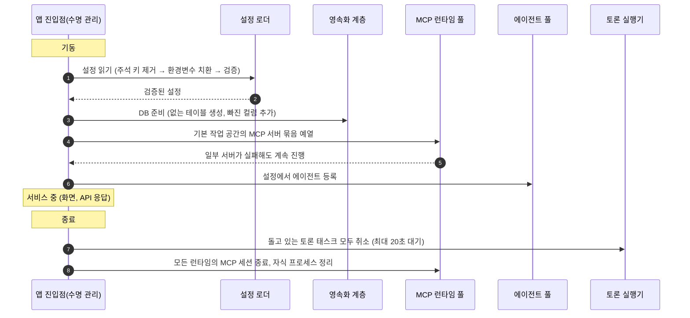
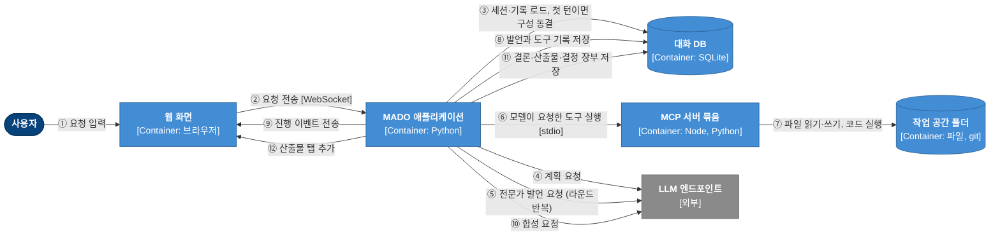
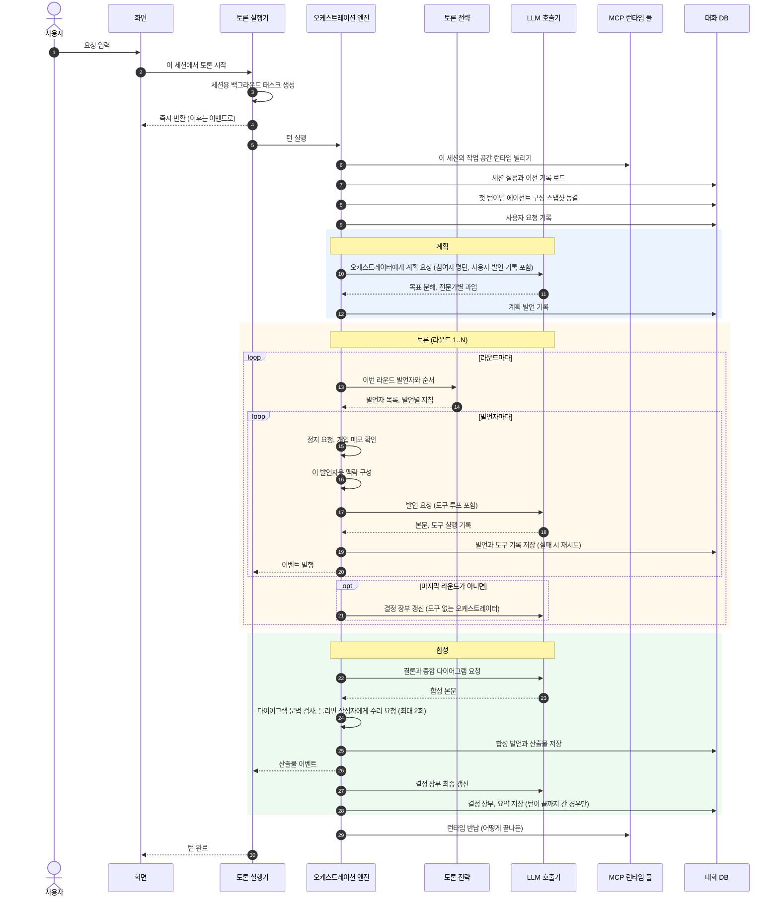
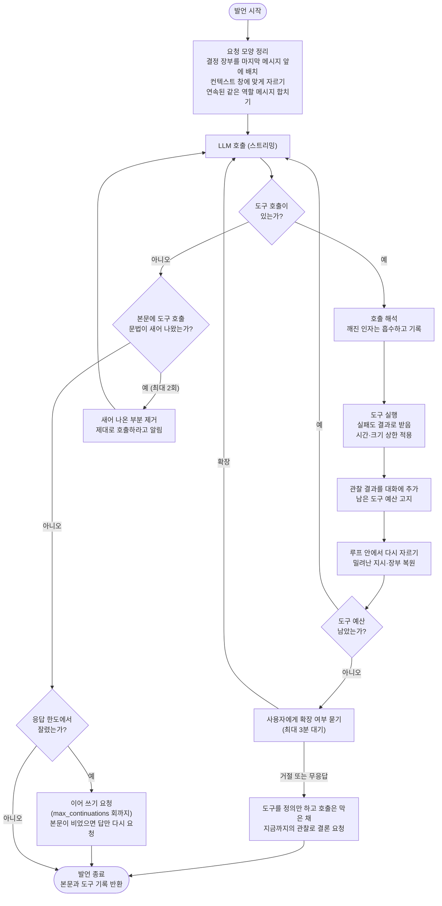
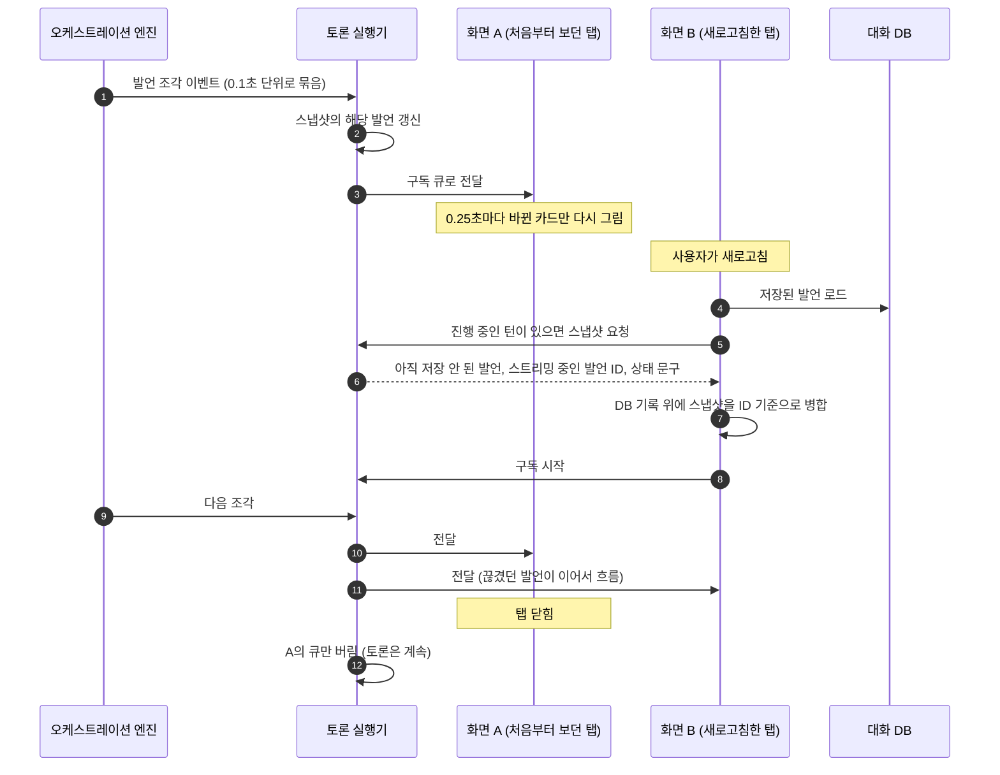
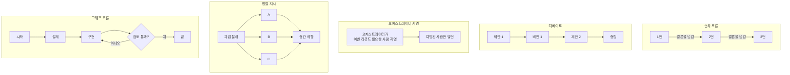
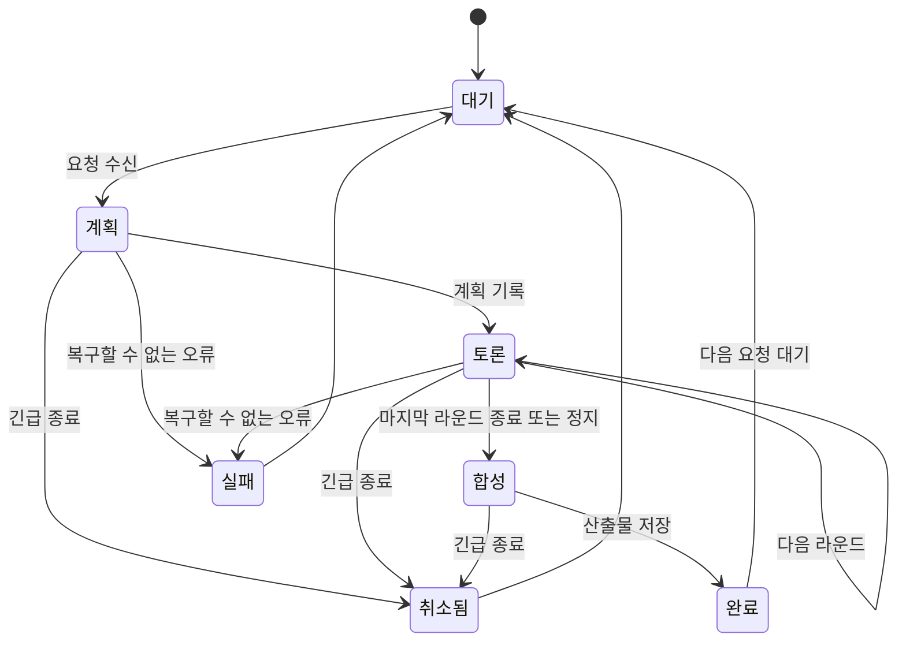
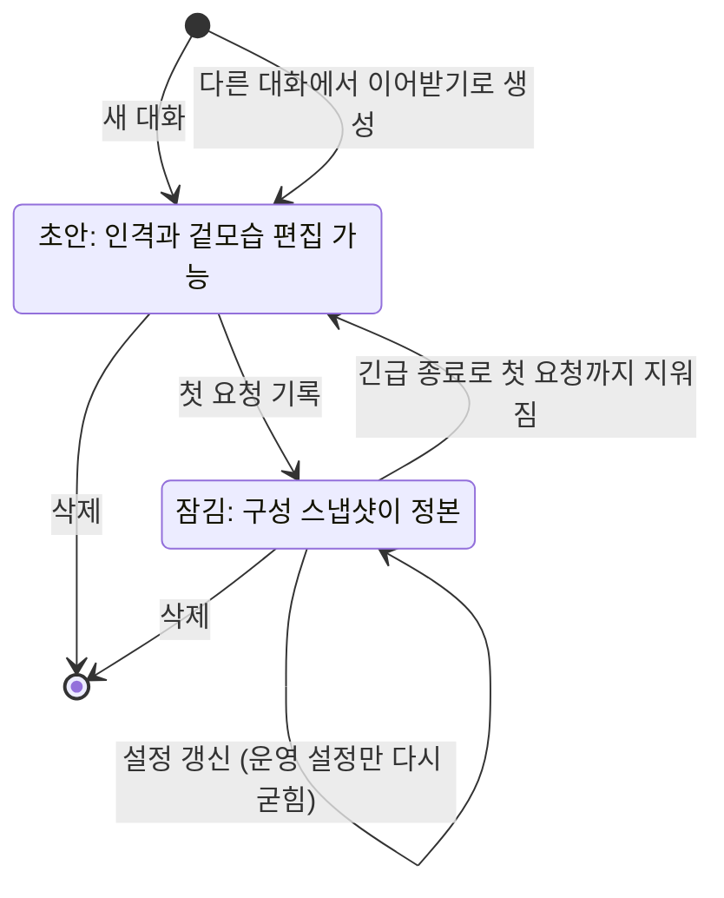
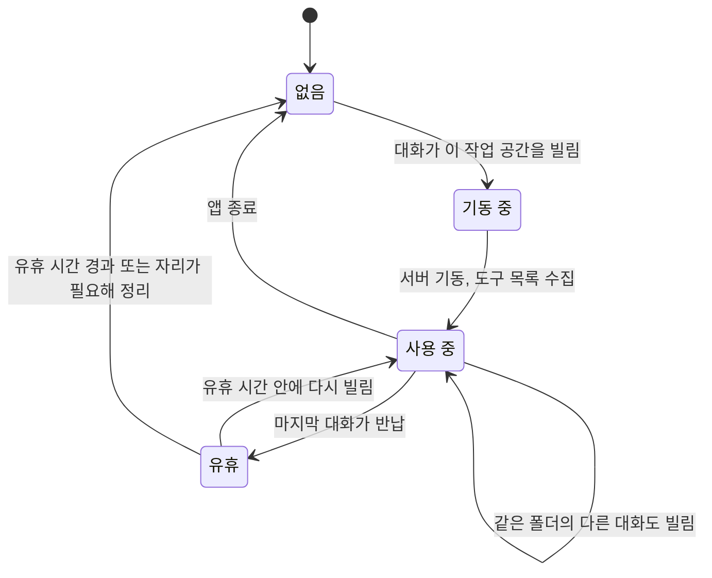
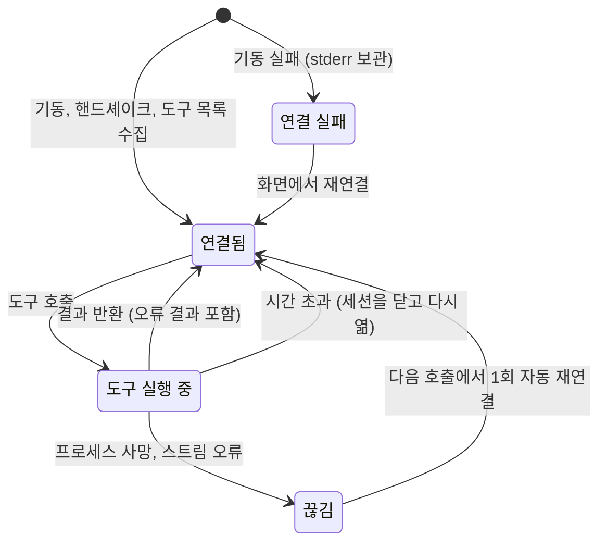

# 3-2. 동적 뷰: 실행하면 무슨 일이 일어나는가

> 상위: [3강. 아키텍처](README.md) · 이전: [3-1. 정적 뷰](01-static-view.md) · 다음: [3-3. 배포 뷰](03-deployment-view.md)

정적 뷰가 부품 목록이라면 동적 뷰는 그 부품들이 움직이는 순서입니다. 이 문서는 시나리오 단위로
구성했습니다. 앱이 뜨고 내리는 과정, 요청 하나가 산출물이 되기까지의 과정, 발언 하나 안에서 도구가
도는 과정, 화면이 끊겼다 다시 붙는 과정을 차례로 봅니다. 뒤쪽에서는 주요 구성 요소의 상태 머신과
실패 시나리오를 정리합니다.

---

## 1. 앱의 기동과 종료

세 가지를 짚어 보겠습니다.

**도구 서버가 떠야 앱이 뜨는 것은 아닙니다.** 기본 작업 공간의 MCP 서버 묶음을 미리 띄워 두지만,
어떤 서버가 기동에 실패해도 앱은 그대로 뜹니다. 실패한 서버는 로스터 패널의 상태 칩에 빨간색으로
표시되고, 칩에 마우스를 올리면 그 서버가 표준 오류로 남긴 첫 줄과 마지막 줄들이 보입니다. 그 도구를
쓰려던 에이전트는 도구 없이 발언합니다. 부분 기능이라도 쓸 수 있는 편이 앱 전체가 뜨지 않는 것보다
낫다는 판단입니다.

**종료를 기다리는 시간에 상한이 있습니다.** 취소 신호를 무시하는 태스크가 하나라도 있으면 종료가
영원히 끝나지 않습니다. 실제로 그런 일이 있었습니다. 예외를 넓게 잡는 코드가 취소 신호까지 삼켜서,
Uvicorn이 강제 종료될 때까지 앱이 멈춰 있었습니다. 겉으로는 서버가 죽은 것처럼 보였습니다. 지금은
취소를 보낸 뒤 20초까지만 기다립니다.

**자식 프로세스는 프로세스 번호가 아니라 핸들로 정리합니다.** 이미 끝난 프로세스의 번호로 종료
신호를 보내면, 운영체제가 그사이 같은 번호를 준 **다른 프로세스**가 맞을 수 있습니다. Windows는
프로세스 번호를 적극적으로 재사용하고, 운이 나쁘면 그 번호의 주인이 Uvicorn의 작업 프로세스일 수도
있습니다. 도구 서버 하나를 정리하다가 앱이 같이 죽는 일을 막으려고, 기동할 때 받아 둔 프로세스
객체로 정리하고 번호는 그 객체를 얻지 못한 경우에만 씁니다.

## 2. C4 동적 다이어그램: 요청 하나가 컨테이너를 오가는 순서

사용자가 요청을 보내 산출물을 받기까지, 컨테이너 사이를 오가는 상호작용에 번호를 붙였습니다.

④부터 ⑨까지가 토론의 본체이고, ⑤~⑨는 라운드 수와 발언자 수만큼 반복됩니다. 이 그림에서 보이지
않는 것이 하나 있습니다. ②에서 요청을 받은 뒤 앱은 **곧바로 응답을 돌려주고**, 이후의 일은 백그라운드
태스크에서 진행됩니다. 브라우저는 ⑨와 ⑫의 이벤트를 받을 뿐 토론 태스크를 붙잡고 있지 않습니다.

## 3. 한 턴의 흐름

컴포넌트 수준으로 내려가서 같은 시나리오를 다시 봅니다.

몇 가지 설계 의도를 짚어 봅니다.

**런타임은 턴 전체 동안 빌리고, 어떻게 끝나든 반납합니다.** 정상 종료, 사용자 정지, 취소, 예외 중
무엇으로 끝나도 반납 코드가 실행되도록 구조화되어 있습니다. 반납을 한 번이라도 빠뜨리면 아무도
쓰지 않는 도구 서버 묶음이 앱이 내려갈 때까지 자리를 차지하고, 다음 대화가 쓸 자리를 빼앗습니다.

**구성 동결은 계획보다 먼저입니다.** 첫 요청이 기록되는 순간 이 대화의 에이전트 구성이 굳습니다.
계획을 세운 뒤에 굳히면, 계획을 세운 오케스트레이터와 실제로 발언하는 에이전트의 설정이 다를 수
있습니다.

**계획에는 참여자 명단이 들어갑니다.** 초기 버전의 첫 턴 프롬프트에는 "(Architect, Coder, Critic)"이
박혀 있었습니다. 로스터가 다른 대화에서는 존재하지 않는 에이전트에게 일을 나눠 줬습니다. 지금은
이번 턴에 실제로 참여하는 전문가의 이름, 역할, 가진 도구 서버를 한 줄씩 넣습니다. 시스템 프롬프트는
넣지 않습니다. 일을 나누는 데는 에이전트당 수십 토큰이면 충분하지만, 페르소나 전문은 호출마다
수천 토큰이 들기 때문입니다.

**결정 장부는 턴이 끝까지 가야 저장됩니다.** 사용자가 "요청 되돌리기"로 턴을 취소하면 그 턴의
발언은 지워집니다. 그런데 결정 장부가 이미 저장되어 있다면, 아무도 내린 적 없는 결정이 장부에 남게
됩니다. 그래서 장부와 요약은 합성이 끝난 뒤에만 DB에 씁니다.

**산출물 이벤트가 결정 장부 갱신보다 먼저 나갑니다.** 순서를 반대로 하면 산출물 탭이 보고서보다 LLM
호출 한 번만큼 늦게 뜹니다. 사용자가 기다리는 것을 먼저 보내고, 내부 정리는 그다음에 합니다.

### 그래프 토론은 분기가 하나 더 있습니다

그래프 토론 전략을 고른 대화는 라운드 루프 대신 그래프 실행으로 갈라집니다. 이 분기는 사용자 요청을
기록하기 **전에** 그래프를 검증합니다. 잘못된 그래프라면 요청 자체를 받지 않고 이유를 보여 줍니다.
기록부터 하고 나서 실패하면, 대화 기록에 응답 없는 요청이 하나 남기 때문입니다. 계획, 합성, 산출물,
결정 장부는 다른 전략과 같은 코드를 씁니다.

## 4. 발언 하나 안의 도구 루프

에이전트 하나가 한 번 발언하는 동안 LLM 호출기 안에서 일어나는 일입니다. 겉보기에는 "도구 부르고
결과 넣고 다시 묻기"의 반복이지만, 실제로는 곳곳에 안전장치가 있습니다.

이 흐름에서 눈여겨볼 두 가지 원칙이 있습니다.

첫째, **루프 안의 어떤 실패도 발언을 끝내지 않습니다.** 모델이 깨진 JSON으로 도구를 불러도, 도구
서버가 오류를 내도, 응답하지 않아도, 결과가 수십 MB여도 발언은 계속됩니다. 실패는 모델이 읽을 수
있는 관찰 결과로 바뀌어 대화에 들어갑니다. 모델은 그 오류 메시지를 보고 인자를 고쳐 다시 부릅니다.

둘째, **상한에 닿아도 그때까지의 작업을 버리지 않습니다.** v0.4 이전에는 도구 호출 상한을 다 쓰면
발언이 실패로 처리되어, 스트리밍으로 흘러나온 글과 실행된 도구 기록이 모두 실패 안내로 덮였습니다.
원인이 엔드포인트 장애가 아니라 우리가 정한 상한이었는데도 말입니다. 지금은 사용자에게 상한을
늘릴지 묻고, 늘리지 않으면 도구 없이 결론을 쓰게 합니다. 어느 쪽이든 왜 멈췄는지 발언 끝에
적힙니다.

도구 예산 고지도 흥미로운 부분입니다. 남은 횟수를 매번 똑같이 알리지 않고, 처음에 총량을 알리고
이후 마일스톤마다, 끝이 가까워지면 5, 4, 3, 2번 남았을 때, 마지막 기회일 때 알립니다. 남은 예산을
알아야 모델이 결론 쓸 자리를 스스로 남겨 두는데, 매번 떠들면 그 자체가 컨텍스트를 먹기 때문입니다.
컨텍스트 창 사용률 고지도 같은 원리로 50, 70, 85, 95%를 처음 넘을 때만 알립니다.

## 5. 이벤트와 화면 재접속

토론 실행기는 세션마다 두 가지를 들고 있습니다. 이번 턴의 **정본 스냅샷**과, 화면마다 하나씩 주는
**구독 큐**입니다.

- 화면이 사라지면 그 화면의 큐만 버립니다. 토론 태스크는 화면이 몇 개 붙어 있는지 모릅니다.
- 따라오지 못하는 화면(큐가 가득 찬 화면)도 토론이 아니라 그 화면을 버립니다. 느린 화면 하나가
  토론을 붙잡으면 안 됩니다.
- 턴이 끝나면 스냅샷은 무시합니다. 그 뒤로는 DB가 정본입니다.
- 이벤트를 두 번 묶는 이유는 2강 NiceGUI 절에서 본 스트리밍 사례 때문입니다. 엔진은 조각 이벤트를
  0.1초 단위로 합치되, 느린 도구 호출 직전의 글이 화면에 늦게 나오지 않도록 지연 전송을 한 번 더
  걸어 둡니다. 화면은 받은 조각을 이어 붙이기만 하고, 다시 그리는 것은 0.25초마다 한 번입니다.

## 6. 토론 전략별 라운드의 모양

전략은 라운드마다 "누가, 어떤 순서로, 어떤 지침을 받고 말하는가"를 정합니다. 무엇을 말할지는
정하지 않습니다. 다섯 전략의 라운드 모양을 비교합니다.

| 전략 | 발언 순서 | 발언마다 붙는 지침 | 라운드 시간 | 실패 시 대체 |
| :--- | :--- | :--- | :--- | :--- |
| 순차 토론 | 발언 우선순위 순서 | 바로 앞 사람을 이름으로 지목하고 그 결론을 검증·보강·반증하라 | 발언 시간의 합 | 없음 |
| 디베이트 | 제안 진영과 비판 진영을 번갈아, 중립은 마지막 | 제안자는 반론에 정면으로 답하라, 비판자는 재현 가능한 반례를 내라 | 발언 시간의 합 | 한쪽 진영이 비면 우선순위 순서로 한 바퀴 |
| 오케스트레이터 지명 | 매 라운드 오케스트레이터가 정함 | 전략별 지침 | 지명된 사람의 합 | 지명 실패 시 우선순위 순서, 그 사실을 기록 |
| 병렬 지시 | 동시 실행 (동시 실행 상한까지) | 자기 과업 + 누가 무엇을 맡았는지 | 가장 느린 한 명 | 분배 실패 시 과업 없이 전원 동시 실행, 그 사실을 기록 |
| 그래프 토론 | 그림에 그린 연결대로 슈퍼스텝 단위 | 노드별 지침, 연결선이 나르는 내용만 봄 | 스텝마다 가장 느린 노드 | 게이트 판정이 형식에 맞지 않으면 기본 분기, 그 사실을 기록 |

전략 사이에 공통된 태도가 보입니다. **대체 경로로 물러설 때는 반드시 물러섰다고 기록합니다.**
오케스트레이터가 지명에 실패했는데 조용히 우선순위 순서로 돌면, 사용자는 오케스트레이터가 그 순서를
골랐다고 믿습니다. 다른 순서로 조용히 도는 것이 가장 나쁜 결과입니다.

### 병렬 지시가 깨뜨린 두 가지 가정

한 번에 한 명씩 말하던 엔진에 동시 발언을 넣자, 순차 실행에서 당연했던 가정 두 개가 깨졌습니다.

1. **DB 세션은 한 번에 하나의 작업만 합니다.** 여러 발언이 같은 비동기 DB 세션에 동시에 커밋하면
   상태 전이 오류로 토론이 통째로 죽습니다. 기록 구간에만 잠금을 걸었습니다. LLM 호출은 잠금 밖에
   두어 병렬성은 그대로 유지합니다.
2. **발언은 저장 시각 순서로 다시 읽힙니다.** 끝난 순서대로 저장하면 새로고침할 때마다 토론 순서가
   달라 보입니다. 지시한 순서대로 정렬 키를 박아 넣습니다(3-1의 "정렬 키와 시각을 나눴습니다" 참고).

또 하나. 그 라운드에 쓸 프롬프트는 **첫 발언이 시작되기 전에 모두 만들어 둡니다.** 각 발언 태스크
안에서 프롬프트를 만들면, 먼저 끝난 동료의 발언이 늦게 시작한 쪽의 맥락에 섞입니다. 같은 라운드인데
누구는 남의 답을 보고 누구는 못 보게 되면, 그건 병렬이 아닙니다. 서로의 답을 못 봤으니 라운드 끝에
오케스트레이터가 중간 취합(통합 결론, 어긋나는 지점과 판정, 검증되지 않은 가정, 다음 과제)을 남깁니다.
이 취합이 없으면 라운드는 독백 묶음이 되고, 모순이 최종 합성까지 그대로 실려 갑니다.

### 그래프 토론의 실행 규칙

그래프 토론은 "발언 순서" 대신 **누가 누구에게 무엇을 넘기는지**를 사람이 그림으로 그립니다.

- 노드 종류는 시작, 에이전트, 병합, 게이트(예/아니오), 끝입니다.
- 새 입력을 받은 노드들이 한 **슈퍼스텝**에 함께 돌고, 출력은 그 스텝이 끝날 때 전달됩니다.
- 연결선마다 전문을 나를지, 요지만 나를지, 긴 코드는 참조로 바꿔 나를지 정합니다. 노드는 들어오는
  연결선이 나르는 것만 봅니다.
- 여러 입력을 기다리는 노드는 **앞쪽에서 오는 입력만** 기다립니다. 되돌아오는 연결(루프)까지 기다리면,
  아직 한 번도 돌지 않은 루프 때문에 영원히 멈춥니다.
- 멈추는 조건은 끝 노드 도달, 더 돌 노드 없음, 스텝 상한, 사용자 정지입니다.
- 게이트를 거치지 않는 순환은 검증 단계에서 거절합니다. "게이트 노드를 뺀 그래프에 순환이 없어야
  한다"로 검사합니다. 첫 구현은 "강하게 연결된 요소 안에 게이트가 있는가"로 검사했는데, 게이트 있는
  루프와 같은 요소에 속한 게이트 없는 루프를 통과시켰습니다.

## 7. 사람이 끼어드는 방법

토론 도중 사람이 할 수 있는 일은 네 가지입니다. 이름은 비슷하지만 전제가 다릅니다.

| 조작 | 전제 | 진행 중인 발언 | 합성 | 기록 |
| :--- | :--- | :--- | :--- | :--- |
| 개입 메모 | 방향을 조금 틀고 싶다 | 끝까지 받음 | 그대로 | 다음 발언자의 맥락에 사용자 발언으로 들어감 |
| 정지 | 논의는 옳았다, 여기까지면 충분하다 | 끝까지 받음 | 실행 (산출물이 나옴) | 남김 |
| 긴급 종료 | 요청 자체가 틀렸다 | 즉시 끊음 | 하지 않음 | 이번 턴이 만든 것을 지우고, 보낸 글은 입력창으로 돌아옴 |
| 도구 예산 확장 응답 | 도구를 더 쓰게 해 줄까? | 이어서 진행 | 그대로 | 발언 끝에 결과가 적힘 |

개입 메모와 정지는 **발언과 발언 사이**에서 확인합니다. 병렬 지시 전략에서는 그 "사이"가 없습니다.
모두가 이미 동시에 달리고 있으므로 라운드 경계에서만 확인합니다. 합성이 시작된 뒤에 도착한 개입
메모는 이번 턴에 실을 자리가 없으므로, 버리지 않고 기록에 남겨 다음 턴이 읽게 합니다. 화면은
"다음 발언 차례에 반영됩니다"라고 알렸는데 조용히 버려지면 약속을 어기는 셈이기 때문입니다.

## 8. 상태 머신

### 8.1 턴의 상태

"완료"가 곧 "합의"는 아닙니다. 발언하지 못한 에이전트가 하나라도 있으면, 또는 합성이 빈 응답으로
끝났으면 턴은 완료되어도 합의로 표시하지 않습니다. 세 명 중 두 명이 침묵했는데 "합의 도달"이라고
적히면 그 기록은 믿을 수 없게 됩니다.

### 8.2 대화(세션)의 수명

**이어받기**는 컨텍스트 창이 가득 찬 긴 대화에서 새 대화를 만들어 옮겨 가는 기능입니다. 원래 대화는
그대로 남고, 새 대화가 작업 공간, 지식 그래프, 에이전트 구성과 스냅샷, 전략 설정, 결정 장부, 직전
결론을 물려받습니다. 비우는 것은 발언 기록뿐입니다. 새 대화는 잠기지 않은 초안 상태로 시작합니다.
컨텍스트가 넘친 원인이 모델 선택이었다면, 사용자가 가장 먼저 바꾸고 싶은 것이 바로 구성이기
때문입니다.

### 8.3 MCP 런타임의 수명

- 참조는 대화 ID의 집합으로 셉니다. 같은 대화가 두 번 빌려도 한 번으로 칩니다.
- 반납 즉시 끄지 않고 유휴 시간(기본 300초) 동안 살려 둡니다. 샌드박스는 파이썬 커널을 띄우는 데
  몇 초가 걸리므로, 연달아 오는 턴이 매번 그 비용을 치르지 않게 합니다.
- 런타임 수에는 상한(기본 4)이 있습니다. 새 폴더가 자리를 원하면 만료된 유휴 런타임, 가장 오래 쉰
  유휴 런타임 순으로 정리합니다. **사용 중인 런타임은 절대 정리하지 않습니다.** 정리할 것이 없으면
  어느 대화가 자리를 잡고 있는지 알려 주며 거절합니다.

### 8.4 MCP 연결 하나의 상태

자동 재연결은 **연결이 끊긴 경우에만** 한 번 시도합니다. 도구가 살아 있는 서버에서 "실패했다"는
결과를 돌려준 경우에는 다시 시도하지 않습니다. 파일 추가나 git 커밋처럼 부작용이 있는 도구를 자동으로
재시도하면 같은 일이 두 번 일어날 수 있기 때문입니다.

시간 초과 후에 세션을 닫고 다시 여는 이유도 있습니다. 늦게 도착한 응답이 다음 호출의 응답으로
섞이면 안 됩니다.

## 9. 실패 시나리오

| 상황 | 어디서 잡는가 | 그 뒤의 흐름 | 사용자가 보는 것 |
| :--- | :--- | :--- | :--- |
| LLM 엔드포인트 연결 실패 | 엔진의 발언 단위 | 그 발언만 "응답 없음"으로 기록하고 다음 발언자로. 이후 맥락과 합성에서 제외하되 합성 프롬프트에 누가 빠졌는지 명시 | 다른 색의 실패 카드, 턴 끝에 응답하지 못한 에이전트 목록 |
| 도구 실행 오류 | MCP 매니저 | 오류 문구를 그대로 모델에게 관찰 결과로 전달, 모델이 고쳐서 재시도 | 도구 접이식 영역에 빨간 상태 |
| 도구 무응답 | MCP 연결 | 180초 뒤 포기, 세션 재개방, 모델에게 "응답 없음"을 알림 | 같음 |
| 도구 결과가 너무 큼 | MCP 연결 | 앞뒤만 남기고 가운데 생략 (20만 자) | 생략 표시 |
| 응답 한도(`max_tokens`)에서 잘림 | LLM 호출기 | 이어 쓰기, 잘린 도구 호출이면 실행하지 않고 이유와 대안을 알림 | 필요하면 발언 끝에 잘림 안내 |
| DB 잠김 | 엔진의 기록 계층 | 30초 대기 후 2초, 5초 간격 재시도, 끝내 실패하면 마크다운 파일로 보존 | 닫을 때까지 남는 알림 |
| 합성이 빈 응답 | 산출물 추출기 | "합성 실패"로 기록하고 전문가별 마지막 발언을 LLM 없이 모아 채움, 합의로 표시하지 않음 | 합성 실패 탭 |
| 다이어그램 문법 오류 | 산출물 추출기 | 오케스트레이터에게 파서 오류와 함께 돌려보내 최대 2회 수리, 끝내 실패하면 원본 유지하고 제목에 ⚠ | 수리 진행 문구, 경고 표시 |
| 브라우저 연결 끊김 | 토론 실행기 | 그 화면의 구독만 정리, 토론은 계속 | 새로고침하면 진행 중인 토론에 다시 붙음 |

이 표의 공통점은 **실패를 가장 가까운 층에서 잡아 "기록 가능한 사실"로 바꾼다**는 것입니다. 위로
전파되는 것은 예외가 아니라 결과입니다. 이 원칙을 코드 수준에서 어떻게 지키는지는
[4-7. 실패를 설계하기](../04-core-techniques/07-failure-design.md)에서 다룹니다.

---

## 정리

- 앱은 도구 서버가 일부 실패해도 뜨고, 종료는 상한 시간 안에 끝나며, 자식 프로세스는 핸들로 정리합니다.
- 요청을 받은 화면은 곧바로 손을 떼고, 토론은 세션별 백그라운드 태스크가 진행합니다.
- 한 턴은 런타임 대여 → 구성 동결 → 계획 → 라운드 → 합성 → 반납의 순서이고, 반납은 어떻게 끝나든 일어납니다.
- 도구 루프 안의 실패는 관찰 결과가 되고, 상한에 닿아도 그때까지의 작업은 보존됩니다.
- 전략이 대체 경로로 물러설 때는 반드시 그 사실을 기록합니다.
- 실패는 가장 가까운 층에서 잡아 기록 가능한 사실로 바꿉니다.

## 생각해 볼 문제

1. 결정 장부를 매 라운드 끝이 아니라 매 발언 끝에 갱신한다면 무엇이 좋아지고 무엇이 나빠질까요?
   비용(LLM 호출 수)과 프롬프트 캐시 관점에서 따져 보세요.
2. 병렬 지시 전략에서 라운드 프롬프트를 미리 만들지 않고 각 태스크 안에서 만들었을 때, 테스트로 이
   버그를 잡으려면 어떤 가짜 LLM이 필요할까요?
3. 자동 재연결을 "연결이 끊긴 경우 1회"로 제한했습니다. 읽기 전용 도구에 한해서는 오류 결과도
   재시도하게 하면 어떨까요? 도구가 읽기 전용인지 호스트가 어떻게 알 수 있을까요?
