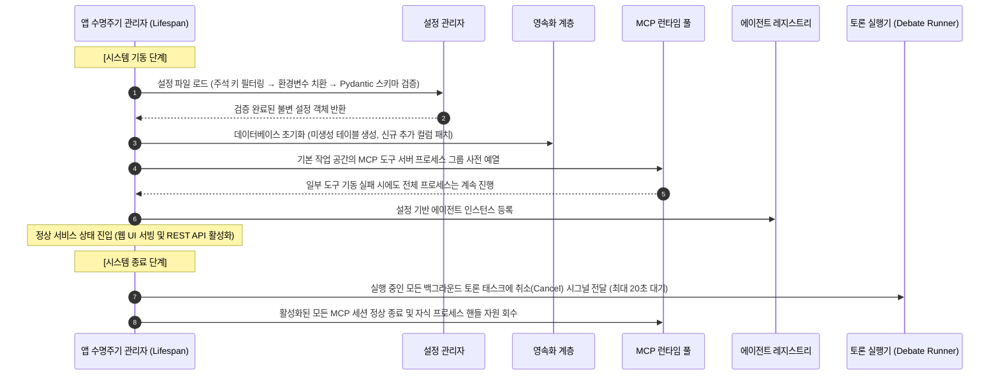
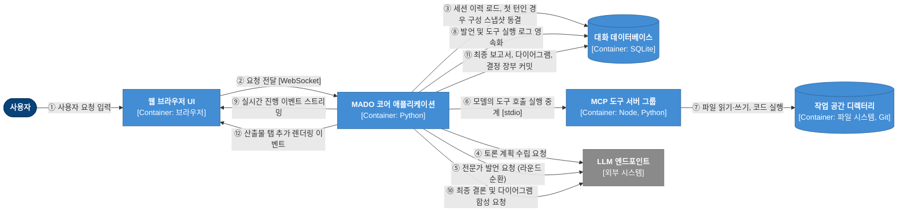
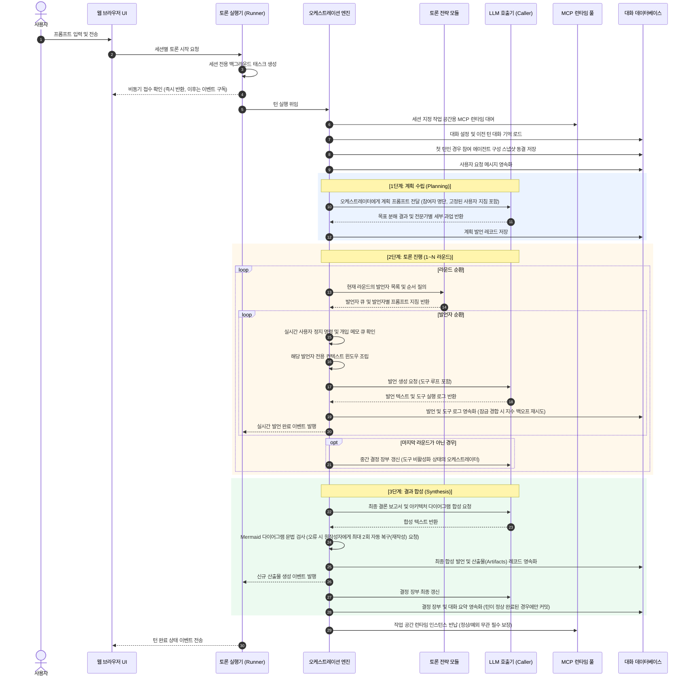
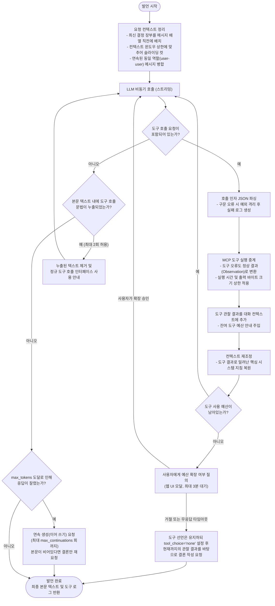
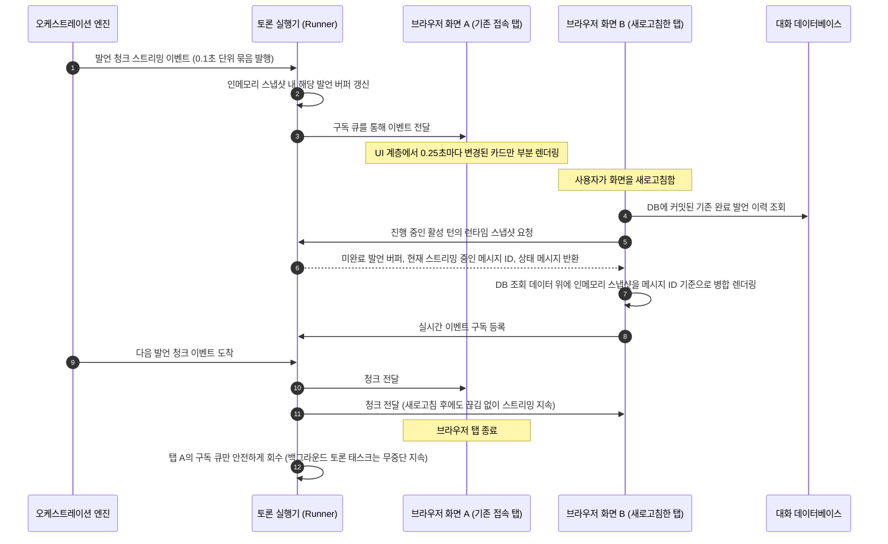
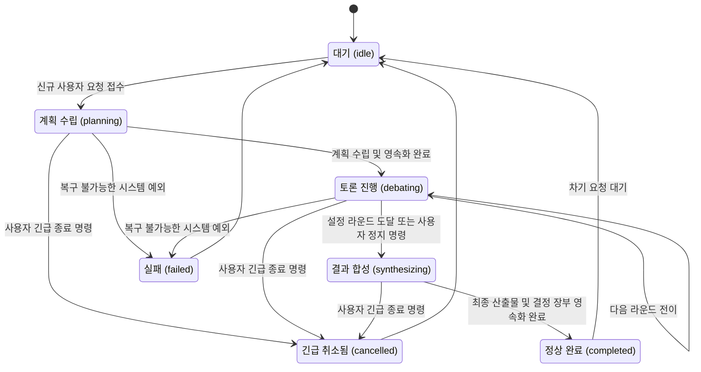
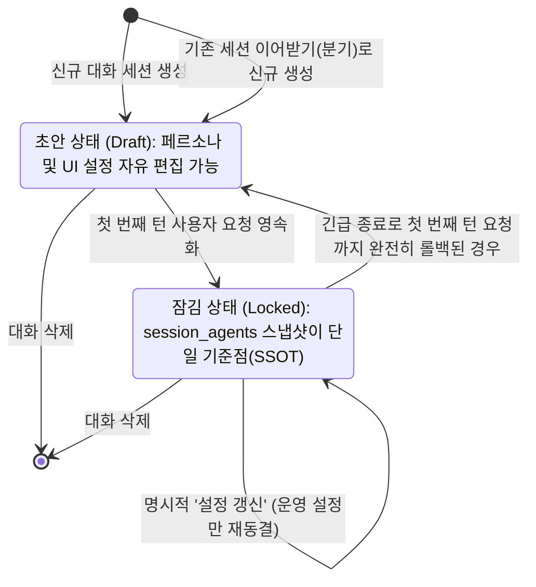
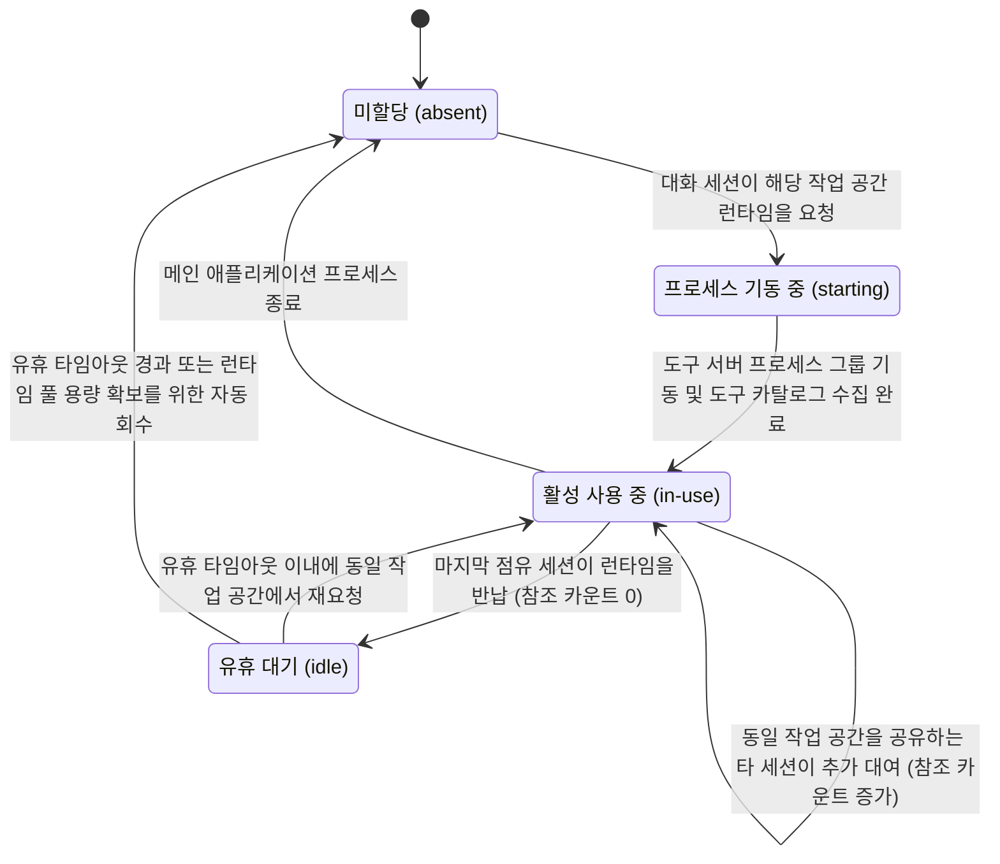
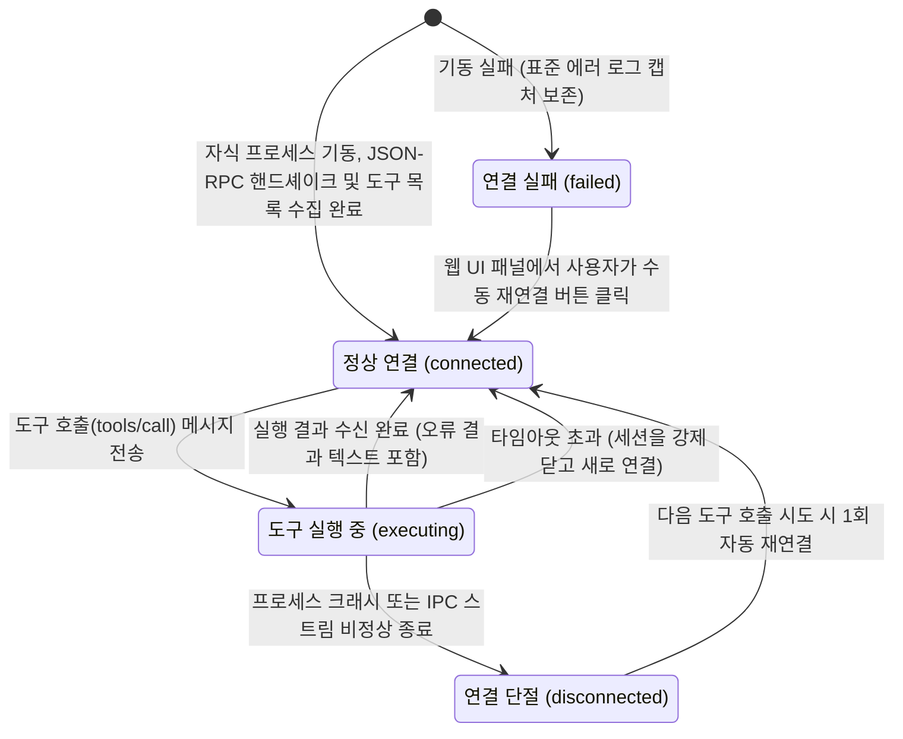

# 3-2. 동적 뷰: 런타임 실행 흐름과 상태 전이 분석

> 상위: [3강. 아키텍처](README.md) · 이전: [3-1. 정적 뷰](01-static-view.md) · 다음: [3-3. 배포 뷰](03-deployment-view.md)

정적 뷰가 시스템 부품의 명세라면, 동적 뷰(Dynamic View)는 그 부품들이 런타임에 유기적으로 상호작용하는 실행 순서와 상태 변화를 다룹니다. 본 문서는 핵심 시나리오 단위로 구성했습니다. 애플리케이션의 기동 및 종료 생명주기, 사용자 요청이 최종 산출물로 합성되기까지의 엔드투엔드 흐름, 단일 발언 내의 도구 루프 실행 과정, 웹 소켓 연결 단절 시의 화면 재접속 복구 메커니즘을 차례대로 살펴봅니다. 후반부에서는 주요 아키텍처 구성 요소들의 상태 머신과 구체적인 실패 대응 시나리오를 정리합니다.

---

## 1. 애플리케이션 기동과 정상 종료 시퀀스

기동 및 종료 시퀀스에서 반드시 주목해야 할 아키텍처 설계 포인트 3가지는 다음과 같습니다.

- **도구 서버의 실패가 애플리케이션 전체 기동을 차단하지 않습니다.** 기동 시 기본 작업 공간의 MCP 서버들을 미리 예열하지만, 특정 도구 서버가 환경 결함으로 실행에 실패하더라도 메인 웹 서버는 정상적으로 기동됩니다. 실행에 실패한 도구 서버는 로스터 패널의 상태 칩에 빨간색 경고로 표시되며, 마우스 오버 시 표준 에러(stderr) 로그의 시작과 끝부분을 확인하여 원인을 즉시 진단할 수 있습니다. 해당 도구를 사용하도록 지정된 에이전트는 도구 없이 발언을 이어갑니다. 특정 도구의 장애 때문에 애플리케이션 전체의 가용성이 무너지는 것을 방지하는 회복 탄력성(Resilience) 설계입니다.
- **종료 대기 시간에는 반드시 명시적인 상한(타임아웃)을 둡니다.** 작업 취소 신호를 적절히 처리하지 못하는 태스크가 존재할 경우 프로세스 종료가 영구 차단될 수 있습니다. 실제로 예외를 포괄 처리(`except Exception:`)하는 모듈이 `asyncio.CancelledError`까지 삼켜버리면서 Uvicorn이 운영체제 강제 종료 신호를 받을 때까지 프로세스가 멈추어 있던 장애가 있었습니다. 현재는 모든 활성 태스크에 취소를 요청한 후 최대 20초까지만 대기하도록 상한을 설정하여 안전한 종료를 보장합니다.
- **자식 프로세스는 단순 PID(프로세스 ID)가 아닌 프로세스 핸들 객체로 관리합니다.** 이미 종료된 프로세스의 PID로 강제 종료 시그널을 전송하면, 그사이에 운영체제가 해당 PID를 다른 신규 프로세스에 재할당했을 경우 엉뚱한 타 프로세스(심지어 Uvicorn 워커 프로세스 본체)를 종료시켜 버리는 치명적인 사고가 발생할 수 있습니다. Windows 환경은 PID 재사용이 매우 빈번하므로, 프로세스 기동 시점에 획득한 운영체제 프로세스 핸들 객체를 보존하여 정리하며, PID 기반 정리는 핸들을 획득할 수 없는 비정상 예외 상황에만 한정합니다.

## 2. C4 동적 다이어그램: 컨테이너 간 메시지 흐름

사용자가 프롬프트를 전송하여 최종 산출물을 수령하기까지, 컨테이너 계층 간에 전개되는 상호작용의 순서입니다.

④단계부터 ⑨단계까지가 토론의 핵심 본체이며, ⑤~⑨단계는 설정된 라운드 횟수와 참여 전문가 수만큼 반복 순환됩니다. 

여기서 반드시 기억해야 할 구조적 특징은 ②단계에서 요청을 수신한 직후 백엔드는 **즉시 HTTP/WebSocket 응답을 반환**하고, 실제 토론은 독립된 백그라운드 태스크에서 비동기로 수행된다는 점입니다. 브라우저 UI는 단지 ⑨단계와 ⑫단계의 이벤트를 수신하여 화면을 갱신할 뿐, 토론 태스크의 실행 스레드를 직접 점유하지 않습니다.

## 3. 단일 턴의 엔드투엔드 실행 라이프사이클

컴포넌트 수준에서 단일 턴이 수행되는 내부 시퀀스를 상세히 살펴봅니다.

이 시퀀스에 내포된 주요 설계 원칙을 정리합니다.

- **런타임 자원은 턴 전체에 걸쳐 대여되며, 턴의 종료 형태와 무관하게 반드시 반납됩니다.** `try...finally` 블록을 통해 정상 완료, 사용자 정지, 긴급 취소, 치명적 예외 등 어떠한 경로로 턴이 종료되더라도 런타임 인스턴스 반납 함수가 무조건 실행되도록 보장합니다. 반납 처리가 단 한 번이라도 누락되면 미사용 도구 프로세스들이 메모리를 영구 점유하여 다른 세션의 런타임 생성을 가로막게 됩니다.
- **구성 스냅샷 동결은 토론 계획 수립보다 선행되어야 합니다.** 첫 사용자 요청이 데이터베이스에 기록되는 즉시 참여 에이전트들의 구성이 동결됩니다. 만약 계획 수립 이후에 스냅샷을 굳히게 되면, 계획을 수립한 오케스트레이터의 에이전트 인식 정보와 실제 토론에 참여하는 전문가 에이전트의 런타임 설정 간에 불일치가 발생할 수 있습니다.
- **계획 프롬프트에는 세션에 실제 등록된 참여자 명단만 전달합니다.** 참여 전문가의 이름, 역할, 보유 도구 목록만을 간결하게 요약하여 주입합니다. 페르소나 전문(시스템 프롬프트)을 통째로 주입할 경우 계획 프롬프트 호출마다 불필요하게 수천 토큰이 낭비되기 때문에, 역할 분배에 꼭 필요한 핵심 메타데이터만 경량 주입합니다.
- **결정 장부는 턴이 끝까지 완결되었을 때에만 최종 영속화됩니다.** 사용자가 중간에 작업을 취소하거나 롤백할 경우 해당 턴의 발언들은 삭제됩니다. 만약 중간 과정에서 결정 장부를 미리 커밋해 버리면, 실제로는 취소되어 토론되지 않은 가상의 결정 사항이 장부에 영구 잔존하는 정합성 왜곡이 발생합니다. 따라서 결정 장부와 대화 요약의 최종 커밋은 합성 단계가 성공적으로 완결된 시점에만 수행됩니다.
- **산출물 발행 이벤트는 내부 대화 기억 정리보다 우선하여 발송됩니다.** 사용자에게 제공되는 결과물 화면 탭 생성을 먼저 발행한 뒤 백그라운드에서 결정 장부 및 요약 갱신을 진행합니다. 이를 통해 사용자가 체감하는 최종 결과물 대기 시간을 크게 단축할 수 있습니다.

### 그래프 토론(Graph Debate) 전략의 특화 분기

토론 전략으로 '그래프 토론'을 선택한 세션은 정형화된 라운드 루프 대신 사용자 정의 유향 비순환 그래프(DAG) 스케줄러 분기로 전환됩니다. 이때 엔진은 사용자 요청을 DB에 기록하기 **이전에** 그래프 구조의 정합성(연결성, 순환 참조 유무, 게이트 배치 등)을 먼저 검증합니다. 만약 유효하지 않은 잘못된 그래프라면 요청 자체를 수락하지 않고 UI에 즉시 오류 사유를 피드백합니다. 요청을 먼저 기록한 뒤 검증에 실패하면 데이터베이스에 응답 없는 비정상 요청 레코드가 잔존하기 때문입니다.

## 4. 단일 발언 내의 도구 루프 상호작용

에이전트가 1회 발언하는 동안 LLM 호출기 내부에서 실행되는 도구 루프(Tool Loop)의 세부 흐름입니다. 단순한 질의-응답 반복 구조처럼 보이지만, 토큰 낭비와 비정상 루프를 방어하는 다중 안전장치가 내장되어 있습니다.

이 도구 루프를 지탱하는 2가지 핵심 설계 원칙은 다음과 같습니다.

첫째, **루프 내부에서 발생하는 어떠한 국지적 오류도 발언 전체를 강제 중단시키지 않습니다.** 모델이 유효하지 않은 JSON 형식으로 도구를 호출하거나, 도구 서버가 내부 예외를 반환하거나, 응답 타임아웃이 발생하더라도 발언은 중단되지 않습니다. 모든 실패는 모델이 해석할 수 있는 텍스트 형태의 관찰 결과(Observation)로 변환되어 대화 컨텍스트에 주입됩니다. 모델은 에러 메시지를 확인하고 잘못된 인자를 스스로 수정하여 다음 호출을 재시도할 수 있습니다.

둘째, **도구 예산 상한에 도달하더라도 기존 작업 내용을 일체 폐기하지 않습니다.** v0.4 이전 버전에서는 도구 호출 상한을 초과하면 발언 전체를 실패로 간주하여, 기껏 스트리밍으로 생성된 텍스트와 도구 실행 결과가 모두 에러 메시지로 덮어씌워지는 문제가 있었습니다. 현재는 상한에 도달하면 사용자에게 예산 연장 여부를 확인하며, 사용자가 연장하지 않더라도 도구 호출만 차단한 채(`tool_choice: "none"`) 그때까지 확보된 관찰 결과를 기반으로 결론을 도출하도록 유도합니다. 왜 도구 사용이 중단되었는지는 발언 말미에 명확하게 주석으로 표기됩니다.

도구 예산 및 컨텍스트 잔여량 고지 방식 역시 정교하게 튜닝되어 있습니다. 매 루프마다 잔여량을 반복해서 전달하면 그 자체가 귀중한 컨텍스트 토큰을 낭비하게 됩니다. 따라서 도구 예산은 초기 1회 전체 예산을 공지한 뒤 마일스톤 단위 및 종료 직전(5, 4, 3, 2, 1회)에만 선별적으로 고지하며, 컨텍스트 윈도우 사용률 역시 50%, 70%, 85%, 95% 임계점을 최초 초과하는 순간에만 한정하여 모델에 통지합니다.

## 5. 이벤트 스트리밍과 웹 클라이언트 재접속 처리

토론 실행기는 세션마다 두 가지 핵심 인메모리 객체를 관리합니다. 현재 턴의 **실시간 상태 스냅샷**과 접속된 웹 브라우저 화면마다 할당되는 **이벤트 구독 큐(Subscription Queue)**입니다.

- 특정 브라우저 탭이 닫히거나 네트워크가 끊어지면 해당 화면에 할당된 구독 큐만 메모리에서 해제합니다. 백그라운드 토론 태스크는 외부 클라이언트의 접속 상태에 전혀 영향받지 않고 작업을 지속합니다.
- 느린 네트워크 환경 등으로 인해 이벤트 큐가 최대 버퍼 크기를 초과하여 지연되는 클라이언트는, 전체 토론을 지연시키는 대신 해당 지연 화면의 큐만을 능동적으로 폐기하여 다른 정상 클라이언트와 백엔드 엔진을 보호합니다.
- 턴이 완전히 종료되면 인메모리 스냅샷은 안전하게 파기되며, 이후의 모든 조회는 데이터베이스를 단일 기준점(SSOT)으로 삼습니다.

## 6. 토론 전략별 라운드 실행 패턴

토론 전략(Strategy)은 라운드마다 "누가, 어떤 순서로, 어떠한 프롬프트 지침을 부여받아 발언할 것인가"를 규정하는 순수 정책 객체입니다. 무엇을 발언할지에 대한 구체적인 내용은 모델 스스로 판단합니다.

```mermaid
flowchart TB
    subgraph seq["1. 순차 토론 (Sequential)"]
        direction LR
        s1["전문가 1"] -->|"결론 전달"| s2["전문가 2"] -->|"결론 전달"| s3["전문가 3"]
    end
    subgraph adv["2. 디베이트 (Debate)"]
        direction LR
        a1["제안 1"] --> c1["비판 1"] --> a2["제안 2"] --> n1["중립 종합"]
    end
    subgraph led["3. 오케스트레이터 지명 (Dynamic Nomination)"]
        direction LR
        o1["오케스트레이터가<br/>이번 라운드 필요 발언자 지명"] --> l1["지명된 전문가만 선별 발언"]
    end
    subgraph par["4. 병렬 지시 (Parallel Delegation)"]
        direction LR
        o2["세부 과업 병렬 분배"] --> p1["전문가 A"]
        o2 --> p2["전문가 B"]
        o2 --> p3["전문가 C"]
        p1 --> m1["오케스트레이터 중간 취합"]
        p2 --> m1
        p3 --> m1
    end
    subgraph gr["5. 그래프 토론 (DAG Graph)"]
        direction LR
        g0["시작"] --> g1["아키텍처 설계"] --> g2["코드 구현"] --> gate{"게이트 판정 통과?"}
        gate -->|"반려 (No)"| g2
        gate -->|"승인 (Yes)"| g3["종료"]
    end
```

| 토론 전략 | 발언 순서 결정 규칙 | 발언별 고유 프롬프트 지침 | 라운드 소요 시간 | 예외 시 대체(Fallback) 경로 |
| :--- | :--- | :--- | :--- | :--- |
| **순차 토론** | 에이전트별 `debate_priority` 오름차순 | "선행 발언자를 직접 지목하고 그 결론을 비판적으로 검증·보강·반증하십시오." | 모든 발언 소요 시간의 단순 합산 | 대체 없음 (우선순위 순차 유지) |
| **디베이트** | 제안 진영과 비판 진영을 교차 배치하며 중립 진영은 최후미 발언 | 제안자: "비판에 명확히 반박하십시오." 비판자: "재현 가능한 반례 코드를 제시하십시오." | 모든 발언 소요 시간의 단순 합산 | 특정 진영 참여자가 전무할 경우 우선순위 순차 토론으로 자동 대체 |
| **오케스트레이터 지명** | 매 라운드 오케스트레이터가 맥락에 따라 동적으로 발언자 선별 | 지명 사유 및 개별 맞춤 지침 부여 | 지명된 발언자들의 소요 시간 합산 | 지명 실패 시 전체 우선순위 순차로 대체하며 실패 사실을 로그에 기록 |
| **병렬 지시** | 전체 참여 전문가가 동시에 병렬 발언 (설정된 동시성 제한 내) | 개별 분배된 독립 세부 과업 명세 및 타 전문가 담당 과업 요약 | 동시 실행자 중 가장 지연되는 1인의 소요 시간 | 과업 분배 실패 시 지침 없이 전원 병렬 실행으로 대체하며 로그 기록 |
| **그래프 토론** | 사용자가 정의한 DAG 토폴로지 기반의 슈퍼스텝(Superstep) 실행 | 노드별 설정 프롬프트 및 유입 엣지를 통해 전달된 선행 데이터 | 슈퍼스텝마다 가장 지연되는 노드의 소요 시간 | 게이트 판정 출력 규격 위반 시 기본 분기 경로로 대체하며 로그 기록 |

모든 전략 구현에서 일관되게 지켜지는 아키텍처 원칙은 **대체(폴백) 경로로 전환될 때는 반드시 그 사실을 시스템 로그와 결과물에 명시적으로 기록한다**는 점입니다. 오케스트레이터의 동적 지명이 실패했는데 아무런 표시 없이 일반 순차 토론으로 전환되면, 사용자는 오케스트레이터가 의도적으로 그 순서를 선택했다고 오해하게 됩니다. 시스템이 침묵 속에서 임의로 다른 동작을 수행하는 것은 아키텍처의 제1원칙인 '정직성'에 위배됩니다.

### 병렬 지시 전략 도입 시 해결한 두 가지 동시성 과제

단일 발언자 기반 엔진에 동시 병렬 발언을 도입하면서, 기존의 순차 실행 모델이 암묵적으로 전제하고 있던 두 가지 가정이 깨졌습니다.

1. **비동기 DB 세션은 단일 트랜잭션 동시 쓰기를 허용하지 않습니다.** 여러 에이전트의 발언이 단일 SQLAlchemy 비동기 세션을 공유하여 동시에 `commit()`을 호출하면 세션 상태 머신 충돌로 인해 토론 전체가 비정상 종료되었습니다. 이에 따라 데이터베이스 기록 구간에만 비동기 락(`asyncio.Lock`)을 적용하여 쓰기 작업을 직렬화했습니다. LLM API 호출 및 도구 실행 구간은 락 외부에서 수행되므로 병렬 처리 성능은 그대로 유지됩니다.
2. **발언 메시지의 정렬 순서 보장 문제입니다.** 각 에이전트의 발언이 완료되는 시점 순서대로 DB에 타임스탬프를 부여할 경우, 페이지를 새로고침할 때마다 발언 카드의 배치 순서가 뒤죽박죽으로 바뀌는 현상이 발생했습니다. 이를 방지하기 위해 오케스트레이터가 사전에 분배한 순서에 따라 밀리초 오프셋을 정렬 키에 고정 부여하여 화면 복원 시의 결정론적 순서를 확립했습니다.

또한 해당 라운드에 사용할 모든 프롬프트는 **병렬 작업이 개시되기 전에 사전에 일괄 생성**해야 합니다. 개별 태스크 내부에서 프롬프트를 동적으로 조립할 경우, 먼저 발언을 완료한 동료 에이전트의 결과가 뒤늦게 시작된 에이전트의 프롬프트에 불균등하게 섞여 들어가는 컨텍스트 오염이 발생합니다. 서로의 결과를 참조하지 못한 채 병렬 발언이 끝나므로, 라운드 말미에는 반드시 오케스트레이터가 개입하여 **중간 취합(통합 결론, 의견 대립 지점, 미검증 가설, 차기 과제)**을 명시적으로 정리해야 합니다. 이 중간 취합 단계가 누락되면 토론은 산만한 독백들의 나열로 전락하게 됩니다.

### 그래프 토론의 세부 실행 원칙

그래프 토론은 턴을 고정된 라운드로 나누는 대신, **누가 누구에게 데이터를 인계하는지**를 시각적 DAG 형태로 표현합니다.

- 지원 노드 유형: 시작 노드, 전문가 에이전트 노드, 다중 입력 병합 노드, 조건부 게이트(Yes/No 판정) 노드, 최종 종료 노드.
- 이전 슈퍼스텝에서 새로운 입력을 전달받은 활성 노드들이 동일 **슈퍼스텝(Superstep)** 내에서 동시에 병렬 실행되며, 실행 산출물은 해당 슈퍼스텝이 완전히 완료되는 시점에 연결된 다음 엣지로 일괄 방출됩니다.
- 엣지(연결선) 속성에 따라 전체 텍스트 전달, 핵심 요약 전달, 대용량 코드의 파일 참조 변환 전달 여부를 개별 지정할 수 있습니다. 각 노드는 자신에게 유입되는 엣지가 전달하는 데이터만을 입력 컨텍스트로 수신합니다.
- 여러 유입 경로를 대기하는 합류 노드는 **순방향으로 들어오는 입력만을 대기**합니다. 만약 피드백 루프(되돌아오는 역방향 엣지)의 입력까지 무조건 대기하도록 구현하면, 아직 한 번도 실행되지 않은 역방향 경로로 인해 영구적인 데드락(교착 상태)에 빠지게 됩니다.
- 순환 루프(Loop)는 반드시 조건부 게이트 노드를 통해서만 형성될 수 있으며, 게이트 노드를 거치지 않는 무조건적 순환 그래프는 스케줄링 검증 단계에서 즉시 실행이 거부됩니다.

## 7. 사용자의 실시간 개입 및 제어 메커니즘

토론 진행 도중 사용자가 개입할 수 있는 제어 명령은 총 4가지로 구분되며, 각 명령의 시스템 처리 방식은 서로 다릅니다.

| 사용자 명령 | 개입 의도 및 상황 | 진행 중인 현재 발언 처리 | 최종 합성 단계 수행 여부 | 데이터 영속화 처리 |
| :--- | :--- | :--- | :--- | :--- |
| **개입 메모 (Intervention)** | 논의 방향을 부분 수정하거나 추가 제약을 부여하고자 할 때 | 현재 발언은 끝까지 정상 수신 | 정상 수행 | 다음 발언 에이전트의 프롬프트 컨텍스트에 사용자 발언으로 자동 주입 |
| **토론 정지 (Stop)** | 논의가 충분히 무르익어 조기에 결론을 도출하고자 할 때 | 현재 발언은 끝까지 정상 수신 | 정상 수행 (최종 산출물 생성) | 현재까지 진행된 발언 및 최종 산출물 정상 보존 |
| **긴급 종료 (Abort)** | 초기 질의 자체가 잘못되어 턴 전체를 무효화하고자 할 때 | 즉시 네트워크 소켓을 닫고 태스크 강제 취소 | 수행하지 않음 | 현재 턴에서 생성된 모든 임시 데이터를 DB에서 삭제하고 입력 프롬프트 복원 |
| **도구 예산 확장 승인** | 에이전트의 추가 도구 사용 요청을 승인 또는 거부할 때 | 승인 시 루프 지속, 거절 시 결론 작성 | 정상 수행 | 도구 확장 승인/거절 이력을 해당 발언 로그에 기록 |

개입 메모와 정지 명령은 **발언과 발언 사이의 전환 시점**에 엔진이 큐를 폴링하여 반영합니다. 병렬 지시 전략의 경우 모든 전문가가 동시에 실행되므로 발언 간 간격이 존재하지 않으며, 따라서 라운드 완료 경계에서 개입을 처리합니다. 합성 단계가 이미 시작된 이후에 도착한 개입 메모는 이번 턴에는 반영할 수 없으므로, 유실하지 않고 다음 턴의 대화 기억으로 안전하게 이월 보존합니다.

## 8. 상태 머신 (State Machine) 명세

### 8.1 턴(Turn)의 생명주기 상태 머신

여기서 "정상 완료(completed)" 상태가 반드시 "합의 도달(Consensus)"을 의미하지는 않는다는 점을 유의해야 합니다. 참여 에이전트 중 단 하나라도 응답에 실패했거나 최종 합성이 빈 응답으로 끝난 경우, 턴 자체는 라이프사이클상 완료되었더라도 합의 성공으로 표시하지 않습니다. 침묵한 에이전트가 존재함에도 "합의 성공"으로 처리하는 것은 데이터의 신뢰성을 저해하기 때문입니다.

### 8.2 대화 세션의 수명주기 상태 머신

**세션 이어받기(Branch Session)**는 긴 대화로 인해 컨텍스트 윈도우 한계에 다다른 세션을 새로운 세션으로 깔끔하게 분기하는 핵심 기능입니다. 기존 원본 세션은 읽기 전용으로 온전히 보존되며, 신규 세션은 작업 공간 경로, 지식 그래프, 에이전트 페르소나 구성 스냅샷, 전략 설정, 누적된 결정 장부, 직전 턴의 최종 합성 결론만을 정제하여 상속받습니다. 방대한 과거 발언 메시지 텍스트만을 깨끗이 비워내어 컨텍스트를 초기화합니다. 

특히 신규 세션은 잠기지 않은 **초안(Draft) 상태**로 시작됩니다. 컨텍스트 포화가 발생했던 근본 원인이 특정 에이전트의 모델 할당 문제였을 수 있으므로, 새로운 대화를 본격 시작하기 전에 사용자가 모델이나 프롬프트 구성을 자유롭게 재조정할 수 있도록 유연성을 보장하기 위함입니다.

### 8.3 작업 공간별 MCP 런타임 수명주기

- 런타임 점유 참조는 고유 대화 세션 ID의 집합(Set)으로 관리하여 중복 카운팅을 원천 방지합니다.
- 세션이 런타임을 반납하더라도 즉시 프로세스를 종료하지 않고 지정된 유휴 시간(기본 300초) 동안 프로세스를 메모리에 유지합니다. Python 샌드박스 커널을 초기화하는 데 수 초가 소요되므로, 연속적으로 질의를 이어가는 사용자가 매 턴마다 프로세스 콜드 스타트 지연을 겪지 않도록 하기 위함입니다.
- 시스템 전체에서 동시 유지할 수 있는 런타임 풀 개수에는 상한(기본 4개)이 존재합니다. 풀 용량이 포화된 상태에서 새로운 작업 공간 요청이 들어오면, 만료된 유휴 런타임 및 가장 오래전에 사용된(LRU) 유휴 런타임을 순차 정리합니다. 단, **현재 토론이 활발히 진행 중인 런타임은 절대로 강제 회수하지 않습니다.** 정리 가능한 유휴 런타임이 전혀 없다면, 현재 어느 세션들이 풀을 점유하고 있는지 구체적인 사유를 사용자에게 안내하고 신규 실행을 정직하게 거절합니다.

### 8.4 단일 MCP 연결 상태 머신

자동 재연결은 **프로세스 소멸이나 스트림 단절로 인해 물리적 연결이 끊어진 경우에만 1회 한정**으로 시도합니다. 정상 연결된 서버에서 도구가 비즈니스 로직 오류나 예외 결과 문구를 반환한 경우에는 절대로 자동 재시도하지 않습니다. 파일 쓰기나 Git 커밋처럼 외부 상태를 변경하는 도구를 무분별하게 자동 재시도할 경우 의도치 않은 데이터 중복 조작 사고를 유발할 수 있기 때문입니다.

타임아웃(180초) 초과 시 기존 세션을 완전히 닫고 새로 여는 이유 역시 명확합니다. 뒤늦게 도착한 이전 호출의 지연 응답이 다음 신규 호출의 응답과 뒤섞이는 패킷 오염을 방지하기 위함입니다.

## 9. 장애 유형별 예외 격리 시나리오

| 장애 상황 | 1차 포착 계층 | 시스템 내부 복구 흐름 | 사용자 UI 피드백 |
| :--- | :--- | :--- | :--- |
| **LLM 엔드포인트 연결 실패** | 오케스트레이션 엔진의 발언 실행 단위 | 해당 발언 레코드에만 "응답 없음"을 기록하고 즉시 다음 발언자로 제어를 이관합니다. 이후 컨텍스트와 합성 단계에서 제외하되 합성 프롬프트에 미참여 사실을 명시합니다. | 고유 색상의 실패 카드 표시, 턴 완료 시 미참여 에이전트 목록 안내 |
| **도구 내부 실행 오류** | MCP 매니저 | 도구 서버의 예외 문구를 관찰 결과(Observation) 텍스트로 변환하여 모델에 전달하며, 모델이 인자를 수정하여 스스로 재시도하도록 유도합니다. | 도구 실행 아코디언 영역 내에 빨간색 오류 상태 칩 표시 |
| **도구 무응답 및 교착 상태** | MCP 연결 계층 | 180초 타임아웃 경과 후 실행을 단념하고 세션을 재초기화한 뒤 모델에게 "응답 없음" 관찰 결과를 반환합니다. | 도구 타임아웃 경고 문구 표시 |
| **도구 출력 데이터 과다** | MCP 연결 계층 | 출력 텍스트가 20만 자를 초과할 경우 앞뒤 주요 맥락만을 보존하고 중앙 영역을 요약 생략 처리합니다. | 대용량 텍스트 생략 표기 안내 |
| **토큰 한도(`max_tokens`) 도달로 응답 잘림** | LLM 호출기 | 연속 생성(이어 쓰기)을 자동 요청합니다. 잘린 응답이 도구 호출 JSON인 경우 잘못된 인자로 도구를 실행하지 않고 모델에게 완결된 형태로 다시 작성하도록 알립니다. | 필요한 경우 발언 하단에 응답 연장 안내 표기 |
| **SQLite 파일 잠금 경합 (`database is locked`)** | 영속화 계층 | 30초 대기 설정 및 2초, 5초 지수 백오프 재시도를 수행합니다. 최종 실패 시 산출물을 로컬 앱 데이터 디렉터리에 Markdown 파일로 비상 보존합니다. | 사용자가 수동 닫기 전까지 유지되는 영구 경고 배너 |
| **최종 합성이 빈 응답을 반환** | 산출물 추출기 | 해당 턴을 "합성 실패"로 기록하고, LLM 호출 없이 참여 전문가들의 마지막 핵심 발언을 수집하여 보고서 본문을 대체 구성하며, 합의 완료로 표시하지 않습니다. | 합성 실패 탭 및 대체 보고서 안내 |
| **Mermaid 다이어그램 문법 오류** | 산출물 추출기 | 파서 오류 메시지를 첨부하여 오케스트레이터에게 최대 2회 자동 복구(재작성)를 요청합니다. 최종 실패 시 원본 코드를 보존하고 제목에 경고 심볼(⚠)을 부여합니다. | 다이어그램 자동 복구 진행 토스트 및 문법 오류 경고 |
| **브라우저 네트워크 단절** | 토론 실행기 | 해당 브라우저의 구독 큐만 정리하고 백그라운드 토론 태스크는 끝까지 완결합니다. | 브라우저 새로고침 시 진행 중인 토론에 즉시 재접속 |

이 모든 예외 대응 체계의 공통된 아키텍처 원칙은 **시스템 예외를 그것이 발생한 계층과 가장 가까운 곳에서 포착하여 "객관적으로 기록 가능한 사실(Observation Fact)"로 변환한다**는 점입니다. 상위 계층으로 무분별하게 전파되는 것은 가공되지 않은 시스템 예외가 아니라, 안정적으로 처리 가능한 결과 데이터여야 합니다. 이러한 견고한 예외 격리 기법은 [4-7. 실패 설계](../04-core-techniques/07-failure-design.md)에서 자세히 다룹니다.

---

## 핵심 요약

- 애플리케이션은 일부 도구 서버가 기동에 실패하더라도 정상 구동되며, 프로세스 종료는 제한 시간 내에 완결되고, 자식 프로세스는 안전한 운영체제 핸들을 통해 회수됩니다.
- 사용자 요청을 접수한 웹 UI는 즉시 제어권을 반환하며, 실제 토론은 세션별 백그라운드 태스크가 독립적으로 수행합니다.
- 단일 턴의 라이프사이클은 **런타임 대여 → 구성 스냅샷 동결 → 계획 수립 → 토론 라운드 순환 → 결과 합성 → 런타임 반납** 순서로 전개되며, 자원 반납은 예외 발생 여부와 무관하게 보장됩니다.
- 도구 루프 내부의 모든 실패는 관찰 결과로 변환되어 모델에 제공되며, 도구 예산 한도에 도달하더라도 기존 작업 산출물은 안전하게 보존됩니다.
- 토론 전략이 장애로 인해 대체(폴백) 경로로 전환될 때는 반드시 그 사실을 시스템에 투명하게 기록합니다.
- 모든 시스템 장애는 발생 계층에서 즉시 격리하여 기록 가능한 사실로 변환한 후 처리합니다.

## 학습 점검 과제

1. 누적된 결정 장부를 매 라운드가 종료되는 시점이 아니라 매 전문가 발언이 끝날 때마다 실시간으로 갱신하도록 변경한다면 시스템에 어떤 장단점이 발생할까요? LLM 호출 비용 증가와 프롬프트 캐싱 효율성 관점에서 분석해 보십시오.
2. 병렬 지시 전략에서 라운드 프롬프트를 사전에 일괄 생성하지 않고 각 비동기 태스크 내부에서 동적으로 조립하도록 잘못 작성했을 때, 단위 테스트를 통해 이러한 동시성 결함을 검출하려면 어떠한 특성을 지닌 테스트 대역(Mock LLM)을 설계해야 할지 고민해 보십시오.
3. 시스템은 도구 연결 단절 시 1회에 한해 자동 재연결을 시도하지만, 도구 실행 오류 시에는 재시도하지 않습니다. 만약 부작용(Side-effect)이 없는 읽기 전용 도구에 한하여 오류 시 자동 재시도를 허용하고자 한다면, 특정 도구가 읽기 전용인지 여부를 호스트 애플리케이션이 어떻게 안전하게 식별할 수 있을지 아키텍처 방안을 제시해 보십시오.
