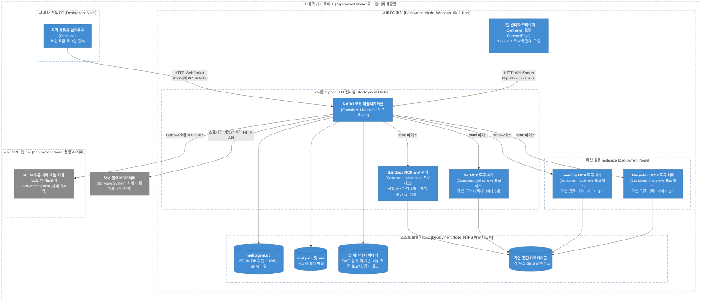
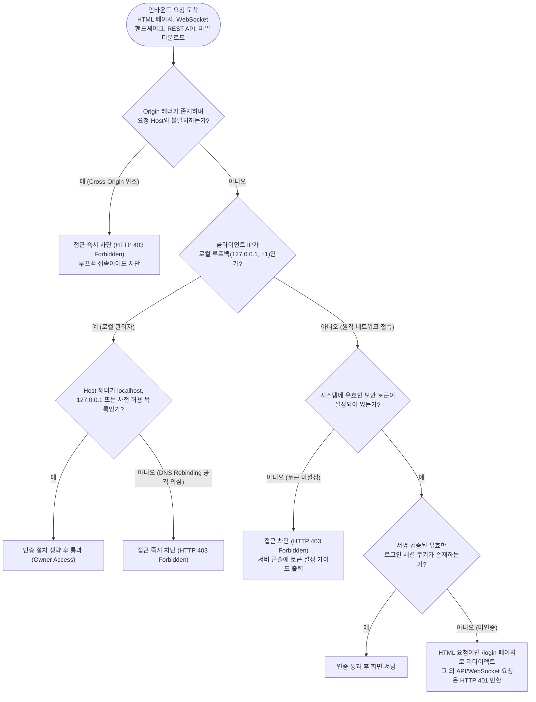
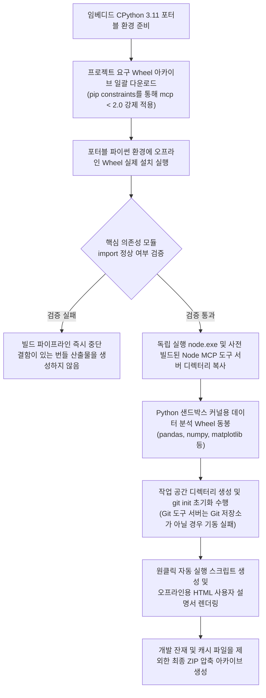

# 3-3. 배포 뷰: 인프라 토폴로지와 폐쇄망 배포 전략

> 상위: [3강. 아키텍처](README.md) · 이전: [3-2. 동적 뷰](02-dynamic-view.md) · 다음: [4강. 핵심 기술](../04-core-techniques/README.md)

배포 뷰(Deployment View)는 소프트웨어 시스템이 실제 물리적 하드웨어 및 OS 런타임 환경에 어떻게 배치되고 구동되는지를 다룹니다. 어떤 머신에서 어떤 런타임 기반으로 몇 개의 프로세스가 생성되는지, 물리적 파일 시스템의 어느 경로에 데이터가 영속화되는지, 네트워크 통신 경로와 보안 경계는 어떻게 설정되는지가 이 뷰의 핵심 관심사입니다. MADO는 "외부 인터넷이 차단된 폐쇄망 환경의 단일 서버 PC"를 기본 배포 대상으로 설계되었으므로, 오프라인 설치 및 패치 갱신 전략도 이 뷰에서 함께 다룹니다.

---

## 1. 3가지 배포 아티팩트 형태

| 패키지 형태 | 활용 시점 | 패키지 구성 내용 | 인터넷 연결 필요 여부 |
| :--- | :--- | :--- | :--- |
| **개발 PC 환경** | 로컬 개발 및 기능 테스트 | Git 소스 체크아웃, 로컬 Python 가상환경(venv), OS 설치 Node.js 및 npm 글로벌 패키지 | 최초 개발 환경 구축 시에만 필요 |
| **폐쇄망 전체 번들 (Full Bundle)** | 폐쇄망 최초 반입 및 런타임/도구 메이저 업그레이드 | 임베디드 포터블 Python, `node.exe`, 오프라인 Wheel 아카이브, 사전 빌드된 MCP 도구 서버 디렉터리, 소스 코드, 사용자 설명서, 자동 실행 스크립트 | 번들 생성 시에만 외부망에서 필요하며, 폐쇄망 실행 시에는 완전 불필요 |
| **소스 갱신 패키지 (Source Patch)** | 순수 비즈니스 로직 및 UI 코드 변경 시 | 경량 소스 코드, 설정 템플릿, 변경 설명서 (수백 KB 수준) | 패키징 시에만 필요하며 오프라인 반입 즉시 적용 가능 |

전체 번들의 용량은 수백 MB에 달하지만, 소스 갱신 패키지는 수백 KB에 불과합니다. 이러한 용량 격차가 발생하는 이유는 한 번 반입된 Python 및 Node 런타임과 도구 라이브러리 바이너리는 거의 변경되지 않기 때문입니다. 애플리케이션 코드를 수정할 때마다 매번 수백 MB의 대용량 번들을 반입하면 파일 전송도 비효율적일 뿐만 아니라, 폐쇄망 보안 규정에 따라 바이너리 파일 전수 검사를 매번 처음부터 다시 거쳐야 하는 막대한 행정적 비용이 수반됩니다. 두 가지 패키지 형태를 명확히 분리한 이유가 바로 여기에 있습니다([ADR-006](../05-adr/ADR-006-airgap-first-packaging.md)).

## 2. C4 배포 다이어그램: 폐쇄망 운영 환경

사내 폐쇄망 환경에서 MADO가 실제로 배포되어 구동되는 전형적인 물리적 토폴로지입니다. 단일 서버 PC 상에서 애플리케이션이 구동되고, 동일 사내 서브넷의 타 업무용 PC에서 브라우저를 통해 접속하며, LLM은 사내 GPU 인프라의 추론 엔진이나 게이트웨이를 활용합니다.



이 배포 구조에서 반드시 확인해야 할 기술적 특징은 다음과 같습니다.

- **동일한 Python 런타임 바이너리가 3종류의 서로 다른 프로세스를 실행합니다.** 즉, 메인 애플리케이션 프로세스, Git 도구 서버 프로세스, Python 샌드박스 서버 프로세스가 모두 동일한 포터블 Python 인터프리터를 공유합니다. 만약 메인 앱은 포터블 가상환경에서 구동되는데 도구 서버가 호스트 OS의 다른 파이썬 경로로 실행된다면, 필수 패키지가 누락되어 기동 즉시 크래시가 발생합니다. 따라서 시스템은 별도의 파이썬 경로를 지정하지 않을 경우 `sys.executable`을 통해 메인 앱 자신의 인터프리터 경로를 자식 프로세스에 일관되게 주입합니다.
- **`node.exe` 실행 파일과 설치된 Node 모듈은 모든 작업 공간이 단일 바이너리로 공유합니다.** 도구 서버 프로세스는 실행 중 Node 런타임 코드를 읽기만 하므로 런타임 자체를 작업 공간마다 복제할 필요가 없습니다. 작업 공간마다 격리되는 것은 런타임 프로세스 그 자체와 실행 시 주입되는 환경(작업 디렉터리, 파일 접근 범위 등)입니다.
- **데이터베이스 파일은 반드시 호스트 머신의 로컬 NTFS 디스크에 배치합니다.** 네트워크 공유 폴더(SMB, NFS 등)에서는 파일 잠금 신뢰성 문제로 인해 SQLite의 고성능 WAL 저널 모드를 정상적으로 사용할 수 없습니다. 대용량 보고서 생성 중 잠금 오류를 방지하기 위해, 데이터베이스 디렉터리를 백신 소프트웨어의 실시간 감시 예외 경로 및 클라우드 동기화 대상에서 제외할 것을 권장합니다.

### 개발 PC 환경과 폐쇄망 번들 환경의 비교

| 세부 항목 | 로컬 개발 PC 환경 | 폐쇄망 배포 번들 환경 |
| :--- | :--- | :--- |
| **Python 환경** | 로컬 개발 가상환경 (`.venv`) | 번들 내에 내장된 포터블 Python 3.11 (모든 의존성 사전 설치 및 import 검증 완료) |
| **Node.js 환경** | OS 설치 Node.js 및 전역 npm 도구 | 정적 번들된 단일 `node.exe` (npm 미포함) |
| **MCP 도구 서버 준비** | 개발자 스크립트가 `npm install`, 샌드박스 저장소 복제, 작업 공간 `git init` 자동 수행 | 번들 내에 완제 디렉터리로 내장되어 있으며 작업 공간 역시 Git 초기화 상태로 동봉 |
| **LLM 공급자** | OpenAI, Anthropic 등 퍼블릭 클라우드 API 위주 | 사내 온프레미스 GPU 추론 서버 (vLLM 등) 또는 사내 AI 게이트웨이 |
| **실행 방식** | 터미널에서 Python 명령어로 직접 구동 | 자동화된 배치 스크립트가 절대 경로 환경변수를 자동 계산·주입하여 원클릭 구동 |

여기서 가장 중요한 점은 개발 환경과 폐쇄망 환경이 **완전히 동일한 단일 설정 파일(`conf.json`)**을 공유한다는 사실입니다. 설정 파일 내의 모든 물리적 경로는 `${변수:-기본값}` 템플릿 형태로 기술되어 있으며, 번들의 실행 배치 스크립트가 현재 번들이 풀린 드라이브 및 폴더 위치를 기반으로 런타임 절대 경로를 계산하여 환경변수로 주입합니다. 따라서 환경별로 설정 파일을 별도 분기하여 관리할 필요가 없으며, "개발 환경에서는 정상 동작했는데 배포 환경에서 경로가 깨지는" 전형적인 환경 불일치 결함을 원천 방지합니다.

## 3. 프로세스 토폴로지와 리소스 할당 예산

서버 PC에서 동시에 구동되는 총 운영체제 프로세스 수는 다음과 같이 산출됩니다.

```text
총 프로세스 수 ≈ 1 (MADO 코어 애플리케이션 프로세스)
              + (동시 활성 작업 공간 수 × 작업 공간당 MCP 도구 서버 수)
              + 전체 샌드박스 내부의 활성 IPython 커널 프로세스 수
```

기본 설정(작업 공간당 도구 서버 4개) 기준으로 2개의 작업 공간이 동시 활성화되면, 메인 앱 1개 + 도구 서버 8개 + 커널 프로세스들이 단일 머신에서 함께 구동됩니다. 이러한 프로세스 증식이 시스템 메모리를 고갈시키지 않도록 3단계의 리소스 예산 상한선을 엄격히 통제하고 있습니다.

| 리소스 예산 설정 키 | 기본값 | 아키텍처 의미 및 통제 목적 |
| :--- | :--- | :--- |
| `MCP_MAX_RUNTIMES` | 4개 | 메모리에 동시 상주할 수 있는 최대 작업 공간 런타임 풀 개수입니다. 이는 동시 대화 세션 수가 아니라 **서로 다른 물리적 작업 디렉터리의 수**를 의미합니다. 동일 디렉터리를 사용하는 대화 세션들은 단일 런타임 풀 인스턴스를 공유합니다. |
| `MCP_RUNTIME_IDLE_TTL` | 300초 | 세션이 반납된 유휴 런타임을 메모리에 유지하는 시간입니다. 연속적인 질의 과정에서 매 턴마다 프로세스 콜드 스타트 오버헤드가 발생하는 것을 방지합니다. |
| `SANDBOX_MAX_NAMESPACES` | 16개 | 시스템 전체에서 유지되는 IPython 커널의 총합 상한선입니다. 런타임 풀 개수로 균등 분할 배분되며, 상한 초과 시 가장 오랫동안 사용되지 않은(LRU) 커널부터 안전하게 회수됩니다. |

커널 예산 설정을 런타임 풀 개수로 나누어 배분하는 이유가 있습니다. 작업 공간마다 샌드박스 서버 프로세스가 독립적으로 뜨게 되면서 샌드박스 프로세스 자체도 복수 개가 되는데, 만약 16개라는 상한을 각 샌드박스 프로세스마다 개별 부여한다면 시스템 전체 커널 수가 최대 16 × 4 = 64개까지 기하급수적으로 폭증할 수 있습니다. 시스템 설정값은 항상 **"전체 시스템 수준의 총합 예산"**이라는 본래의 의도를 엄격히 준수해야 합니다.

`MCP_MAX_RUNTIMES` 상한을 상향 조정하는 것은 하드웨어 사양에 따라 가능하지만, 상한을 1 올릴 때마다 단순한 스레드가 아니라 복수의 도구 서버 운영체제 프로세스 그룹이 추가로 메모리를 점유한다는 점을 반드시 고려해야 합니다.

## 4. 네트워크 토폴로지와 계층별 보안 경계

### 바인딩 주소 및 단일 접근 제어 게이트웨이

애플리케이션은 기본적으로 로컬 루프백 인터페이스인 `127.0.0.1`에 바인딩되어 호스트 서버 PC 본체에서만 접근할 수 있도록 보안 설정됩니다. 사내망 타 PC의 브라우저 접속을 허용하기 위해 바인딩 주소를 `0.0.0.0`으로 개방할 경우, 인가되지 않은 모든 인바운드 트래픽을 차단하는 강력한 보안 통제가 필수적입니다.

MADO에서는 모든 인바운드 HTTP 및 WebSocket 요청이 단 하나의 최외곽 **접근 제어 게이트웨이(ASGI 미들웨어)**를 반드시 통과하도록 강제합니다.



| 보안 통제 규칙 | 상세 구현 내용 | 설계 배경 및 보안 목적 |
| :--- | :--- | :--- |
| **로컬 루프백 무인증 허용** | 서버 PC 본체(`127.0.0.1`)에서 유입된 요청은 별도 로그인 절차 없이 통과시킵니다. | 이미 해당 호스트 OS의 파일 시스템과 설정 파일에 대한 물리적 제어권을 보유한 소유자로 간주합니다. |
| **루프백 Origin 및 Host 엄격 검증** | 로컬 루프백 요청이라 할지라도 Origin 헤더가 외부 도메인이거나 Host 헤더가 비표준적인 경우 즉시 차단합니다. | 호스트 PC의 브라우저에서 열린 악성 웹 페이지가 백그라운드 스크립트를 통해 루프백 MADO 인스턴스를 무단 원격 조종하는 CSRF 및 DNS 리바인딩 공격을 방어합니다. |
| **원격 접속 보안 토큰 규격** | 영문 대소문자 및 숫자로 구성된 정확히 24자리 문자열 규격을 요구하며, `.env` 파일에 보관합니다. | 규격이 미달하거나 설정되지 않은 경우 원격 접속을 전면 차단하는 안전한 기본값(Fail-closed) 정책을 취합니다. |
| **토큰 기반 세션 발급 방식** | 토큰은 로그인 폼의 POST 본문으로만 전달받으며, 검증 성공 시 토큰에서 HMAC 파생된 비밀키로 서명된 세션 쿠키를 7일간 발급합니다. | 원격 사용자의 주소창 URL, 웹 프록시 로그, HTTP Referer 헤더에 토큰 원문이 유출되는 것을 원천 차단합니다. 관리자가 토큰을 변경하면 기존의 모든 발급 쿠키가 즉시 무효화됩니다. |
| **무차별 대입(Brute-force) 방어** | 동일 클라이언트 IP에서 로그인 인증에 5회 연속 실패할 경우 해당 IP를 15분간 차단하며 감사 로그를 남깁니다. | 네트워크상의 무차별 대입 공격을 효과적으로 지연시킵니다. 단, 공격자가 입력한 오답 토큰 값 자체는 유출 방지를 위해 로그에 기록하지 않습니다. |
| **토큰 원자적 갱신** | 토큰 교체는 로컬 서버 PC에서만 수행 가능하며, 신규 토큰이 디스크의 `.env` 파일에 안전하게 쓰여진 경우에만 메모리에 반영합니다. | 메모리와 디스크 간의 상태 불일치로 인해 서버 재기동 시 토큰이 예기치 않게 롤백되는 현상을 방지합니다. |

### 의도적으로 배제한 아키텍처 요소

- **HTTPS 직접 지원 배제**: 폐쇄망 환경의 내부 IP 접속 특성상 공인 CA 인증서 발급이 불가능하며, 자체 서명(Self-signed) 사설 인증서는 모든 사내 브라우저에서 보안 경고창을 유발합니다. 따라서 시스템 레벨에서 무리하게 자체 SSL 엔진을 구성하지 않으며, 전송 계층 암호화가 필요한 격리 구역의 경우 표준 SSH 로컬 포트 포워딩 터널링을 활용하도록 안내합니다.
- **역방향 프록시(Reverse Proxy) 직접 연동 배제**: 접근 제어 게이트웨이는 `X-Forwarded-For` 헤더를 신뢰하지 않고 무시하도록 설계되었습니다. 만약 검증되지 않은 프록시 뒤에 배치될 경우 모든 외부 트래픽이 프록시 머신의 로컬 루프백 IP로 둔갑하여 인증 없이 무단 통과하는 중대한 보안 취약점이 발생할 수 있기 때문입니다.
- **다중 사용자 권한 분리 배제**: 복잡한 사내 RBAC 계정 체계를 구축하지 않고, 시스템 소유자 1인과 해당 소유자가 토큰을 공유한 신뢰된 작업 그룹이라는 단순화된 보안 모델을 유지합니다([ADR-019](../05-adr/ADR-019-owner-token-remote-access.md)).

## 5. 단일 설정 파일의 다중 환경 적응 기법

동일한 설정 파일(`conf.json`)이 개발 PC와 폐쇄망 배포 환경 모두에서 수정 없이 동작할 수 있도록 지원하는 핵심 기술 요소들입니다.

| 적응 메커니즘 | 세부 동작 방식 | 미적용 시 발생하는 잠재 결함 |
| :--- | :--- | :--- |
| **환경변수 다중 템플릿 치환** | `${A:-${B:-기본값}}`과 같이 중첩된 기본값 폴백 구조를 완벽하게 파싱하여 치환합니다. | 배포 환경마다 설정 파일 복사본을 만들어 수동으로 경로를 덮어써야 하는 유지보수 파편화 방지 |
| **공백 문자열의 미설정 간주** | 환경변수 치환 결과가 공백 문자열인 경우 "설정되지 않음"으로 처리하여 전역 기본값을 상속받습니다. | 비어 있는 특정 에이전트의 로컬 설정이 전역 LLM 기본 엔드포인트 주소를 빈 값으로 오염시키는 문제 차단 |
| **Python 실행 경로 동적 고정** | 설정에 명시된 파이썬 경로가 없으면 현재 메인 프로세스의 인터프리터 경로(`sys.executable`)를 도구 서버에 인계합니다. | 자식 도구 서버가 필요한 패키지가 설치되지 않은 OS 전역 파이썬으로 기동되어 크래시되는 결함 방지 |
| **작업 공간의 절대 경로 자동 정규화** | 기동 시 설정에 지정된 상대 경로(`./workspace`)를 프로젝트 루트 기반의 절대 경로로 즉시 변환합니다. | Node.js 기반 도구와 Python 기반 도구가 각자의 작업 디렉터리를 기준으로 상대 경로를 해석하여 서로 다른 폴더를 참조하는 심각한 데이터 불일치 버그 방지 |
| **런타임 실행 스크립트 경로 주입** | 폐쇄망 실행 스크립트(`run.bat`)가 자신의 실행 위치를 기준으로 런타임, 도구 서버, 작업 공간의 절대 경로를 계산하여 환경변수로 사전 주입합니다. | 사용자가 배포 폴더를 다른 드라이브나 다른 디렉터리로 이동시켰을 때 내부 경로 바인딩이 깨지는 현상 방지 |
| **UTF-8 인코딩 강제 고정** | Python 입출력 인코딩 및 UTF-8 모드를 활성화하고, 윈도우 배치/PowerShell 스크립트를 BOM 포함 UTF-8로 표준화합니다. | 한글 Windows 기본 환경인 CP949 콘솔에서 로그 출력 및 스크립트 인자 파싱이 깨지는 결함 원천 방지 |

작업 공간 디렉터리의 절대 경로 정규화는 실제 운영 장애를 통해 도출된 핵심 설계입니다. 초기에 설정 파일에 `./workspace`라는 상대 경로를 지정했을 때, 파일 시스템 도구 서버는 Node.js 프로세스의 작업 디렉터리를 기준으로 상대 경로를 풀었고, Python 샌드박스 서버는 자신의 프로세스 디렉터리를 기준으로 상대 경로를 해석했습니다. 그 결과 두 도구가 물리적으로 서로 다른 디렉터리를 바라보게 되면서, 엔지니어 에이전트가 파일 시스템 도구로 디스크에 작성한 코드를 샌드박스 에이전트가 "파일이 존재하지 않는다"며 실행하지 못하는 원인 불명의 오류가 발생했습니다.

## 6. 오프라인 폐쇄망 전체 번들 빌드 파이프라인

외부 인터넷이 연결된 Windows 빌드 머신에서 폐쇄망용 오프라인 전체 번들을 패키징하는 자동화 파이프라인입니다.



이 빌드 파이프라인의 핵심 설계는 **Wheel 파일들을 단순히 다운로드하여 모아두는 것에 그치지 않고, 포터블 런타임 환경에 실제로 설치한 후 핵심 모듈들의 import 동작까지 파이프라인 내에서 직접 검증한다**는 점입니다. Wheel 파일만 단순히 담아둔 패키지는 폐쇄망에 반입된 이후에야 누락된 C++ 런타임 DLL이나 숨은 서브 의존성이 드러나게 되며, 폐쇄망 환경에서는 이를 즉각 해결할 방법이 없습니다. 빌드 머신 단계에서 실패를 조기에 발견하고 차단하는 것이 전체 비용과 리스크를 최소화하는 길입니다.

MCP 라이브러리의 버전 상한(`<2.0`) 역시 이 빌드 파이프라인의 `pip constraints` 제약 파일을 통해 엄격히 강제됩니다. 번들에 내장된 Git 도구 서버와 샌드박스 서버가 MCP 1.x 규격에 기반하고 있으므로, 상한 통제 없이 패키징을 수행할 경우 최신 2.x 버전이 유입되어 폐쇄망 기동 즉시 도구 서버들이 초기화 실패를 일으키게 됩니다.

## 7. 초경량 소스 갱신 패키지 배포 파이프라인

바이너리 런타임 변경 없이 비즈니스 로직 소스 코드만 수정된 경우, 수백 KB 크기의 초경량 소스 패키지를 생성하여 기존 배포 번들 위에 안전하게 덮어씁니다.

| 패키징 및 배포 검증 규칙 | 상세 통제 내용 | 설계 이유 및 방어 목적 |
| :--- | :--- | :--- |
| **엄격한 화이트리스트 기반 수집** | 배포할 소스 디렉터리와 파일을 명시적 허용 목록(Whitelist)으로만 수집합니다. | 블랙리스트(제외 목록) 방식을 취할 경우 신규 추가된 임시 디렉터리나 빌드 캐시가 의도치 않게 패키지에 포함되는 보안 사고를 방지합니다. |
| **필수 핵심 파일 누락 검사** | Vue Flow 그래프 편집기 번들 모듈과 같이 UI 구동에 필수적인 자산 파일이 포함되어 있는지 검사합니다. | 예기치 않은 정규식 제외 규칙으로 인해 핵심 프런트엔드 정적 파일이 누락되어 화면이 깨지는 결함을 방지합니다. |
| **운영 설정 파일(`conf.json`) 제외** | 배포 패키지 생성 시 운영 설정 파일을 절대로 포함하지 않습니다. | 폐쇄망 운영 머신의 설정 파일에는 해당 현장의 실제 사내 GPU 주소와 토큰이 기록되어 있으므로, 이를 덮어써서 시스템 연결이 단절되는 대형 장애를 방지합니다. |
| **단일 파일 크기 상한 제한 (2MB)** | 패키지 내에 2MB를 초과하는 파일이 존재할 경우 빌드를 중단합니다. | 대용량 모델 가중치, 테스트 데이터베이스, 런타임 바이너리가 실수로 소스 패키지에 혼입되는 것을 감지합니다. |
| **비밀키 및 민감 정보 패턴 탐지** | 코드 및 설정 템플릿 내에 실제 API 키나 토큰 패턴이 존재하는지 정규식으로 검사합니다. | 소스 패키지가 보안 반입 심사를 통과하기 전에 개발자의 로컬 테스트 비밀키가 유출되는 사고를 원천 방지합니다. |
| **SHA-256 무결성 매니페스트 동봉** | 패키지 내 모든 파일의 상대 경로와 SHA-256 해시를 기록한 매니페스트를 생성하여 동봉합니다. | 폐쇄망 반입 승인 기록으로 활용하며, 압축 해제 후 운영 머신에서 파일 변조 여부를 자동 검증합니다. |

소스 패키지를 운영 서버에 적용할 때는 개별 파일 단위로 무분별하게 덮어쓰지 않고, 기존 `mado/` 소스 디렉터리를 완전히 교체하는 방식으로 배포해야 합니다. 이전 버전에서 삭제된 오래된 Python 모듈이 디스크에 잔존할 경우, 예기치 않은 모듈 자동 임포트로 인해 시스템이 오작동할 수 있기 때문입니다.

만약 외부 패키지 의존성 목록(`requirements.txt`)이 변경되었다면 이는 포터블 런타임에 없는 패키지가 추가되었음을 의미하므로 원칙적으로 전체 번들을 재생성해야 합니다. 단, C 확장이 없는 순수 Python 패키지가 1~2개 추가된 경우라면, 해당 패키지의 Wheel 파일만을 소스 갱신 패키지의 보조 디렉터리에 동봉하여 오프라인 설치하는 유연한 옵션을 지원합니다.

## 8. 시스템 관리자 운영 점검표 (Checklist)

| 점검 항목 | 구체적인 확인 절차 및 가이드 |
| :--- | :--- |
| **데이터베이스 저장 위치** | `multiagent.db` 파일이 서버 PC의 로컬 물리 드라이브에 위치해 있는지 확인합니다. 백신 실시간 감시, 자동 동기화 프로그램의 검사 제외 경로로 등록되어 있는지 확인합니다. |
| **데이터베이스 파일 보안 권한** | 세션 구성 스냅샷 내에 LLM 연동 키가 보존되어 있으므로, SQLite 파일 및 데이터 폴더에 대한 Windows OS 계정 접근 권한을 관리자 전용으로 제한합니다. |
| **원격 네트워크 접속 설정** | 바인딩 주소를 `0.0.0.0`으로 개방했다면 `.env` 파일에 24자리 이상의 강력한 보안 토큰이 올바르게 정의되어 있는지 확인합니다. 신뢰할 수 없는 공유망이라면 SSH 로컬 포워딩 터널링 접속을 사용하십시오. |
| **비상 미저장 보고서 디렉터리** | `data/unsaved_reports/` 디렉터리가 평소에 비어 있는지 점검합니다. 만약 파일이 존재한다면 DB 잠금 경합으로 인해 저장되지 못한 보고서가 안전하게 파일로 보존된 것이므로 원인을 분석합니다. |
| **원격 로그인 감사 로그 확인** | `data/auth_audit.log` 파일을 확인하여 특정 IP의 무차별 토큰 대입 시도 및 15분 계정 잠금 발생 이력이 있는지 주기적으로 모니터링합니다. |
| **MCP 도구 상태 칩 모니터링** | 웹 UI 로스터 상단의 도구 상태 칩에 빨간색 경고가 점등되어 있는지 확인하고, 필요 시 마우스 오버를 통해 표준 에러 요약 로그를 확인합니다. |
| **LLM 타임아웃 여유값 점검** | 설정의 `timeout` 값은 전체 응답 시간이 아니라 **토큰 스트리밍 조각 간의 유휴 대기 시간**입니다. 대규모 파일 작성을 수행하는 도구 호출 시 인자 조립에 지연이 발생할 수 있으므로, 예상되는 `max_tokens ÷ 초당 토큰 수`보다 충분히 큰 여유 시간(기본 180초 이상)을 부여하십시오. |

## 9. 현 배포 모델의 아키텍처적 한계

본 배포 모델은 "1인의 전담 엔지니어가 단일 서버 PC 머신에서 독립 운영한다"는 전제 조건에 최적화되어 있습니다. 향후 서비스 규모가 대폭 확장될 경우 다음과 같은 지점에서 구조적 한계에 직면하게 됩니다.

- **단일 프로세스 아키텍처의 확장성 한계**: 토론 실행기, 에이전트 인스턴스 풀, MCP 도구 런타임 풀이 모두 메인 Python 프로세스 단일 메모리 공간에 상주하므로, 다중 서버 인스턴스로 수평 확장(Scale-out)할 수 없습니다.
- **SQLite 동시 쓰기 잠금 한계**: 세션 동시 쓰기 요청이 대폭 증가할 경우 파일 레벨 잠금 경합으로 인해 처리량이 저하됩니다. 설정 교체를 통해 PostgreSQL 등 독립 RDBMS로 전환할 수 있는 경로는 열려 있으나, 내장된 경량 스키마 패치 메커니즘을 전면 재설계해야 합니다.
- **다중 테넌트 권한 분리 부재**: 모든 원격 사용자가 동일한 관리자 토큰을 공유하므로 사용자별 역할 분담이나 세션 소유권(대화 격리) 개념이 없습니다. 엔터프라이즈 멀티 테넌트 환경을 지원하려면 계정 및 인증 시스템의 전면적인 도입이 필요합니다.
- **호스트 머신의 물리적 리소스 종속성**: 작업 공간과 샌드박스 커널이 증가함에 따라 프로세스 수와 메모리 점유량이 선형적으로 증가하므로 단일 하드웨어의 물리적 사양 한계에 종속됩니다.

아키텍처의 명확한 한계를 문서로 규정해 두는 것 역시 중요한 엔지니어링 설계의 일부입니다. 시스템이 성장에 따라 이러한 한계에 도달했을 때, 어느 계층부터 분리하고 재설계해야 할지 명확한 이정표를 제공하기 때문입니다.

---

## 핵심 요약

- 배포 형태는 **로컬 개발 PC**, **폐쇄망 전체 번들**, **초경량 소스 갱신 패키지**의 3가지로 표준화되어 있으며, 모든 환경이 단일 설정 파일 템플릿을 공유합니다.
- 단일 서버 PC 상에서 메인 애플리케이션과 작업 공간별 도구 서버 프로세스 그룹이 구동되며, 런타임 개수, 유휴 TTL, 커널 총합에 대한 엄격한 3단계 리소스 예산이 적용됩니다.
- 모든 네트워크 인바운드 트래픽은 단일 접근 제어 게이트웨이를 거치며, 로컬 루프백 무인증 허용과 원격 토큰 인증이 철저한 안전 우선 차단(Fail-closed) 원칙에 따라 통제됩니다.
- 오프라인 번들은 실제 런타임 설치 및 import 무결성 검증을 거쳐 생성되며, 소스 패키지는 엄격한 화이트리스트 및 보안 검사를 통해 안전하게 배포됩니다.

## 학습 점검 과제

1. 원격 접속 사용자가 10명 이상으로 증가한 환경에서, 단일 보안 토큰을 모든 사용자가 공유하여 접속하는 현재 배포 모델이 초래할 수 있는 가장 심각한 운영 및 보안상의 리스크는 무엇일까요?
2. 만약 MADO 애플리케이션 앞단에 Nginx와 같은 리버스 프록시를 배치해야 하는 인프라 요구가 발생했을 때, 현재의 "로컬 루프백 무인증 허용" 보안 원칙의 취지를 훼손하지 않으면서도 외부 공격자의 루프백 IP 위조를 원천 차단하려면 게이트웨이 검증 로직을 어떻게 개선해야 할지 제시해 보십시오.
3. 소스 갱신 패키지에 순수 Python Wheel 패키지를 함께 동봉하여 배포할 수 있는 기능을 지원합니다. 이 방식이 C/C++ 네이티브 확장 모듈(Native Extension Module)이 포함된 패키지를 반입할 때 오히려 치명적인 시스템 장애를 유발할 수 있는 기술적 배경을 설명해 보십시오.
