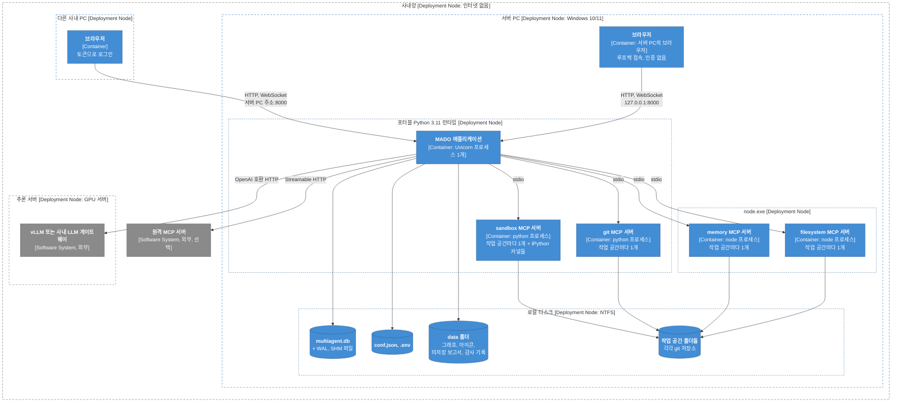
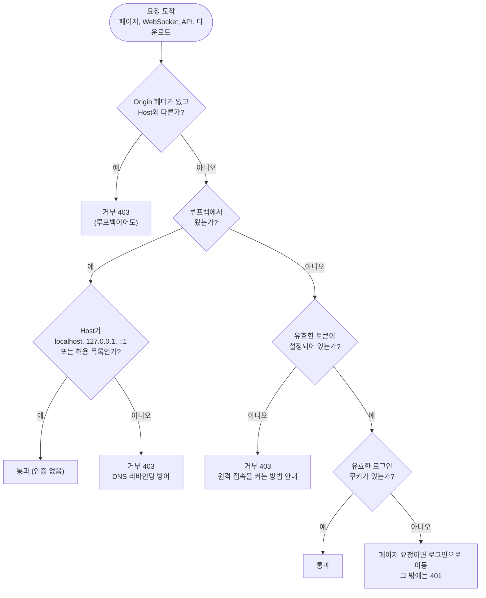
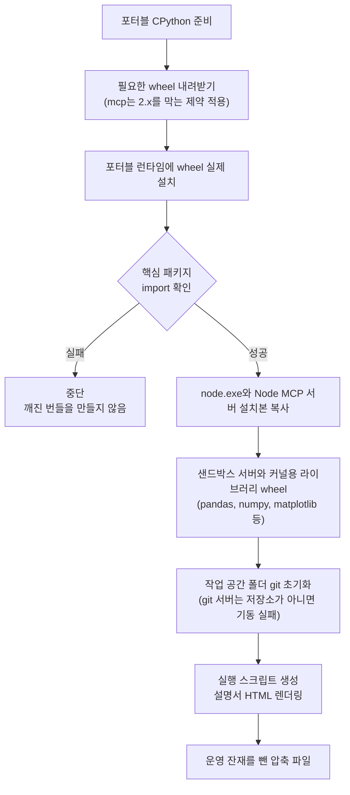

# 3-3. 배포 뷰: 어디에서, 어떤 프로세스로 도는가

> 상위: [3강. 아키텍처](README.md) · 이전: [3-2. 동적 뷰](02-dynamic-view.md) · 다음: [4강. 핵심 기술](../04-core-techniques/README.md)

배포 뷰는 소프트웨어가 실제 기계 위에 어떻게 올라가는지를 봅니다. 어떤 기계에서, 어떤 런타임 위에서,
프로세스가 몇 개 뜨는지, 파일은 어디에 놓이는지, 네트워크 경계는 어디인지가 이 뷰의 관심사입니다.
MADO는 "인터넷이 없는 망의 PC 한 대"를 기본 배포 대상으로 삼기 때문에, 설치와 갱신 방식도 이 뷰에서
함께 다룹니다.

---

## 1. 배포 형태 세 가지

| 형태 | 언제 | 무엇이 들어 있나 | 인터넷 |
| :--- | :--- | :--- | :--- |
| 개발 PC | 개발, 시험 | 소스 체크아웃, 가상환경, 시스템에 설치된 Node, npm으로 받은 MCP 서버 | 설치할 때 필요 |
| 폐쇄망 전체 번들 | 처음 반입, 런타임 버전을 올릴 때 | 포터블 파이썬, `node.exe`, 오프라인 wheel, MCP 서버 설치본, 소스, 설명서, 실행 스크립트 | 만들 때만 필요, 실행할 때는 불필요 |
| 소스 갱신 패키지 | 코드만 바뀌었을 때 | 소스, 설정 예시, 설명서 (수백 KB) | 만들 때만 필요 |

전체 번들은 수백 MB이고 소스 갱신 패키지는 수백 KB입니다. 차이가 이렇게 큰 것은 런타임이 한 번
반입하면 거의 바뀌지 않기 때문입니다. 코드를 고칠 때마다 수백 MB를 다시 반입하면 용량도 문제지만,
반입 심사를 매번 처음부터 다시 받아야 합니다. 두 패키지를 나눈 이유가 여기에 있습니다
([ADR-006](../05-adr/ADR-006-airgap-first-packaging.md)).

## 2. C4 배포 다이어그램: 폐쇄망 운영 환경

가장 전형적인 운영 형태입니다. 사내망 안에 서버 PC 한 대가 있고, 같은 망의 다른 PC에서 브라우저로
접속하며, LLM은 사내 GPU 서버의 추론 서버나 게이트웨이를 씁니다.



이 그림에서 확인할 것들입니다.

- **파이썬 런타임 하나가 세 종류의 프로세스를 띄웁니다.** 앱 자신, git 서버, 샌드박스 서버입니다.
  모두 같은 인터프리터를 써야 합니다. 앱이 가상환경이나 포터블 런타임에서 도는데 도구 서버가
  시스템의 다른 파이썬으로 뜨면, 필요한 패키지가 없어서 기동하자마자 죽습니다. 그래서 파이썬 실행
  파일 경로를 따로 지정하지 않으면 앱 자신의 인터프리터 경로를 쓰도록 되어 있습니다.
- **`node.exe`와 설치된 Node 패키지는 공유합니다.** 실행 중에는 읽기만 하므로 작업 공간마다 따로 둘
  이유가 없습니다. 나뉘는 것은 프로세스와 그 환경(작업 디렉터리, 임시 폴더, 볼 폴더)입니다.
- **DB는 로컬 디스크에 둡니다.** 네트워크 드라이브에서는 WAL 모드를 켜지 않으므로 잠금에 약해집니다.
  자리를 비운 사이 저장이 실패한 적이 있다면, DB 폴더를 백신 실시간 검사와 동기화·백업 대상에서
  빼는 것도 도움이 됩니다.

### 개발 PC와 다른 점

| 항목 | 개발 PC | 폐쇄망 번들 |
| :--- | :--- | :--- |
| 파이썬 | 가상환경 | 번들 안의 포터블 런타임 (wheel을 미리 설치하고 import까지 확인) |
| Node | 시스템에 설치된 Node + npm | `node.exe` 하나 (npm 없음) |
| MCP 서버 준비 | 준비 스크립트가 npm 설치, 샌드박스 저장소 받기, 작업 공간 git 초기화를 수행 | 번들에 설치본이 들어 있고, 작업 공간은 git 초기화된 상태로 들어 있음 |
| LLM | 클라우드 API를 쓰는 경우가 많음 | 사내 추론 서버, 게이트웨이 |
| 실행 | 파이썬 모듈로 직접 실행 | 실행 스크립트가 경로 환경변수를 주입하고 실행 |

눈여겨볼 점은 두 환경이 **같은 설정 파일**을 쓴다는 것입니다. 설정의 경로와 주소는 모두 `${변수:-기본값}`
형태로 적혀 있고, 번들의 실행 스크립트가 자기 위치를 기준으로 절대 경로를 계산해 환경변수로
넣어 줍니다. 설정 파일을 환경마다 따로 관리하지 않으므로 "개발 PC에서는 되는데 번들에서는 안 되는"
설정 차이가 생기지 않습니다.

## 3. 프로세스 구성과 자원 예산

서버 PC에서 뜨는 프로세스 수는 대략 다음과 같습니다.

```text
프로세스 수 ≈ 1 (앱)
            + 사용 중인 서로 다른 작업 공간 수 × 켜 둔 MCP 서버 수
            + 샌드박스 안의 IPython 커널 수
```

기본 구성(서버 4개)에서 작업 공간을 둘 쓰면 앱 하나에 도구 서버 여덟 개, 여기에 커널이 더해집니다.
이 수가 무한정 늘지 않도록 세 개의 예산이 있습니다.

| 예산 | 기본값 | 의미 |
| :--- | :--- | :--- |
| `MCP_MAX_RUNTIMES` | 4 | 동시에 살아 있을 수 있는 작업 공간별 서버 묶음 수. 동시 토론 수가 아니라 **서로 다른 작업 공간** 수입니다. 같은 폴더를 쓰는 대화는 묶음 하나를 함께 씁니다 |
| `MCP_RUNTIME_IDLE_TTL` | 300초 | 아무도 쓰지 않는 묶음을 살려 두는 시간. 연달아 오는 턴이 기동 비용을 다시 치르지 않게 합니다 |
| `SANDBOX_MAX_NAMESPACES` | 16 | 전체 커널 예산. 런타임 수로 나눠 각 샌드박스에 배분합니다. 넘으면 가장 오래 안 쓴 커널부터 정리하고, 그 변수는 사라집니다 |

커널 예산을 런타임 수로 나누는 이유가 있습니다. 런타임이 작업 공간마다 따로 뜨게 되면서 샌드박스도
여럿이 되었는데, 설정값 16을 각 샌드박스에 그대로 주면 전체 커널이 16 × 4 = 64개까지 늘어날 수
있습니다. 설정값은 "전체 예산"이라는 원래 의미를 지켜야 합니다.

`MCP_MAX_RUNTIMES`를 올리는 것은 정당한 조정이지만, 하나 올릴 때마다 스레드 하나가 아니라 도구 서버
프로세스 묶음 하나가 늘어난다는 점을 기억해야 합니다.

## 4. 네트워크와 보안 경계

### 바인딩 주소와 접근 규칙

앱은 기본적으로 `127.0.0.1`에 바인딩되어 서버 PC에서만 접속할 수 있습니다. `0.0.0.0`으로 열면 같은
망의 다른 PC에서도 접속할 수 있는데, v0.8.2 전까지는 인증이 전혀 없었습니다. 같은 망의 누구나
다른 사람의 대화를 읽고, MCP 서버 실행 명령을 바꾸고, 샌드박스로 코드를 실행하고, 작업 공간 파일을
받을 수 있었습니다. 도구 서버 추가 기능이 사실상 원격 명령 실행 통로였던 셈입니다.

지금은 모든 요청이 하나의 접근 제어 게이트를 지납니다.



| 규칙 | 내용 | 이유 |
| :--- | :--- | :--- |
| 루프백은 무인증 | 서버 PC 앞에 앉은 사람은 곧 주인 | 이미 그 PC의 파일과 설정에 접근할 수 있는 사람입니다 |
| 루프백에도 Origin, Host 검사 | 다른 출처의 페이지가 보낸 요청, 낯선 Host 이름을 거부 | 서버 PC 브라우저에 열린 악성 페이지가 루프백 권한으로 MADO를 조종하는 것, DNS 리바인딩을 막습니다 |
| 토큰 형식 | 영문 대소문자와 숫자로 정확히 24자, `.env`에 보관 | 형식만 검사하고 강도는 검사하지 않습니다(주인의 결정) |
| 토큰이 없거나 형식이 틀리면 | 원격 요청 전면 거부 | 잘못 설정되었을 때 열리는 쪽이 아니라 닫히는 쪽으로 실패합니다(fail-closed) |
| 로그인 | 토큰은 POST 본문으로만 받고, 성공하면 토큰에서 파생한 키로 서명한 쿠키를 7일간 발급 | 토큰이 URL, 쿠키, 응답에 한 번도 나타나지 않습니다. 토큰을 바꾸면 모든 쿠키가 무효가 됩니다 |
| 실패 제한 | 같은 IP에서 5회 실패하면 15분 잠금, 잠금과 해제는 감사 기록에 남김 | 무차별 대입을 늦춥니다. 제출된 토큰 값은 기록하지 않습니다 |
| 토큰 교체 | 서버 PC에서만 가능. 새 토큰은 `.env`에 먼저 쓰고, 쓰기에 성공했을 때만 적용 | 메모리와 파일이 어긋나면 다음 재시작 때 토큰이 조용히 바뀝니다 |

### 하지 않기로 한 것

- **HTTPS는 지금 두지 않습니다.** 사설 인증서는 어차피 브라우저 경고를 띄우고, 이 규모에서는 과하다는
  판단입니다. 신뢰할 수 없는 망이라면 SSH 터널로 접속하라고 안내합니다.
- **리버스 프록시 뒤에 두지 않습니다.** 게이트는 `X-Forwarded-For` 헤더를 일부러 무시합니다. 프록시
  뒤에 두면 모든 요청이 프록시에서, 즉 루프백에서 온 것으로 보여 인증 없이 통과합니다.
- **사용자별 계정은 없습니다.** 주인 한 명과 주인이 토큰을 나눠 준 사람들이 있을 뿐입니다. 대화의
  소유자 개념도 없습니다.

이 결정들은 [ADR-019](../05-adr/ADR-019-owner-token-remote-access.md)에 정리되어 있습니다.

## 5. 설정이 환경을 따라가는 방식

같은 설정 파일이 여러 환경에서 돌 수 있게 하는 장치들입니다.

| 장치 | 동작 | 막아 주는 문제 |
| :--- | :--- | :--- |
| 환경변수 치환 | `${A:-${B:-기본값}}`처럼 중첩된 기본값까지 풀어 줌 | 환경마다 설정 파일을 복사해 고치는 일 |
| 빈 값은 미설정 | 치환 결과가 빈 문자열이면 "설정하지 않음"으로 보고 전역 기본값을 상속 | 비어 있는 에이전트별 주소가 전역 주소를 빈 값으로 덮어쓰는 일 |
| 파이썬 경로 고정 | 지정하지 않으면 앱 자신의 인터프리터 경로를 도구 서버에 넘김 | 도구 서버가 패키지 없는 다른 파이썬으로 뜨는 일 |
| 작업 공간 절대 경로화 | 기동 시 프로젝트 루트 기준 절대 경로로 바꿈 | Node 서버와 Python 서버가 같은 상대 경로를 각자의 작업 디렉터리 기준으로 풀어 서로 다른 폴더를 보는 일 |
| 실행 스크립트의 경로 주입 | 번들 위치를 기준으로 런타임, MCP 서버, 작업 공간 경로를 환경변수로 넣음 | 번들을 다른 드라이브로 옮겼을 때 경로가 깨지는 일 |
| UTF-8 강제 | 파이썬 입출력 인코딩과 UTF-8 모드를 켜고, PowerShell 스크립트는 BOM 포함 UTF-8로 저장 | 한국어 Windows 콘솔(CP949)에서 한글 출력이나 스크립트 파싱이 깨지는 일 |

작업 공간 절대 경로화는 실제 사고에서 나왔습니다. 설정은 파일 시스템 서버와 샌드박스 서버에 똑같이
`./workspace`를 넘겼습니다. 그런데 파일 시스템 서버는 Node 프로세스이고 샌드박스는 Python 프로세스라
각자의 작업 디렉터리 기준으로 상대 경로를 풀었습니다. 설정 하나를 줬는데 두 서버가 서로 다른 폴더를
봤고, 엔지니어가 파일 시스템 도구로 쓴 파일을 샌드박스가 찾지 못했습니다.

## 6. 폐쇄망 번들 만들기

인터넷이 되는 빌드 PC(Windows)에서 전체 번들을 만드는 과정입니다.



핵심은 **wheel을 모으기만 하지 않고 실제로 설치해서 import까지 해 본다**는 점입니다. wheel만 모은
번들은 폐쇄망에 들어간 뒤에야 빠진 의존성이 드러나고, 그때는 다시 반입하는 것 말고 방법이 없습니다.
빌드 PC에서 실패하는 편이 훨씬 싸게 먹힙니다.

MCP 버전 상한도 이 단계에서 지킵니다. 동봉한 샌드박스 서버는 `mcp`의 상한을 적어 두지 않았기 때문에,
아무 제약 없이 wheel을 받으면 2.x가 들어와 기동에 실패합니다. 번들 빌드가 제약 파일로 `<2`를 강제합니다.

실행 스크립트는 번들이 만들어 내는 산출물입니다. 저장소에도 같은 내용의 사본이 들어 있지만, 원본은
생성 코드입니다. 사본만 고치면 번들에 실리는 스크립트는 바뀌지 않습니다. 실행 스크립트는 서버가
응답하기 시작하면 기본 브라우저를 여는 작은 도우미도 함께 띄웁니다. 이 도우미를 서버 프로세스 밖에 둔
이유는, 개발 모드에서 파일이 바뀔 때마다 서버가 다시 기동되는데 그때마다 브라우저 탭이 새로 열리면
곤란하기 때문입니다.

## 7. 소스만 갱신하기

코드만 바뀌었다면 소스 갱신 패키지를 만들어 기존 번들 위에 덮어씁니다.

| 규칙 | 이유 |
| :--- | :--- |
| 담을 목록을 **허용 목록**으로 관리 | 거부 목록이면 나중에 생긴 폴더가 조용히 따라 들어갑니다. 허용 목록이면 빠진 것이 눈에 보입니다 |
| 필수 파일이 빠지면 중단 | 그래프 편집기 라이브러리처럼 앱 폴더 안에 있지만, 나중에 추가된 제외 규칙에 걸려 조용히 빠질 수 있는 파일을 확인합니다 |
| 설정 파일(`conf.json`)은 담지 않음 | 배포된 쪽의 설정에는 그 망의 실제 엔드포인트가 들어 있습니다. 덮어쓰면 모든 에이전트가 엉뚱한 곳을 가리킵니다 |
| 2MB 넘는 파일이 있으면 중단 | 소스 패키지에 그런 파일이 있다면 런타임 산출물이 섞여 들어온 것입니다 |
| 키처럼 보이는 값이 있으면 중단 | 설정 파일은 git에서 빠져 있어서 누군가 실제 키를 붙여 넣어도 막을 장치가 없습니다. 반입 심사에서 발견하는 것은 너무 늦습니다 |
| 파일마다 SHA-256을 적은 목록 동봉 | 반입 기록으로 쓰고, 풀어 놓은 뒤 받은 쪽에서 검증합니다 |

적용할 때는 앱 폴더를 파일 단위로 덮지 말고 통째로 바꿉니다. 이번 갱신에서 지운 모듈이 남아 있으면
계속 import될 수 있습니다.

소스 갱신으로 충분하지 않은 경우도 분명히 알려 둡니다. 의존성 목록이 바뀌었다면 런타임에 없는
패키지가 필요하다는 뜻이므로 원칙적으로 전체 번들을 다시 만들어야 합니다. 다만 순수 파이썬 패키지
몇 개가 추가된 정도라면, 그 패키지의 wheel만 갱신 패키지에 함께 담는 옵션을 쓸 수 있습니다.

v0.5.0이 좋은 예입니다. 새 모듈, 세션 이어받기, 다이어그램 수리, 발언 순서 미리보기가 추가되었지만
새로 쓴 것은 모두 표준 라이브러리였고 의존성 목록은 그대로였습니다. 그래서 수백 MB짜리 번들 대신
391KB짜리 소스 패키지 하나로 갱신이 끝났습니다. **새 기능을 표준 라이브러리로 만들 수 있다면
폐쇄망에서는 그것만으로 큰 이득입니다.**

## 8. 운영 점검표

| 항목 | 확인할 것 |
| :--- | :--- |
| DB 위치 | 로컬 디스크인가? 백신 실시간 검사, 동기화, 백업 대상에서 빠져 있는가? |
| DB 파일 권한 | 대화 구성 스냅샷에 API 키가 평문으로 들어 있습니다. 파일 권한을 확인합니다 |
| 원격 접속 | `0.0.0.0`으로 열었다면 `.env`의 토큰이 올바른 형식인가? 신뢰할 수 없는 망이면 SSH 터널을 쓰는가? |
| 미저장 보고서 폴더 | 평소에는 비어 있어야 합니다. 파일이 있다면 DB 저장이 실패한 적이 있다는 뜻입니다 |
| 로그인 감사 기록 | 잠금 기록이 있다면 누가 틀린 토큰을 반복해서 넣었는지 확인합니다 |
| MCP 상태 칩 | 빨간 칩이 있으면 마우스를 올려 표준 오류 요약을 봅니다 |
| LLM 응답 대기 시간 | `timeout`은 응답 전체가 아니라 **조각 사이의 대기** 시간입니다. 긴 파일을 쓰는 도구 호출은 인자가 다 만들어질 때까지 아무것도 흘려보내지 않으므로, `max_tokens ÷ 초당 토큰 수`보다 크게 잡습니다 |

## 9. 이 배포 모델의 한계

이 배포 모델은 "한 사람이 운영하는 서버 PC 한 대"에 맞춰져 있습니다. 규모가 커지면 다음이 먼저
한계에 닿습니다.

- **단일 프로세스.** 앱을 여러 대로 늘릴 수 없습니다. 토론 실행기, 에이전트 풀, 런타임 풀이 모두 한
  프로세스의 메모리에 있습니다.
- **SQLite.** 쓰는 주체가 늘면 잠금 경합이 커집니다. 접속 주소가 설정값이라 PostgreSQL로 옮길 길은
  열려 있지만, 누락 컬럼 추가 방식의 스키마 이관은 다시 봐야 합니다.
- **사용자 구분 없음.** 원격 사용자 모두가 주인과 같은 권한을 가집니다. 여러 팀이 쓰려면 계정과 대화
  소유권이 필요하고, 이는 명시적으로 범위 밖으로 정해 둔 부분입니다.
- **서버 PC 자원.** 작업 공간과 커널이 늘면 프로세스와 메모리가 선형으로 늘어납니다.

한계를 적어 두는 것도 설계의 일부입니다. 언젠가 이 한계에 닿았을 때, 무엇을 바꿔야 하는지가 이미
정리되어 있기 때문입니다.

---

## 정리

- 배포 형태는 개발 PC, 폐쇄망 전체 번들, 소스 갱신 패키지 세 가지이고, 모두 같은 설정 파일을 씁니다.
- 서버 PC 한 대 위에 앱 프로세스 하나와 작업 공간 수만큼의 도구 서버 묶음이 뜹니다. 런타임, 유휴
  시간, 커널에 각각 예산이 있습니다.
- 모든 요청은 하나의 접근 제어 게이트를 지납니다. 루프백은 무인증, 원격은 토큰 로그인이며, 잘못
  설정되면 닫히는 쪽으로 실패합니다.
- 번들은 설치와 import까지 확인한 뒤에 만들고, 소스 갱신은 허용 목록과 안전 검사를 거칩니다.

## 생각해 볼 문제

1. 원격 사용자가 10명으로 늘었습니다. 토큰 하나를 나눠 쓰는 방식에서 가장 먼저 생길 운영 문제는
   무엇일까요?
2. 리버스 프록시 뒤에 두면서도 루프백 무인증 규칙의 취지를 지키려면 무엇을 바꿔야 할까요?
3. 소스 갱신 패키지에 파이썬 패키지 wheel을 함께 담을 수 있게 했습니다. 이 옵션이 오히려 위험해지는
   경우는 언제일까요? (힌트: 네이티브 확장 모듈)
