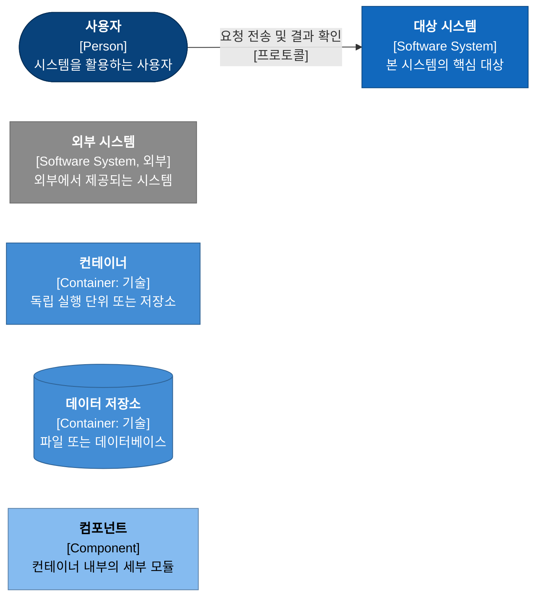

# 3강. 아키텍처: 세 개의 뷰로 읽기

> 이전: [2강. 기술 스택](../02-tech-stack.md) · 다음: [3-1. 정적 뷰](01-static-view.md)

복잡한 시스템 아키텍처를 단 한 장의 다이어그램으로 모두 표현하려 하면, 결국 어떠한 질문에도 명확하게 답하지 못하는 모호한 다이어그램이 만들어집니다. 상자와 화살표가 무질서하게 뒤엉켜 "이 화살표가 함수 호출인지, 데이터 흐름인지, 아니면 물리적인 네트워크 배포 위치인지" 아무도 명확히 해석할 수 없게 됩니다. 따라서 이번 강의에서는 MADO의 전체 아키텍처를 3가지의 상호 보완적인 뷰(View)로 나누어 체계적으로 분석합니다.

| 아키텍처 뷰 | 핵심 질의 | 해당 강의 문서 |
| :--- | :--- | :--- |
| **정적 뷰 (Static View)** | 시스템에 무엇이 존재하며, 구성 요소 간의 의존 관계는 어떠한가? 어떤 데이터가 어디에 영구 저장되는가? | [3-1. 정적 뷰](01-static-view.md) |
| **동적 뷰 (Dynamic View)** | 런타임에 어떤 순서로 프로세스가 상호작용하는가? 예외나 실패가 발생했을 때 제어 흐름은 어떻게 전개되는가? | [3-2. 동적 뷰](02-dynamic-view.md) |
| **배포 뷰 (Deployment View)** | 물리적 또는 논리적 머신의 어떤 프로세스에서 구동되는가? 시스템 설치 및 업데이트는 어떻게 이루어지는가? | [3-3. 배포 뷰](03-deployment-view.md) |

동일한 시스템 구성 요소라도 각 뷰에 따라 전혀 다른 관점으로 해석됩니다. 예를 들어 "MCP 런타임 풀"의 경우, 정적 뷰에서는 단순한 하나의 컴포넌트 블록이지만, 동적 뷰에서는 세션별로 인스턴스를 대여하고 반납하는 상태 머신(State Machine)으로 묘사되며, 배포 뷰에서는 활성 작업 공간의 개수에 비례하여 동적으로 생성되는 자식 프로세스 그룹으로 표현됩니다. 하나의 아키텍처 요소를 세 가지 서로 다른 시각에서 입체적으로 조망하는 것이 이번 강의의 핵심 목표입니다.

---

## C4 모델 기반의 시각화

본 강의의 아키텍처 다이어그램은 소프트웨어 아키텍트 Simon Brown이 정립한 **C4 모델**의 표기 원칙을 따릅니다. C4 모델은 온라인 지도 서비스를 확대하듯이 시스템의 구조를 총 4단계의 추상화 수준으로 나누어 표현합니다.

| 단계 | 명칭 | 표현 대상 | 본 강의에서의 활용 |
| :--- | :--- | :--- | :--- |
| **1단계** | 시스템 컨텍스트 (System Context) | 전체 소프트웨어 시스템과 이를 사용하는 사용자 및 외부 연동 시스템 간의 경계 | 정적 뷰에서 활용 |
| **2단계** | 컨테이너 (Containers) | 시스템을 구성하는 상위 수준의 독립 실행 단위(프로세스, 저장소 등) | 정적 뷰 및 동적 뷰에서 활용 |
| **3단계** | 컴포넌트 (Components) | 단일 컨테이너 내부를 구성하는 주요 모듈 및 논리적 컴포넌트 | 정적 뷰에서 활용 |
| **4단계** | 코드 (Code) | 클래스, 인터페이스, 함수 수준의 구현 세부사항 | 본 강의에서는 제외 |

본 강의에서는 의도적으로 4단계(코드 수준) 다이어그램을 다루지 않습니다. 코드 수준 다이어그램은 리팩터링이나 소스 변경에 따라 쉽게 왜곡되며, 본 강의의 관심사는 지엽적인 구현 코드보다 거시적인 아키텍처 구조와 설계 이유를 이해하는 데 있기 때문입니다.

C4 모델은 위의 4단계 외에도 다음과 같은 보조 다이어그램을 제공합니다.

- **동적 다이어그램 (Dynamic Diagram)**: 컨테이너 또는 컴포넌트 다이어그램 위에 번호가 매겨진 메시지 흐름을 표현하여 특정 비즈니스 시나리오의 런타임 상호작용을 설명합니다. ([3-2. 동적 뷰](02-dynamic-view.md)에서 활용)
- **배포 다이어그램 (Deployment Diagram)**: 소프트웨어 컨테이너들이 실제 인프라 환경(하드웨어, OS, 런타임)에 어떻게 매핑되어 구동되는지를 보여줍니다. ([3-3. 배포 뷰](03-deployment-view.md)에서 활용)

### C4 모델의 "컨테이너"는 Docker 컨테이너만을 의미하지 않습니다

C4 모델을 처음 접할 때 가장 빈번하게 혼동하는 개념입니다. C4 모델에서 컨테이너란 Docker와 같은 가상화 기술만을 지칭하는 것이 아니라, **독립적으로 배포 및 실행되거나 데이터를 별도로 저장하는 모든 실행·저장 단위**를 의미합니다. 웹 애플리케이션 프로세스, 브라우저 클라이언트, 데이터베이스, 파일 시스템 저장소가 모두 컨테이너의 범주에 속합니다. MADO는 Docker 가상화를 사용하지 않지만 여러 개의 논리적 컨테이너로 구성되어 있습니다. 즉, 메인 Python 애플리케이션 프로세스, 브라우저 UI 계층, SQLite 데이터베이스 파일, 작업 공간 디렉터리, 그리고 외부 MCP 도구 서버 프로세스들이 각각 독립적인 컨테이너 역할을 수행합니다.

### C4 표기 범례

본 강의에 포함된 C4 다이어그램은 Mermaid 순서도(flowchart) 문법을 기반으로 C4 표준 시각화 규칙을 적용하여 작성했습니다. 각 노드에는 볼드체 명칭, 대괄호로 둘러싸인 요소 유형 및 적용 기술, 핵심 요약 설명이 표기됩니다. 연결 화살표의 라벨에는 수행하는 행위의 명칭과 사용된 통신 프로토콜을 함께 기재했습니다.

| 색상 구분 | 아키텍처 요소 유형 |
| :--- | :--- |
| **짙은 남색** | 사용자 (Person) |
| **파란색** | 자체 구축 소프트웨어 시스템 (Software System) |
| **회색** | 외부 시스템 (LLM 공급자, 원격 도구 서버 등) |
| **중간 파란색** | 컨테이너 (Containers) |
| **연한 하늘색** | 내부 컴포넌트 (Components) |
| **점선 테두리** | 시스템 경계, 컨테이너 경계 또는 물리적 배포 노드 |

---

## 아키텍처 설계를 주도한 6대 품질 속성

기능 요구사항이 "시스템이 무엇을 수행해야 하는가"를 결정한다면, 품질 속성(Quality Attributes)은 "시스템을 어떤 구조와 형태로 구축해야 하는가"를 결정합니다. MADO의 아키텍처 구조를 도출해 낸 품질 속성들을 우선순위에 따라 정렬하면 다음과 같습니다. 이 우선순위는 사전에 문서로 단순히 선언된 것이 아니라, 설계 간에 상호 충돌이 발생했을 때 어느 가치를 우선하여 선택했는지를 사후에 귀납적으로 도출한 결과입니다.

| 우선순위 | 품질 속성 | 핵심 요구사항 | 대표적인 아키텍처 결정 |
| :--- | :--- | :--- | :--- |
| **1순위** | **정직성 (Honesty)** | 연결 실패, 토큰 초과로 잘린 응답, 디스크 저장 실패 등의 결함을 은폐하지 않습니다. | 가상 시뮬레이터 제거, 응답 잘림 명시 표시, 미저장 산출물 보존 경로 신설 |
| **2순위** | **신뢰성 (Reliability)** | 국지적 실패가 전체 시스템을 중단시키지 않으며, 생성된 최종 결과물을 유실하지 않습니다. | 도구 예외 격리 경계 수립, SQLite 쓰기 재시도 메커니즘, 백그라운드 태스크 분리 |
| **3순위** | **이식성 (Portability)** | 외부 인터넷이 차단된 폐쇄망 환경에 반입되어 추가적인 설정 변경 없이 즉시 구동됩니다. | Python 단일 프로세스 일원화, 오프라인 Wheel 번들링, 프런트엔드 라이브러리 인앱 내장 |
| **4순위** | **격리성 (Isolation)** | 특정 대화 세션이 다른 세션의 작업 파일, 대화 기억, 코드 실행 커널을 침범하지 않습니다. | 호스트 주도형 도구 호출 스코프 통제, 작업 공간별 독립 MCP 런타임 풀 구축 |
| **5순위** | **변경 용이성 (Modifiability)** | 소스 코드 수정 없이 설정을 통해 에이전트 페르소나와 도구 구성을 자유롭게 변경합니다. | 선언적 JSON 설정 체계, 웹 UI 변경사항의 양방향 설정 파일 동기화 |
| **6순위** | **성능 및 반응성 (Performance)** | 동시 토론 실행 및 대량 토큰 스트리밍 상황에서도 웹 화면의 응답성이 유지됩니다. | 병렬 지시 토론 전략, UI 이벤트 스로틀링(묶음 처리), 런타임 풀 사전 예열 |

여기서 가장 주목할 점은 **'정직성'이 '신뢰성'보다 상위 우선순위**로 자리 잡고 있다는 점입니다. 두 품질 속성이 정면으로 충돌했던 대표적인 사례가 바로 작업 공간 경합 문제입니다.

v0.6 이전 버전에서는 작업 공간 디렉터리가 서로 다른 두 개의 토론 세션을 동시에 구동할 수 없었습니다. 두 번째 토론을 그대로 실행할 경우 도구가 다른 세션의 폴더를 침범하여 읽고 쓸 위험이 존재했기 때문입니다. 이에 시스템은 시스템 가용성을 일시 희생하더라도 작업을 거절하는 쪽을 선택했습니다([ADR-009](../05-adr/ADR-009-refuse-cross-workspace-debates.md)). 이후 런타임 풀 구조로 아키텍처를 전면 개선하여 두 가치를 모두 만족시켰지만([ADR-016](../05-adr/ADR-016-per-workspace-mcp-runtime.md)), 그 전까지의 엔지니어링 판단 기준은 타협 없이 확고했습니다.

## 세 가지 뷰 간의 상호 매핑 관계

세 가지 뷰 문서를 모두 학습하신 후 아래 비교 표를 다시 확인하시면 전체 아키텍처를 유기적으로 이해하시는 데 큰 도움이 됩니다.

| 정적 뷰의 구성 요소 | 동적 뷰에서의 관점 | 배포 뷰에서의 관점 |
| :--- | :--- | :--- |
| **MADO 애플리케이션 컨테이너** | 기동 및 종료 라이프사이클 관리, 턴 오케스트레이션 | 서버 머신 상의 단일 Python 운영체제 프로세스 |
| **토론 실행기 (Debate Runner)** | 세션별 단일 실행 태스크, 웹 클라이언트별 이벤트 구독 큐 | 메인 프로세스 내부의 비동기 asyncio 태스크 |
| **MCP 런타임 풀** | 대여, 반납, 유휴 시간 초과 정리 상태 머신 | 작업 공간 디렉터리 수 × 도구 서버 수만큼 생성되는 자식 프로세스군 |
| **대화 데이터베이스** | 발언 생성 시마다 영구 기록, 쓰기 경합 시 지수 백오프 재시도 | 로컬 파일 시스템 상의 SQLite 데이터 파일 (+ WAL 보조 파일) |
| **설정 파일** | 서버 기동 시 역직렬화 검증, 웹 UI 편집 시 파일 되쓰기 | 설치 디렉터리 내의 `conf.json` 및 환경 설정 `.env` 파일 |
| **접근 제어 게이트** | 모든 인바운드 HTTP/WebSocket 요청의 보안 검증 관문 | 로컬 루프백 접속과 원격 네트워크 접속을 분기하는 보안 경계 |

## 세부 강의 목차

1. [3-1. 정적 뷰](01-static-view.md): C4 컨텍스트·컨테이너·컴포넌트 다이어그램, 계층 구조와 의존성 방향, 데이터 도메인 모델, 상태의 유형과 격리 경계 분석
2. [3-2. 동적 뷰](02-dynamic-view.md): 기동과 정상 종료 시퀀스, 단일 턴의 엔드투엔드 라이프사이클, 도구 루프 상호작용, 토론 전략별 실행 패턴, 클라이언트 재접속 처리, 예외 발생 시의 제어 흐름
3. [3-3. 배포 뷰](03-deployment-view.md): C4 배포 다이어그램, 프로세스 토폴로지, 네트워크 보안 경계, 폐쇄망 오프라인 패키징 및 소스 무중단 배포 전략
