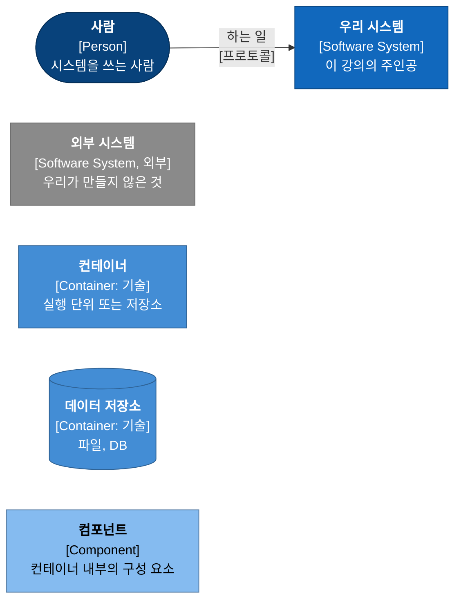

# 3강. 아키텍처: 세 개의 뷰로 읽기

> 이전: [2강. 기술 스택](../02-tech-stack.md) · 다음: [3-1. 정적 뷰](01-static-view.md)

아키텍처 그림 한 장으로 모든 질문에 답하려 하면, 결국 어떤 질문에도 제대로 답하지 못하는 그림이
나옵니다. 상자와 화살표가 뒤엉켜서 "이 화살표는 호출인가, 데이터 흐름인가, 배포 위치인가"를 아무도
모르게 됩니다. 그래서 이 강에서는 MADO의 아키텍처를 세 개의 뷰로 나눠서 봅니다.

| 뷰 | 답하는 질문 | 이 강의 문서 |
| :--- | :--- | :--- |
| **정적 뷰** | 무엇이 있고, 무엇이 무엇에 기대는가? 어떤 데이터가 어디에 저장되는가? | [3-1. 정적 뷰](01-static-view.md) |
| **동적 뷰** | 실행하면 어떤 순서로 무슨 일이 일어나는가? 실패하면 어떻게 흘러가는가? | [3-2. 동적 뷰](02-dynamic-view.md) |
| **배포 뷰** | 어느 기계의 어떤 프로세스에서 도는가? 어떻게 설치하고 갱신하는가? | [3-3. 배포 뷰](03-deployment-view.md) |

같은 구성 요소가 세 뷰에 모두 나옵니다. 예를 들어 "MCP 런타임 풀"은 정적 뷰에서는 컴포넌트 상자
하나이고, 동적 뷰에서는 "빌리고 반납하는" 생명주기를 가진 상태 머신이며, 배포 뷰에서는 작업 공간
수만큼 늘어나는 프로세스 묶음입니다. 한 요소를 세 방향에서 보는 연습이 이 강의 목표입니다.

---

## C4 모델

그림은 C4 모델의 표기를 따릅니다. C4는 Simon Brown이 정리한 방식으로, 지도를 확대하듯 네 단계로
시스템을 그립니다.

| 단계 | 이름 | 보여 주는 것 | 이 강의에서 |
| :--- | :--- | :--- | :--- |
| 1 | 시스템 컨텍스트 (Context) | 시스템 하나와 그 주변의 사람, 외부 시스템 | 정적 뷰 |
| 2 | 컨테이너 (Container) | 시스템을 이루는 실행 단위와 저장소 | 정적 뷰, 동적 뷰 |
| 3 | 컴포넌트 (Component) | 컨테이너 하나의 내부 구성 요소 | 정적 뷰 |
| 4 | 코드 (Code) | 클래스, 함수 수준 | 그리지 않음 |

4단계는 일부러 그리지 않았습니다. 코드 수준 그림은 코드가 바뀌면 바로 틀려지고, 이 강의의 관심은
특정 구현보다 구조와 그 이유에 있기 때문입니다.

C4에는 이 네 단계 외에 보조 그림이 두 가지 있습니다.

- **동적 다이어그램**: 컨테이너나 컴포넌트 그림 위에 번호 붙은 상호작용을 그려서 한 시나리오의
  흐름을 보여 줍니다. [3-2. 동적 뷰](02-dynamic-view.md)에서 씁니다.
- **배포 다이어그램**: 컨테이너가 어떤 기계, 어떤 런타임 위에 올라가는지 보여 줍니다.
  [3-3. 배포 뷰](03-deployment-view.md)에서 씁니다.

### C4의 "컨테이너"는 도커 컨테이너가 아니다

처음 C4를 접하면 가장 많이 헷갈리는 부분입니다. C4에서 컨테이너는 **따로 실행되거나 따로 데이터를
담는 단위**를 말합니다. 웹 애플리케이션, 브라우저에서 도는 SPA, 데이터베이스, 파일 저장소가 모두
컨테이너입니다. MADO는 도커를 쓰지 않지만 컨테이너는 여러 개입니다. 파이썬 앱 프로세스, 브라우저 쪽
화면, SQLite 파일, 작업 공간 폴더, 그리고 도구 서버 프로세스들입니다.

### C4 표기 범례

이 강의의 C4 그림은 Mermaid 순서도 문법에 C4 표기를 얹어 그렸습니다. 각 상자에는 굵은 이름,
대괄호 안의 요소 종류와 기술, 한 줄 설명이 들어갑니다. 화살표 라벨은 "무엇을 하는가"와
"어떻게(프로토콜)"를 함께 적습니다.

| 색 | 요소 |
| :--- | :--- |
| 짙은 남색 | 사람 |
| 파랑 | 우리가 만드는 시스템 |
| 회색 | 외부 시스템 (LLM 공급자, 원격 도구 서버 등) |
| 중간 파랑 | 컨테이너 |
| 연한 파랑 | 컴포넌트 |
| 점선 테두리 | 경계 (시스템 경계, 컨테이너 경계, 배포 노드) |

---

## 아키텍처를 이끈 품질 속성

기능 요구사항은 "무엇을 하는가"를 정하고, 품질 속성은 "어떤 모양으로 만드는가"를 정합니다. MADO의
구조를 결정한 품질 속성을 우선순위대로 적으면 다음과 같습니다. 이 순위는 문서로 선언된 것이 아니라,
두 속성이 부딪힌 결정에서 어느 쪽을 골랐는지 거꾸로 읽어 낸 것입니다.

| 순위 | 품질 속성 | 구체적인 요구 | 대표 결정 |
| :--- | :--- | :--- | :--- |
| 1 | 정직성 | 연결 실패, 잘린 답변, 저장 실패를 숨기지 않는다 | 시뮬레이터 제거, 잘림 표시, 미저장 파일 보존 |
| 2 | 신뢰성 | 부분 실패가 전체를 죽이지 않고, 결과물을 잃지 않는다 | 도구 실패 경계, DB 재시도, 백그라운드 실행 |
| 3 | 이식성 | 인터넷 없는 망에 반입해 설정 변경 없이 돈다 | 파이썬 일원화, 오프라인 번들, 라이브러리 동봉 |
| 4 | 격리 | 한 대화가 다른 대화의 파일, 기억, 커널을 건드리지 않는다 | 호스트가 정하는 도구 스코프, 작업 공간별 런타임 |
| 5 | 변경 용이성 | 코드를 고치지 않고 에이전트와 도구를 바꾼다 | 설정 중심 구성, 화면에서 설정 되쓰기 |
| 6 | 성능 | 동시 토론, 긴 스트리밍에서 화면이 버틴다 | 병렬 전략, 갱신 묶기, 런타임 예열 |

정직성이 신뢰성보다 앞에 있다는 점이 눈에 띕니다. 두 속성이 부딪힌 대표 사례가 작업 공간 충돌입니다.
v0.6 이전에는 작업 공간이 다른 두 토론을 동시에 돌릴 수 없었습니다. 두 번째 토론을 조용히 돌리면
도구가 남의 폴더를 읽고 쓰게 되므로, 가용성을 포기하고 거절하는 쪽을 택했습니다
([ADR-009](../05-adr/ADR-009-refuse-cross-workspace-debates.md)). 나중에 구조를 바꿔 두 속성을 함께
만족시켰지만([ADR-016](../05-adr/ADR-016-per-workspace-mcp-runtime.md)), 그 전까지의 우선순위는
분명했습니다.

## 뷰 사이의 대응

세 뷰를 읽고 나서 아래 표로 돌아와 보면 도움이 됩니다.

| 정적 뷰의 요소 | 동적 뷰에서 | 배포 뷰에서 |
| :--- | :--- | :--- |
| MADO 애플리케이션 컨테이너 | 기동·종료 시퀀스, 턴 처리 | 서버 PC의 파이썬 프로세스 하나 |
| 토론 실행기 | 세션마다 태스크 하나, 화면마다 구독 큐 하나 | 앱 프로세스 안의 asyncio 태스크 |
| MCP 런타임 풀 | 빌리기·반납·유휴 정리 상태 머신 | 작업 공간 수 × 서버 수만큼의 자식 프로세스 |
| 대화 DB | 발언마다 기록, 실패 시 재시도 | 로컬 디스크의 SQLite 파일(+WAL 파일) |
| 설정 파일 | 기동 시 읽기, 화면 편집 시 되쓰기 | 설치 폴더의 `conf.json`과 `.env` |
| 접근 제어 게이트 | 모든 요청의 첫 관문 | 루프백과 원격을 가르는 경계 |

## 이 강의 문서

1. [3-1. 정적 뷰](01-static-view.md): C4 컨텍스트·컨테이너·컴포넌트, 계층과 의존 방향, 데이터 모델,
   상태의 종류와 격리 경계
2. [3-2. 동적 뷰](02-dynamic-view.md): 기동과 종료, 한 턴의 흐름, 도구 루프, 토론 전략별 라운드,
   화면 재접속, 상태 머신, 실패 시나리오
3. [3-3. 배포 뷰](03-deployment-view.md): C4 배포 다이어그램, 프로세스 구성, 보안 경계, 폐쇄망 번들과
   소스 갱신
