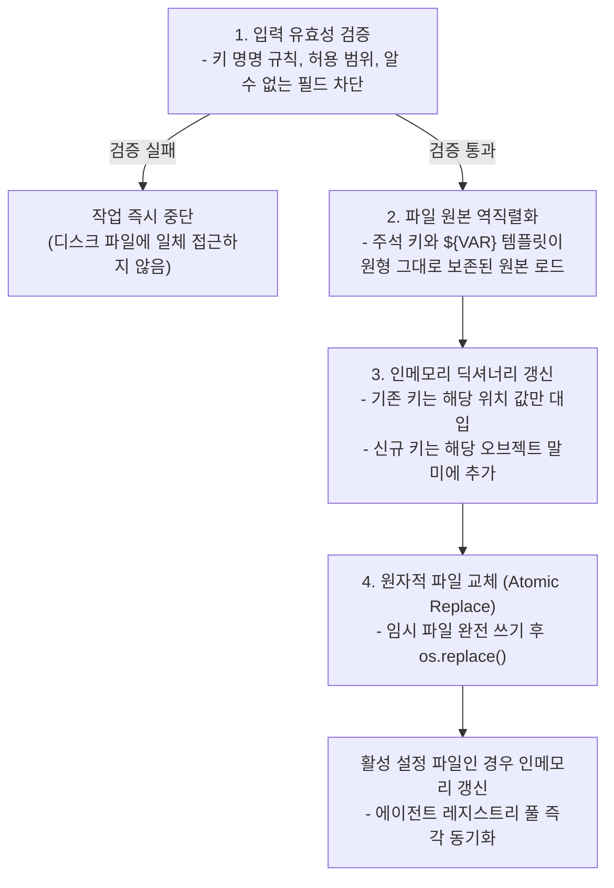

# 4-1. 설정을 읽고, 검증하고, 되쓰기

> 상위: [4강. 핵심 기술](README.md) · 다음: [4-2. LLM 연동](02-llm-integration.md)

대부분의 소프트웨어 애플리케이션에서 설정 파일은 기동 시점에 한 번 로드되는 읽기 전용(Read-only) 자원입니다. 사람이 텍스트 편집기로 수정하고, 애플리케이션은 시작할 때 읽기만 수행합니다. 하지만 MADO는 동작 방식이 다릅니다. 사용자가 웹 UI 화면에서 에이전트를 추가하거나, 카드를 드래그하여 발언 순서를 변경하거나, 특정 MCP 서버를 켜고 끄면 그 결과가 실제 설정 파일(`conf.json`)에 즉시 되써집니다. 설정 파일이 시스템의 입력(Input)이자 동시에 출력(Output)으로 기능합니다. 이번 절에서는 사람과 프로그램이 동일한 설정 파일을 안전하게 공존 수정할 수 있도록 보장하는 아키텍처 기법들을 살펴봅니다.

---

## 1. 설정 읽기 파이프라인


### 주석 메타데이터의 데이터화 기법

JSON 표준 규격에는 주석 문법이 존재하지 않습니다. MADO는 **키 이름이 `//`로 시작하는 항목을 주석 및 설명 데이터**로 간주하여 처리합니다.

```json
"// mcp_servers": "MCP 서버 연동 설정입니다. fetch는 외부 인터넷이 개방된 환경에서만 활성화하십시오.",
"mcp_servers": { ... }
```

설정을 읽어 들일 때는 이러한 주석 키들을 재귀적으로 걷어낸 후 Pydantic 유효성 검증 계층에 전달합니다. 이 설계의 진정한 가치는 쓰기 파이프라인에서 발휘됩니다. 주석 자체가 **일반 데이터 딕셔너리의 일부**로 파싱되어 메모리에 유지되므로, 파일에서 딕셔너리를 읽어 특정 비즈니스 값만 수정하고 다시 저장하는 것만으로 사람이 달아둔 주석 설명이 바이트 단위로 완벽하게 보존됩니다. 설정 직렬화 엔진이 주석의 위치를 보존하기 위해 복잡한 AST(추상 구문 트리)를 다룰 필요가 없습니다.

여러 줄로 구성된 장문의 텍스트 역시 동일한 방식으로 해결합니다. 시스템 프롬프트와 같은 긴 지침 문구는 설정 파일에 문자열 배열(`["줄 1", "줄 2", ...]`) 형태로 작성하도록 지원하며, 로더가 읽는 시점에 줄바꿈 문자(`\n`)로 자동 결합합니다. 한 줄 안에 수많은 이스케이프 문자(`\n`)가 포함된 거대한 문자열은 사람이 직접 읽고 편집하기에 매우 불편하기 때문입니다.

### 환경변수 재귀 치환 엔진

설정 파일 내의 `${VAR}`, `${VAR:-기본값}`, `${A:-${B:-기본값}}`과 같은 변수 템플릿을 실제 환경변수 값으로 치환합니다.

```text
"${APP_PORT:-${PORT:-8000}}"
   1. APP_PORT 환경변수가 정의되어 있다면 해당 값 사용
   2. 정의되지 않았다면 ${PORT:-8000}을 다시 재귀 평가
   3. PORT 변수마저 없다면 최종 기본값 "8000" 확정
```

이 치환 엔진은 단순 정규식이 아니라 중첩 구조를 해석할 수 있는 재귀 파서로 구현되었습니다. 정규식만으로는 다중 중첩된 중괄호(`{...}`)의 열림과 닫힘 쌍을 정확하게 계측할 수 없기 때문입니다. 작은 문법이라도 재귀적 중첩이 허용되는 순간 정규식을 배제하고 명시적인 문자 단위 파서를 작성하는 편이 안전합니다.

치환 결과가 공백이나 빈 문자열인 경우 시스템은 이를 **"설정되지 않음(Not Set)"**으로 처리합니다. 예를 들어 에이전트마다 `"api_base": "${CODER_API_BASE}"`를 선언해 두고, 환경변수 파일에 이 변수를 정의하지 않았다고 가정해 보겠습니다. 만약 빈 문자열(`""`)을 유효한 값으로 취급한다면 전역 `llm.api_base`의 정상적인 엔드포인트 주소를 빈 문자열로 덮어써버리는 오류가 발생합니다. 검증 단계에서 공백 문자열을 `None`으로 정규화함으로써, 해당 에이전트는 자연스럽게 전역 기본 설정을 상속받게 됩니다.

### 계층형 상속 모델

```text
llm (전역 기본 설정)
 ├─ orchestrator: 명시적으로 재정의한 항목만 오버라이드
 ├─ architect:    명시적으로 재정의한 항목만 오버라이드
 └─ ...
```

개별 에이전트는 자신에게 명시적으로 선언된 항목만 오버라이드하고, 나머지 모든 공통 속성(API 기본 주소, 타임아웃, 공통 파라미터 등)은 전역 `llm` 블록에서 상속받습니다. 사내 AI 게이트웨이 주소가 변경되었을 때 `.env`의 단 한 줄만 수정하면 시스템 내의 모든 에이전트가 즉시 새 주소를 바라보게 되는 유연한 구조입니다. 이 상속 구조는 후술할 "변경분 선택적 기록" 규칙과 긴밀하게 결합됩니다.

## 2. 설정 쓰기 파이프라인

웹 화면에서 발생하는 모든 설정 저장 작업은 항상 일관된 4단계를 거칩니다.



### 환경변수 템플릿 보존을 위한 원문 역직렬화

웹 UI 화면에 표시되는 값은 이미 **환경변수 치환이 완료된 최종 런타임 값**입니다. 만약 브라우저에서 제출된 값을 그대로 디스크 파일에 직렬화하면 다음과 같은 3가지 심각한 문제가 발생합니다.

1. `${OPENAI_API_KEY}`로 안전하게 템플릿 처리되어 있던 자리에 개발자의 실제 개인 API 키가 평문 문자열로 영구 박제되는 보안 사고가 일어납니다.
2. 이후 시스템 관리자가 `.env` 파일의 변수 값을 변경하더라도 설정 파일의 값이 하드코딩되어 더 이상 환경변수를 추종하지 않게 됩니다.
3. 다른 머신으로 시스템을 이전했을 때 이전 호스트 머신의 절대 디렉터리 경로가 파일에 고정 잔존하여 배포 이식성이 파괴됩니다.

따라서 설정 기록기는 Pydantic의 런타임 객체가 아니라 **디스크 상의 원본 JSON 파일**을 파싱하여 원시 딕셔너리를 메모리에 올린 뒤 수정 작업을 진행합니다. 화면에서 사용자가 명시적으로 변경한 필드만을 원본 딕셔너리에 대입하고, 기존의 주석 키나 `${VAR}` 템플릿 문자열은 단 한 글자도 건드리지 않고 그대로 유지합니다.

### 원자적 파일 교체 (Atomic Write) 메커니즘

```python
# 원자적 쓰기 구현 패턴 예시
text = json.dumps(data, ensure_ascii=False, indent=2) + "\n"
tmp = path.with_suffix(".tmp")
tmp.write_text(text, encoding="utf-8")
os.replace(tmp, path)  # 동일 파일 시스템 볼륨 내에서 원자적으로 교체
```

운영체제에서 기존 설정 파일에 직접 쓰기 스트림을 열어 덮어쓰던 중 정전, 프로세스 강제 종료, 디스크 용량 고갈이 발생하면 반쪽만 기록된 깨진(Corrupted) 파일이 남게 됩니다. 이는 차기 시스템 기동 시 파싱 실패를 유발하여 서비스 전체를 마비시킵니다. 

임시 파일(`.tmp`)에 전체 데이터를 완전히 기록하고 플러시한 후 `os.replace()`를 호출하면, 운영체제 파일 시스템 수준에서 원자적(Atomic) 교체가 보장됩니다. 디스크 상의 설정 파일은 항상 "완전한 이전 버전" 또는 "완전한 최신 버전" 중 하나의 정상 상태만을 갖게 되며 중간 파손 상태가 원천 배제됩니다. 이 기법은 설정 파일뿐만 아니라 `.env` 파일의 보안 토큰을 갱신할 때도 동일하게 적용됩니다.

### 변경분 선택적 기록 (Delta-only Persistence)

웹 화면의 에이전트 추가 모달 창은 편의를 위해 시스템 전역 기본값들로 폼이 미리 채워진 상태로 열립니다. 사용자는 대개 에이전트 이름과 담당 역할만을 수정한 뒤 저장 버튼을 클릭합니다. 만약 폼에 채워져 있던 모든 필드(모델명, API 엔드포인트 주소, 온도 값 등)를 설정 파일에 무차별적으로 기록한다면 어떻게 될까요? 해당 에이전트 객체에 모든 속성이 하드코딩되어 고정됩니다. 이후 관리자가 시스템 전역 기본 모델을 업그레이드하더라도 해당 에이전트만은 구버전 모델에 묶여 업데이트를 따라오지 못하게 됩니다.

따라서 설정 기록기는 사용자가 제출한 값과 현재의 전역 기본값을 대조하여 **기본값과 동일한 속성은 의도적으로 직렬화 대상에서 제외**합니다. 설정 파일에 명시적으로 기록되지 않은 속성은 앞으로도 계속 시스템 전역 설정을 유연하게 상속받습니다. 화면 폼의 기본값 자동 완성은 사용자의 편의를 돕기 위한 UI 보조 기능일 뿐, 해당 값을 영구 고정하겠다는 사용자의 명시적 의사 표시로 취급해서는 안 됩니다.

### 주석 설명 키의 영구 보존 정책

사용자가 화면에서 특정 에이전트나 MCP 서버를 삭제하더라도, 해당 항목에 부속되어 있던 `//` 설명 주석 키는 설정 파일에서 삭제하지 않고 보존합니다. 사람이 직접 작성한 문서화 텍스트는 한번 삭제되면 되돌릴 수 없으며, 나중에 동일한 서버나 역할을 다시 등록할 때 중요한 참고 정보가 되기 때문입니다. 

또한 "설정 화면에서 특정 에이전트를 추가한 직후 다시 삭제하면, 디스크 상의 파일이 바이트 단위로 수정 이전과 완벽히 일치해야 한다"는 무결성 규칙을 자동화 회귀 테스트로 검증하고 있습니다. 설정 기록기가 파일을 불필요하게 오염시키지 않는다는 가장 결정적인 증거입니다.

### 발언 우선순위에 10 단위 간격 부여

사용자가 로스터 패널에서 에이전트 카드를 드래그하여 발언 순서를 변경하면 시스템은 `debate_priority` 값을 10, 20, 30...과 같이 10 단위 간격으로 재부여합니다. 값 사이에 충분한 간격을 두면 향후 텍스트 편집기나 스크립트를 통해 두 에이전트 사이에 새로운 발언자(예: 15번)를 끼워 넣을 때 다른 모든 에이전트의 번호를 연쇄적으로 수정할 필요가 없습니다. 고전적인 프로그래밍 라인 번호 매기기 기법이지만, 사람이 직접 수동 편집하는 설정 체계에서는 여전히 강력한 실용성을 발휘합니다.

## 3. 설정 포맷을 TOML에서 JSON으로 전환한 배경

프로젝트 초기 버전의 설정 파일 포맷은 TOML이었습니다. 표준적으로 주석과 여러 줄 문자열(`"""`)을 지원하므로 사람이 읽고 쓰기에는 JSON보다 우수한 포맷이었습니다. 그러나 애플리케이션이 설정을 **프로그래밍 방식으로 되쓰기(Write-back)** 시작하면서 심각한 구조적 한계에 부딪혔습니다. Python 표준 라이브러리에는 TOML을 읽는 모듈(`tomllib`)만 내장되어 있을 뿐, 딕셔너리를 TOML 문자열로 직렬화하여 쓰는 모듈이 없습니다. 

결국 화면에서 변경된 설정을 파일에 되쓰기 위해 취약한 문자열 치환 및 정규식 기반 줄 단위 편집 코드를 자체 구현해야 했습니다.

| 비교 항목 | 초기 TOML 기반 수작업 편집 | 현재 표준 JSON 기반 직렬화 |
| :--- | :--- | :--- |
| **설정 섹션 탐색** | 여러 줄 문자열 내부인지 줄 번호를 일일이 추적하며 수작업 계측 | 표준 딕셔너리 키(`dict[key]`) 접근으로 즉시 조회 |
| **속성 값 쓰기** | 데이터 타입별로 문자열 이스케이프 함수를 수작업 매핑 | 표준 라이브러리 `json.dumps()`로 완벽한 직렬화 |
| **주석 보존 방식** | 텍스트 라인을 건드리지 않도록 복잡한 우회 로직 구현 | 주석이 데이터 딕셔너리의 일부(`//`)이므로 자동 보존 |
| **구조 파손 리스크** | 프롬프트 내부의 `[검토 항목]` 같은 텍스트를 TOML 테이블 헤더로 오인하여 파일 손상 | 데이터와 구조가 명확히 분리되어 구조 왜곡 위험 완전 배제 |
| **내부 헬퍼 코드 규모** | 12개 복합 파싱 함수 (약 400 라인) | 5개 단순 헬퍼 함수 (약 100 라인) |

표준 JSON으로 전환하면서 구문 오류 발생 시 정확한 행(Line)과 열(Column) 번호가 즉각 보고되는 가시성도 확보했습니다. 수백 줄 분량의 설정 파일에서 "어딘가 문법이 틀렸습니다"와 "42번째 줄 15번째 열에서 콤마가 누락되었습니다"의 유지보수성 차이는 매우 큽니다.

물론 포맷 전환에 따른 트레이드오프도 존재합니다. 표준 JSON 직렬화로 파일을 다시 쓰면 사람이 가독성을 위해 배치해 둔 **빈 줄(Blank Lines)들이 모두 제거**됩니다. 표준 JSON 명세에는 공백 라인을 보존하는 메커니즘이 없기 때문입니다. 따라서 저장소에 포함된 설정 예시 파일(`conf.json.example`)은 프로그램이 건드리지 않고 사람이 직접 서식을 다듬어 관리하며, 애플리케이션이 런타임에 되쓰는 실제 운영 설정 파일은 2칸 들여쓰기가 적용된 깔끔한 표준 서식으로 재정렬되는 비용을 수용했습니다([ADR-013](../05-adr/ADR-013-json-config.md)).

## 4. 런타임 설정 갱신의 다중 안전장치

### 활성 설정 파일 일치 시에만 인메모리 재로드

초기 구현에서는 페르소나를 디스크에 기록하는 함수가 실행 말미에 조건 없이 `reload_config()`를 호출하여 전역 설정을 갱신하도록 작성되어 있었습니다. 그 결과 단위 테스트 코드가 임시 디렉터리의 모의 설정 파일에 페르소나를 썼을 뿐인데, 메인 애플리케이션의 프로세스 전역 설정 객체가 해당 테스트용 임시 파일로 교체되어 이후 실행되는 모든 테스트의 에이전트 레지스트리가 오염되는 치명적인 사이드 이펙트가 발생했습니다.

현재는 방금 수정한 파일의 실제 경로가 **현재 애플리케이션이 로드하여 사용 중인 활성 설정 파일 경로와 일치할 때에만** 전역 인메모리 설정을 재로드하도록 가드 조건을 엄격히 적용했습니다. 전역 싱글턴 상태를 변경하는 모든 부수 효과는 반드시 엄격한 전제 조건 하에서만 실행되어야 합니다.

### 모호한 설정의 원천 거절 (Fail-fast)

MCP 서버 정의 시 로컬 자식 프로세스 실행 명령어(`command`)와 원격 네트워크 주소(`url`) 중 하나를 지정해야 합니다. 만약 사용자가 두 항목을 모두 작성하거나, 둘 다 비워둔 채 저장하려 하면 시스템은 이를 자동으로 임의 해석하지 않고 검증 단계에서 즉시 거절합니다. 

모호한 입력을 받았을 때 시스템이 임의로 한쪽을 선택해 버리면, 사용자는 자신이 작성한 값이 왜 무시되었는지 인지하지 못해 혼란을 겪게 됩니다. 이 검증 규칙은 Pydantic 스키마와 쓰기 검증기 양쪽에서 동일하게 적용되어, 텍스트 편집기로 파일을 직접 수정한 사람과 웹 화면에서 입력한 사람이 동일한 오류 피드백을 받도록 보장합니다.

### 동시성 편집 잠금 (Edit Locks)

설정 객체는 프로세스 내의 모든 대화 세션이 공통으로 참조합니다. 따라서 전역 설정에 대한 수정 작업은 토론 실행 상태에 따라 조건부로 제한됩니다.

| 편집 대상 | 수정 허용 조건 | 통제 이유 |
| :--- | :--- | :--- |
| **에이전트 추가, 삭제 및 비활성화** | 시스템 내의 **그 어떤 대화도 토론을 진행하고 있지 않을 때**에만 허용 | 에이전트 풀은 프로세스 전역 자원이므로, 타 세션의 실행 정합성을 보호해야 합니다. |
| **MCP 서버 추가, 삭제 및 On/Off 토글** | 시스템 내의 **그 어떤 대화도 토론을 진행하고 있지 않을 때**에만 허용 | 도구 구성을 변경하면 활성화된 모든 도구 런타임 풀을 재시작해야 하므로, 진행 중인 토론의 도구 파이프라인 단절을 방지합니다. |
| **세션 로컬 설정 (참여 여부, 전략, 최대 라운드)** | **해당 대화 세션이 토론 중이 아닐 때** 허용 | 해당 변경사항은 해당 세션의 차기 턴에만 국한되어 반영됩니다. |
| **작업 공간 디렉터리 경로** | 상시 변경 가능 | 작업 공간 변경은 독립 런타임 풀의 동적 교체를 수반하므로 언제든 조정할 수 있습니다. |

웹 UI 로스터 패널이 "현재 대화 전용 로컬 설정"과 "시스템 공통 전역 설정"을 시각적으로 명확히 분리하여 배치한 배경이 바로 이 편집 잠금 규칙에 있습니다.

### 무중단 설정 리로드 (Hot Reload)

시스템 관리자가 외부 텍스트 편집기로 설정 파일을 직접 수정한 경우, 서버 프로세스를 재부팅하지 않고도 UI 상단의 "설정 다시 읽기" 버튼을 통해 변경사항을 즉시 반영할 수 있습니다. 이때 파이프라인은 신규 설정 파일을 완전히 로드하여 스키마 검증을 완벽히 통과한 **이후에만** 기존 인메모리 전역 설정을 교체합니다. 만약 수정된 파일에 문법 오류가 존재한다면 기존의 정상 동작 중인 메모리 구성을 그대로 유지한 채 화면에 오류 내용만 안전하게 경고합니다.

또한 재로드 결과 MCP 서버 설정이 변경된 경우에 한하여 도구 프로세스들을 안전하게 재기동합니다. 에이전트 정보만 변경된 경우라면 불필요한 도구 프로세스 재기동을 생략하여 수 초간의 재기동 지연 없이 즉각적인 갱신을 완료합니다.

---

## 핵심 요약

- 설정 파일이 시스템의 출력이기도 하다면, 기록기는 런타임에 치환된 값이 아닌 원본 템플릿 텍스트를 기반으로 안전하게 수정해야 합니다.
- 모든 쓰기 작업은 **입력 검증 → 원본 역직렬화 → 딕셔너리 갱신 → 임시 파일 기반 원자적 교체**의 4단계를 엄격히 준수합니다.
- UI 폼의 기본값과 일치하는 속성은 직렬화에서 제외하여 계층형 상속 관계를 영구 보존합니다.
- 주석 메타데이터를 표준 데이터의 일부(`//`)로 수용함으로써 포맷 변환 시 주석 유실 문제를 완벽히 해결했습니다.
- 모호하거나 충돌하는 설정 값은 시스템이 임의로 추측하지 않고 즉시 실행을 거절하는 Fail-fast 원칙을 고수합니다.

## 학습 점검 과제

1. 만약 설정 포맷으로 YAML을 채택했다면 어떠한 장단점이 있었을까요? 주석과 다중 행 문자열을 기본 지원하지만, 애플리케이션이 런타임에 설정을 되쓸 때 기존 주석과 서식을 보존하려면 어떠한 복잡한 라이브러리(예: `ruamel.yaml`) 의존성이 추가되었을지 검토해 보십시오.
2. 여러 명의 관리자가 서로 다른 브라우저 화면에서 동시에 전역 설정을 수정하고 저장 버튼을 누를 경우, 현재의 단일 파일 원자적 교체(`os.replace`) 방식만으로 동시성 정합성을 완벽히 보장할 수 있을까요? 갱신 손실(Lost Update)을 방지하기 위해 어떠한 추가 메커니즘이 필요할지 분석해 보십시오.
3. "변경분 선택적 기록" 규칙 하에서, 사용자가 전역 기본값과 동일한 값을 의도적으로 특정 에이전트에 **영구 고정(Pinning)**하고자 할 때(즉, 향후 전역 설정이 변경되더라도 이 에이전트만은 현재 값을 유지하도록 강제), 시스템 설정 스키마 차원에서 이를 어떻게 명시적으로 표현할 수 있을지 아이디어를 제시해 보십시오.
