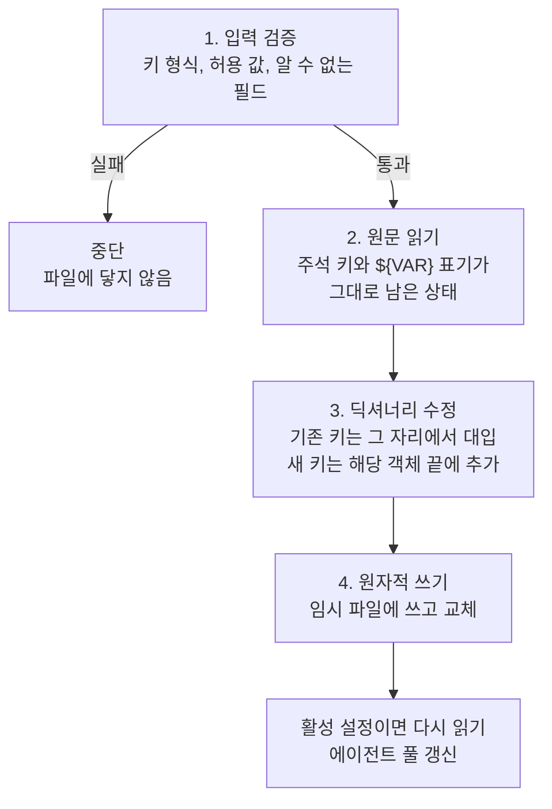

# 4-1. 설정을 읽고, 검증하고, 되쓰기

> 상위: [4강. 핵심 기술](README.md) · 다음: [4-2. LLM 연동](02-llm-integration.md)

대부분의 애플리케이션에서 설정 파일은 읽기 전용입니다. 사람이 편집기로 고치고, 앱은 기동할 때
읽기만 합니다. MADO는 다릅니다. 화면에서 에이전트를 추가하거나, 카드를 끌어 발언 순서를 바꾸거나,
MCP 서버를 끄면 그 결과를 설정 파일에 되씁니다. 설정 파일이 입력이면서 출력입니다. 이 절에서는
사람과 프로그램이 함께 고치는 설정 파일을 안전하게 다루는 방법을 봅니다.

---

## 1. 읽기 경로


### 주석을 데이터로 다루기

JSON에는 주석 문법이 없습니다. MADO는 **키가 `//`로 시작하면 설명**으로 봅니다.

```json
"// mcp_servers": "MCP 서버 연동 설정. fetch 는 외부망이 열린 곳에서만 켜세요.",
"mcp_servers": { ... }
```

읽을 때는 이런 키를 재귀적으로 걷어낸 뒤 검증합니다. 이 방식의 진짜 장점은 쓰기 쪽에서 드러납니다.
설명이 **데이터의 일부**이므로, 파일을 읽어서 딕셔너리를 고치고 다시 쓰는 것만으로 설명이 그대로
보존됩니다. 기록기가 주석을 지키려고 따로 애쓸 필요가 없습니다.

여러 줄 글도 같은 식으로 풉니다. 시스템 프롬프트 같은 긴 글은 문자열 배열로 적고, 읽을 때 줄바꿈으로
이어 붙입니다. `\n`이 박힌 한 줄짜리 문자열은 사람이 읽을 수 없기 때문입니다.

### 환경변수 치환

설정 값 안의 `${VAR}`, `${VAR:-기본값}`, `${A:-${B:-기본값}}`을 풀어 줍니다.

```text
"${APP_PORT:-${PORT:-8000}}"
   APP_PORT가 있으면 그 값
   없으면 ${PORT:-8000}을 다시 치환
   그것도 없으면 "8000"
```

이 치환기는 정규식이 아니라 직접 만든 작은 파서입니다. 정규식으로는 중첩된 중괄호의 짝을 셀 수
없기 때문입니다. 작은 문법이라도 중첩이 들어가면 정규식을 내려놓는 편이 안전합니다.

치환 결과가 빈 문자열이면 **"설정하지 않음"** 으로 봅니다. 에이전트마다 `"api_base": "${CODER_API_BASE}"`를
적어 두고, 이 변수를 정의하지 않았다고 해 봅시다. 빈 문자열을 그대로 값으로 받으면 전역 `llm.api_base`를
빈 값으로 덮어쓰게 됩니다. 검증 단계에서 공백뿐인 값을 없는 값으로 바꾸면, 그 에이전트는 자연스럽게
전역 값을 상속합니다.

### 상속 모델

```text
llm (전역 기본값)
 ├─ orchestrator: 적은 항목만 덮어씀
 ├─ architect:    적은 항목만 덮어씀
 └─ ...
```

에이전트는 자기에게 적힌 항목만 덮어쓰고 나머지는 전역 `llm`에서 받습니다. 사내 게이트웨이 주소를
바꿀 때 `.env`의 한 줄만 고치면 모든 에이전트가 따라오는 구조입니다. 이 구조는 뒤에 나올 "바꾼 값만
기록" 규칙과 짝을 이룹니다.

## 2. 쓰기 경로

모든 기록 작업이 같은 네 단계를 거칩니다.



### 원문을 읽어서 고친다

화면이 보여 주는 값은 **이미 환경변수가 풀린 값**입니다. 그 값을 그대로 파일에 쓰면 세 가지가 망가집니다.

1. `${OPENAI_API_KEY}`로 적혀 있던 자리에 실제 API 키가 평문으로 박힙니다.
2. 나중에 `.env`를 바꿔도 그 값은 더 이상 따라오지 않습니다.
3. 다른 PC에서 파일을 열면 원래 PC의 절대 경로가 들어 있습니다.

그래서 기록기는 검증된 설정 객체가 아니라 **파일의 원문**을 다시 읽어서 고칩니다. 화면에서 바꾼 항목만
원문에 반영하고, 나머지는 한 글자도 건드리지 않습니다.

### 원자적 쓰기

```python
# 개념 예시
text = json.dumps(data, ensure_ascii=False, indent=2) + "\n"
tmp.write_text(text, encoding="utf-8")
os.replace(tmp, path)   # 같은 볼륨 안에서 원자적으로 교체
```

파일에 직접 쓰다가 프로세스가 죽거나 디스크가 가득 차면 반쪽짜리 설정 파일이 남습니다. 그러면 다음
기동이 실패합니다. 임시 파일에 다 쓴 다음 교체하면, 파일은 "완전한 옛 내용"과 "완전한 새 내용" 둘 중
하나의 상태만 가집니다. 이 기법은 설정 파일뿐 아니라 `.env`의 토큰을 바꿀 때도 똑같이 씁니다.

### 바꾼 값만 기록한다

새 에이전트 추가 창은 전역 기본값으로 미리 채워져 뜹니다. 사용자는 이름과 역할만 바꾸고 저장합니다.
이때 폼에 있던 모든 값을 파일에 쓰면 어떻게 될까요? 모델, 주소, 온도 같은 값이 전부 이 에이전트에
박힙니다. 이후 전역 기본값을 바꿔도 이 에이전트만 따라오지 않습니다.

그래서 기록기는 제출된 값과 기본값을 비교해서 **같은 값은 빼고** 적습니다. 적히지 않은 항목은 계속
전역을 상속합니다. 미리 채운 폼은 편의를 위한 것이지, 사용자의 의사 표시가 아닙니다.

### 설명은 지우지 않는다

에이전트나 MCP 서버를 삭제해도 그에 딸린 `//` 설명 키는 남깁니다. 사람이 쓴 글을 지우면 되돌릴 수
없고, 같은 서버를 다시 추가할 때 그대로 쓸 수 있는 정보이기 때문입니다. 한편 "추가한 뒤 삭제하면
파일이 바이트 단위로 원래와 같아진다"는 성질은 테스트로 고정해 두었습니다. 기록기가 파일을 조금씩
오염시키지 않는다는 가장 확실한 증거입니다.

### 발언 순서에 10씩 간격을 둔다

카드를 끌어 발언 순서를 바꾸면 `debate_priority`를 10, 20, 30...으로 다시 매깁니다. 간격을 두면 나중에
한 명을 둘 사이에 끼워 넣을 때(예: 15) 나머지를 다시 쓰지 않아도 됩니다. 오래된 기법이지만 사람이
직접 파일을 고치는 설정에서는 여전히 유용합니다.

## 3. 형식을 TOML에서 JSON으로 바꾼 이유

처음 설정 형식은 TOML이었습니다. 주석과 여러 줄 문자열을 기본으로 지원하니 사람이 쓰기에는 JSON보다
낫습니다. 문제는 쓰기였습니다. 파이썬 표준 라이브러리에는 TOML을 읽는 모듈만 있고 쓰는 모듈이 없습니다.
결국 되쓰기 코드가 줄 단위 문자열 편집이 되었습니다.

| | TOML 시절 | JSON으로 바꾼 뒤 |
| :--- | :--- | :--- |
| 섹션 찾기 | 여러 줄 문자열 안인지 추적하며 줄 범위 계산 | 딕셔너리 키 접근 |
| 값 쓰기 | 값 종류마다 손으로 만든 직렬화 함수 | 표준 JSON 직렬화 |
| 주석 보존 | 줄을 건드리지 않는 방식으로 우회 | 데이터의 일부라 자동 |
| 위험 | 시스템 프롬프트 안의 `[검토 항목]` 줄을 섹션 헤더로 오인 | 없음 |
| 내부 도우미 함수 | 12개 | 5개 |

덤으로 얻은 것도 있습니다. JSON 문법 오류가 줄과 칸 번호와 함께 보고됩니다. 16KB짜리 설정 파일에서
"어딘가 잘못됐다"와 "4번째 줄 3번째 칸"의 차이는 큽니다.

잃은 것도 있습니다. 표준 JSON 직렬화로 다시 쓰면 사람이 읽기 좋게 넣어 둔 **빈 줄이 모두 사라집니다.**
JSON에는 빈 줄을 표현할 방법이 없으니 되살릴 수도 없습니다. 그래서 저장소의 설정 예시 파일은 프로그램이
아니라 사람이 직접 고칩니다. 앱이 되쓰는 실제 설정 파일은 들여쓰기 두 칸의 정돈된 모양으로 바뀌는 것을
감수합니다. 이 결정의 전체 맥락은 [ADR-013](../05-adr/ADR-013-json-config.md)에 있습니다.

## 4. 되쓰는 설정의 안전장치

### 지금 쓰고 있는 설정일 때만 다시 읽는다

한때 페르소나를 파일에 기록하는 함수가 끝에서 조건 없이 "방금 쓴 파일로 전역 설정을 다시 읽기"를
했습니다. 테스트가 임시 파일에 페르소나를 썼을 뿐인데 앱 전체의 설정이 그 임시 파일로 갈아끼워졌고,
이후 테스트들의 에이전트 풀과 MCP 서버 목록이 통째로 바뀌었습니다. 지금은 방금 쓴 파일이 **현재 앱이
쓰고 있는 설정 파일**일 때만 다시 읽습니다. 전역 상태를 바꾸는 부수 효과에는 항상 조건이 필요합니다.

### 모호한 입력은 거절한다

MCP 서버는 로컬 프로세스(`command`)이거나 원격 주소(`url`)입니다. 둘 다 적거나 둘 다 비우면 거절합니다.
조용히 한쪽을 고르면, 고치는 사람은 자기가 적은 값이 왜 무시되는지 알 수 없습니다. 이 규칙은 설정
모델과 기록기가 함께 지킵니다. 파일을 직접 고친 사람과 화면에서 넣은 사람이 같은 오류 메시지를
들어야 합니다.

### 편집에도 잠금이 있다

설정은 프로세스 전체가 공유합니다. 그래서 전역 설정 편집은 조건부로 열립니다.

| 편집 | 열리는 조건 | 이유 |
| :--- | :--- | :--- |
| 에이전트 추가·삭제·비활성 | 아무 대화도 토론 중이 아닐 때 | 에이전트 풀은 모든 대화가 공유합니다 |
| MCP 서버 추가·삭제·켜고 끄기 | 아무 대화도 토론 중이 아닐 때 | 편집하면 살아 있는 모든 런타임을 다시 띄웁니다. 토론 도중 도구를 잃으면 안 됩니다 |
| 대화 전용 설정(참여 여부, 전략, 라운드) | 그 대화가 토론 중이 아닐 때 | 그 대화에만 영향을 줍니다 |
| 작업 공간 | 언제든 | 토론 중에도 바꿀 수 있어야 합니다 |

화면의 로스터 패널이 "이 대화 설정"과 "전역 설정"을 시각적으로 나눠 둔 이유가 이 표입니다.

### 앱을 다시 띄우지 않고 다시 읽기

사람이 편집기로 설정 파일을 고쳤다면 화면의 "다시 읽기"로 반영할 수 있습니다. 새 설정을 끝까지
읽고 검증한 **뒤에야** 전역 설정을 갈아 끼우므로, 파일이 깨져 있으면 아무것도 바뀌지 않고 오류만
알립니다. 잘못된 파일 하나 때문에 돌아가던 구성이 무너지면 안 됩니다.

다시 읽은 결과 MCP 서버 구성까지 바뀌었다면 서버도 다시 띄웁니다. 그러지 않으면 화면은 새 설정을,
도구는 옛 서버를 가리킵니다. 에이전트만 바뀌었다면 서버는 건드리지 않습니다. 다시 띄우는 데 몇 초가
걸리고 얻는 것이 없기 때문입니다. 무엇이 늘고 줄었는지는 알림으로 보여 줍니다.

---

## 정리

- 설정 파일이 출력이기도 하다면, 기록기는 해석된 값이 아니라 원문을 고쳐야 합니다.
- 쓰기는 "검증 → 원문 읽기 → 딕셔너리 수정 → 원자적 교체"의 네 단계로 통일합니다.
- 미리 채운 기본값은 기록하지 않습니다. 사용자가 바꾼 값만 적어야 상속이 살아 있습니다.
- 주석을 데이터로 만들면 보존이 공짜가 됩니다. 대신 JSON 재직렬화는 빈 줄 같은 서식을 잃습니다.
- 모호한 설정은 조용히 해석하지 말고 거절합니다.

## 생각해 볼 문제

1. YAML을 골랐다면 어땠을까요? 주석과 여러 줄 문자열을 지원하지만, 되쓸 때 주석을 보존하려면 무엇이
   필요할까요?
2. 여러 사람이 동시에 화면에서 설정을 고친다면 지금의 원자적 쓰기만으로 충분할까요? 무엇이 더
   필요할까요?
3. "바꾼 값만 기록" 규칙에서, 사용자가 일부러 기본값과 같은 값을 **고정**하고 싶다면(전역이 바뀌어도
   이 에이전트는 이 값을 유지) 어떻게 표현할 수 있을까요?
