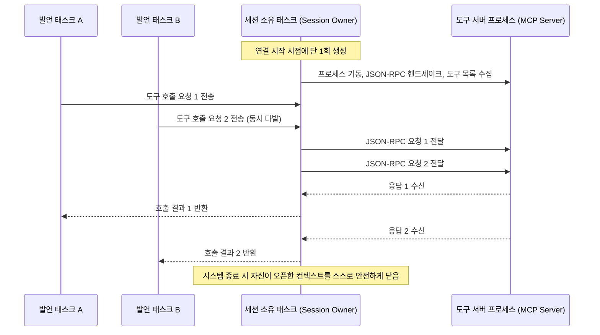

# 4-3. MCP 호스트 만들기

> 상위: [4강. 핵심 기술](README.md) · 이전: [4-2. LLM 연동](02-llm-integration.md) · 다음: [4-4. 오케스트레이션](04-orchestration.md)

MCP(Model Context Protocol) 생태계에는 3가지 핵심 역할이 존재합니다. **호스트(Host)**는 LLM 애플리케이션 자체이며, **클라이언트(Client)**는 호스트 내부에서 단일 도구 서버와의 1:1 연결을 전담하고, **서버(Server)**는 실제 도구 기능을 외부에 제공합니다. MADO는 이 구조에서 호스트 역할을 수행합니다. 다양한 도구 서버 프로세스를 직접 구동하고, 연결 상태를 유지하며, 에이전트별로 도구 사용 권한을 차등 배분하고, 모델의 호출 요청을 중계 실행하여 그 결과를 안전하게 전달합니다. 이번 절에서는 견고한 프로덕션 레벨의 MCP 호스트를 구축할 때 마주하게 되는 실무적 난제들과 그 해결 설계를 다룹니다.

---

## 1. 도구 카탈로그 수집과 권한 제어

호스트는 연결된 개별 MCP 도구 서버들로부터 사용 가능한 도구 목록을 조회하여 하나의 통합 카탈로그로 색인화합니다.

- **서버 네임스페이스 격리**: 서로 다른 도구 서버 간에 동일한 도구 명칭(예: 두 서버 모두 `write_file` 제공)이 충돌할 수 있습니다. 따라서 모든 도구 이름의 접두사에 서버 식별자를 부여하여 `filesystem__write_file`, `sandbox__execute_python_code`, `git__git_diff`와 같이 네임스페이스를 엄격히 분리합니다. 모델이 호출한 도구명만으로 어느 서버로 라우팅해야 할지 즉각 식별할 수 있습니다.
- **스키마 변환 및 출처 명시**: MCP 서버가 제공하는 원본 도구 스키마를 OpenAI 함수 호출 규격으로 변환하여 LiteLLM에 전달합니다. 이때 도구 설명문(Description) 서두에 `[서버명]` 태그를 자동으로 주입하여 모델이 해당 도구의 물리적 출처와 특성을 정확히 인지하도록 돕습니다.
- **선제적 권한 필터링 (Exposure-time Filtering)**: 에이전트 설정에는 허용된 MCP 서버 목록(`allowed_mcp_servers`)이 명시되어 있습니다. 호스트는 에이전트가 발언할 때 해당 에이전트에게 인가된 도구 스키마만을 선별하여 프롬프트 페이로드에 주입합니다. 권한이 없는 도구는 프롬프트에 아예 노출되지 않으므로, 모델은 인가되지 않은 도구의 존재 자체를 인지할 수 없습니다. 즉, 권한 검증을 실행 시점이 아니라 **도구 노출 시점**에 선제적으로 적용합니다.

## 2. 도구 세션의 장기 지속 (Long-lived Sessions)

### 호출마다 프로세스를 새로 띄우던 초기 방식의 한계

초기 구현에서는 도구를 호출할 때마다 매번 stdio 파이프를 열어 하위 프로세스를 실행하고, 1회 호출 완료 후 프로세스를 즉시 종료했습니다. 겉보기에는 정상 동작하는 것처럼 보였지만, 도구 서버가 프로세스 메모리에 유지해야 하는 런타임 상태가 호출 간에 전혀 보존되지 못하는 심각한 한계가 있었습니다.

특히 Python 샌드박스 서버의 핵심 기능은 네임스페이스별 IPython 커널에 변수와 데이터프레임 메모리를 유지하는 것입니다. 그러나 프로세스가 매 호출마다 새로 기동되다 보니, 서버는 "기존 네임스페이스를 재사용했다"고 응답하면서도 실제로는 메모리가 초기화된 빈 커널을 반환했습니다. 그 결과 동일한 네임스페이스에서 첫 번째 호출로 생성한 변수를 두 번째 호출에서 참조하려 할 때 즉시 `NameError`가 발생했습니다. 세션을 상시 유지하는 구조로 전환한 결과, 상태 보존이 완벽히 해결되었을 뿐만 아니라 5회의 파일 쓰기 작업 소요 시간이 기존 1.36초에서 0.02초로 98% 이상 대폭 단축되었습니다.

### 세션 소유권을 전담하는 단일 비동기 태스크

도구 세션을 장기 지속 상태로 유지하려면 비동기 라이브러리의 취소 범위(Cancel Scope) 특성을 깊이 이해해야 합니다. MCP Python SDK 내부의 AnyIO 취소 범위는 **해당 컨텍스트를 최초로 오픈한 비동기 태스크에 엄격하게 바인딩**됩니다. 만약 특정 태스크에서 오픈한 stdio 스트림 컨텍스트를 다른 태스크에서 종료하려 하면 런타임 오류가 발생합니다. 토론을 진행하던 태스크가 세션을 열어두고, 나중에 애플리케이션 종료 시점에 메인 수명주기 태스크가 이를 닫으려 할 때 이 문제가 발생합니다.



이를 해결하기 위해 **세션의 오픈과 클로즈를 전담하는 독립 비동기 태스크**를 도입했습니다. 토론을 수행하는 작업 태스크들은 세션 소유 태스크의 큐에 요청을 전달하기만 합니다. 다수의 에이전트가 동시에 도구를 호출하더라도 단일 지속 세션 위에서 안전하게 비동기 다중화(Multiplexing)가 이루어집니다.

### 물리적 단절 시의 1회 자동 재연결

서버 프로세스가 예기치 않게 종료되더라도 세션 소유 태스크 자체가 즉시 파괴되지는 않습니다. 따라서 스트림 계열의 저수준 I/O 예외를 감지하면 시스템은 "도구 프로세스가 비정상 종료되었다"고 판단합니다. 물리적 단절이 확인되면 다음 도구 호출 시점에 **단 1회에 한하여 프로세스를 다시 띄우고 재연결**을 시도합니다.

단, 정상 동작 중인 서버가 "도구 실행 실패"라는 비즈니스 에러 결과를 반환한 경우에는 절대로 자동 재시도하지 않습니다. Git 커밋이나 파일 수정처럼 부작용(Side-effect)을 유발하는 도구를 무분별하게 자동 재시도하면 중복 작업 사고가 발생하기 때문입니다. 자동 재시도는 "요청 메시지가 서버에 물리적으로 도달하지 못했음"이 확실할 때에만 안전합니다.

### 도구 실행 실패의 성공 은폐 결함 극복

초기 버전에서는 도구 실행 도중 에러가 발생했을 때 예외 문자열을 정상 결과 포맷으로 감싸서 에이전트에게 반환하는 결함이 있었습니다. 모델은 반환된 에러 문구를 읽고 대응할 수 있었기 때문에 기능상으로는 동작하는 것처럼 보였지만, 웹 화면과 데이터베이스에는 모든 도구 실행 상태가 "성공(초록색)"으로 기록되는 심각한 정보 왜곡이 발생했습니다. 실패가 감사 기록에서 완전히 은폐된 것입니다. 실행 상태 메타데이터는 모델뿐만 아니라 시스템 관리자를 위한 핵심 관측 데이터이므로, 실패한 호출은 반드시 `status: "error"`로 정직하게 영속화해야 합니다.

## 3. 프로세스 비정상 종료의 원인 가시화

사용자가 작성한 커스텀 도구 서버가 기동 도중 비정상 종료되면, 호스트 애플리케이션이 수신하는 예외는 대개 다음과 같은 무의미한 래퍼 예외뿐입니다.

```text
ExceptionGroup: unhandled errors in a TaskGroup
```

이 메시지만으로는 문제를 진단할 수 없습니다. 프로세스가 실패한 근본 원인(`ModuleNotFoundError`, `Cannot find module` 등)은 자식 프로세스의 **표준 오류(stderr) 스트림**에 기록되어 있기 때문입니다.

따라서 호스트는 모든 자식 프로세스의 표준 오류 스트림을 별도 비동기 파이프로 수집하며, 콘솔에 실시간 출력함과 동시에 **초기 4줄과 말미 8줄의 핵심 오류 로그를 인메모리 버퍼에 보존**합니다. 초기 라인에는 직접적인 실패 원인이, 말미 라인에는 예외 콜스택의 최종 지점이 담겨 있습니다. 이 요약 로그는 웹 UI 로스터 패널의 서버 상태 칩 툴팁에 실시간으로 표시되어 사용자가 브라우저 상에서 즉각적인 원인 분석을 수행할 수 있도록 지원합니다.

| 상태 칩 표시 | 아키텍처 의미 |
| :--- | :--- |
| **초록색 (`도구 N개`)** | 정상 연결 및 통신 완료. 현재 등록된 유효 도구 개수 표시 |
| **주황색 (연결 끊김)** | 프로세스 일시 종료 감지. 다음 호출 시 1회 자동 재연결 대기 상태 |
| **빨간색 (연결 실패)** | 기동 실패 또는 복구 불가능한 단절. 마우스 오버 시 표준 오류 요약 로그 제공 |
| **회색 (비활성)** | 사용자가 설정에서 의도적으로 비활성화한 상태 |

## 4. 단일 도구 서버의 시스템 점유 방어

| 자원 보호 상한 | 기본값 | 한도 초과 시 아키텍처 대응 |
| :--- | :--- | :--- |
| **단일 도구 호출 타임아웃** | 180초 | 호출을 포기하고 해당 세션을 강제로 닫은 후 재연결합니다. 늦게 도착한 지연 응답이 다음 호출의 결과와 뒤섞이는 패킷 오염을 방지하며, 모델에는 "도구가 응답하지 않았습니다"라는 관찰 결과를 반환합니다. |
| **도구 출력 크기 상한** | 20만 자 | 출력 텍스트의 시작과 끝부분만을 보존하고 중앙 영역을 요약 생략합니다. 수십 MB에 달하는 원시 출력을 그대로 수용할 경우 토큰 계산 파이프라인, 데이터베이스 트랜잭션, 웹 브라우저 렌더링 엔진이 연쇄적으로 다운되는 것을 방어합니다. |

타임아웃 상한이 부재하면 무한 루프에 빠진 스크립트나 터미널 입력을 대기하는 명령행 도구 하나가 전체 토론 턴을 영구적인 교착 상태(Deadlock)에 빠뜨릴 수 있습니다.

## 5. 데이터 격리 경계의 호스트 주도 강제

### 지식 그래프 서버의 세션 간 데이터 오염 문제

지식 그래프 도구 서버(`memory`)는 본래 프로세스 하나당 단일 그래프 데이터 파일을 점유하도록 설계되었습니다. 그러나 초기 버전에서는 모든 대화 세션이 단일 도구 서버 프로세스를 공유했습니다. 그 결과 서로 다른 대화 세션들이 동일한 지식 그래프 파일을 공유하게 되면서, A 대화에서 논의된 결정 사항이 전혀 무관한 B 대화의 에이전트에게 사실로 주입되는 심각한 데이터 오염이 발생했습니다.

### 해결책: 모든 도구 호출 메타데이터(`_meta`)에 세션 ID 강제 주입

어느 대화 세션에서 발생한 도구 호출인지를 가장 정확히 알고 있는 주체는 바로 호스트 애플리케이션입니다. 이를 모델에게 프롬프트 인자로 전달하게 하면, 모델이 인자 작성을 누락하거나 잘못된 ID를 전달하는 순간 다른 대화의 데이터가 오염됩니다.

따라서 호스트는 **모든 MCP JSON-RPC 요청의 메타데이터(`_meta`)에 현재 활성 대화 세션 ID를 강제로 삽입하여 전송**합니다. 도구 서버는 인자보다 메타데이터를 최우선으로 검증하므로 모델의 프롬프트 환각에 영향받지 않는 완벽한 격리가 보장됩니다.

| 시스템 상태 유형 | 호스트가 강제하는 격리 단위 | 격리 설계 배경 |
| :--- | :--- | :--- |
| **작업 공간 파일 시스템** | 모든 참여 에이전트 공통 공유 | 에이전트 간의 산출물 전달 경로이며 Git diff 및 파일 뷰어에 투명하게 반영되어야 합니다. |
| **지식 그래프 (Memory)** | **단일 대화 세션 단위 격리** | 해당 토론에 참여한 전문가들끼리만 합의된 사실을 공유해야 합니다. |
| **샌드박스 IPython 커널** | **세션 × 발언자 단위 격리** | 발언자 간의 보이지 않는 인메모리 전역 변수 오염을 방지합니다. |

지식 그래프 공식 서버는 세션 격리 기능을 지원하지 않았기 때문에, 공식 코드를 최소한으로 포크하여 요청 컨텍스트(Node.js의 `AsyncLocalStorage`)를 기반으로 세션 ID별 독립 그래프 파일을 다루도록 개선했습니다. 전역 변수 대신 비동기 컨텍스트 스토리지를 적용함으로써 여러 대화의 호출이 단일 Node 프로세스 내에서 교차 실행되더라도 상호 간섭이 발생하지 않도록 격리했습니다.

대체(폴백) 파일 경로 설계 역시 세심한 주의를 기울였습니다. 만약 세션 메타데이터 주입이 실패했을 때 공용 그래프 파일(`memory.json`)로 폴백하도록 구현하면, 초기 결함이었던 세션 간 기억 오염 문제가 조용히 재발하게 됩니다. 따라서 스코프가 누락된 비정상 호출은 `unscoped-<PID>.json`이라는 명확한 격리 파일로 분기시켜 즉각적인 모니터링이 가능하도록 방어했습니다. **대체 경로는 원래의 결함을 절대로 재현하지 않는 방향으로 설계되어야 합니다.**

### 세션 분기 시 지식 그래프의 안전한 복제

호스트가 세션 메타데이터를 기반으로 접근 경계를 철저히 통제하기 때문에, 모델은 프롬프트를 통해 이전 대화의 지식 그래프에 접근할 수 없습니다. 따라서 세션 이어받기(분기) 기능을 수행할 때, 호스트는 이전 대화의 지식 그래프 파일을 신규 대화의 세션 ID 파일로 **물리적 파일 복제(Copy)**하여 전달합니다. 원본 세션을 다시 열었을 때 당시의 지식 그래프 상태가 온전히 보존되어야 하기 때문입니다.

## 6. 작업 공간 단위의 독립 MCP 런타임 풀

### 프로세스 기동 시점에 고정되는 작업 디렉터리

MCP 도구 서버들은 자신이 접근할 파일 디렉터리 경로를 **프로세스 최초 기동 시점**에 커맨드라인 인자나 환경변수로 고정 수령합니다. 실행 중인 프로세스의 작업 디렉터리를 동적으로 변경할 수 있는 표준 방법은 없습니다.

과거에는 앱 전역에 단 하나의 MCP 매니저만 존재했기 때문에, 사용자가 작업 공간을 변경하면 기존 도구 서버 프로세스들을 종료하고 새 디렉터리로 재기동했습니다. 이로 인해 작업 공간이 서로 다른 두 개의 대화 세션을 동시에 실행할 수 없었으며, 시스템은 데이터 무결성을 위해 두 번째 토론 실행을 거절해야 했습니다([ADR-009](../05-adr/ADR-009-refuse-cross-workspace-debates.md)).

### 런타임 풀 (Runtime Pool) 아키텍처 도입

현재는 작업 공간 디렉터리마다 독립된 도구 서버 프로세스 그룹을 관리하는 **MCP 런타임 풀** 아키텍처를 적용하고 있습니다([ADR-016](../05-adr/ADR-016-per-workspace-mcp-runtime.md)).

- 동일한 작업 공간 디렉터리를 참조하는 대화 세션들은 단일 런타임 풀 인스턴스를 공유하며, 대화 간 격리는 메타데이터 스코프가 담당합니다.
- 물리적 디렉터리가 다른 대화 세션은 독립된 도구 서버 프로세스 그룹을 할당받아 완벽히 병렬 실행됩니다.
- 턴이 시작될 때 런타임을 대여하고, 턴이 종료되면 예외 발생 여부와 무관하게 즉시 반납합니다.
- 반납된 런타임은 지정된 유휴 시간(기본 300초) 동안 프로세스를 유지하여 후속 질의 시 콜드 스타트 지연을 방지합니다.

### 진정한 "런타임 격리"의 계층별 구분

| 시스템 계층 | 공유 여부 | 아키텍처 판단 근거 |
| :--- | :--- | :--- |
| **`node.exe`, `python.exe` 실행 바이너리** | 전체 프로세스 공유 | 실행 중 정적 코드를 읽기만 하므로 머신 레벨에서 공유해도 안전합니다. |
| **설치된 npm 모듈 및 Python 라이브러리** | 전체 프로세스 공유 | 읽기 전용 라이브러리 코드이므로 불필요하게 디렉터리를 복제할 필요가 없습니다. |
| **서버 프로세스 인스턴스 및 런타임 환경 (메모리, 작업 디렉터리, 임시 폴더, IPC 파이프)** | **작업 공간별 완전 격리** | 실제 데이터 오염과 자원 경합이 발생하는 계층이므로 철저히 분리 구동합니다. |

런타임 풀을 다중화하기 전에 선행되어야 할 작업은 **프로세스 전역 상태의 완전한 제거**였습니다. 초기 코드에서는 도구 서버에 작업 공간 경로를 전달하기 위해 메인 Python 프로세스의 전역 환경변수(`os.environ`)를 직접 변경하고 있었습니다. 런타임이 2개 이상 구동되는 순간 나중에 실행된 런타임이 앞선 런타임의 환경변수를 덮어써버리는 동시성 버그가 발생했습니다. 현재는 각 자식 프로세스를 생성할 때 해당 프로세스 전용 환경변수 딕셔너리를 독립 구성하여 주입함으로써 전역 상태 오염을 근절했습니다.

또한 Windows 환경에서 경로를 정규화할 때 간헐적으로 반환되는 확장 길이 경로(`\\?\C:\...`)가 파일 URI로 변환되면서 `file://?/C:/...`와 같은 잘못된 URL을 형성하여 도구 서버 기동이 실패하던 Windows 고유 결함도 접두사 제거 정규화를 통해 완벽히 해결했습니다.

## 7. 원격 MCP 서버 연동 지원

로컬 서브 프로세스 실행뿐만 아니라 사내 인프라에 이미 구동 중인 원격 도구 서버와의 네트워크 연동을 지원합니다.

- 로컬 명령어(`command`)와 원격 주소(`url`)는 상호 배타적이며, 둘 다 입력되거나 둘 다 누락된 설정은 엄격히 거절합니다.
- `transport: auto` 설정 시 최신 표준인 스트리밍 가능한 원격 HTTP(Streamable HTTP)를 먼저 시도하고, 구버전 호환을 위해 HTTP+SSE로 폴백 연결합니다.
- **이미 정상 연결되어 운용되던 세션이 네트워크 순단으로 단절된 경우에는 다른 전송 프로토콜로 전환하지 않습니다.** 이는 일시적인 네트워크 장애이지 서버 프로토콜의 규격 불일치가 아니기 때문입니다.
- 원격 서버 인증 토큰은 설정 파일에 `${환경변수}` 템플릿으로만 보존되어 설정 파일 공유 시에도 민감 정보가 안전하게 보호됩니다.

## 8. 호스트 레벨의 선제적 도구 호출 차단

호스트는 에이전트의 도구 호출을 수동적으로 중계하는 역할에 머무르지 않고, 시스템 무결성을 위해 필요한 경우 호출을 선제적으로 차단합니다.

대표적인 사례가 `.pptx`, `.xlsx`, `.docx`, `.pdf`와 같은 바이너리 및 오피스 파일 생성 시도입니다. 이러한 파일들은 내부적으로 압축된 바이너리 또는 XML 패키지 구조를 갖습니다. 모델이 순수 텍스트 파일 쓰기 도구를 활용해 이러한 확장자의 파일을 생성하면, 파일 쓰기 자체는 성공하지만 실제로는 열리지 않는 손상된 파일이 생성됩니다. 

따라서 호스트는 텍스트 파일 쓰기 도구 호출 시 파일 확장자를 사전에 검사하여, 바이너리 형식을 텍스트 도구로 작성하려는 시도를 **도구 서버에 도달하기 전에 즉시 차단**합니다. 그리고 모델에게 "해당 파일 포맷은 텍스트 도구로 직접 생성할 수 없으므로, Markdown 형식으로 작성하거나 전용 생성 도구를 활용하십시오"라는 안내를 관찰 결과(Observation)로 반환합니다. 발언은 실패하지 않으며, 모델은 가이드를 확인하고 올바른 형식으로 방향을 전환합니다.

---

## 핵심 요약

- 호스트는 도구 이름에 서버 네임스페이스를 부여하여 식별하고, 권한 제어는 프롬프트 페이로드 노출 시점에 선제적으로 수행합니다.
- 도구 프로세스 세션은 장기 지속 상태로 유지하며, 세션의 수명주기는 전용 비동기 태스크가 전담 통제합니다.
- 자식 프로세스의 표준 오류 로그를 실시간 캡처하여 비정상 종료 시의 근본 원인을 UI 툴팁에 가시화합니다.
- 호출 타임아웃과 출력 바이트 상한을 통해 단일 도구 서버의 장애가 전체 토론을 차단하지 못하도록 방어합니다.
- 세션 간 데이터 격리 경계는 호스트가 메타데이터(`_meta`)를 통해 강제하며, 작업 공간별 독립 런타임 풀을 통해 멀티 테넌시 병렬성을 보장합니다.

## 학습 점검 과제

1. 도구 권한 검증을 "프롬프트 노출 시점"에만 수행하고 "실제 실행 라운드 시점"에는 별도로 재검증하지 않을 경우, 모델의 응답에 타 도구 문법이 누출되거나 모델이 임의로 비인가 도구명을 추측하여 호출했을 때 발생할 수 있는 보안 취약점은 무엇일까요?
2. 특정 대화 세션의 지식 그래프를 단일 세션에만 가두지 않고, 사용자가 지정한 "프로젝트 그룹" 단위로 여러 대화 세션이 함께 공유하도록 정책을 확장하고자 한다면, 메타데이터 스코프 주입 파이프라인을 어떻게 수정해야 할지 설계해 보십시오.
3. 런타임 풀의 동시 유지 상한(`MCP_MAX_RUNTIMES`)에 도달했을 때, 신규 요청을 거절하는 대신 "가장 오랫동안 사용된 활성 런타임"을 강제로 회수하여 신규 세션에 할당하는 방식을 취한다면 시스템에 어떠한 연쇄 장애가 유발될지 분석해 보십시오.
