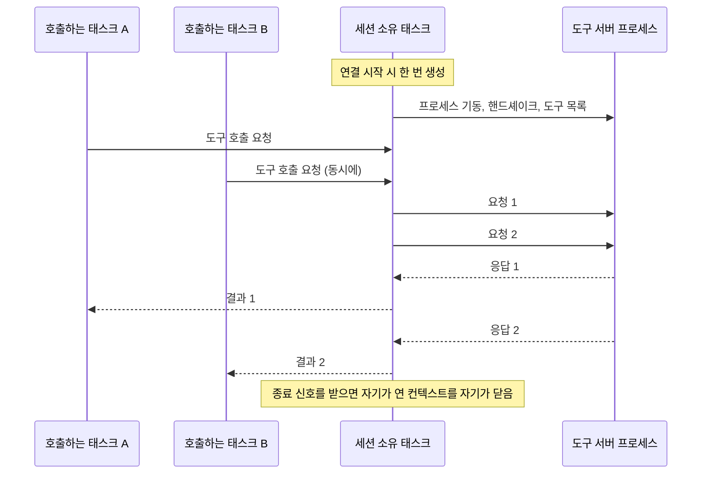

# 4-3. MCP 호스트 만들기

> 상위: [4강. 핵심 기술](README.md) · 이전: [4-2. LLM 연동](02-llm-integration.md) · 다음: [4-4. 오케스트레이션](04-orchestration.md)

MCP(Model Context Protocol)에는 세 역할이 있습니다. **호스트**는 LLM 애플리케이션 자체이고, **클라이언트**는
호스트 안에서 도구 서버 하나와의 연결을 맡으며, **서버**는 도구를 제공합니다. MADO는 호스트입니다.
도구 서버를 띄우고, 연결을 유지하고, 에이전트에게 도구를 나눠 주고, 호출을 실행하고, 결과를 모델에게
돌려줍니다. 이 절에서는 호스트를 만들 때 부딪히는 문제들을 봅니다. 대부분은 MCP 규격 자체보다 "다른
프로세스와 오래 대화하기"의 문제입니다.

---

## 1. 도구 발견과 권한

호스트는 연결한 서버마다 도구 목록을 받아 하나의 색인으로 합칩니다.

**이름공간.** 서버가 여럿이면 같은 이름의 도구가 생깁니다(예: 두 서버에 모두 `write_file`). 그래서
모든 도구 이름 앞에 서버 이름을 붙입니다. `filesystem__write_file`, `sandbox__execute_python_code`,
`git__git_diff`처럼요. 모델이 부르는 이름에서 서버를 바로 알 수 있으니 실행할 곳을 찾기도 쉽습니다.

**형식 변환.** MCP 서버가 알려 주는 도구 스키마를 OpenAI 함수 호출 형식으로 바꿔 LiteLLM에 넘깁니다.
설명 앞에는 `[서버이름]`을 붙여 모델이 도구의 출처를 알게 합니다.

**권한 필터.** 에이전트마다 `allowed_mcp_servers` 목록이 있고, 호스트는 발언할 때 그 목록에 있는 서버의
도구만 모델에게 보냅니다. 모델은 목록에 없는 도구의 존재 자체를 모릅니다. 권한 검사를 실행 시점이
아니라 **노출 시점**에 하는 셈입니다.

## 2. 세션은 오래 유지한다

### 호출마다 서버를 띄우던 시절

첫 구현은 도구를 호출할 때마다 stdio 연결을 새로 열었습니다. 즉 호출 한 번에 서버 프로세스를 띄우고,
호출하고, 죽였습니다. 겉보기에는 잘 돌았지만 서버가 들고 있는 상태가 호출 사이에 전혀 남지 않았습니다.

샌드박스 서버의 핵심 기능은 네임스페이스별 파이썬 커널에 변수와 데이터프레임을 유지하는 것입니다.
그런데 프로세스가 매번 새로 떴기 때문에, 서버는 "네임스페이스를 재사용한다"고 응답하면서 실제로는 빈
커널을 돌려주었습니다. 같은 네임스페이스로 두 번 호출하면 두 번째에서 `NameError`가 났습니다. 파일 쓰기
다섯 번에 1.36초가 걸리던 것이, 세션을 유지하게 바꾸자 0.02초가 되었습니다.

### 세션을 소유하는 전용 태스크

세션을 오래 유지하려면 한 가지 함정을 피해야 합니다. MCP SDK가 쓰는 anyio의 취소 범위(cancel scope)는
**그것을 연 태스크에 묶여 있습니다.** 한 태스크에서 연 stdio 컨텍스트를 다른 태스크에서 닫으면 런타임
오류가 납니다. 토론 태스크가 연결을 열고, 종료 시점에 앱의 수명 관리 코드가 닫는 구조라면 바로 이
오류가 납니다.



세션을 여는 일과 닫는 일을 **전용 태스크 하나**가 맡습니다. 호출하는 쪽은 그 세션에 요청만 넣습니다.
여러 태스크가 동시에 호출해도 하나의 세션 위에서 다중화됩니다.

### 끊기면 한 번 다시 붙는다

프로세스가 죽었다고 소유 태스크가 곧바로 끝나지는 않습니다. 그래서 스트림 계열 예외를 "서버가 죽었다"는
신호로 판단합니다. 끊긴 것이 확인되면 다음 호출에서 **한 번** 다시 연결하고, 성공하면 호출을 진행합니다.

살아 있는 서버가 "도구 실행에 실패했다"고 답한 경우는 다시 시도하지 않습니다. 파일 덧붙이기나 git 커밋처럼
부작용이 있는 도구를 자동으로 재시도하면 같은 일이 두 번 일어납니다. 재시도는 "요청이 서버에 닿지
못했다"가 확실할 때만 안전합니다.

### 초기의 또 다른 버그: 실패를 성공으로 포장하기

같은 시기에 고친 버그가 하나 더 있습니다. 도구 실행이 실패하면 오류 문자열을 "성공" 상태로 감싸서
에이전트에게 넘기고 있었습니다. 모델은 오류 문구를 읽을 수 있으니 기능상 큰 차이가 없어 보이지만,
화면과 DB의 상태 표시는 모두 초록색이었습니다. 실패가 기록에서 사라진 것입니다. 상태 값은 모델이 아니라
사람을 위한 정보이고, 사람을 속이면 안 됩니다.

## 3. 서버가 죽은 이유를 사람에게 보여 주기

사용자 정의 MCP 서버가 기동 중에 죽으면, 호스트가 받는 예외는 대개 이런 모양입니다.

```text
ExceptionGroup: unhandled errors in a TaskGroup
```

진단 가치가 전혀 없습니다. 진짜 원인(`ModuleNotFoundError: No module named 'xyz'`, `Cannot find module ...`)은
자식 프로세스가 **표준 오류**에 써 놓았습니다. 그래서 호스트는 자식의 표준 오류를 별도 파이프로 받아,
백그라운드 스레드가 그 내용을 앱 콘솔로 그대로 흘려보내면서 **앞의 4줄과 뒤의 8줄**을 보관합니다. 앞줄에는
대개 직접적인 실패 문구가, 뒷줄에는 스택 추적의 뿌리가 있습니다. 이 요약이 로스터 패널의 서버 상태 칩
툴팁에 뜹니다.

| 상태 칩 | 의미 |
| :--- | :--- |
| 초록, `도구 14` | 연결됨. 등록된 도구 수 |
| 주황, 연결 끊김 | 프로세스 종료. 다음 호출에서 자동 재연결 |
| 빨강, 연결 실패 | 기동 실패. 마우스를 올리면 표준 오류 요약 |
| 회색, 비활성 | 설정에서 꺼 둠 |

## 4. 한 서버가 토론 전체를 붙잡지 못하게

| 상한 | 기본값 | 넘으면 |
| :--- | :--- | :--- |
| 도구 호출 시간 | 180초 | 호출을 포기하고, 세션을 닫았다가 다시 엽니다. 늦게 도착한 응답이 다음 호출의 답으로 섞이면 안 되기 때문입니다. 모델에게는 "도구가 응답하지 않았다"고 알립니다 |
| 도구 결과 크기 | 20만 자 | 앞과 뒤를 남기고 가운데를 생략합니다. 서버는 실제로 수십 MB를 돌려주기도 하고, 그걸 그대로 넘기면 토큰 계산, DB 기록, 브라우저가 차례로 무너집니다 |

시간 상한이 없으면 응답하지 않는 서버 하나(무한 루프 스크립트, 끊어진 원격 서버, 표준 입력을 기다리는
명령행 도구)가 턴을 영원히 붙잡습니다. 그 상태에서는 취소 신호도 멈춰 있는 코루틴에 닿지 않습니다.

## 5. 격리의 경계는 호스트가 정한다

### 문제: 다음 대화가 이전 대화의 기억을 읽었다

지식 그래프 서버(memory)는 원래 **프로세스 하나에 그래프 파일 하나**를 씁니다. 그런데 도구 서버 프로세스는
모든 대화가 함께 씁니다. 격리의 단위가 규격이 아니라 전송 계층의 성질(프로세스 수명)에 얹혀 있었던
것이고, 결과는 이 서버를 둔 목적과 정반대였습니다. 긴 토론에서 컨텍스트가 잘려도 결정이 남게 하려고 둔
기억이, 다른 대화의 결정을 섞어 넣고 있었습니다.

### 해결: 모든 호출에 대화 ID를 싣는다

어느 대화의 호출인지는 호스트가 압니다. 이것을 도구 인자로 두고 모델에게 넘기게 하면, 모델이 한 번
잊는 순간 남의 대화에 씁니다. 바로 고치려던 증상입니다. 그래서 호스트가 **MCP 요청의 메타데이터
(`_meta`)** 에 대화 ID를 싣습니다. 서버마다 찾는 키 이름이 달라 몇 가지 이름으로 함께 보냅니다.

서버마다 경계가 다르고, 그 정책은 호스트의 한 곳에서 정합니다.

| 상태 | 경계 | 이유 |
| :--- | :--- | :--- |
| 작업 공간 폴더 | 모두 공유 | 에이전트 사이의 인계 채널입니다. 파일 도구, git diff, 산출물 뷰어에서 보입니다 |
| 지식 그래프 | 대화 | 합의된 사실은 그 토론의 참가자 모두가 함께 봅니다 |
| 샌드박스 커널 | 대화 × 발언자 | 커널 변수는 어디에도 기록되지 않습니다 (3-1 정적 뷰의 격리 경계 참고) |

샌드박스 서버는 원래부터 요청 메타데이터를 인자보다 먼저 보도록 만들어져 있었습니다. 다만 아무도
메타데이터를 보내지 않아서 그 경로가 한 번도 실행된 적이 없었을 뿐입니다.

### 공식 서버를 조금 고친 포크

지식 그래프 서버는 공식 서버를 포크해서 세 군데만 고쳤습니다. 도구 처리 함수 아홉 개는 원본 그대로 두고,
도구 등록 부분을 감싸서 (1) 모든 도구에 그래프 ID를 받을 수 있게 하고, (2) 처리 함수를 그 요청의 그래프
컨텍스트 안에서 실행합니다. 원본 코드를 최대한 건드리지 않은 것은 공식 서버의 새 버전을 다시 따라잡기
쉽게 하려는 것입니다.

요청마다 전역 변수를 갈아끼우지 않고 요청 단위 컨텍스트(Node의 AsyncLocalStorage)를 쓴 데도 이유가
있습니다. 두 대화의 호출이 `await` 지점에서 서로 교차하면, 전역 변수 방식에서는 한 대화가 다른 대화의
그래프에 씁니다.

그래프를 고르는 우선순위는 이렇습니다.

| 순위 | 출처 | 비고 |
| :--- | :--- | :--- |
| 1 | 요청 메타데이터 | 이 앱이 보내는 값 |
| 2 | 도구 인자의 그래프 ID | 메타데이터를 보내지 않는 다른 MCP 클라이언트를 위한 것. 메타데이터를 이길 수 없습니다 |
| 3 | `unscoped-<프로세스 번호>` | 경고와 함께 쓰는 대비책 |

3순위를 **공용 그래프로 두지 않은 데**에는 이유가 있습니다. 스코프 주입이 깨졌을 때 공용 그래프로 떨어지면,
원래의 버그(대화끼리 서로의 기억을 읽음)가 조용히 되살아납니다. 대신 `unscoped-...` 파일이 생기면 그것이
눈에 보이는 증상이 됩니다. **대비책은 원래 버그를 재현하지 않는 쪽으로 설계해야 합니다.**

### 경계를 옮기는 것도 호스트의 일

이 설계에는 부작용이 있습니다. 모델이 인자로 다른 대화의 그래프 ID를 적어도 호스트가 보낸 메타데이터가
이기므로, **어떤 프롬프트로도 이전 대화의 그래프에 닿을 수 없습니다.** 긴 대화를 새 대화로 이어받을 때
"이전 기억을 참고하라"고 해도 소용이 없습니다. 호스트가 경계를 정했으니 옮기는 것도 호스트가 해야
합니다. 이어받기 기능은 호스트가 이전 대화의 그래프 파일을 새 대화 ID로 **복사**합니다. 옮기지 않고
복사하는 이유는 원래 대화를 다시 열었을 때 그 기억이 그대로 있어야 하기 때문입니다.

## 6. 작업 공간마다 런타임을 따로

### 기동 시점에 고정되는 것

MCP 서버는 자기가 볼 폴더를 **기동할 때** 받습니다. 파일 시스템 서버는 명령행 인자로, git 서버는 저장소
경로 인자로, 샌드박스는 환경변수로 받습니다. 실행 중인 서버에게 다른 폴더를 보게 할 방법은 없습니다.

처음에는 앱 전체에 MCP 매니저가 하나뿐이었습니다. 대화별로 작업 공간을 바꿀 수 있게 하면서, 작업 공간을
바꾸면 서버들을 다시 띄웠습니다. 그러자 작업 공간이 다른 두 대화를 동시에 돌릴 수 없게 되었습니다. 나중에
시작한 토론이 서버를 다시 띄우면 앞선 토론의 도구가 남의 폴더를 읽고 쓰게 되기 때문입니다. 그래서 두 번째
토론을 **거절**했습니다([ADR-009](../05-adr/ADR-009-refuse-cross-workspace-debates.md)).

### 런타임 풀

지금은 작업 공간마다 매니저를 하나씩 두는 풀이 있습니다([ADR-016](../05-adr/ADR-016-per-workspace-mcp-runtime.md)).

- 같은 폴더를 쓰는 대화는 서버 묶음을 함께 씁니다. 파일을 이미 공유하는 사이이고, 대화 사이의 격리는
  5절의 메타데이터 스코프가 맡습니다.
- 다른 폴더를 쓰면 서버 묶음이 따로 뜹니다.
- 턴은 시작할 때 빌리고, 어떻게 끝나든 반납합니다.
- 반납된 묶음은 유휴 시간 동안 살려 두고, 전체 묶음 수에는 상한이 있습니다.

키가 대화가 아니라 **작업 공간**인 이유가 있습니다. 같은 폴더를 쓰는 대화에 프로세스를 따로 주면
아무것도 격리하지 못하면서 프로세스 수만 대화 수만큼 늘어납니다. 대화 하나를 완전히 격리하고 싶으면 그
대화에 전용 폴더를 지정하면 됩니다.

### "Node 런타임 격리"가 뜻하는 것

"대화마다 MCP와 Node 런타임을 격리하라"는 말은 Node를 여러 벌 설치하라는 뜻으로 들리기 쉽습니다. 실제로는
계층마다 다릅니다.

| 계층 | 공유 또는 격리 | 이유 |
| :--- | :--- | :--- |
| `node.exe`, `python.exe` 실행 파일 | 공유 | 실행 중에 읽기만 합니다. 복사해도 얻는 것이 없습니다 |
| 설치된 Node 패키지, 샌드박스 코드 | 공유 | 역시 실행 중 읽기 전용입니다 |
| **서버 프로세스와 그 환경** (메모리, 작업 디렉터리, 임시 폴더, 볼 폴더, 기억 파일 위치, 커널) | **격리** | 대화 사이에 실제로 새던 것은 이 계층이었습니다 |

런타임마다 자기 환경변수를 얹어 서버를 띄웁니다. 볼 폴더, 작업 공간 안의 전용 임시 폴더, npm 캐시 위치,
그리고 전체 커널 예산을 런타임 수로 나눈 값이 들어갑니다. 반대로 사용자 홈 디렉터리는 일부러 건드리지
않습니다. git 설정과 파이썬 사용자 패키지가 거기 있어서, 옮기면 격리가 아니라 고장이 납니다.

### 여럿을 두기 전에 전역 상태부터 없앴다

매니저를 둘 이상 두려면 먼저 **서로의 상태를 덮어쓰지 않아야** 합니다. 두 군데가 문제였습니다.

- 작업 공간 경로를 서버 설정에 적용하는 함수가, 자식 프로세스에 물려주려고 **프로세스 전역 환경변수를
  직접 바꾸고** 있었습니다. 런타임이 둘이면 마지막으로 부른 쪽이 나머지의 경로를 덮습니다. 이제는
  치환기에 덮어쓸 값을 따로 넘기고, 각 서버의 환경에 명시적으로 적습니다.
- 서버가 "내가 볼 수 있는 폴더(Roots)"를 물을 때 답하는 콜백도 같은 전역 값을 읽고 있었습니다. 이제는
  연결마다 따로 묶습니다.

작업 공간 경로를 다시 적용할 때는 **치환하기 전의 원래 설정**을 새 경로로 다시 치환합니다. 이미 치환된
명령행 인자에서 경로 문자열을 찾아 바꾸는 방식보다 정확합니다. 같은 치환기를 한 번 더 돌리는 것이니까요.

### 도중에 찾은 Windows 버그

이 작업 중에 원래부터 있던 버그가 하나 드러났습니다. Windows에서 경로를 정규화하면, 특히 아직 없는 폴더에
대해 확장 길이 경로(`\\?\C:\...`)가 나올 수 있습니다. 이걸 URI로 바꾸면 `file://?/C:/...`가 되고, 서버는
잘못된 URL이라며 거절합니다. 파일 시스템 서버는 허용 폴더가 하나도 없는 채로 떴고, 남은 흔적은 "초기
Roots 요청 실패" 로그 한 줄뿐이었습니다. 이제 URI로 바꾸기 전에 접두사를 걷어냅니다.

## 7. 원격 MCP 서버

로컬 프로세스만 다루던 호스트에 주소로 붙는 서버를 더했습니다. SDK에 이미 두 전송 방식이 들어 있었고
쓰지 않았을 뿐입니다.

- `command`와 `url`은 함께 쓸 수 없습니다. 둘 다 적거나 둘 다 비우면 거절합니다(4-1 참고).
- `transport: auto`는 Streamable HTTP로 먼저 붙어 보고, 안 되면 옛 HTTP+SSE로 한 번 더 시도합니다. 두
  규격이 같은 주소를 쓰는 일이 흔해서 붙어 보기 전에는 알 수 없습니다. 설정에 규격을 못 박으면 이 왕복을
  건너뜁니다.
- **한 번 붙었던 세션이 나중에 끊겼다면 다른 규격으로 갈아타지 않습니다.** 그건 서버가 죽은 것이지 규격이
  틀린 것이 아닙니다.
- 인증 토큰은 설정 파일에 `${환경변수}` 표기로만 남고, 읽을 때만 풀립니다. 설정 파일은 화면에서 서버를
  켜고 끌 때마다 다시 쓰이고 배포 패키지에도 담기지만 `.env`는 그렇지 않습니다.

화면에는 버튼을 따로 만들지 않았습니다. 기존 "서버 추가" 창에서 로컬과 원격을 고르면 필요한 칸이
바뀝니다. 사람이 먼저 생각하는 것은 "MCP 서버를 하나 붙이겠다"이지 "그게 HTTP다"가 아니기 때문입니다.

## 8. 호스트가 도구 호출을 막는 경우

호스트는 도구 호출을 그대로 전달하기만 하지 않습니다. 가장 최근에 더한 규칙이 좋은 예입니다.

`.pptx`, `.xlsx`, `.docx`, `.pdf`는 XML을 담은 ZIP 파일이거나 바이너리입니다. 모델이 텍스트 파일 쓰기
도구로 이런 파일을 만들면, 도구는 성공을 보고하지만 열리지 않는 파일이 생깁니다. 모델 크기와 무관한 형식
문제입니다. 그래서 호스트가 이런 호출을 **서버에 닿기 전에** 거절하고, 그 형식을 만들 수 있는 도구가
붙어 있으면 그 이름을, 없으면 "마크다운으로 쓰고 그 형식은 만들지 못했다고 알리라"는 문구를 관찰 결과로
돌려줍니다.

거절도 결국 관찰 결과입니다. 발언은 끝나지 않고, 모델은 그 안내를 읽고 다른 길을 찾습니다.

---

## 정리

- 호스트는 도구 이름에 서버 이름공간을 붙이고, 권한은 도구를 모델에게 노출하는 시점에 적용합니다.
- 세션은 오래 유지하고, 세션을 여닫는 일은 전용 태스크 하나가 맡습니다. 재연결은 끊긴 경우에 한 번만 합니다.
- 서버가 죽은 이유는 표준 오류에 있습니다. 앞뒤 줄을 보관해 사람에게 보여 줍니다.
- 시간과 크기 상한으로 서버 하나가 토론 전체를 붙잡지 못하게 합니다.
- 격리 경계는 호스트가 메타데이터로 정하고, 대비책은 원래 버그를 재현하지 않게 설계합니다.
- 기동 시점에 고정되는 바인딩이 있다면 그 단위(작업 공간)로 프로세스를 나누고, 그 전에 전역 상태부터 없앱니다.

## 생각해 볼 문제

1. 권한 검사를 노출 시점에만 하고 실행 시점에는 하지 않는다면, 어떤 경우에 뚫릴 수 있을까요?
   (힌트: 새어 나온 도구 호출, 이름이 비슷한 도구)
2. 지식 그래프를 대화 단위가 아니라 "프로젝트" 단위로 공유하고 싶다면, 스코프 정책의 어디를 바꾸면
   될까요? 모델에게 그 선택을 맡기면 안 되는 이유는요?
3. 런타임 상한에 닿았을 때 거절하는 대신 가장 오래된 사용 중 런타임을 빼앗는다면 무슨 일이 생길까요?
