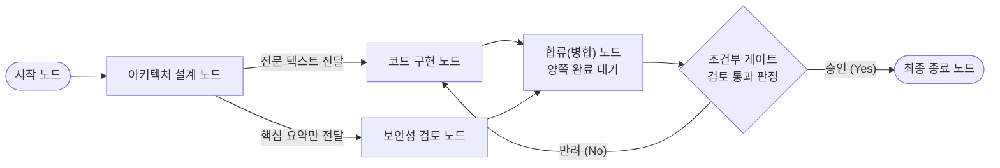
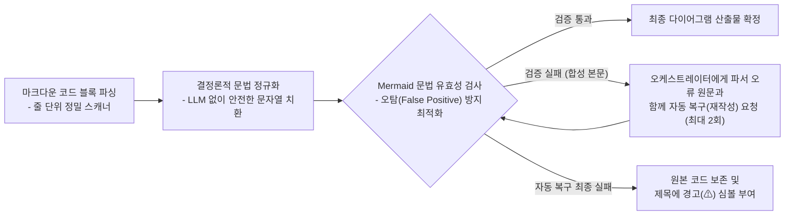

# 4-4. 토론을 조율하는 엔진

> 상위: [4강. 핵심 기술](README.md) · 이전: [4-3. MCP 호스트](03-mcp-host.md) · 다음: [4-5. 대화 기억](05-context-memory.md)

오케스트레이션 엔진은 단일 턴의 엔드투엔드 라이프사이클을 총괄하는 핵심 컨트롤러입니다. 사용자 요청을 바탕으로 계획을 수립하고, 토론 라운드를 제어하며, 최종 결론을 합성하고 다이어그램과 코드를 포함한 산출물을 추출합니다. 단일 턴의 전체 흐름은 [3-2. 동적 뷰](../03-architecture/02-dynamic-view.md)에서 다루었으므로, 이번 절에서는 엔진을 설계할 때 적용된 핵심 아키텍처 패턴들에 집중합니다. 토론 전략을 순수한 비즈니스 객체로 분리하는 방법, 순차 실행과 동시 병렬 실행 및 DAG 그래프 실행을 단일 엔진에 유기적으로 통합하는 방법, 그리고 신뢰성이 낮은 LLM의 출력을 검증 가능한 정형 산출물로 가공하는 기법을 살펴봅니다.

---

## 1. 커스텀 비동기 상태 머신 엔진의 도입 배경

프로젝트 기획 단계에서는 LangGraph와 같은 기성 프레임워크 도입과 "경량 커스텀 비동기 상태 머신"의 자체 구축이 모두 검토되었으며, MADO는 후자를 최종 선택했습니다. 엔진은 "계획 수립(Planning) → 토론 진행(Debating) → 결과 합성(Synthesizing)"의 상태를 갖는 비동기 상태 머신이며, 모든 상태 전이와 이벤트 발행을 명시적인 비즈니스 코드로 제어합니다.

이러한 자체 엔진 구축 선택을 통해 다음과 같은 명확한 아키텍처 이점을 확보했습니다.

| 분석 관점 | 자체 상태 머신 구축을 통해 얻은 효과 |
| :--- | :--- |
| **외부 의존성 최소화** | 외부 그래프 프레임워크를 배제함으로써 폐쇄망에 반입해야 하는 서드파티 패키지와 숨은 C 확장 의존성을 대폭 절감했습니다. |
| **정밀한 영속화 통제** | 발언 단위로 언제 데이터베이스에 트랜잭션을 커밋하고, 언제 WebSocket 이벤트를 발행하며, 언제 커밋을 보류할지(예: 턴이 완결된 후에만 커밋하는 결정 장부)를 엔진이 완벽히 통제할 수 있습니다. |
| **세밀한 사용자 개입 지점** | 발언과 발언 사이의 유휴 간격에서 정지 명령, 개입 메모, 도구 예산 연장 승인 큐를 확인하는 제어 지점을 자유롭게 배치할 수 있습니다. |
| **감수한 개발 비용** | 체크포인트 복원, 시각화 등의 기능을 필요에 따라 직접 구현해야 했습니다. 실제로 그래프 토론의 런타임 진행 상태 표시는 발언 이력 로그로부터 역산하는 경량 알고리즘으로 직접 구현했습니다. |

엔진이 다섯 전략과 그래프 토론까지 자란 뒤 이 판단을 다시 검토했고, 결론은 같았습니다. LangChain·LangGraph와의 개념 대응, 의미가 다른 세 지점, 전환 비용은 [ADR-023](../05-adr/ADR-023-keep-litellm-and-own-engine.md)에 정리했습니다.

엔진 구축에서 가장 까다로운 핵심은 단순히 "노드와 엣지를 어떻게 메모리에 표현하는가"가 아니라, "런타임 실패, 사용자의 실시간 개입, 비동기 영속화의 정합성을 어떻게 통제하는가"에 있었습니다.

## 2. 토론 전략의 순수 객체화 (Pure Strategy Pattern)

### 전략이 결정하는 책임의 범위

토론 전략(Strategy) 객체는 라운드마다 2가지 핵심 질문에만 답합니다. 첫째, **"이번 라운드에 누가, 어떤 순서로 발언하는가"**, 둘째, **"각 발언자에게 어떠한 프롬프트 지침을 부여하는가"**입니다. 모델이 구체적으로 무엇을 주장할지는 전략이 결정하지 않으며, 이는 에이전트 고유의 페르소나와 축적된 대화 기억에 위임됩니다. 병렬 지시 전략의 경우 "발언자들을 한 명씩 순차로 실행할 것인가, 동시에 병렬로 기동할 것인가"라는 동시성 정책을 추가로 결정합니다.

오케스트레이터 에이전트는 어떠한 토론 전략에서도 일반 라운드의 발언자로 직접 참여하지 않습니다. 라운드 개시 전에 전체 계획을 세우고, 모든 라운드가 종료된 후에 최종 결과를 합성하는 상위 조율자 역할을 수행합니다.

### 발언 순서와 진영의 에이전트 속성 내재화

초기 구현에서는 발언 순서가 전략 모듈 코드 내부에 `{"architect": 0, "coder": 1, "critic": 2}`와 같이 딕셔너리로 하드코딩되어 있었습니다. 웹 UI에서 사용자가 자유롭게 신규 에이전트를 추가할 수 있게 되면서 이러한 방식은 즉시 한계에 부딪혔습니다. 하드코딩 딕셔너리에 정의되지 않은 신규 에이전트 키는 우선순위 판별이 불가능하여 항상 토론 순서의 맨 뒤로 밀려났고, 디베이트 전략에서는 제안자도 비판자도 아닌 "기타"로 분류되어 겉도는 문제가 발생했습니다.

현재는 발언 순서와 토론 진영이 에이전트의 1급 속성(Attribute)으로 관리됩니다.

| 에이전트 속성 키 | 의미 및 동작 규칙 | 사용자가 변경하는 경로 |
| :--- | :--- | :--- |
| `debate_priority` | 라운드 내 발언 순서 인덱스 (낮을수록 선순위 발언, 동일한 경우 설정 파일 정의 순서) | 웹 UI 로스터 패널에서 에이전트 카드를 드래그 앤 드롭 |
| `debate_stance` | 토론 참여 진영 (제안: `proponent`, 비판: `critic`, 중립: `neutral`) | 에이전트 카드의 우측 옵션 메뉴 |

이제 전략 코드 내부에는 시스템 앵커인 `orchestrator` 키 외에는 특정 에이전트 키가 일체 하드코딩되어 있지 않습니다. 신규 전략을 추가할 때도 **에이전트 고유 식별자 키로 하드코딩 분기하지 말고 에이전트가 가진 메타데이터 속성을 조회하여 결정**해야 합니다. 에이전트 키는 사용자가 언제든 바꿀 수 있는 동적 데이터이기 때문입니다.

### 순차 토론으로의 전략 통합 배경

발언 순서를 우선순위 속성으로 내재화한 결과, 과거에 분리되어 있던 "자유 토론"과 "순차 검증" 전략이 사실상 동일한 발언자를 동일한 순서로 호출하고 있음을 확인했습니다. 유일한 차이는 프롬프트 지침뿐이었습니다. 명칭과 달리 자유 토론 역시 정해진 순서대로 돌아가는 구조였으므로 두 전략을 "순차 토론(Sequential)" 하나로 과감히 통합했습니다.

이때 순차 검증 전략의 핵심 지침이었던 **"바로 앞 선행 발언자를 이름으로 명시 지목하고 그 결론을 이어받아 비판적으로 검증·보강하라"**는 프롬프트 템플릿을 기본 지침으로 통합 흡수했습니다. 이 명시적 인계 지침이 누락되면 토론은 서로 다른 에이전트가 동일한 초기 맥락만 바라보고 각자 독백을 읊는 무의미한 나열로 전락하기 때문입니다.

기존 데이터베이스에 저장된 수많은 대화 세션의 하위 호환성을 위해 구버전 전략 명칭을 최신 명칭으로 매핑하는 별칭(Alias) 테이블을 지원하며, 대화 내보내기 시에는 과거의 오래된 키 대신 **현재 런타임에서 실제로 실행된 표준 전략 명칭**을 명시하도록 처리했습니다.

### LLM 호출이 필요한 동적 전략의 순수성 유지

오케스트레이터 동적 지명 전략은 매 라운드마다 오케스트레이터에게 "이번 라운드에 어떤 전문가가 발언해야 하는가"를 질의해야 하므로 외부 LLM API 호출이 필수적입니다. 그러나 전략 객체 자체는 외부 I/O를 직접 호출하지 않습니다. 전략 객체는 단지 "이 전략은 오케스트레이터의 동적 지명이 필요함"이라는 **메타데이터 플래그**만을 반환하고, 실제 LLM API 호출과 응답 파싱 및 실패 시의 대체(Fallback) 순서 처리는 상위 오케스트레이션 엔진이 전담합니다.

이를 통해 전략 객체는 입력(참여 에이전트 목록, 현재 라운드 번호, 토론 상태)을 받아 결과(발언 큐, 프롬프트 지침)를 산출하는 순수 함수(Pure Function)로 유지됩니다. 복잡한 모의 객체(Mock) 없이도 단위 테스트를 손쉽게 수행할 수 있으며 웹 UI 화면에서도 동일한 로직을 부작용 없이 재활용할 수 있습니다.

### UI 발언 순서 미리보기의 단일 진실 공급원(SSOT) 준수

순차 토론 외의 전략들은 에이전트 카드의 배치 순서와 실제 런타임 발언 순서가 일치하지 않습니다. 디베이트 전략은 제안과 비판 진영을 교차 배치하고 중립은 최후미에 배치하며, 지명 및 병렬 전략은 매 라운드 동적으로 순서를 결정합니다. 이로 인해 사용자가 화면에서 카드를 드래그해도 발언 순서가 바뀌지 않는 것처럼 오해하는 UX 문제가 있었습니다.

이를 해소하기 위해 로스터 패널에 "실제 계산된 발언 순서 미리보기" 기능을 도입하면서 세운 아키텍처 원칙은 **"화면의 미리보기는 런타임 엔진이 호출하는 바로 그 도메인 함수를 그대로 호출한다"**는 것입니다. 순서 결정 알고리즘을 프런트엔드 UI 코드에 중복 작성하면 두 구현 간에 언젠가 반드시 정합성 불일치가 발생합니다. 또한 지명 전략의 경우 "매 라운드 오케스트레이터가 동적으로 지명하며, 아래 목록은 지명 실패 시 적용되는 폴백 순서입니다"와 같이 해당 순서의 확정도를 투명하게 고지합니다.

### 경로 결정을 위한 무도구 오케스트레이터 경량 인스턴스

발언자 동적 지명, 세부 과업 병렬 분배, 그래프 게이트 판정, 결정 장부 갱신, 이전 대화 요약 등은 모두 오케스트레이터에게 시스템의 제어 경로를 묻는 **메타 질의(Meta Query)**입니다. 이는 일반적인 발언 텍스트를 작성하는 호출이 아닙니다.

따라서 이러한 내부 조율 질의는 도구 호출 스키마와 단계적 사고(Thinking) 기능이 완전히 비활성화된 **경량 오케스트레이터 사본 인스턴스**로 전달합니다. 만약 도구 스키마가 포함되어 있으면 단순 JSON 답변을 요구했음에도 모델이 파일 시스템부터 탐색하기 시작하며, 사고 기능이 켜져 있으면 요청한 정형 JSON 대신 긴 생각 과정을 서술하다가 응답이 잘리는 현상이 발생하기 때문입니다.

지명 응답이 표준 JSON 포맷을 벗어난 경우 본문 텍스트 내에서 등록된 유효 에이전트 키를 등장 순서대로 정규식 추출하여 지명을 최대한 복원합니다. 만약 유효한 키를 전혀 찾지 못하거나 API 연결이 두절된 경우에만 우선순위 순차 토론으로 안전하게 폴백하며, **대체 경로로 전환되었다는 사실을 시스템 대화 로그에 명확히 기록**합니다. 게이트 판정 역시 마찬가지로 명확한 "예/아니오" 형식이 아닌 모호한 서술형 답변이 반환되면 해당 노드의 기본 분기 경로로 안전하게 이관하고 그 사실을 명시합니다.

## 3. 동시성 병렬 라운드 (Parallel Delegation)

병렬 지시 전략의 라운드는 "과업 분배 → 동시 병렬 실행 → 중간 결과 취합"의 독특한 흐름을 갖습니다. 전체 라운드 소요 시간이 참여자 발언 시간의 단순 합산이 아니라, 병렬 실행자 중 가장 느린 1인의 소요 시간에 수렴하므로 아키텍처 설계, 스켈레톤 코드 구현, 보안성 검토처럼 상호 간의 선행 결과에 의존하지 않는 독립 과업 수행에 매우 적합합니다.

병렬 라운드를 안정적으로 구동하기 위한 6대 동시성 제어 규칙은 다음과 같습니다.

1. **모든 프롬프트는 첫 번째 병렬 태스크가 시작되기 전에 사전에 일괄 조립합니다.** 개별 태스크 내부에서 동적으로 프롬프트를 만들면, 먼저 실행이 끝난 동료의 답변이 뒤늦게 시작된 에이전트의 입력 컨텍스트에 불균등하게 섞여 들어가는 컨텍스트 오염이 발생합니다.
2. **각 전문가는 자신이 담당한 과업과 "타 전문가들의 담당 업무 요약"을 수신하되, 동료의 답변 본문은 참조할 수 없습니다.** 따라서 타인의 결과를 임의로 예단하지 말고 자신의 전제 가정을 명시적으로 서술하도록 지침을 부여합니다.
3. **동시 실행 태스크 수에 비동기 세마포어(`asyncio.Semaphore`) 상한(기본 3)을 둡니다.** 상한을 초과하는 작업은 취소하지 않고 큐에서 대기시킵니다. 단일 GPU로 구동되는 사내 온프레미스 추론 서버에 대량의 동시 요청이 유입되면 타임아웃이 발생하여 에이전트 호출이 집단 실패하기 때문입니다.
4. **공유 데이터베이스 세션 커밋 구간만을 상호 배제(Mutex) 잠금으로 직렬화합니다.** 비동기 DB 세션 충돌을 방지하며, 무거운 LLM API 호출은 락 외부에서 완전 병렬로 유지합니다.
5. **정렬 키 인덱스에 사전 지시 순서를 고정 부여합니다.** 완료 순서대로 타임스탬프를 부여할 경우 새로고침 시마다 카드 순서가 뒤바뀌는 문제를 방지합니다.
6. **라운드 종료 시점에 오케스트레이터가 반드시 '중간 취합'을 작성합니다.** 통합 결론, 전문가 간 상충 지점, 미검증 가설, 차기 과제를 오케스트레이터가 명확히 종합합니다. 이 중간 취합 브릿지가 누락되면 라운드는 독백들의 파편으로 흩어지며 최종 합성 단계까지 심각한 논리 모순이 전파됩니다.

과업 분배 API 호출이 실패할 경우 과업 할당 없이 전원 동시 발언으로 안전하게 폴백합니다. 분배 프롬프트가 실패했을 뿐 병렬 실행이라는 시스템적 특성까지 포기할 이유는 없기 때문입니다.

## 4. 유향 비순환 그래프(DAG) 기반 오케스트레이션

그래프 토론 전략은 발언 순서를 정형화된 라운드에서 얻지 않고, 사용자가 직접 정의한 시각적 DAG 토폴로지로부터 동적으로 유도합니다.



그래프 실행 엔진의 핵심 아키텍처 원칙은 다음과 같습니다.

- **단일 분기 통합 구조**: 엔진은 라운드 루프에 진입하기 직전에 "그래프 전략이면 DAG 스케줄러 실행"으로 단 한 번 분기되며, 계획 수립, 최종 합성, 산출물 추출, 결정 장부 파이프라인은 기존 전략들과 100% 동일한 공통 코드를 공유합니다.
- **순수 알고리즘 기반 검증 및 스케줄링**: 그래프 토폴로지 검증과 슈퍼스텝 계산 모듈은 LLM 및 DB 의존성이 전혀 없는 순수 알고리즘으로 작성되어 고속 단위 테스트가 가능합니다.
- **엣지 속성이 곧 정보 시야**: 각 노드는 공통 불변 목표(사용자 요청, 상단 고정 지침), 자신에게 유입되는 엣지가 전달하는 데이터, 자신의 이전 발언 이력, 노드 전용 지침만을 입력으로 수신합니다. 엣지 설정에 따라 전문 전달, 요약 전달, 대용량 코드의 파일 참조 변환 전달을 개별 지정할 수 있습니다.
- **게이트의 판정 근거 피드백 인계**: 조건부 게이트 노드가 반려(No) 결정을 내릴 때, 단순 거절 플래그뿐만 아니라 자신이 판정한 입력 근거와 반려 사유를 함께 첨부하여 피드백 루프로 되돌려 보냅니다. 반려를 받은 노드가 어떤 결함을 보완해야 하는지 인지할 수 있도록 보장합니다.
- **피드백 루프의 데드락 방지**: 다중 입력을 대기하는 병합 노드는 **순방향 엣지의 입력만을 대기**합니다. 역방향 순환 루프의 입력까지 무조건 대기하도록 구현하면 최초 기동 시 영구적인 데드락에 빠지게 되므로, 시작 노드 기준 깊이 우선 탐색(DFS)을 통해 역방향 피드백 엣지를 식별하여 최초 대기 대상에서 제외합니다.
- **다중 종료 안전장치**: 종료 노드 도달, 실행 가능한 노드 소진, 스텝 상한 도달, 사용자 정지 등 다중 종료 조건을 부여합니다. 노드별 최대 방문 횟수(기본값은 세션의 최대 라운드 수)를 두어 무한 루프를 방어합니다.
- **발언 이력 로그 기반의 결정론적 런타임 상태 복원**: 모든 발언 메시지 레코드에 실행 노드 ID와 방출 포트 메타데이터를 영구 기록합니다. 따라서 실시간 웹 화면, 페이지를 새로고침한 화면, 며칠 뒤 다시 연 대화 세션이 모두 발언 기록 데이터로부터 당시의 그래프 실행 궤적(노드별 방문 횟수, 활성 엣지 흐름 등)을 오차 없이 동일하게 재현 렌더링할 수 있습니다.

### 순환 참조 검증 알고리즘의 실패와 개선

게이트 노드가 없는 무조건적 순환 경로는 시스템을 무한 루프에 빠뜨리므로 그래프 저장 시점에 엄격히 거절해야 합니다. 

초기 구현에서는 그래프 이론의 "강하게 연결된 컴포넌트(SCC) 내부에 게이트 노드가 최소 1개 이상 존재하는가"로 유효성을 검사했습니다. 그러나 이 알고리즘은 `구현 → 검토 → 구현`과 같은 게이트 없는 위험한 순환 루프가, 게이트를 정상 포함한 다른 루프와 동일한 SCC에 묶여 있을 경우 이를 정상 그래프로 오인하여 통과시키는 치명적인 결함이 있었습니다.

현재는 **"그래프에서 모든 게이트 노드를 임시 제거했을 때, 남은 서브그래프에 어떠한 사이클(순환)도 존재하지 않아야 한다"**는 직관적이고 강력한 규칙으로 검증합니다. "특정 조건이 존재하는가"보다 "핵심 요소를 제거했을 때 잔여 결함이 없는가"로 조건을 전환함으로써 알고리즘의 견고성을 비약적으로 높였습니다.

## 5. 최종 합성 및 정형 산출물 파이프라인

### 오케스트레이터 산출물 생성 범위의 의도적 축소

초기 버전에서는 최종 합성 프롬프트가 오케스트레이터에게 "토론에서 논의된 모든 최종 구현 코드를 완전한 형태로 작성하라"고 요구했습니다. 그 결과 오케스트레이터는 전문가들이 이전 라운드에서 이미 작성한 수백 줄의 코드를 보고서 본문에 그대로 복사해 옮겨 적었고, 이로 인해 `max_tokens` 출력 한도를 초과하여 응답이 중간에 잘리는 장애가 빈번했습니다. 더욱이 이렇게 거대해진 합성 보고서가 다음 턴의 대화 기록에 거대한 코드 덤프로 누적되면서 컨텍스트 윈도우를 급속도로 고갈시켰습니다.

현재 오케스트레이터의 산출물 작성 책임은 다음 2가지로 엄격히 한정됩니다([ADR-018](../05-adr/ADR-018-orchestrator-writes-conclusions.md)).

1. **최종 결론 텍스트**: 핵심 결정 사항 및 아키텍처 근거, 기각된 대안과 사유, 잔여 위험 요인 및 향후 과제
2. **전체 시스템을 조망하는 단 하나의 종합 아키텍처 다이어그램 (Mermaid)**

오케스트레이터가 본문 내에 방대한 소스 코드를 직접 재작성하는 것을 프롬프트 레벨에서 엄격히 금지하며, 코드는 작업 공간 내의 파일 경로, 모듈명, 함수명으로 참조하도록 지시합니다. 최종 산출물의 코드 탭은 **이번 턴에서 전문가들이 직접 작성한 실제 발언**으로부터 추출합니다. 각 전문가별로 코드가 포함된 가장 최신의 발언에서 중간 추론 과정을 제거한 후 유효한 코드 블록만을 파싱하며, 중복 코드를 제거하여 최대 12개까지 정형 산출물 탭으로 자동 등록합니다.

### 4대 정형 산출물 구성

| 산출물 유형 | 데이터 추출 원천 | 주요 특징 |
| :--- | :--- | :--- |
| **최종 결론 문서 (Markdown)** | 오케스트레이터 합성 본문 | 보고서 본문 말미에 완료 타임스탬프와 해당 턴의 총 소요 시간을 명시 |
| **종합 다이어그램 (Mermaid)** | 오케스트레이터 합성 본문 | 합성에 누락된 경우 이번 턴 전문가 발언 중 최신 다이어그램을 작성자 명의와 함께 폴백 추출 |
| **전문가 작성 코드 (Code Blocks)** | 참여 전문가들의 실제 발언 | 전문가별 최신 코드 블록 수집, 중복 제거, 최대 12개 탭 구성 |
| **토론 요약 메타데이터 (JSON)** | 엔진 합성 결과 및 턴 메타데이터 | 토론 성공 여부, 합의 도달 여부, 참여자 통계 보존 |

모든 산출물 탭 제목 서두에는 해당 턴의 완료 시각(`MM-DD HH:MM`)을 접두사로 부여합니다. 산출물 뷰어는 매 턴마다 기존 탭을 덮어쓰지 않고 새로운 탭을 **누적 덧붙이기(Append)** 방식으로 렌더링합니다.

### 빈 응답 합성에 대한 정직한 실패 처리

오케스트레이터의 최종 합성이 빈 응답을 반환하거나 토큰 초과로 인해 결론이 도출되지 못한 경우, 시스템은 이를 "합성 실패 (빈 응답)"로 명확히 기록합니다. 결론 본문이 비어 있다고 해서 사용자를 빈 화면으로 방치할 수는 없으므로, LLM 호출 없이 **이번 턴에 참여한 전문가들의 마지막 핵심 발언들을 수집하여 대체 보고서 본문을 구성**합니다. 단, 이는 어디까지나 실패에 따른 대체물이므로 시스템은 해당 턴을 "합의 도달"로 절대로 표시하지 않습니다. 실패를 은폐하지 않으면서도 사용자가 손에 쥘 수 있는 최소한의 결과물은 보존하는 설계입니다.

### 보고서 본문 내 완료 시각 및 총 소요 시간의 명시적 영속화

최종 보고서는 복사되거나 파일로 다운로드되어 대화 세션과 분리된 채 사내 타 조직에 문서로 전달되는 경우가 많습니다. 따라서 해당 결론에 도달한 정확한 완료 시각과 턴 소요 시간이 보고서 **본문 내부에 텍스트로 영구히 기록**되어 있어야 합니다.

턴의 총 소요 시간은 "해당 턴의 사용자 요청이 최초 접수되어 DB에 커밋된 시각"부터 계측합니다. 이 시작 시각은 데이터베이스에서 역산 추론하지 않고 합성 발언 레코드에 **명시적 컬럼 필드로 직접 저장**합니다. 만약 "라운드 0의 마지막 사용자 발언 시각"을 조회하는 방식으로 시작 시각을 역산 추론하면, 계획 수립 직후 사용자가 전달한 개입 메모 역시 라운드 0의 사용자 발언으로 분류되므로, 중간 개입이 발생한 턴의 총 소요 시간이 수 초 수준으로 왜곡되는 치명적인 데이터 오류가 발생하기 때문입니다. 비결정론적 추론의 위험이 있는 메타데이터는 반드시 명시적으로 저장해야 합니다.

## 6. LLM 생성 다이어그램의 문법 검증과 자동 복구

LLM이 생성한 Mermaid 다이어그램은 문법 오류(Syntax Error)가 빈번하게 발생합니다. 초기에는 잘못된 다이어그램 코드가 산출물로 그대로 노출되어 사용자가 토론 완료 후 탭을 열었을 때 브라우저 렌더링 에러를 마주해야 했습니다. 현재는 다음과 같은 다단계 정제 파이프라인을 거칩니다.



- **코드 블록 추출의 견고화**: 단순 정규식으로 마크다운 펜스를 파싱하면 ```` ```mermaid title="아키텍처" ````와 같이 부가 메타데이터가 붙은 펜스나 `~~~` 펜스를 감지하지 못해 파싱 순서가 뒤틀리는 문제가 발생합니다. 현재는 줄 단위 상태 머신 스캐너를 통해 닫는 펜스가 누락된 잘린 다이어그램까지 안전하게 추출합니다.
- **결정론적 사전 정규화**: LLM 호출 없이 규칙 기반으로 명확히 교정 가능한 결함은 즉시 수정합니다. 플로우차트 라벨 내부의 특수 괄호(`A[결제 (PG) 모듈]`)에 따옴표를 자동 씌우고, 플로우차트 내에 잘못 삽입된 시퀀스 다이어그램 스타일의 노트를 점선 서브노드로 자동 변환합니다.
- **오탐(False Positive)을 배제한 문법 검사기**: 검사기가 실제 오류를 놓치면 사용자가 렌더링 실패를 보게 되지만, 멀쩡한 다이어그램을 오류로 오판하면 불필요한 LLM API 호출을 낭비하고 모델이 정상적인 코드를 오히려 망가뜨리는 역효과를 냅니다. 따라서 검사 규칙은 실제 Mermaid 내장 파서의 특성을 기반으로 121개 이상의 엣지 케이스를 테스트로 고정하여 **오탐을 원천 배제하는 방향으로 엄격히 한정**했습니다.
- **제한적 자동 복구 (Auto-repair)**: LLM을 통한 자동 복구 요청은 오케스트레이터의 최종 합성 본문에만 적용합니다(최대 2회). 복구가 최종 실패하더라도 원본 텍스트를 파기하지 않고 보존하며 제목에 경고 심볼(⚠)만을 부여합니다. 후처리 파이프라인의 실패가 전체 산출물을 날려버려서는 안 되기 때문입니다.

### 외부 CDN 의존성으로 인한 폐쇄망 렌더링 실패와 오프라인 인라인화

과거 다이어그램을 "독립 실행형 단일 HTML 파일"로 내보내는 기능이 있었는데, 해당 HTML 파일을 브라우저로 열 때마다 외부 CDN 주소에서 Mermaid 렌더러 스크립트를 다운로드하도록 작성되어 있었습니다. 외부 인터넷이 차단된 폐쇄망 환경에서는 스크립트 로드가 실패하면서 자바스크립트 예외가 발생했고, 확대/축소 툴바를 포함한 모든 기능이 마비되었습니다. 그 결과 어두운 테마의 흰색 글씨로 작성된 원본 텍스트가 흰색 다이어그램 뷰어 배경 위에 얹혀 "흰 바탕에 흰 글씨"로 아무것도 보이지 않는 치명적인 장애가 발생했습니다.

현재는 서버 측에서 사전에 완전하게 렌더링된 **순수 SVG 벡터 그래픽 코드를 HTML 파일 본문에 직접 인라인으로 임베딩**하여 내보냅니다. 외부 CDN이나 원격 자바스크립트 호출이 파일 내에 단 하나도 존재하지 않습니다. **"독립 실행형"이라는 명칭이 붙은 파일은 외부 네트워크 없이 오프라인 환경에서 100% 자립 동작해야 합니다.**

## 7. 정직한 합의(Consensus) 판정 규칙

단일 턴이 완료되면 시스템은 해당 턴이 성공적으로 "합의에 도달했는지" 여부를 평가합니다. 판정 기준은 매우 엄격합니다.

1. 등록된 전문가 에이전트 중 **응답에 실패하여 침묵한 에이전트가 단 하나도 없어야 합니다.**
2. 사용자가 중간에 작업을 **강제 정지하거나 긴급 종료하지 않았어야 합니다.**
3. 오케스트레이터의 **최종 합성이 빈 응답이나 결함 없이 온전하게 완결되었어야 합니다.**

참여 전문가 3명 중 2명이 API 연결 실패로 발언하지 못했는데 시스템 화면에 "합의 완료"라는 녹색 뱃지가 표시된다면, 사용자는 산출물의 신뢰성을 의심하게 됩니다. 불완전한 상태를 정직하게 드러내는 엄격한 판정 기준이야말로 멀티 에이전트 시스템의 결과를 신뢰할 수 있게 만드는 핵심 기반입니다.

---

## 핵심 요약

- 커스텀 상태 머신 엔진을 통해 폐쇄망 의존성을 배제하고 영속화 시점과 사용자 실시간 개입 지점을 완벽히 제어합니다.
- 토론 전략은 순수 비즈니스 객체로 분리하여 단위 테스트 용이성을 극대화하며, 화면의 발언 순서 미리보기 역시 동일한 도메인 함수를 단일 진실 공급원(SSOT)으로 공유합니다.
- 발언자 지명, 게이트 판정 등 시스템 경로를 결정하는 질의는 도구가 배제된 경량 오케스트레이터 사본을 활용하며, 대체 경로로 전환 시 그 사실을 투명하게 기록합니다.
- 병렬 라운드는 사전 프롬프트 일괄 조립, DB 커밋 구간 상호 배제, 라운드 종료 시 중간 취합을 필수로 준수합니다.
- DAG 그래프 토론은 순수 스케줄링 코드로 검증하며, 게이트 노드를 제거한 서브그래프의 비순환성 검사를 통해 무한 루프를 원천 방어합니다.
- 오케스트레이터는 소스 코드 복사를 지양하고 결론과 종합 다이어그램 작성에 전념하며, 다이어그램은 오탐 없는 사전 검증과 제한된 자동 복구를 거칩니다.

## 학습 점검 과제

1. 오케스트레이터 동적 지명 전략에서, 모델의 응답이 JSON 형식을 벗어났을 때 본문 텍스트 내에서 에이전트 키를 정규식으로 긁어내는 폴백 로직이 의도치 않은 잘못된 발언 순서를 유발할 수 있는 시나리오는 무엇일까요?
2. 병렬 지시 전략에서 라운드 종료 시점의 '오케스트레이터 중간 취합' 단계를 생략하고 곧바로 다음 라운드의 세부 과업 분배로 넘어가도록 단순화한다면, LLM API 호출 비용은 절감되지만 토론 전체의 논리적 완결성 측면에서 어떠한 부작용이 발생할지 분석해 보십시오.
3. Mermaid 다이어그램 문법 검사기를 "문법 오류 가능성이 조금이라도 의심되면 무조건 LLM 자동 복구로 보내는" 엄격한 방향으로 설계했을 때, 시스템 비용 및 다이어그램 결과물 품질 관점에서 어떠한 부정적 파급 효과가 나타났을지 설명해 보십시오.
