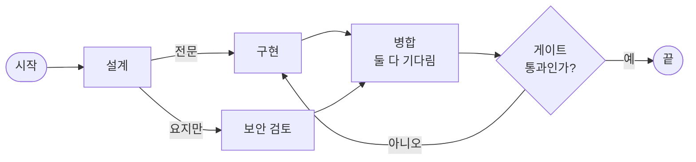
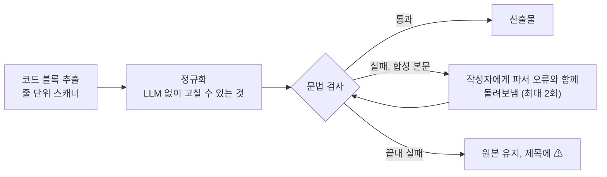

# 4-4. 토론을 조율하는 엔진

> 상위: [4강. 핵심 기술](README.md) · 이전: [4-3. MCP 호스트](03-mcp-host.md) · 다음: [4-5. 대화 기억](05-context-memory.md)

오케스트레이션 엔진은 한 턴의 전 과정을 진행합니다. 계획을 세우고, 라운드를 돌리고, 결론을 합성하고,
산출물을 뽑아냅니다. 한 턴의 순서는 [3-2. 동적 뷰](../03-architecture/02-dynamic-view.md)에서 봤으니, 이
절에서는 엔진을 설계할 때 쓴 기법들에 집중합니다. 전략을 순수한 객체로 떼어 내는 방법, 병렬 실행과
그래프 실행을 같은 엔진에 얹는 방법, 그리고 LLM 출력을 믿을 수 있는 산출물로 바꾸는 방법입니다.

---

## 1. 상태 머신 엔진을 직접 만든다는 것

프로젝트 명세는 LangGraph 같은 그래프 프레임워크와 "경량 커스텀 비동기 상태 그래프 엔진"을 모두 허용했고,
MADO는 후자를 택했습니다. 엔진은 "계획 → 토론 → 합성"의 상태를 가진 비동기 상태 머신이고, 상태 전이를
외부 라이브러리가 아니라 코드가 직접 표현합니다.

이 선택이 가져온 효과를 정리하면 이렇습니다.

| 측면 | 효과 |
| :--- | :--- |
| 의존성 | 폐쇄망에 반입할 패키지가 하나 줄었습니다 |
| 기록 시점 | 발언 단위로 언제 DB에 쓰고, 언제 이벤트를 보내고, 언제 쓰지 않을지(예: 턴이 끝나야 저장하는 결정 장부)를 엔진이 정확히 통제합니다 |
| 사람의 개입 | 발언과 발언 사이에서 정지, 개입 메모, 예산 확장 응답을 확인하는 지점을 원하는 곳에 둘 수 있습니다 |
| 비용 | 체크포인트, 재개, 시각화 같은 프레임워크 기능은 필요할 때 직접 만들어야 합니다. 실제로 그래프 토론의 실행 상태 표시는 발언 기록에서 다시 계산하는 방식으로 직접 만들었습니다 |

어느 쪽이 정답이라기보다, 엔진의 가장 까다로운 부분이 "그래프를 어떻게 표현하는가"가 아니라 "실패와
개입과 기록을 어떻게 다루는가"였다는 점이 이 선택을 설명합니다.

## 2. 전략은 순수한 객체로

### 전략이 답하는 질문

전략은 라운드마다 두 가지 질문에 답합니다. **누가, 어떤 순서로 말하는가**, 그리고 **발언마다 어떤 지침을
붙이는가**. 무엇을 말할지는 정하지 않습니다. 그건 에이전트의 페르소나와 대화 기록이 정합니다. 병렬 지시
전략은 질문 하나에 더 답합니다. 한 명씩 말하는가, 동시에 말하는가.

오케스트레이터는 어떤 전략에서도 라운드의 발언자가 아닙니다. 라운드 전에 계획하고, 라운드 후에
합성합니다.

### 순서는 에이전트가 들고 다닌다

처음에는 발언 순서가 전략 코드 안에 `{"architect": 0, "coder": 1, "critic": 2}`처럼 박혀 있었습니다.
화면에서 에이전트를 만들 수 있게 되자 이 방식이 무너졌습니다. 표에 없는 키는 모두 같은 우선순위로 묶여
언제나 맨 뒤로 밀렸고, 디베이트 전략에서는 제안자도 비판자도 아닌 "기타"로 빠졌습니다.

지금은 순서와 진영이 에이전트의 설정 항목입니다.

| 항목 | 뜻 | 바꾸는 곳 |
| :--- | :--- | :--- |
| `debate_priority` | 라운드 안의 발언 순서. 작을수록 먼저. 같으면 설정 파일에 적힌 순서 | 로스터에서 카드를 끌어서 |
| `debate_stance` | 제안(proponent), 비판(critic), 중립(neutral). 디베이트 전략이 씀 | 카드의 메뉴에서 |

전략 코드에 남은 에이전트 키는 `orchestrator` 하나입니다. 그건 역할이 아니라 시스템의 구조이기
때문입니다. 새 전략을 만들 때도 같은 규칙을 지킵니다. **에이전트 키로 분기하지 말고 에이전트의 속성을
읽으세요.** 에이전트 키는 사용자가 정하는 값이라 오늘 하드코딩한 키가 내일은 없을 수 있습니다.

### 전략 두 개를 하나로 합친 이유

순서를 우선순위 하나로 정리하고 나니, "자유 토론"과 "순차 검증" 두 전략이 같은 사람들을 같은 순서로
부르게 되었습니다. 남은 차이는 발언 지침뿐이었습니다. 이름과 달리 자유 토론도 정해진 순서대로 도는
것이었으므로 둘을 "순차 토론" 하나로 합쳤습니다. 순차 검증의 지침, 즉 "바로 앞 사람을 이름으로 지목하고
그 결론을 이어받아 검증하라"는 지침을 그대로 흡수했습니다. 이 지침이 없으면 라운드는 독백 세 개가 됩니다.
같은 맥락을 보고 각자 따로 말하고, 아무도 앞사람의 결론을 책임지지 않습니다.

이미 저장된 대화 수백 건이 옛 전략 이름을 들고 있었기 때문에, 옛 이름을 새 이름으로 바꿔 주는 별칭 표를
두었습니다. 또 대화를 문서로 내보낼 때는 저장된 키가 아니라 **지금 실제로 도는 전략의 이름**을 적습니다.
없어진 키를 적으면 그 문서가 사실과 다른 말을 하게 됩니다.

### LLM이 필요한 전략도 순수하게

오케스트레이터 지명 전략은 매 라운드 오케스트레이터에게 "이번 라운드에 누가 말해야 하는가"를 묻습니다.
LLM 호출이 필요합니다. 그래도 전략 객체는 LLM을 부르지 않습니다. "이 전략은 발언자를 오케스트레이터가
고른다"는 **표시**만 하고, 실제 호출과 실패 시 대체 순서는 엔진이 맡습니다. 병렬 지시도 "이 전략은 라운드를
동시에 돌린다"는 표시만 합니다.

이렇게 하면 전략 코드가 입력(참여 에이전트, 라운드 번호, 토론 상태)에서 출력(발언자 목록, 지침)으로 가는
순수 함수로 남습니다. 가짜 LLM 없이 테스트할 수 있고, 다음 절처럼 화면에서 재사용할 수도 있습니다.

### 화면의 순서 미리보기는 같은 함수를 부른다

순차 토론만 카드 순서대로 말합니다. 디베이트는 진영을 번갈아 세우고, 중립은 늘 마지막이며, 지명과 병렬
전략은 라운드마다 정합니다. 그래서 카드를 끌어도 순서가 안 바뀐 것처럼 보이는 경우가 생겼습니다.

로스터에 계산된 발언 순서를 보여 주는 미리보기를 달면서 원칙을 하나 세웠습니다. **미리보기는 엔진이
부르는 바로 그 함수를 부른다.** 순서 계산을 화면 쪽에 한 번 더 구현하면, 두 구현은 언젠가 반드시 어긋나고,
사람들은 화면을 믿습니다. 미리보기 옆에는 이 순서를 얼마나 믿어도 되는지도 함께 적습니다. 예를 들어
지명 전략에서는 "매 라운드 오케스트레이터가 지명합니다, 아래는 지명에 실패했을 때의 순서"라고 씁니다.

### 도구 없는 오케스트레이터 사본

발언자 지명, 과업 분배, 그래프 게이트 판정, 결정 장부 갱신, 옛 발언 요약은 모두 오케스트레이터에게 묻는
**경로 결정 질문**입니다. 발언이 아닙니다. 이런 호출은 도구와 단계적 사고를 끈 오케스트레이터 사본으로
보냅니다. 도구가 붙어 있으면 JSON 한 줄을 받자고 했는데 파일부터 읽기 시작하고, 단계적 사고 절차가
붙어 있으면 요청한 JSON 대신 "생각 1..N"을 씁니다.

응답이 형식에 맞지 않을 때의 처리도 정해 두었습니다. 지명 응답이 JSON이 아니면 본문에서 아는 에이전트
키를 등장 순서대로 긁어냅니다. 형식 하나 때문에 지명을 포기하면 이 전략은 결국 우선순위 순서와 같아집니다.
아는 키를 하나도 찾지 못하거나 엔드포인트가 응답하지 않으면 우선순위 순서로 물러서고, **물러섰다는
사실을 대화 기록에 남깁니다.** 조용히 다른 순서로 도는 것이 가장 나쁜 결과입니다. 게이트 판정도 같습니다.
"예/아니오"가 아닌 답은, "문제없어 보입니다" 같은 긍정적인 산문이라도 그 노드의 기본 분기로 보내고 그렇게
했다고 적습니다.

## 3. 병렬 라운드

병렬 지시 전략의 라운드는 모양이 다릅니다.

```text
분배 → 동시 실행 → 중간 취합
```

다른 전략은 한 명이 끝나야 다음 사람이 시작하므로 라운드 시간이 발언 시간의 합입니다. 병렬 라운드는
가장 느린 한 명의 시간입니다. 설계, 스켈레톤 작성, 위협 검토처럼 서로의 결과를 기다릴 이유가 없는 일에
맞습니다.

병렬로 바꾸면서 지켜야 했던 규칙들입니다.

1. **프롬프트는 첫 태스크가 뜨기 전에 모두 만든다.** 각 태스크 안에서 만들면 먼저 끝난 동료의 답이 늦게
   시작한 쪽의 맥락에 섞입니다.
2. **각자는 자기 과업과 "누가 무엇을 맡았는지"를 받되, 동료의 답은 보지 못한다.** 그래서 다른 사람의
   결과를 짐작하지 말고 가정을 명시하라고 지시합니다.
3. **동시 실행 수에 상한을 둔다.** 대화마다 설정하는 값(기본 3)을 세마포어로 적용합니다. 상한을 넘는
   과업은 버리지 않고 기다리게 합니다. 로컬 GPU 한 장짜리 추론 서버에 요청 다섯 개를 동시에 던지면 시간
   초과가 나고, 그건 "에이전트가 응답하지 못했다"로 보입니다.
4. **DB 기록 구간만 직렬화한다.** 공유하는 비동기 DB 세션에 동시에 커밋하면 토론이 통째로 죽습니다. LLM
   호출은 잠금 밖에 둡니다.
5. **정렬 키에 지시 순서를 박는다.** 끝난 순서대로 저장하면 새로고침할 때마다 발언 순서가 달라 보입니다.
6. **라운드 끝에 오케스트레이터가 중간 취합을 쓴다.** 통합 결론, 어긋나는 지점과 판정, 검증되지 않은 가정,
   다음 과제를 적습니다. 이것이 다음 라운드 분배의 입력이 됩니다. 이 접합부가 없으면 아무도 라운드 전체를
   본 적이 없는 채로 최종 합성까지 가고, 모순이 그대로 실립니다.

분배에 실패하면(엔드포인트 없음, 응답에서 아는 키를 못 찾음) 과업 없이 전원을 동시에 돌립니다. 지시를 잃었을
뿐 병렬이라는 성질까지 잃을 이유는 없습니다. 전문가가 한 명뿐이면 나눌 것이 없으므로 분배 호출을 하지
않습니다.

## 4. 그래프 실행

그래프 토론은 발언 순서를 카드 정렬에서 얻지 않고, 사람이 그린 그림에서 얻습니다. 병렬 갈래, 합류, 검토
루프가 전략 코드가 아니라 그림에서 나옵니다.



설계의 요점만 추립니다.

- **엔진은 한 번만 갈라진다.** 라운드 루프에 들어가기 전에 "그래프 전략이면 그래프 실행"으로 갈라지고,
  계획, 합성, 산출물, 결정 장부는 다른 전략과 같은 코드를 씁니다. 다른 네 전략과 카드 정렬 방식은
  건드리지 않았습니다.
- **그래프 규칙은 순수 코드.** 스키마, 검증, 스케줄 계산은 LLM도 DB도 모르는 모듈에 있어서 LLM 없이
  테스트합니다.
- **연결선이 곧 시야.** 노드는 고정된 목표(요청, 사용자 발언 기록, 계획), 들어오는 연결선이 나르는 내용,
  자기가 이전에 한 발언, 노드 지침만 봅니다. 연결선마다 전문, 요지, 코드 참조 중 무엇을 나를지 정합니다.
- **게이트는 판정과 근거를 함께 넘긴다.** 게이트는 판정 메모에 **자기가 판단한 입력**을 붙여 넘깁니다.
  되돌려 보내진 노드가 왜, 무엇 때문에 돌아왔는지 알아야 하기 때문입니다.
- **루프는 기다리지 않는다.** 여러 입력을 기다리는 노드는 앞쪽 연결만 기다립니다. 되돌아오는 연결은
  시작 노드에서 깊이 우선 탐색으로 찾아 제외합니다.
- **멈추는 조건이 여럿이다.** 끝 노드 도달, 돌 수 있는 노드 없음, 스텝 상한, 사용자 정지. 노드마다 방문
  상한이 있고 기본값은 대화의 최대 라운드입니다. 스텝 상한은 모든 방문 상한의 합이라, 방문 상한 안에서
  그래프가 먼저 잘리는 일은 없습니다.
- **턴마다 그래프를 동결한다.** 턴이 시작될 때 그래프를 대화에 스냅샷으로 저장합니다. 토론 도중 그래프
  파일을 고치거나 지워도 진행 중인 턴에는 영향이 없습니다.
- **실행 상태는 기록에서 다시 계산한다.** 노드의 모든 출력에 노드와 출력 포트를 기록합니다. 그래서 방문
  횟수, 게이트 분기, 흐른 연결선을 발언 기록만으로 셀 수 있고, 실시간 화면, 새로고침한 화면, 다시 연
  대화가 모두 같은 그림을 그립니다. 이벤트에서만 얻는 것은 "지금 도는 노드"와 "멈춘 이유" 둘뿐입니다.

### 검증 규칙을 잘못 세웠던 경험

게이트를 거치지 않는 순환은 무한 루프가 되므로 검증에서 거절해야 합니다. 첫 구현은 "강하게 연결된 요소마다
게이트가 하나 이상 있는가"로 검사했습니다. 그런데 `구현 → 취합 → 구현` 같은 게이트 없는 순환이, 게이트
있는 다른 루프와 같은 요소에 속하면 통과해 버렸습니다. 지금은 **"게이트 노드를 모두 뺀 그래프에 순환이
없어야 한다"** 로 검사합니다. 조건을 "무엇이 있어야 한다"에서 "무엇을 빼면 무엇이 없어야 한다"로 바꾸면
훨씬 단단해지는 경우가 많습니다.

## 5. 합성과 산출물

### 오케스트레이터가 쓰는 것을 줄였다

처음에는 합성 프롬프트와 기본 오케스트레이터 페르소나가 "완전히 실행 가능한 소스 코드"를 요구했습니다.
오케스트레이터는 전문가들이 쓴 코드를 통째로 다시 옮겨 적었고, 응답 한도를 다 썼습니다. 그 합성 보고서는
다음 턴의 대화 기록에 코드 덤프로 들어가 컨텍스트를 턴마다 조금씩 더 빨리 채웠습니다. 합성이 빈 응답으로
돌아오던 원인 중 하나였습니다.

지금 오케스트레이터가 쓰는 것은 두 가지뿐입니다.

1. **결론**: 결정 사항과 근거, 기각된 대안, 미해결 쟁점과 위험
2. **종합 다이어그램 하나**

소스 코드를 다시 쓰거나 붙여 넣는 것은 금지하고, 코드는 파일 경로나 모듈, 함수 이름으로 가리키게 합니다.
코드 탭은 이번 턴 **전문가 발언**에서 뽑습니다. 전문가마다 코드를 담은 가장 최근 발언 하나를, 사고 흔적을
걷어 낸 뒤 사용하고, 같은 코드는 하나만 남기며, 최대 12개까지 만듭니다
([ADR-018](../05-adr/ADR-018-orchestrator-writes-conclusions.md)).

### 산출물 네 가지

| 산출물 | 출처 | 비고 |
| :--- | :--- | :--- |
| 최종 결론 (마크다운) | 합성 본문 | 끝에 보고서 완료 시각과 턴 총 경과 시간 |
| 종합 다이어그램 (Mermaid) | 합성 본문 | 합성에 없으면 이번 턴 발언에서 가장 최근 다이어그램을 작성자 이름과 함께 가져옴 |
| 전문가 코드 | 이번 턴 전문가 발언 | 전문가별 최신, 중복 제거, 최대 12개 |
| 토론 요약 (JSON) | 합성 결과와 턴 상태 | 합성 실패 여부 포함 |

모든 제목 앞에 턴이 끝난 시각(`MM-DD HH:MM`)을 붙입니다. 산출물 뷰어는 턴마다 탭을 **덧붙입니다.** 예전에는
탭을 통째로 바꿨는데, 여기에 빈 합성이 겹치자 긴 대화의 결과가 모두 사라진 것처럼 보였습니다(이전 보고서는
DB에 멀쩡히 있었습니다).

### 빈 합성은 실패다

합성이 비어 있으면, 또는 응답 한도 안내나 사고 흔적만 있으면 "합성 실패 (빈 응답)"로 기록합니다. 예전에는
빈 본문을 정상 보고서 제목으로 저장했습니다. 지금은 설명과 함께 **전문가별 이번 턴 마지막 발언**을 LLM
없이 모아 채우고, 합의로 표시하지 않습니다. 실패를 성공처럼 보이게 하지 않되, 사용자가 손에 쥘 것은
남깁니다.

### 보고서 안에 완료 시각을 적는다

최종 보고서는 복사되고, 내려받아지고, 대화와 떨어져 따로 전달됩니다. 그래서 결론에 도달한 시각과 그 턴이
걸린 시간이 보고서 **안에** 있어야 합니다. 완료 시각은 다이어그램 수리까지 끝나 본문이 확정된 시점이라,
합성 발언 카드의 종료 시각과 정확히 같습니다.

총 경과 시간은 "그 턴의 요청이 기록된 시각"부터 셉니다. 이 시작 시각을 기록에서 추론하지 않고 합성
발언에 **명시적으로 저장**합니다. 추론하려면 "라운드 0의 마지막 사용자 발언"을 찾아야 하는데, 계획 직후에
끼어든 개입 메모도 라운드 0의 사용자 발언이라, 누군가 끼어든 턴의 총 경과가 조용히 짧아지기 때문입니다.
추론이 틀릴 수 있는 값은 저장하는 편이 낫습니다.

## 6. LLM이 그린 다이어그램 믿기

LLM이 그린 Mermaid 다이어그램은 문법 오류가 잦습니다. 예전에는 파싱되지 않는 다이어그램이 그대로 산출물이
되었고, 사용자는 토론이 끝난 뒤 탭을 열고서야 알았습니다. 지금은 여러 단계를 거칩니다.



**추출.** 한 줄짜리 정규식으로 코드 블록을 찾던 시절에는 정보 문자열이 붙은 펜스(```` ```mermaid title="…" ````)를
인식하지 못했습니다. 그러면 그 블록의 닫는 펜스를 여는 펜스로 읽어서 이후의 모든 짝이 밀렸고, 뒤따르는
파이썬 블록을 잃었습니다. `~~~` 펜스도 무시했습니다. 응답 한도에서 잘려 닫는 펜스가 없는 다이어그램은
통째로 놓쳤습니다. 지금은 줄 단위 스캐너가 이 경우들을 모두 다룹니다.

**정규화.** LLM 없이 확실하게 고칠 수 있는 것은 고칩니다. 괄호가 든 라벨(`A[결제 (PG)]`)에 따옴표를 씌우고,
순서도 안에 잘못 들어간 시퀀스 다이어그램식 노트를 점선으로 붙은 노드로 바꿉니다. 단, 라벨 따옴표 처리는
순서도와 마인드맵에만 합니다. 다른 다이어그램에서는 그 라벨이 원래 유효했고, 따옴표가 눈에 보이는
글자를 바꿔 버렸습니다.

**검사는 일부러 불완전하게.** 검사기가 오류를 놓치면 치르는 비용은 예전과 같습니다. 반면 멀쩡한 다이어그램을
오류로 판정하면 LLM 호출을 한 번 낭비하고, 고칠 것이 없는 모델에게 잘 되던 다이어그램을 망칠 기회를 줍니다.
그래서 **오탐을 내지 않는 쪽으로** 규칙을 좁혔습니다. 모든 규칙을 실제 Mermaid 파서로 하나씩 맞췄습니다.
처음에는 유효한 다이어그램 30개에서 오탐 0, 틀린 다이어그램 13개를 모두 잡았고, 이후 엣지 케이스 121개를
실제 파서로 다시 확인해 오탐, 정규화가 오히려 망가뜨린 경우, 추출 누락을 고쳤습니다. 이 판정표는 테스트로
고정했고, 판정의 기준이 된 파서 버전을 지키려고 NiceGUI 버전 범위를 좁혔습니다(2강 참고).

**수리는 합성에만.** LLM 수리는 오케스트레이터의 합성 본문에만 합니다. 전문가 발언에서 가져온 다이어그램은
정규화와 경고 표시만 합니다. 수리하다 실패해도 원본은 유지합니다. 후처리가 턴을 망가뜨리면 안 됩니다.

### 폐쇄망에서 흰 화면으로 열리던 다이어그램 파일

다이어그램을 "독립 실행 HTML"로 내보내는 기능이 있었는데, 열 때마다 CDN에서 Mermaid 렌더러를 받아 왔습니다.
폐쇄망에서는 스크립트가 로드되지 않았고, 초기화 코드가 첫 줄에서 예외를 던지면서 같은 스크립트 블록에 있던
도구 모음과 확대 기능까지 함께 죽었습니다. 남은 것은 다크 테마의 흰 글씨로 쓴 원본 코드가 늘 밝은 다이어그램
패널 위에 놓인 모습, 즉 흰 바탕에 흰 글씨였습니다. 지금은 이미 렌더링된 SVG를 파일에 넣고 CDN 태그는 아예
쓰지 않습니다. 내려받은 파일에는 외부 URL이 하나도 없습니다. **"독립 실행"이라는 이름이 붙은 파일은 정말로
혼자 돌아야 합니다.**

## 7. 합의 판정

턴이 끝나면 합의에 도달했는지 표시합니다. 조건은 단순합니다. 발언하지 못한 에이전트가 없고, 사용자가
도중에 끊지 않았고, 합성이 비어 있지 않아야 합니다. 셋 중 둘이 침묵했는데 "합의 도달"로 표시되면 그
기록 전체를 믿을 수 없게 됩니다. 판정 기준이 느슨한 쪽보다 엄격한 쪽이 낫습니다.

---

## 정리

- 전략은 발언자, 순서, 지침만 정하는 순수 객체입니다. LLM이 필요하면 표시만 하고 호출은 엔진이 합니다.
- 순서와 진영은 에이전트의 속성이고, 전략은 에이전트 키로 분기하지 않습니다.
- 화면의 미리보기는 엔진과 같은 함수를 부릅니다. 두 번째 구현은 결국 어긋납니다.
- 대체 경로로 물러설 때는 반드시 기록합니다.
- 병렬 라운드는 프롬프트를 미리 만들고, 기록 구간만 직렬화하고, 끝에 취합합니다.
- 그래프 실행은 순수 코드로 검증·계획하고, 실행 상태는 발언 기록에서 다시 계산합니다.
- 오케스트레이터는 결론과 다이어그램만 쓰고, 다이어그램은 오탐 없는 검사와 제한된 수리를 거칩니다.

## 생각해 볼 문제

1. 오케스트레이터 지명 전략에서, 지명 응답의 본문에서 에이전트 키를 긁어내는 대비책은 어떤 경우에
   엉뚱한 결과를 낼 수 있을까요?
2. 병렬 지시 전략의 중간 취합을 생략하고 곧바로 다음 라운드를 분배하면 무엇이 달라질까요? 비용은
   줄어드는데, 무엇을 잃을까요?
3. 다이어그램 검사기를 "틀린 것은 최대한 잡는" 방향으로 만들었다면 어떤 일이 생겼을지 시나리오로
   설명해 보세요.
