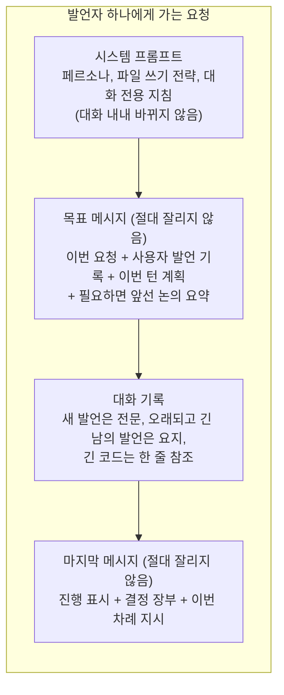

# 4-5. 컨텍스트 창과 대화 기억

> 상위: [4강. 핵심 기술](README.md) · 이전: [4-4. 오케스트레이션](04-orchestration.md) · 다음: [4-6. 영속화](06-persistence.md)

LLM은 요청에 담긴 것만 압니다. 멀티 에이전트 토론은 라운드마다 발언이 쌓이고, 턴이 지나도 이전 기록을
이어 가므로 컨텍스트 창이 금방 찹니다. 창이 차면 무언가를 빼야 합니다. 이 절은 **무엇을 빼고 무엇을 지킬
것인가**를 다룹니다. 처음의 단순한 방법이 어떻게 실패했는지, 그리고 그것을 세 겹의 장치로 어떻게
바꿨는지 봅니다.

---

## 1. 오래된 것부터 버리면 생기는 일

처음 방식은 단순했습니다. 발언자마다 세션의 모든 발언을 그대로 넣고, 창을 넘으면 **가장 오래된 메시지부터**
통째로 버렸습니다. 기준은 나이 하나였습니다. 그러자 가장 먼저 사라진 것이 한 번 말하고 다시 반복하지 않는
것들이었습니다.

| 사라진 것 | 결과 |
| :--- | :--- |
| 1턴에서 사용자가 준 피드백("레디스는 쓰지 마세요") | 5턴에서 사용자 지시를 어깁니다. 살아남는 것은 현재 요청뿐이었습니다 |
| 이번 턴의 오케스트레이터 계획 | 뒤쪽 발언자는 자기가 무엇을 맡았는지 모릅니다 |
| 이미 내린 결정과 근거, 기각한 대안 | 끝난 논쟁이 다시 시작됩니다 |

에이전트마다 모델과 창 크기가 다르므로 **잊는 양도 서로 달랐습니다.** 창이 작은 에이전트는 더 많이 잊었고,
에이전트들은 서로 다른 전제를 가지고 엇갈린 이야기를 했습니다. 합성용 기록은 최근 것부터 채웠기 때문에
최종 보고서도 초기 요구사항을 놓칠 수 있었습니다.

이 문제는 재현 테스트로 남겨 두었습니다. 8k 창, 발언 하나에 약 2,100토큰, 1턴에서 준 제약 하나, 3라운드짜리
2턴. 옛 방식에서는 2턴의 발언 아홉 개 중 **어느 것도** 그 제약을 엔드포인트에 전달하지 못했습니다. 발언마다
메시지 3~14개가 버려졌습니다. 지금 방식에서는 아홉 개 모두에 정확히 한 번씩 전달되고, 아무것도 버려지지
않습니다.

## 2. 원칙: 대화는 잊되, 상태는 지킨다

대화의 모든 문장을 기억할 필요는 없습니다. 지켜야 하는 것은 대화에서 나온 **상태**, 즉 사용자가 요구한 것,
합의한 것, 기각한 것, 아직 풀리지 않은 것입니다. 그리고 우선순위가 있습니다. **사람의 말이 LLM이 만든 어떤
요약보다 앞섭니다.** 프롬프트에도 그렇게 적습니다.

세 겹의 장치를, 싸고 권위 있는 것부터 둡니다.



## 3. 첫째 겹: 사용자 발언 고정

세션의 모든 사용자 발언을 **목표 메시지** 안에 모아 둡니다. 목표 메시지는 시스템 프롬프트 바로 다음에 오는
메시지이고, 컨텍스트를 자르는 두 함수(발언 시작 전, 도구 루프 안) 모두 앞의 두 메시지는 절대 버리지
않습니다. 그러니 사용자 발언 기록은 잘리지 않습니다.

- 원래 자리의 사용자 발언은 "사용자 발언 #n, 위 기록에 전문이 있습니다"라는 참조로 바꿉니다. 시간 순서는
  여전히 읽히고, 같은 글을 두 번 보내지 않습니다.
- "이전 턴 요청", "이번 턴 토론 중 개입"처럼 라벨을 달아 턴 요청과 개입 메모를 구분합니다.
- **몫에 상한을 둡니다.** 발언자 예산의 25%까지입니다. 사용자가 긴 명세서를 붙여 넣으면 목표 메시지가
  창을 밀어낼 수 있는데, 목표 메시지는 자를 수 없으니 그대로 400이 납니다. 상한을 넘으면 최신 발언부터
  고정하고, 들어가지 않는 발언은 건너뛰어 대화 기록에 원문 그대로 남깁니다(그건 예전처럼 잘릴 수 있습니다).
  몇 개가 빠졌는지는 기록에 적습니다.
- 이번 턴의 계획도 같은 방식으로 고정합니다(예산의 15%, 넘으면 자르지 않고 건너뜀).
- 발언자 지명이나 과업 분배 같은 경로 결정 호출에는 더 작은 몫(10%)으로 넣습니다.
- 합성 프롬프트에도 기록 앞에 고정하고, 그 크기만큼 기록 예산을 줄입니다.

## 4. 둘째 겹: 결정 장부

오케스트레이터가 다섯 개의 고정된 절로 이루어진 장부를 다시 씁니다.

```text
## 요구사항·제약
## 결정 사항
## 기각된 대안
## 미해결 쟁점
## 담당·다음 할 일
```

### 언제, 어떻게 갱신하는가

- 마지막 라운드를 **제외한** 매 라운드 끝과 합성 뒤에 갱신합니다. 마지막 라운드를 빼는 이유는 합성이 기록을
  직접 읽고, 합성 뒤의 갱신이 그 라운드까지 반영하기 때문입니다.
- 입력은 이전 장부, 사용자 발언 기록, 이번 요청, 그리고 **지난 갱신 이후의 발언만**입니다. 매번 처음부터 다시
  읽지 않습니다.
- 도구 없는 오케스트레이터 사본으로 호출합니다.
- 응답에 `## ` 절 제목이 하나도 없으면 장부가 아니라고 보고 **이전 장부를 유지**합니다. 장부 갱신에 실패했다고
  토론을 멈추지 않습니다.
- 크기는 5,000자와 "이번 턴 에이전트 중 가장 작은 예산의 10%" 중 작은 값으로 제한합니다. 장부는 모든
  에이전트의 모든 호출에 실리기 때문입니다.
- **턴이 끝까지 가야만 저장합니다.** 사용자가 요청을 되돌리면 그 턴의 발언은 지워지는데, 장부가 이미
  저장되어 있으면 아무도 내린 적 없는 결정이 남습니다.

### 어디에 두는가: 프롬프트 캐시

장부의 위치가 흥미로운 대목입니다. 첫 구현은 장부를 **시스템 프롬프트**의 대화 전용 지침 바로 뒤에 넣었습니다.
중요한 정보이니 가장 앞에 두는 것이 자연스러워 보였습니다. 그런데 공급자들의 프롬프트 캐시는 요청의 **앞부분**이
이전 요청과 같을 때 싸고 빠르게 처리합니다. 시스템 프롬프트가 장부 갱신마다 바뀌니, 매번 요청 전체의 캐시가
깨졌습니다.

지금은 장부를 **마지막 사용자 메시지의 맨 앞**, 즉 "이번이 당신 차례다" 지시 바로 앞에 둡니다. 컨텍스트
자르기는 마지막 메시지를 늘 지키므로 장부가 잘리지 않고, 시스템 프롬프트는 장부가 바뀌어도 그대로입니다.

같은 원리로 다른 것들도 옮겼습니다. **자주 바뀌는 것은 뒤로.**

| 요소 | 바뀌는 빈도 | 위치 |
| :--- | :--- | :--- |
| 시스템 프롬프트 | 대화 내내 고정 | 맨 앞 |
| 목표 메시지 | 새 턴, 개입, 요약할 때만 | 앞 |
| 대화 기록 | 뒤에 덧붙기만 함 | 가운데 |
| 라운드 진행 표시("N라운드 중 n") | 매 라운드 | 맨 끝 (예전에는 목표 메시지에 있어서 매 라운드 기록 전체의 캐시를 깼습니다) |
| 결정 장부, 이번 차례 지시 | 매 라운드, 매 발언 | 맨 끝 |

Anthropic은 캐시 지점을 명시하는 표시가 따로 필요한데, MADO는 아직 그 표시를 보내지 않습니다.

## 5. 셋째 겹: 버리기 전에 요약한다

발언자의 맥락을 만들기 전과 합성 전에, 요청 크기를 미리 계산합니다. 예산을 넘으면 가장 오래된 발언들을
오케스트레이터에게 **누적 요약**으로 접게 합니다. 요약은 목표 메시지에 "앞선 논의 요약"으로 고정되고,
대화 기록은 요약이 끝난 지점부터 시작합니다.

- **발언자마다 따로 판단합니다.** 전체 기록이 그 발언자의 창에 들어가면 원문을 그대로 읽습니다. 창이 큰
  에이전트까지 요약본을 읽을 이유가 없습니다.
- 요약 후 요청이 예산의 60% 정도가 되도록 접을 양을 정합니다. 요약이 자랄 여유를 남깁니다.
- 가장 최근 메시지 하나는 절대 접지 않습니다.
- 접어서 얻는 공간이 너무 작으면(필요량과 예산의 10% 중 작은 값보다 작으면) 접지 않습니다. 그러지 않으면
  목표 메시지가 큰 대화에서 발언마다 메시지 하나씩 접느라 호출이 하나씩 늘었습니다.
- 요약에 실패하면 예전처럼 오래된 것부터 버립니다. 버리기는 마지막 방어선으로 남습니다.

처음 정한 상수(목표 80%, 최근 3개 보존, 고정된 크기 상한)로는 재현 테스트의 8k 시나리오에서 **매 발언마다**
요약기를 부르고도 메시지를 버렸습니다. 최근 발언 세 개만으로 목표를 넘었고, 고정 크기 요약이 창의 대부분을
먹었기 때문입니다. 지금 값으로는 대략 두 발언에 한 번 접고(발언 하나가 창의 3분의 1이면 피할 수 없습니다)
아무것도 버리지 않습니다. 128k 창에서는 접을 일이 드뭅니다. **상수는 재현 시나리오로 보정해야 합니다.**
그럴듯해 보이는 숫자는 실제 조건에서 전혀 다르게 움직입니다.

## 6. 발언을 필요한 만큼만 전달하기

세 겹의 장치는 "넘칠 때"의 대책입니다. 넘치기 전에 애초에 덜 보내는 방법도 있습니다. 예전에는 모든 발언이
이후 모든 발언자에게 코드까지 포함해 원문 그대로, 라운드마다 반복해서 전달되었습니다. 지금은 발언자마다
세 단계로 나눠 보냅니다.

| 단계 | 어떤 발언 | 무엇을 보내는가 |
| :--- | :--- | :--- |
| 새 발언 | 이 에이전트가 마지막으로 말한 뒤에 나온 발언 | 전문, 코드 포함. 아직 답하지 않은 발언이고, 리뷰어는 새 코드를 읽어야 검토할 수 있습니다 |
| 오래되고 긴 남의 발언 | 700자가 넘고 이 에이전트를 `@`로 부르지 않은 다른 에이전트의 발언 | 발언 끝의 `## 요지`만 |
| 나머지 | 짧은 발언, 이 에이전트를 부른 발언, 자기 발언, 요지가 없는 옛 발언 | 본문, 긴 코드 블록은 한 줄 참조로 |

**요지는 추가 호출 없이 얻습니다.** 모든 발언 지침 끝에 "3~5줄짜리 `## 요지`로 끝내라(결론, 근거, 다른
사람에게 요청할 것, 쓴 파일). 이후 라운드에서는 이것만 보일 수 있다"는 문장을 붙입니다. 요지가 없는 발언은
LLM으로 요약하지 않고 코드 참조 본문으로 대신합니다. 잃는 것도 없고 지어내는 것도 없습니다.

**코드 참조**는 15줄 이상이거나 800자 이상인 코드 블록의 내용을 한 줄로 바꿉니다. 줄 수, 언어, 첫 줄, 그리고
관련 파일로 보이는 경로(펜스 위 세 줄 안의 경로, 펜스의 제목, 이 발언이 파일 도구로 쓴 경로)를 적습니다.
원본은 DB, 채팅 화면, 산출물 탭, 대개는 작업 공간 파일에 그대로 있습니다. Mermaid 다이어그램은 절대 바꾸지
않습니다. 다이어그램은 토론의 내용이기 때문입니다. 합성은 여전히 모든 것을 원문으로 읽습니다.

전문가 셋이 세 라운드를 도는 시험에서, 리뷰어의 마지막 프롬프트가 원문을 모두 보낼 때의 약 54%로 줄었습니다.

## 7. 긴 도구 루프에서 지시를 잃지 않기

발언을 시작할 때의 마지막 메시지(결정 장부 + 이번 차례 지시)는 도구 루프가 돌면서 도구 호출과 결과들 뒤로
밀려납니다. 루프가 길어져 루프 안 자르기가 동작하면, 이 메시지가 오래된 블록과 함께 버려질 수 있습니다.
그러면 에이전트는 도구를 한참 쓰다가 자기가 무엇을 하던 중이었는지, 무엇이 결정되었는지를 잃습니다.

그래서 발언 시작 시점의 마지막 메시지를 **닻**으로 기억해 둡니다. 루프 안에서 자를 때 닻이 든 블록이
버려지면, 닻을 생략 안내문 안에 "생략된 기록에 있던 이번 차례 지시와 결정 장부를 다시 붙입니다, 여전히
유효합니다"라는 머리말과 함께 붙입니다.

- 생략 안내문은 목표 메시지에 합쳐지고, 목표 메시지는 이후 어떤 자르기에도 버려지지 않으므로 한 번 복원하면
  그 발언이 끝날 때까지 유지됩니다.
- 닻이 들어갈 자리를 먼저 확보합니다. 닻이 들어갈 때까지 블록을 더 버리고, 최신 블록 하나만 남았는데도
  부족하면 닻의 가운데를 잘라 넣습니다(장부의 앞과 지시의 끝은 살립니다).
- 남은 공간이 48토큰도 안 되면 복원하지 않고 로그에 남깁니다. 넘치는 요청은 400이고, 그러면 발언 전체를
  잃습니다.

## 8. 창이 차오를 때 알리고, 기억으로 옮기게 하기

도구 루프 안에서는 컨텍스트 사용률이 50, 70, 85, 95%를 **처음** 넘을 때만 남은 여유를 모델에게 알립니다.
매 판 알리면 그 안내가 다시 컨텍스트를 먹습니다.

85%에서는 한 가지를 더 합니다. 그 발언자가 지식 그래프에 쓰는 도구를 가지고 있으면 "잘리기 전에 기억해야 할
사실을 한 번의 호출로 그래프에 옮겨 두라"고 시킵니다. 지식 그래프는 대화 단위라 같은 대화의 모든 에이전트와
최종 합성이 함께 읽습니다. 안내 문구는 정직하게 씁니다. 그래프에 쓴다고 컨텍스트가 그 자리에서 줄지는 않고,
잘려도 잃지 않게 될 뿐입니다.

실제로 기록을 잃게 되는 첫 순간에는 사용자에게 한도를 올릴지 마무리할지 묻습니다. 답이 없으면 마무리가
아니라 **생략하고 계속 진행**합니다. 사람이 자리에 없다고 토론을 접을 이유는 없습니다. 라운드가 쌓이면 거의
모든 발언이 같은 벽에 부딪히므로 턴에 한 번만 묻고 그 답을 나머지 발언에 씁니다.

## 9. 마지막 수단: 이어받기

세 겹의 장치로도 결국 창이 가득 차는 대화가 있습니다. 그때는 새 대화로 옮겨 가는 수밖에 없습니다. 예전에는
새 대화를 시작하면 작업 공간 지정과 지식 그래프를 잃었습니다. 이어받기는 발언 기록만 비우고 나머지를 물려주는
새 대화를 만듭니다.

| 물려받는 것 | 물려받지 않는 것 |
| :--- | :--- |
| 작업 공간(같은 폴더, 파일과 git 기록 그대로) | 발언 기록(비우려는 대상) |
| 지식 그래프(호스트가 새 대화 ID로 복사) | 페르소나 잠금(새 대화는 아직 시작 전) |
| 에이전트 구성과 스냅샷, 전략 설정, 대화 전용 지침 | 산출물(원래 대화에 남기고 제목만 안내) |
| 결정 장부 | 옛 발언 요약(새 대화에 없는 발언을 요약한 것이므로) |
| 직전 턴의 최종 결론(인수인계 노트로) | |

새 대화는 오케스트레이터 명의의 **인수인계 노트** 한 통으로 시작합니다. 이 노트는 세 가지를 지킵니다.

- **넘어오지 못한 것을 말합니다.** 지식 그래프 복사에 실패했거나 복사할 것이 없었다면 그렇게 적고 "없는 기억을
  있다고 가정하지 마세요"를 덧붙입니다. 실패를 숨긴 반쪽짜리 인계는 인계를 안 한 것보다 나쁩니다. 에이전트들이
  빈 그래프를 조회하고, 빈손으로 돌아와, 지어내기 시작합니다.
- **결론은 8,000자까지만 싣습니다.** 이어받기의 목적은 여유를 가지고 시작하는 것입니다. 옛 기록을 재현하는
  노트는 풀려던 문제로 되돌아갑니다. 나머지는 작업 공간 파일과 물려받은 그래프에 있습니다.
- **결론이 없으면 최종 보고서 산출물을 씁니다.** 합성 발언이 없는 경우(산출물을 뽑은 뒤 합성 호출이 실패한
  경우 등)에도 인계가 반쪽이 되지 않게 합니다.

진행 중인 토론은 이어받을 수 없습니다. 결론이 아직 없으니 노트의 절반이 빕니다.

---

## 정리

- 오래된 것부터 버리면 한 번만 말한 것, 즉 사용자의 제약과 계획과 결정부터 잃습니다.
- 사용자 발언과 이번 턴 계획은 잘리지 않는 목표 메시지에 몫 상한을 두고 고정합니다.
- 결정 장부는 턴이 끝나야 저장하고, 프롬프트 캐시를 깨지 않도록 마지막 메시지 앞에 둡니다.
- 넘칠 때는 버리기 전에 요약하되, 창에 들어가는 에이전트는 원문을 읽게 합니다.
- 발언은 필요한 만큼만 전달합니다. 새 발언은 전문, 오래되고 긴 발언은 요지, 긴 코드는 참조로.
- 자주 바뀌는 것은 요청의 뒤로 보냅니다.
- 상수는 재현 시나리오로 보정합니다.

## 생각해 볼 문제

1. 결정 장부를 오케스트레이터가 아니라 각 에이전트가 자기 몫만 갱신하게 한다면 어떤 장단점이 있을까요?
2. 사용자 발언 몫을 25%로 정했습니다. 사용자가 50쪽짜리 요구사항 문서를 붙여 넣는 사용 패턴이라면 이
   설계를 어떻게 바꾸는 것이 좋을까요? (힌트: 작업 공간 파일과 `@언급`)
3. 요지를 발언자 스스로 쓰게 했습니다. 발언자가 자기에게 불리한 내용을 요지에서 빼는 경향이 있다면 어떻게
   알아챌 수 있을까요?
