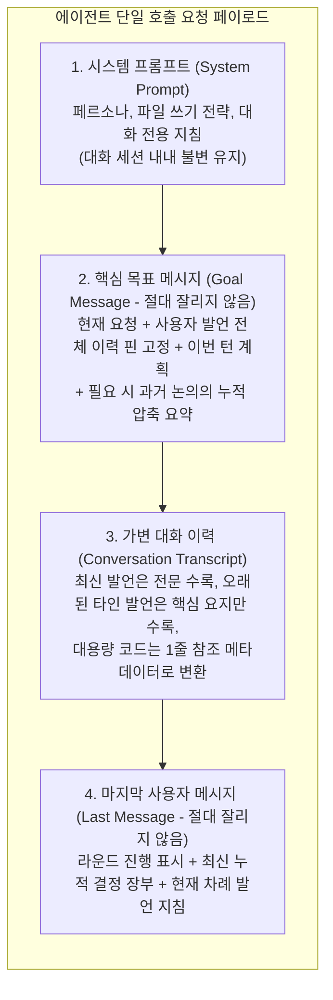

# 4-5. 컨텍스트 윈도우와 장기 대화 기억 보존 기법

> 상위: [4강. 핵심 기술](README.md) · 이전: [4-4. 오케스트레이션](04-orchestration.md) · 다음: [4-6. 영속화](06-persistence.md)

LLM 모델은 단일 API 호출 요청 페이로드에 포함된 텍스트만을 인지할 수 있습니다. 멀티 에이전트 토론 시스템에서는 라운드가 진행될 때마다 각 전문가의 긴 발언이 누적되고, 턴이 거듭되어도 이전 이력을 계승해야 하므로 모델의 최대 컨텍스트 윈도우(Context Window) 한계에 매우 빠르게 도달합니다. 허용 용량을 초과하면 대화 기록의 일부를 반드시 덜어내야 합니다. 이번 절에서는 **"무엇을 압축하여 비워내고, 무엇을 결코 유실하지 않고 온전히 지킬 것인가"**에 대한 해법을 다룹니다. 초기의 단순한 선입선출(FIFO) 방식이 초래했던 파멸적 망각 문제와, 이를 극복하기 위해 구축한 3단계 대화 기억 보존 아키텍처를 상세히 살펴봅니다.

---

## 1. 단순 선입선출(FIFO) 방식이 초래하는 파멸적 망각

초기 구현은 매우 단순했습니다. 세션에 누적된 모든 발언 메시지를 그대로 배열에 담아 요청을 구성하고, 컨텍스트 상한을 초과하면 **가장 오래된 과거 메시지부터** 순차적으로 삭제했습니다. 오직 메시지의 생성 시점(Age) 하나만을 기준으로 삼았던 것입니다.

그 결과 단 한 번 명시되고 이후 반복 언급되지 않은 가장 중요한 정보들부터 가장 먼저 소멸하는 심각한 부작용이 발생했습니다.

| 조기 소멸된 핵심 맥락 | 시스템 오작동 결과 |
| :--- | :--- |
| **1턴에서 사용자가 부여한 핵심 제약** ("데이터베이스는 Redis를 배제하십시오") | 5턴에 도달하자 사용자의 초기 제약을 망각하고 Redis 도입을 다시 제안하는 오류 발생 |
| **이번 턴의 오케스트레이터 계획** | 뒤쪽 라운드의 발언자가 자신이 어떤 역할을 부여받았는지 모른 채 중복 발언 수행 |
| **기존 라운드에서 합의된 결정 및 기각 사유** | 이미 충분한 검증을 거쳐 기각된 기술적 대안이 다시 논쟁거리로 회귀 |

더욱 심각한 문제는 전문가 에이전트마다 배정된 모델의 컨텍스트 창 크기가 달라 **망각하는 시점과 양이 제각각이었다는 점**입니다. 컨텍스트 창이 작은 모델(8k)은 더 많은 이전 맥락을 일찍 망각했고, 에이전트들은 서로 다른 전제 조건을 바탕으로 엇갈린 주장을 펼쳤습니다. 최종 보고서를 합성하는 오케스트레이터 역시 최근 발언 위주로 컨텍스트를 채웠기 때문에 사용자의 초기 요구사항을 누락하는 결함이 발생했습니다.

이 문제는 단위 테스트로 재현하여 고정했습니다. 8k 컨텍스트 창, 발언당 약 2,100토큰, 1턴 제약 1개, 3라운드 2턴 시나리오에서, 구버전 FIFO 방식은 2턴의 발언 9개 중 **단 하나도** 사용자의 제약을 모델에 전달하지 못했습니다. 발언마다 메시지 3~14개가 무차별 폐기되었기 때문입니다. 현재의 3단계 보존 체계에서는 9개 발언 모두에 사용자의 초기 제약이 정확히 1회씩 온전히 전달되며 단 하나의 핵심 조건도 유실되지 않습니다.

## 2. 설계 원칙: 발언 문장은 잊되, 시스템 상태는 보존한다

모든 발언의 장황한 문장 전문을 영구히 기억할 필요는 없습니다. 장기 대화에서 반드시 지켜내야 할 핵심은 대화를 통해 도출된 **시스템 상태(State)**, 즉 사용자의 필수 요구사항, 이미 합의된 기술 결정, 명시적으로 기각된 대안, 아직 해결되지 않은 쟁점 사항입니다.

그리고 명확한 우선순위 규칙이 존재합니다. **"사용자의 직접적인 발언은 LLM이 생성한 그 어떠한 요약본보다도 항상 상위의 우선순위를 갖는다"**는 원칙입니다. 시스템 프롬프트에도 이를 명시하여 모델이 임의로 사용자의 의도를 왜곡하지 못하도록 통제합니다.

MADO는 이를 위해 다음과 같이 3단계의 기억 보존 계층을 구성했습니다.



## 3. 제1 방어선: 핵심 사용자 발언 핀 고정 (User Pinning)

세션 전체에서 발생한 모든 사용자 발언을 **목표 메시지(Goal Message)** 내부에 명시적으로 수집하여 핀(Pin)으로 고정합니다. 목표 메시지는 시스템 프롬프트 바로 뒤에 배치되며, 컨텍스트 트리밍 함수(발언 시작 전, 도구 루프 순환 중)는 앞선 2개의 메시지(시스템 프롬프트, 목표 메시지)를 어떠한 경우에도 삭제하지 않습니다. 따라서 사용자의 지시는 영구 보존됩니다.

- 원본 대화 배열상의 사용자 발언 자리는 `"사용자 발언 #N (상단 목표 메시지에 전문 수록됨)"`이라는 경량 참조 메시지로 대체하여 중복 토큰 낭비를 차단합니다.
- `[이전 턴 사용자 요청]`, `[이번 턴 토론 중 개입 메모]`와 같이 명확한 라벨을 부여하여 턴별 요청과 중간 피드백을 직관적으로 구분합니다.
- **사용자 발언 점유 예산에 상한(전체 윈도우의 25%)을 둡니다.** 사용자가 수십 쪽에 달하는 방대한 명세서를 입력창에 붙여 넣을 경우, 삭제 불가능한 목표 메시지가 컨텍스트 창 전체를 잠식하여 HTTP 400 에러를 유발할 수 있기 때문입니다. 예산 초과 시 최신 발언부터 우선 고정하고, 한도를 넘는 과거 발언은 일반 대화 이력에 남겨 둡니다. 몇 건의 사용자 발언이 생략되었는지는 메타데이터로 명시합니다.
- 이번 턴의 오케스트레이터 계획 역시 동일한 방식으로 목표 메시지 내에 고정합니다(예산의 15% 한도).

## 4. 제2 방어선: 누적 결정 장부 (Decision Ledger)

오케스트레이터는 매 라운드가 종료될 때마다 다음 5개의 고정 섹션으로 구성된 마크다운 장부를 지속적으로 갱신합니다.

```markdown
## 요구사항·제약
## 결정 사항
## 기각된 대안
## 미해결 쟁점
## 담당·다음 할 일
```

### 갱신 시점과 안전장치

- 마지막 라운드를 **제외한** 매 라운드 종료 시점과 최종 합성 완료 직후에 갱신합니다. 마지막 라운드를 제외하는 이유는 오케스트레이터의 최종 합성이 발언 이력 전체를 직접 검토하며, 합성 직후의 갱신이 마지막 라운드의 내용까지 한 번에 정리하기 때문입니다.
- 장부 갱신 프롬프트에는 이전 장부 내용, 고정된 사용자 지침, 현재 턴의 목표, 그리고 **직전 장부 갱신 이후에 발생한 신규 발언들만**을 증분(Delta)으로 전달합니다. 매 갱신마다 세션 전체의 이력을 처음부터 다시 읽지 않으므로 API 비용을 최소화합니다.
- 도구 사용 권한이 비활성화된 경량 오케스트레이터 사본을 통해 호출합니다.
- 모델의 응답에 `## ` 섹션 헤더가 전혀 존재하지 않는 비정형 텍스트인 경우 파싱 실패로 간주하고 **기존 장부 내용을 그대로 안전하게 유지**합니다. 장부 갱신 실패로 인해 전체 토론이 중단되지 않도록 방어합니다.
- 장부의 최대 크기는 5,000자와 "참여 에이전트 중 최소 컨텍스트 예산의 10%" 중 작은 값으로 엄격히 제한합니다. 결정 장부는 모든 전문가의 모든 호출마다 지속적으로 포함되기 때문입니다.
- **턴이 성공적으로 끝까지 완결되었을 때에만 데이터베이스에 영구 커밋**합니다.

### 프롬프트 캐시(Prompt Cache) 효율을 고려한 배치 구조

초기 버전에서는 결정 장부의 중요성을 감안하여 이를 **시스템 프롬프트** 직후에 배치했습니다. 그러나 상용 공급자(OpenAI, Anthropic 등)의 프롬프트 캐싱 메커니즘은 요청의 **선두 부분**이 이전 요청과 정확히 일치할 때 캐시 히트(Cache Hit)를 발생시켜 비용과 지연 시간을 대폭 절감합니다. 시스템 프롬프트 바로 뒤에 매 라운드 변경되는 결정 장부를 두자, 매 호출마다 전체 프롬프트의 캐시가 무효화되는 심각한 성능 저하가 발생했습니다.

현재는 결정 장부를 **마지막 사용자 메시지의 최상단**, 즉 "이번이 귀하의 발언 차례입니다"라는 동적 지시문 바로 직전에 배치합니다. 컨텍스트 자르기 로직은 마지막 사용자 메시지를 결코 삭제하지 않으므로 장부가 잘려 나가지 않으며, 앞단의 시스템 프롬프트와 정적 목표 메시지는 불변으로 유지되어 프롬프트 캐시 적중률이 극대화됩니다.

| 프롬프트 구성 요소 | 내용 변경 빈도 | 최적 배치 위치 |
| :--- | :--- | :--- |
| **시스템 프롬프트** | 세션 진행 중 영구 불변 | **요청의 최선두 (Index 0)** |
| **핵심 목표 메시지** | 신규 턴 시작, 중간 개입, 요약 수행 시에만 변경 | **선두 계층 (Index 1)** |
| **대화 이력 배열** | 신규 발언이 뒤에 순차 추가됨 | **중앙 계층** |
| **라운드 진행 카운터** | 매 라운드마다 변경 ("N라운드 중 n") | **요청의 최후미** |
| **결정 장부 및 발언 지시** | 매 라운드 및 매 발언마다 변경 | **요청의 최후미 (Last Message)** |

"자주 변경되는 동적 데이터는 프롬프트의 가장 뒤쪽으로 배치한다"는 단순한 원칙이 프롬프트 캐시 효율을 비약적으로 끌어올립니다.

## 5. 제3 방어선: 슬라이딩 윈도우 압축 자동 요약

에이전트의 발언을 개시하기 전과 최종 합성 호출을 수행하기 전에, 시스템은 요청의 예상 토큰 크기를 사전 계측합니다. 만약 사전 계산된 입력 예산을 초과하면, 가장 오래된 과거 발언들을 오케스트레이터에게 전달하여 **누적 압축 요약본(Transcript Summary)**으로 변환합니다. 요약된 결과는 목표 메시지 내에 "앞선 논의 요약" 블록으로 고정되며, 가변 대화 이력 배열은 요약이 종료된 시점 이후의 발언부터 시작하도록 슬라이딩됩니다.

- **에이전트별 독립 판정**: 참여 에이전트마다 컨텍스트 윈도우 크기가 다릅니다. 대화 전체 이력이 자신의 컨텍스트 창에 충분히 수용되는 대형 모델(128k)은 요약본을 거치지 않고 원문 전체를 직접 읽도록 보장합니다.
- 요약이 수행된 후의 전체 요청 크기가 허용 예산의 약 60% 수준으로 떨어지도록 요약 범위를 동적으로 계산하여, 후속 도구 호출이 누적될 수 있는 충분한 헤드룸을 확보합니다.
- 가장 최신의 최근 메시지 1개는 어떠한 경우에도 요약 대상에 포함하지 않고 원문 형태로 보존합니다.
- 요약 호출 자체가 실패할 경우에 한하여 최후의 보루로서 오래된 메시지를 순차 폐기하는 안전한 폴백을 수행합니다.

## 6. 차등적 컨텍스트 인계 (Tiered Transcript Trimming)

앞선 3단계 방어선이 "컨텍스트가 넘칠 때"의 대응책이라면, 애초에 불필요한 토큰 유입을 선제 차단하는 최적화도 병행됩니다. 모든 발언자의 장황한 본문과 소스 코드를 매 라운드마다 모든 참가자에게 전문 복사해 전달하던 비효율을 개선하여, 발언자별로 3단계 차등 전달 정책을 적용합니다.

| 발언 분류 | 판정 기준 | 실제 프롬프트 전달 형태 |
| :--- | :--- | :--- |
| **신규 발언** | 해당 에이전트가 마지막으로 발언한 이후에 새롭게 생성된 발언 | **전문 텍스트 및 전체 소스 코드 유지** (리뷰어가 엔지니어의 최신 코드를 검증해야 하므로 원문 필수) |
| **오래되고 긴 타인 발언** | 700자를 초과하며 해당 에이전트를 `@멘션`으로 직접 지목하지 않은 이전 발언 | 발언 말미에 작성된 **3~5줄 분량의 `## 요지` 섹션만 선별 추출**하여 전달 |
| **일반 발언** | 짧은 발언, 자신을 직접 지목한 발언, 자기 자신의 과거 발언 | 전문 본문을 유지하되, **15줄 이상 또는 800자 이상의 긴 코드 블록은 1줄 메타데이터 참조로 치환** |

`## 요지` 섹션은 별도의 추가 LLM 요약 호출 없이 에이전트의 자체 발언 프롬프트 규격을 통해 확보합니다. 모든 발언 지침 말미에 "발언 끝에 반드시 3~5줄 분량의 `## 요지` 섹션을 작성하십시오"라는 프롬프트를 부여합니다.

긴 코드 블록을 대체하는 **코드 참조 메타데이터**는 다음과 같은 형태로 변환됩니다.

```text
[코드 생략: python 45줄, 'def process_order(...)' - 관련 파일: src/order.py]
```

원본 코드는 데이터베이스, 웹 UI 피드, 작업 공간 디스크 파일에 온전히 보존되어 있으므로 컨텍스트 창에서 안전하게 축약할 수 있습니다. 단, 시스템 구조를 묘사하는 Mermaid 다이어그램은 토론의 핵심 논의 대상이므로 절대로 참조로 축약하지 않고 전문을 유지합니다. 3인 전문가 3라운드 실험 결과, 리뷰어 에이전트의 최종 프롬프트 토큰 크기가 기존 대비 약 46% 절감되는 탁월한 최적화 효과를 거두었습니다.

## 7. 긴 도구 루프 내에서의 지시 닻(Anchor) 복원

발언이 시작될 때 마지막 메시지에 배치되었던 핵심 지침(결정 장부 + 이번 차례 세부 과업)은, 도구 루프가 반복 순환하면서 수많은 도구 호출 메시지와 관찰 결과 뒤로 점차 밀려나게 됩니다. 루프가 장기화되어 루프 내 컨텍스트 자르기가 발동하면, 이 핵심 지시문이 과거 블록과 함께 컨텍스트 밖으로 밀려나 폐기되는 심각한 위험이 존재합니다. 지시를 잃어버린 에이전트는 자신이 무엇을 수행 중이었는지 망각하고 방황하게 됩니다.

이를 방지하기 위해 발언 개시 시점의 마지막 메시지를 **불변 닻(Anchor)**으로 메모리에 안전하게 캐싱해 둡니다. 도구 루프 내부에서 트리밍이 수행되어 닻 메시지가 포함된 블록이 잘려 나가는 순간, 시스템은 트리밍 안내 메시지 서두에 **"생략된 이전 이력에 포함되어 있던 이번 차례 지침과 결정 장부를 복원합니다"**라는 머리말과 함께 닻 텍스트를 즉각 재주입합니다.

복원된 텍스트는 상단의 불변 목표 메시지에 병합되므로 해당 발언이 완전히 끝날 때까지 절대로 다시 잘려 나가지 않습니다.

## 8. 컨텍스트 포화 사전 경고 및 지식 그래프 전이

도구 루프 순환 중 컨텍스트 사용률이 50%, 70%, 85%, 95% 임계점을 **최초 초과하는 순간**에만 잔여 토큰 여유분을 모델에 통지합니다. 매 루프마다 반복 통지하여 컨텍스트를 불필요하게 낭비하는 것을 방지합니다.

특히 **85% 임계점 초과 시점**에는 지식 그래프 쓰기 도구를 보유한 에이전트에게 특별 지침을 내립니다. "컨텍스트가 곧 포화될 예정이므로, 향후 토론에 반드시 필요한 핵심 결정 사항이나 사실을 지식 그래프 도구를 호출하여 영구 저장해 두십시오"라고 유도합니다. 지식 그래프에 저장된 사실은 세션 공통으로 보존되므로, 차후 대화 이력이 슬라이딩되어 잘려 나가더라도 지식 그래프 검색을 통해 언제든 온전히 복원할 수 있습니다.

## 9. 최후의 수단: 세션 이어받기 (Branch Session)

아무리 정교한 3단계 보존 장치를 운영하더라도, 수십 턴에 걸쳐 대화가 극도로 장기화되면 결국 컨텍스트 윈도우의 물리적 한계에 부딪히게 됩니다. 이때는 깨끗한 신규 대화 세션으로 전환하는 **세션 이어받기(Branch Session)**가 최선의 해결책이 됩니다.

| 신규 세션에 안전하게 상속되는 자산 | 의도적으로 비워내는 데이터 |
| :--- | :--- |
| **작업 공간 디렉터리** (물리적 파일 및 Git 이력 100% 유지) | **과거의 모든 발언 메시지 이력 전문** (컨텍스트 초기화 대상) |
| **지식 그래프** (호스트가 신규 세션 ID 파일로 완벽 복제) | **에이전트 페르소나 잠금** (초안 상태로 시작하여 모델 재조정 허용) |
| **에이전트 구성 스냅샷, 전략 설정, 세션 전용 지침** | **과거 턴 산출물 탭** (원본 세션에 온전히 보존) |
| **누적된 결정 장부 전문** | **과거의 대화 요약본** (새 대화에서는 불필요) |
| **직전 턴의 최종 합성 결론** (신규 세션의 인수인계 노트로 활용) | |

신규 세션은 오케스트레이터가 작성하는 **인수인계 노트** 한 통과 함께 산뜻하게 시작됩니다. 이 인수인계 노트는 이전 세션의 최종 결론을 최대 8,000자 이내로 정제하여 전달하며, 만약 지식 그래프 복사에 실패했다면 "이전 지식 그래프가 존재하지 않으므로 없는 기억을 환각하지 마십시오"라는 객관적 사실을 투명하게 고지합니다. 이를 통해 새로운 세션은 방대한 컨텍스트 여유 공간을 확보한 상태에서 이전 턴의 작업 성과를 완벽히 계승하여 후속 토론을 지속할 수 있습니다.

---

## 핵심 요약

- 단순 선입선출(FIFO) 방식은 사용자의 초기 제약과 합의된 결정 사항부터 가장 먼저 망각하는 파멸적 결과를 초래합니다.
- 대화의 개별 발언 문장은 과감히 비워내되, 시스템의 핵심 상태(제약, 결정, 미해결 쟁점)는 끝까지 보존하는 것을 기본 원칙으로 삼습니다.
- **제1 방어선(사용자 지침 핀 고정)**, **제2 방어선(누적 결정 장부)**, **제3 방어선(슬라이딩 압축 자동 요약)**의 3단계 계층 구조를 통해 컨텍스트 포화를 체계적으로 방어합니다.
- 결정 장부와 자주 바뀌는 동적 지시는 프롬프트의 최후미에 배치하여 공급자별 **프롬프트 캐시 적중률**을 극대화합니다.
- 발언자별 차등 인계(신규 발언 전문, 오래된 발언 요지, 긴 코드 블록 1줄 참조화)를 통해 불필요한 토큰 소모를 선제적으로 억제합니다.
- 컨텍스트 한계에 도달한 장기 세션은 **세션 이어받기(분기)** 기능을 통해 물리적 작업 공간과 결정 장부만을 상속받아 깨끗하게 리셋합니다.

## 학습 점검 과제

1. 누적 결정 장부를 오케스트레이터가 중앙 집중식으로 갱신하는 대신, 각 전문가 에이전트가 자신의 발언 말미에 담당 영역의 장부 내용만을 분산 갱신하도록 설계한다면, API 호출 비용 절감 측면과 장부 데이터의 일관성(Consistency) 유지 측면에서 각각 어떠한 득실이 있을지 비교해 보십시오.
2. 시스템은 사용자 발언 고정 몫을 전체 예산의 최대 25%로 제한하고 있습니다. 만약 사용자가 수백 페이지 분량의 방대한 사내 요구사항 정의서 PDF 전문을 대화에 주입하고자 할 때, 현재의 프롬프트 직접 주입 방식 대신 어떠한 아키텍처 패턴(예: 작업 공간 파일 시스템 연동 및 RAG 검색)을 연계하는 것이 바람직할지 설계해 보십시오.
3. 각 전문가 에이전트가 자신의 발언 끝에 직접 `## 요지` 섹션을 작성하도록 프롬프트를 부여했습니다. 만약 특정 에이전트가 자신이 비판받았던 불리한 논거를 요지에서 의도적으로 누락하는 편향을 보인다면, 호스트 애플리케이션 차원에서 이를 어떻게 검출하고 보정할 수 있을지 아이디어를 제시해 보십시오.
