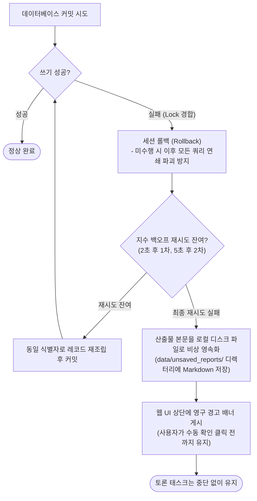

# 4-6. 영속화와 스냅샷 아키텍처

> 상위: [4강. 핵심 기술](README.md) · 이전: [4-5. 대화 기억](05-context-memory.md) · 다음: [4-7. 실패를 설계하기](07-failure-design.md)

MADO의 영속화 저장소는 단일 SQLite 파일 기반으로 구성되어 있습니다. 물리적 인프라 구성은 가볍고 단순하지만, 이를 안정적으로 운영하기 위해 해결해야 했던 소프트웨어 공학적 과제들은 결코 단순하지 않았습니다. 이미 시작된 대화 세션을 전역 설정 변경으로부터 어떻게 완벽히 격리할 것인가, 단일 데이터베이스 컬럼에 복수의 의미가 혼용되는 것을 어떻게 방지할 것인가, 외부 마이그레이션 프레임워크 없이 폐쇄망에서 스키마를 어떻게 안전하게 점진 확장할 것인가, 그리고 운영체제 레벨의 파일 잠금 장애가 발생했을 때 생성된 산출물을 어떻게 단 한 글자도 유실하지 않고 지켜낼 것인가를 다룹니다.

---

## 1. 시작된 대화의 자기완결성 (Self-contained Sessions)

### 페르소나만 동결했을 때 발생했던 구조적 결함

초기 버전에서는 사용자가 첫 메시지를 전송하는 시점에 에이전트의 **이름, 담당 역할, 시스템 프롬프트**의 3가지 속성만을 데이터베이스에 고정했습니다. 토론 도중에 에이전트의 페르소나가 변경되면 동일한 발언자가 이전 발언과 모순된 주장을 펼치게 되기 때문입니다.

그러나 에이전트 객체 인스턴스 자체는 매 턴마다 전역 설정 파일(`conf.json`)을 실시간 참조하고 있었습니다. 그 결과 시스템 관리자가 설정 파일에서 특정 에이전트를 삭제하면, 이미 해당 에이전트가 활발히 참여하고 있던 기존 대화 세션에서도 해당 발언자가 조용히 증발해 버리는 심각한 버그가 발생했습니다. DB에 저장된 페르소나 텍스트만으로는 에이전트를 복원할 수 없었습니다. 해당 에이전트가 어떤 모델을 사용했고, 어느 API 엔드포인트를 호출했으며, 어떤 도구 권한을 가졌는지에 대한 메타데이터가 전혀 남아있지 않았기 때문입니다.

### 에이전트 전체 설정의 스냅샷 동결

현재 시스템은 첫 사용자 메시지가 커밋되는 순간 참여 에이전트들의 **전체 설정 JSON 스냅샷**을 `session_agents` 테이블에 영구 동결합니다. 모델명, API 엔드포인트 URL, 자격 증명 키, 샘플링 파라미터(온도 등), 도구 접근 권한, 단계적 사고 모드, 발언 우선순위 및 진영, UI 카드 테마 색상과 아이콘까지 모두 포함됩니다.

이 시점 이후부터 해당 대화 세션은 전역 설정 파일의 변화로부터 완전히 독립됩니다([ADR-011](../05-adr/ADR-011-session-config-snapshot.md)).

| 전역 설정 파일(`conf.json`)의 변경 사항 | 이미 시작된 대화 세션 | 향후 새로 생성될 신규 대화 세션 |
| :--- | :--- | :--- |
| **신규 에이전트 추가** | **영향 없음** (로스터 패널에 미참여 체크박스로 표시되며 사용자가 직접 켜야 참여) | 기본 설정에 따라 신규 대화에 즉시 참여 |
| **기존 에이전트 삭제 또는 비활성화** | **완전 무영향** (동결된 스냅샷으로 정상 발언 지속) | 목록에서 즉시 배제 |
| **모델명, 엔드포인트 주소, API 키 변경** | **영향 없음** (세션 동결 당시의 설정 유지) | 즉시 신규 설정 적용 |
| **도구 권한 범위 수정** | **영향 없음** | 즉시 신규 설정 적용 |
| **UI 테마 색상, 아바타 아이콘 변경** | **영향 없음** (과거 발언 카드는 당시의 테마 색상 유지) | 즉시 신규 스타일 적용 |
| **MCP 도구 서버 프로세스 On/Off** | **영향 발생** | **영향 발생** |

마지막 행의 도구 서버 실행 여부가 유일한 물리적 예외입니다. 구성 스냅샷은 "해당 에이전트가 어떤 도구 서버를 호출할 수 있는가"라는 권한 명세를 보존할 뿐이며, 해당 도구 서버 프로세스가 실제 머신 상에 떠 있는지는 시스템 프로세스 전역의 물리적 상태이기 때문입니다.

웹 UI 화면 역시 이 단일 기준점(SSOT)을 철저히 따라야 합니다. 잠긴 대화의 로스터 패널과 페르소나 뷰어는 전역 에이전트 레지스트리가 아니라 데이터베이스 내의 세션 스냅샷을 기반으로 렌더링합니다. 설정 파일에서는 이미 삭제되었으나 해당 세션에만 살아남은 에이전트에는 `[이 대화 전용]` 뱃지를 표시합니다. 화면이 전역 설정을 조회하도록 잘못 작성되면, 삭제된 에이전트가 로스터 카드도 없이 허공에서 발언하는 비정상적인 UI 결함이 발생합니다.

### 안전한 예외 갱신 통로: 운영 설정 갱신의 분리

스냅샷을 단일 기준점(SSOT)으로 삼는 설계에는 트레이드오프가 따릅니다. 사내 LLM 엔드포인트의 IP 주소가 변경되거나 보안 토큰이 만료되어 갱신되었을 때, 과거 대화 세션들은 이미 죽어버린 구버전 엔드포인트를 계속 호출하다가 실패하게 됩니다.

따라서 잠긴 세션에서도 운영 설정을 안전하게 갱신할 수 있는 **"설정 갱신" 통로(비상구)**를 구축했습니다. 사용자가 UI에서 이 기능을 실행하면 현재 설정 파일의 최신 인프라 정보(모델명, API 엔드포인트, 도구 구성 등)로 운영 설정을 재동결하되, **에이전트의 페르소나(이름, 역할, 시스템 프롬프트)는 절대로 건드리지 않습니다.** 대화의 맥락적 발언자 정체성은 완벽히 보존하면서 인프라 연결 통로만 현대화하는 것입니다.

강력한 불변 규칙을 설계할 때는, 현실적인 인프라 변경을 수용할 수 있는 제어된 예외 갱신 통로를 반드시 함께 제공해야 합니다.

### 보안 트레이드오프와 다중 방어

에이전트 구성 스냅샷에 API 키가 포함되며 SQLite 파일은 평문으로 디스크에 저장됩니다. 대화 세션의 완전한 자기완결성을 확보한 대가로 보안 책임을 감수한 것입니다.

MADO는 이를 다음 2가지 방어책으로 완충합니다.
1. 외부로 노출되는 세션별 페르소나 조회 REST API는 이름, 역할, 프롬프트만을 선별 반환하며, 내부 스냅샷 필드는 직렬화에서 엄격히 차단합니다. 이를 단위 테스트로 상시 검증합니다.
2. 시스템 배포 가이드 문서에 `multiagent.db` 파일이 위치한 디렉터리의 OS 파일 접근 권한을 관리자 전용으로 제한하도록 명시하고 있습니다.

## 2. 허용 목록(Allow-list)의 함정과 존재 집합의 분리

각 대화 세션은 참여하는 에이전트 키 목록(`active_agents`)을 허용 목록 형태로 저장합니다. 초기 구현에서는 여기에 미묘한 결함이 숨어 있었습니다.

관리자가 전역 설정 파일에 신규 에이전트를 추가했을 때, **모든 기존 대화 세션에서 해당 에이전트가 비활성화(Off)된 것처럼** 표시되었습니다. 시스템이 특정 에이전트 키가 허용 목록에 없는 상태를 마주했을 때, 이것이 "사용자가 의도적으로 체크를 해제한 것"인지 아니면 "이 세션을 생성할 당시에는 세상에 존재하지 않던 에이전트"인지를 논리적으로 구별할 수 없었기 때문입니다.

해결책은 세션 메타데이터에 **"해당 세션이 생성될 당시 존재하던 에이전트 전체 목록"**을 함께 저장하는 것이었습니다. 이제 시스템은 명확히 판별할 수 있습니다.
- 세션 생성 당시에 이미 알던 에이전트인데 허용 목록에 없다면: 사용자가 의도적으로 참여를 배제한 에이전트입니다.
- 세션 생성 당시에는 몰랐던 신규 에이전트라면: 새롭게 추가된 에이전트이므로 기본 참여 정책에 따라 자연스럽게 처리합니다.

단순 허용 목록은 "무엇이 허용되었는가"만을 나타낼 뿐 "당시 무엇을 인지하고 있었는가"라는 맥락을 담지 못합니다. 데이터의 부재(Absence)에 두 가지 이상의 의미가 내포될 수 있다면, 이를 판별할 메타데이터를 반드시 독립 저장해야 합니다.

## 3. 단일 컬럼 단일 의미(Single Responsibility) 원칙

### 정렬 인덱스와 실제 물리적 발언 시각의 분리

웹 화면에 발언 메시지의 시작 시각과 종료 시각을 표시하기로 결정했을 때, 가장 유혹적인 지름길은 기존의 `created_at` 컬럼을 그대로 활용하는 것이었습니다. 그러나 이는 아키텍처적으로 치명적인 오류였습니다.

- `messages` 테이블의 레코드는 LLM 스트리밍 생성이 **완전히 끝난 직후에** DB에 커밋되므로, 생성 시각 필드는 사실상 종료 시각에 가깝습니다.
- 더욱이 병렬 실행 라운드에서는 브라우저 새로고침 후에도 의도된 발언 순서대로 카드가 배치되도록 보장하기 위해, `created_at` 컬럼을 "라운드 기준 시각 + 오케스트레이터 지시 순서(밀리초)"로 인위적으로 덮어쓰고 있었습니다.

즉, 기존의 `created_at` 컬럼은 타임스탬프가 아니라 **UI 렌더링 정렬 인덱스 키**로 기능하고 있었습니다. 하나의 컬럼에 발언 시각이라는 도메인 의미까지 억지로 덧씌우는 것은 데이터 모델을 오염시키는 행위입니다.

따라서 실제 발언 시작 시각(`started_at`)과 종료 시각(`finished_at`)을 담는 전용 컬럼을 새롭게 추가했습니다.
- `started_at`은 LLM 스트리밍 소켓을 열기 직전에 계측합니다.
- `finished_at`은 스트리밍 응답이 완료된 직후, **데이터베이스 쓰기 락 구간에 진입하기 직전**에 계측합니다. DB 락 획득을 위해 큐에서 대기한 지연 시간은 에이전트의 순수 발언 소요 시간에 포함되어서는 안 되기 때문입니다. 이를 통해 병렬 라운드에서 여러 발언의 실행 시간 구간이 실제로 중첩되는 객관적인 사실을 투명하게 기록할 수 있게 되었습니다.

### 부재하는 데이터의 임의 생성 금지

기존 데이터베이스에 신규 컬럼을 추가할 때 기본값(Default Value)을 무분별하게 부여해서는 안 됩니다. 만약 과거 발언 레코드들의 누락된 `started_at`, `finished_at`을 채우기 위해 스키마 마이그레이션 시점에 현재 시각을 기본값으로 채워 넣는다면, 과거의 모든 발언들이 마이그레이션이 수행된 그 특정 순간에 일제히 시작되고 종료된 것처럼 심각한 데이터 왜곡이 발생합니다.

기존 데이터의 경우 컬럼 값을 NULL로 유지하고, 화면 UI 계층에서는 해당 필드가 부재할 경우 단일 생성 시각만을 간결히 표시하도록 처리해야 합니다. 없는 데이터를 인위적으로 조작하여 지어내는 것은 아키텍처의 정직성 원칙에 정면으로 위배됩니다.

### NULL과 빈 문자열(`""`)의 명확한 의미 분리

구성 스냅샷(`config_snapshot`) 컬럼은 NULL을 허용합니다. 여기서 NULL은 "이 스냅샷 기능이 도입되기 이전에 생성된 구버전 대화 세션"이라는 명확한 도메인 의미를 가지며, 시스템은 하위 호환성을 위해 전역 설정 파일을 조회합니다.

반면 UI 카드 색상 컬럼은 NULL 대신 빈 문자열(`""`)을 기본값으로 취합니다. 비즈니스 로직상 "사용자가 특별히 색상을 지정하지 않은 상태"와 "데이터가 아직 없는 상태"가 동일한 기본 동작(에이전트 고유 키 해시 기반 자동 색상 부여)으로 처리되어야 하기 때문입니다. 기본값을 정의할 때는 해당 값이 비즈니스 로직에서 어떠한 구체적 분기로 유도될지를 사전에 면밀히 정의해야 합니다.

## 4. 폐쇄망 환경을 위한 마이그레이션 도구 없는 점진적 스키마 패치

일반적인 웹 프레임워크의 `Base.metadata.create_all()` 기능은 데이터베이스에 존재하지 않는 신규 테이블만 생성할 뿐, 기존 테이블에 새롭게 추가된 컬럼은 추가해 주지 못합니다. 

그렇다고 폐쇄망 환경에 Alembic과 같은 복잡한 외부 마이그레이션 프레임워크를 추가 반입하는 것은 의존성 관리 부담을 가중시킵니다. MADO는 애플리케이션 기동 수명주기 내에서 직접 구동되는 가벼운 점진적 스키마 패처를 구현했습니다.

```text
애플리케이션 기동
 ├─ 1. 코드베이스에 정의된 '신규 추가 컬럼 메타데이터 목록' 순회
 │    └─ SQLite PRAGMA table_info()로 실제 테이블 스키마 조회
 │         └─ 실제 테이블에 누락된 컬럼만 선별하여 ALTER TABLE ... ADD COLUMN 동적 실행
 └─ 2. 완전히 존재하지 않는 신규 테이블 생성 (create_all)
```

- 몇 번을 재실행하더라도 항상 동일한 최종 스키마 상태로 수렴하는 멱등성(Idempotency)을 보장합니다.
- 구버전 배포판에서 사용하던 수개월 전의 SQLite DB 파일을 최신 버전의 MADO에 그대로 마운트해도 즉시 안전하게 업그레이드되어 구동됩니다.
- 폐쇄망 반입 파이프라인이 단순하게 유지됩니다.

단, SQLite의 구조적 특성상 이 방식은 **"컬럼 추가"**에 한해서만 안전하게 작동합니다. 컬럼 이름 변경, 타입 변경, 컬럼 삭제는 SQLite에서 테이블 재생성 복사를 수반하므로 이 경량 메커니즘으로는 처리할 수 없습니다. 따라서 MADO의 데이터 모델은 컬럼을 추가하기만 하는 하위 호환성 확장 원칙을 엄격히 고수하고 있습니다.

## 5. 데이터베이스 잠금 장애 시의 다중 산출물 보존 전략

### 장애의 전개 과정

과거 v0.7.1 버전 운영 당시, 사용자가 잠시 자리를 비워 윈도우 화면이 잠긴 상태에서 최종 2만 자 분량의 장문 합성 보고서가 `database is locked` 오류를 일으키며 영구 유실되는 중대한 장애가 발생했습니다. 실시간 스트리밍 중에는 브라우저 화면에 보고서가 정상적으로 표시되고 있었기 때문에 사용자는 저장이 완료된 것으로 믿었으나, 페이지를 새로고침하는 순간 DB에 커밋되지 못한 보고서가 흔적도 없이 사라져 버렸습니다.

근본 원인은 다음 2가지의 치명적인 결합이었습니다.

### 원인 1: SQLite 드라이버의 기본 설정 취약성과 Windows 파일 잠금

SQLite 기본 드라이버의 쓰기 잠금 대기 시간은 고작 5초에 불과하며, 기본 저널 모드는 쓰기 트랜잭션마다 임시 롤백 저널 파일을 생성했다가 삭제하는 방식으로 동작합니다.

Windows 운영체제는 타 프로세스가 핸들을 열고 있는 파일을 삭제하거나 교체하는 것을 엄격히 차단합니다. 따라서 사내 백신 소프트웨어의 실시간 감시 엔진, Windows Search 색인 데몬, 사내 파일 동기화 프로그램이 DB 파일을 단 수 초만 스캔하더라도 쓰기 작업이 즉시 차단됩니다. 그리고 이러한 윈도우 백그라운드 관리 작업들은 대개 **사용자가 자리를 비워 시스템이 유휴 상태에 진입했을 때** 집중적으로 실행됩니다.

이를 방어하기 위해 SQLite 연결 설정에 3대 최적화 옵션을 영구 반영했습니다([ADR-017](../05-adr/ADR-017-never-lose-a-write.md)).

| SQLite 엔진 설정 | 적용 값 | 설정 근거 및 방어 효과 |
| :--- | :--- | :--- |
| **`busy_timeout` (잠금 대기)** | **30,000ms (30초)** | 발언 1건을 기록하는 데 필요한 순수 I/O는 수 밀리초에 불과합니다. 30초의 잠금을 유발하는 주체는 외부 백신 프로그램이며, 30초 대기 설정을 통해 외부 프로세스가 파일 스캔을 마칠 때까지 안정적으로 대기합니다. |
| **`journal_mode` (저널링 방식)** | **`WAL` (Write-Ahead Logging)** | 트랜잭션마다 파일을 생성·삭제하지 않고 전용 WAL 로그 파일에 순차 기록합니다. 특히 **읽기 작업과 쓰기 작업이 상호 락을 걸지 않고 완전 병렬로 실행**됩니다. |
| **`synchronous` (동기화 레벨)** | **`NORMAL`** | WAL 저널 모드와 완벽한 조화를 이루는 공식 권장값입니다. 대량 쓰기 I/O 지연을 획기적으로 줄이면서도 파일 손상을 완벽히 방지합니다. |

단, WAL 모드는 공유 메모리 IPC(`*.shm`)를 통해 프로세스 간 동기화를 수행하므로 네트워크 공유 파일 시스템(SMB, NFS)에서는 메모리 동기화가 불가능하여 파일이 파손될 수 있습니다. 따라서 **DB 파일 경로가 네트워크 드라이브나 UNC 경로로 지정된 경우에는 WAL 모드를 활성화하지 않도록 안전하게 보호**하고 있습니다.

### 원인 2: 저장 실패의 단순 로그 방치 결함

토론 루프를 중단시키지 않겠다는 선의의 설계가 낳은 부작용이었습니다. 단일 발언 메시지 1건의 저장이 실패했다고 해서 수 분간 진행된 토론 태스크 전체를 중단시켜 버리면 후속 발언들까지 모두 유실되기 때문에, 초기 코드에서는 쓰기 예외 발생 시 에러 로그만 1줄 출력하고 실행을 계속 이어가도록 방치하고 있었습니다. 문제는 턴 전체의 핵심 결실인 최종 합성 보고서 저장 실패 역시 동일한 로깅 무시 파이프라인을 타고 버려졌다는 점입니다.

현재 엔진의 모든 영속화 파이프라인은 다음과 같은 견고한 다단계 장애 극복 회로를 거칩니다.



- **지수 백오프 기반 재시도**: 일시적인 파일 잠금에 대응하여 세션을 롤백한 후 2초, 5초 간격으로 최대 2회 재시도합니다. SQLite 엔진 수준의 30초 대기 위에 애플리케이션 레벨의 재시도가 2중으로 보호막을 형성합니다.
- **로컬 디스크 비상 보존 (Emergency File Flush)**: 재시도마저 최종 실패할 경우, 생성된 텍스트 본문과 메타데이터를 로컬 파일 시스템(`data/unsaved_reports/`)에 Markdown 파일로 즉시 비상 격리 저장합니다. 최종 합성 보고서의 경우 파일명 서두에 `synthesis_` 접두사를 부여하여 사용자가 최우선으로 식별할 수 있도록 지원합니다.
- **영구 지속 알림 배너**: 수 초 후 자동으로 사라지는 토스트 알림은 사용자가 자리를 비웠을 때 무용지물이 됩니다. 사용자가 직접 "확인" 버튼을 눌러 닫기 전까지 브라우저 화면 상단에 영구 잔존하는 경고 배너를 띄웁니다.

**"장애 시 무작정 폐기한다"와 "장애 시 시스템 전체를 중단시킨다" 사이에는, "다른 안전한 대체 저장소에 즉시 보존하고, 사용자에게 가시적으로 알린 후 시스템을 지속한다"는 훌륭한 제3의 아키텍처 선택지가 존재합니다.**

## 6. 데이터 비영속화(Non-persistence)의 타이밍 제어

무엇을 저장할 것인가만큼이나 **"어느 시점까지 저장을 유보해야 하는가"**를 통제하는 것 역시 데이터 무결성의 핵심입니다.

- **누적 결정 장부와 대화 요약은 턴이 완전히 끝날 때까지 저장을 유보합니다.** 사용자가 토론 도중 "긴급 종료" 명령을 내려 턴을 취소하면 해당 턴에서 생성된 모든 임시 발언들이 데이터베이스에서 물리적으로 롤백 삭제됩니다. 만약 중간 과정에서 결정 장부를 미리 커밋해 두었다면, 롤백으로 인해 대화 이력에서는 지워진 환각성 발언의 파생 결정이 장부에 영구 잔존하는 심각한 정합성 왜곡이 발생합니다.
- **결정 장부와 요약이 가리키는 커밋 기준점은 메시지 개수(Count)가 아니라 고유 메시지 ID로 관리합니다.** 세션 복원 시 해당 메시지 ID를 기준으로 증분(Delta)을 계산합니다. 만약 기준이 되는 이전 발언 메시지가 사용자의 롤백으로 인해 삭제되었다면, 시스템은 "해당 위치까지의 변경사항은 이미 반영 완료된 것"으로 안전하게 간주하여 세션 전체의 이력을 한 번의 갱신 프롬프트에 무차별적으로 쏟아붓는 토큰 폭증을 방어합니다.
- **긴급 종료로 첫 번째 턴 요청까지 삭제되면 세션은 완전한 '초안(Draft)' 상태로 복귀합니다.** 동결되었던 페르소나 잠금이 안전하게 해제되며, 차기 턴이 실행될 때 그 시점의 최신 설정 파일 구성으로 새롭게 스냅샷을 형성합니다.

## 7. 테스트 격리와 데이터베이스 싱글턴 관리

SQLAlchemy 비동기 엔진 객체는 프로세스 수명주기 전반에서 단 하나만 유지되는 전역 싱글턴(Singleton)입니다. 초기 구현에서 이 싱글턴 엔진은 기본 설정으로 개발자의 로컬 개발 DB 파일 경로(`multiagent.db`)를 바라보고 있었습니다.

그 결과 특정 단위 테스트가 인메모리 테스트 DB를 미처 설정하기 전에 엔진 객체를 조기 참조하거나, 테스트 종료 후 싱글턴 객체를 깨끗이 초기화하지 않으면, **개발자의 실제 로컬 데이터베이스 파일에 테스트용 임시 대화 데이터가 대량으로 쓰여지는 오염 사고**가 발생했습니다.

현재는 pytest 테스트 픽스처가 구동되는 즉시 인메모리 SQLite(`sqlite+aiosqlite:///:memory:`) 엔진을 생성하여 전역 싱글턴 포인터를 강제 선점하도록 격리했습니다. 싱글턴 패턴은 어디서든 손쉽게 접근할 수 있어 매력적이지만, "어떤 코드가 먼저 객체를 초기화했는가"에 따라 시스템 런타임 결과가 비결정론적으로 달라지는 위험한 암묵적 결합을 유발합니다. 테스트 실행 순서에 따라 통과 여부가 달라지는 불안정한 테스트가 존재한다면 전역 싱글턴의 상태 오염부터 의심해 보아야 합니다.

---

## 핵심 요약

- 대화 세션은 첫 턴 개시 시점에 에이전트의 전체 설정을 스냅샷으로 영구 동결하여 전역 설정 변경에 영향받지 않는 완결성을 확보합니다.
- 설정 파일의 변경으로 인해 기존 세션의 통신이 두절되는 문제를 해결하기 위해, 페르소나를 보존한 채 연결 설정만 갱신하는 제어된 예외 갱신 통로(비상구)를 제공합니다.
- 단일 데이터베이스 컬럼에 다중 의미를 부여하지 않으며, 정렬 인덱스 키와 실제 물리적 발언 시작/종료 시각을 명확히 분리합니다.
- 폐쇄망의 특성을 고려하여 외부 마이그레이션 프레임워크 없이 점진적 컬럼 추가만을 지원하는 가벼운 멱등 스키마 패처를 운용합니다.
- SQLite 파일 잠금 경합에 대비하여 WAL 모드 및 30초 대기를 기본 적용하며, 최종 실패 시 디스크 비상 보존 및 영구 알림을 통해 데이터를 완벽히 지켜냅니다.

## 학습 점검 과제

1. 구성 스냅샷을 생성할 때 민감한 API 키만을 제외하고 저장한 뒤, 런타임 호출 시점에 API 키만은 전역 설정 파일에서 동적으로 읽어오도록 설계를 변경한다면, 보안성과 세션 자기완결성 사이에서 어떠한 트레이드오프가 발생할지 분석해 보십시오.
2. 데이터베이스 잠금 장애로 인해 `data/unsaved_reports/` 디렉터리에 비상 보존된 Markdown 보고서 파일들을, 시스템 유휴 시점에 자동으로 감지하여 SQLite 데이터베이스로 재적재(Re-ingestion)하는 백그라운드 워커를 설계하고자 할 때 고려해야 할 동시성 정합성 이슈를 설명해 보십시오.
3. 만약 영속화 저장소를 SQLite에서 PostgreSQL 클러스터로 전면 교체한다면, 본 절에서 다룬 장애 대응 장치 중 어떤 것들이 불필요해지고, 어떤 장치들은 여전히 필수적으로 유지되어야 할지 비교해 보십시오.
