# 4-6. 영속화와 스냅샷

> 상위: [4강. 핵심 기술](README.md) · 이전: [4-5. 대화 기억](05-context-memory.md) · 다음: [4-7. 실패를 설계하기](07-failure-design.md)

MADO의 저장소는 SQLite 파일 하나입니다. 구조는 단순하지만, 이 절에서 다룰 질문들은 단순하지 않습니다.
시작한 대화를 설정 변경으로부터 어떻게 지키는가, 한 컬럼에 두 의미를 싣지 않으려면 어떻게 하는가,
마이그레이션 도구 없이 스키마를 어떻게 키우는가, 그리고 저장이 실패했을 때 결과물을 어떻게 지키는가입니다.

---

## 1. 시작한 대화는 스스로 완결된다

### 페르소나만 굳혔을 때 생긴 구멍

처음에는 첫 메시지를 보낼 때 에이전트의 **이름, 역할, 시스템 프롬프트** 세 가지만 대화에 굳혔습니다.
토론 도중 인격이 바뀌면 같은 화자가 앞뒤로 모순된 말을 하게 되니까요. 그런데 에이전트 객체 자체는 여전히
매 턴 설정에서 가져왔습니다. 설정 파일에서 에이전트를 지우면, 그 에이전트는 이미 그를 쓰던 대화에서도
조용히 사라졌습니다. 저장된 페르소나로는 되살릴 수 없었습니다. 모델도, 엔드포인트도, 키도 없었으니까요.

### 설정 전체를 굳힌다

지금은 첫 메시지 순간에 에이전트의 **설정 전체**를 대화에 스냅샷으로 저장합니다. 모델, 엔드포인트, API 키,
샘플링 값, 도구 권한, 단계적 사고 설정, 발언 순서와 진영, 카드 색과 아이콘, 그리고 페르소나까지입니다.
그 순간부터 그 대화는 설정 파일을 읽지 않습니다.

| 설정 파일의 변화 | 이미 시작한 대화 | 아직 시작하지 않은 대화 |
| :--- | :--- | :--- |
| 에이전트 추가 | 영향 없음 (체크 해제 상태로 보이고, 사용자가 켜야 참여) | 기본으로 참여 |
| 에이전트 삭제, 비활성 | **영향 없음** (굳힌 설정으로 계속 발언) | 빠짐 |
| 모델, 엔드포인트, 키 변경 | 영향 없음 | 즉시 적용 |
| 도구 권한 변경 | 영향 없음 | 즉시 적용 |
| 카드 색, 아이콘 변경 | 영향 없음 (지난 턴은 기록될 때의 색 그대로) | 즉시 적용 |
| MCP **서버** 켜고 끄기 | **영향 있음** | 영향 있음 |

마지막 줄이 유일한 예외입니다. 스냅샷은 "이 에이전트가 **어떤 서버를** 부를 수 있는가"를 기록하지만,
그 서버 프로세스가 떠 있는지는 앱 전체의 성질입니다. 스냅샷으로 프로세스를 살릴 수는 없습니다.

화면도 같은 목록을 봐야 합니다. 잠긴 대화의 로스터와 페르소나 화면은 에이전트 풀이 아니라 스냅샷을
그립니다. 설정에서 사라졌지만 이 대화에만 남은 에이전트에는 "이 대화 전용" 표시를 붙입니다. 화면이 풀을
그리면, 삭제된 에이전트가 카드 없이 발언하는 이상한 모습이 됩니다.

### 비상구: 설정 갱신

스냅샷을 정본으로 삼으면 대가가 따릅니다. API 키를 교체하거나 게이트웨이 주소를 옮기면, 옛 대화들은 죽은
엔드포인트를 계속 두드립니다. 그래서 잠긴 대화에 **설정 갱신** 버튼을 두었습니다. 현재 설정 파일로 운영
설정을 다시 굳히되 **페르소나는 건드리지 않습니다.** 대화 기록 속 화자는 여전히 그때의 그 화자입니다.
설정에 더 이상 없는 에이전트는 그대로 둡니다.

강한 규칙을 세울 때는 그 규칙에서 빠져나가는 비상구도 함께 설계해야 합니다. 비상구가 없으면 사람들은
규칙 자체를 우회하는 방법을 찾습니다.

### 대가: 평문 키

스냅샷에는 API 키가 들어 있고, DB는 평문 SQLite입니다. 자기완결성의 대가입니다. 두 가지로 보완합니다.
세션별 페르소나를 조회하는 API는 이름, 역할, 시스템 프롬프트만 돌려주고 스냅샷은 절대 내보내지 않으며,
이를 테스트로 확인합니다. 그리고 배포 문서에 DB 파일 권한을 점검하라고 적어 둡니다.

## 2. 허용 목록만으로는 부족한 경우

대화마다 "참여하는 에이전트 키 목록"을 저장합니다. 허용 목록(allow-list)입니다. 여기에 문제가 하나
숨어 있었습니다. 설정 파일에 새 에이전트를 추가하면, **모든 기존 대화에서 그 에이전트가 꺼진 것처럼**
보였습니다. 허용 목록에 없는 키가 "사용자가 뺀 에이전트"인지 "목록을 저장할 때는 존재하지 않던
에이전트"인지 구분할 수 없었기 때문입니다.

해결은 목록을 하나 더 두는 것이었습니다. 로스터를 저장할 때 **그 시점에 존재하던 에이전트 목록**도 함께
저장합니다. 이제 "알던 에이전트인데 목록에 없다"면 뺀 것이고, "몰랐던 에이전트"라면 새로 생긴 것입니다.

허용 목록은 "무엇을 허용했는가"만 말하고 "무엇을 알고 있었는가"는 말하지 않습니다. 부재에 두 가지
의미가 있을 수 있다면, 둘을 구분할 정보를 따로 저장해야 합니다.

## 3. 한 컬럼에 한 의미

### 정렬 키와 발언 시각

발언의 시작과 종료 시각을 화면에 보여 주기로 했을 때, 가장 쉬운 길은 이미 있는 "생성 시각" 컬럼을 쓰는
것이었습니다. 그러면 틀렸을 것입니다.

- 발언 행은 LLM 응답이 **끝난 뒤에** 삽입됩니다. 그 값은 대략 발언의 끝입니다.
- 병렬 라운드에서는 그 값을 "라운드 기준 시각 + 지시 순서(밀리초)"로 덮어씁니다. 끝나는 순서는 매번
  다르지만, 새로고침하면 지시한 순서대로 다시 그려져야 하기 때문입니다.

즉 그 컬럼은 이미 **정렬 키**였습니다. 그래서 실제 시작 시각과 종료 시각을 새 컬럼으로 추가했습니다.
시작은 스트림을 열기 전에, 종료는 응답을 받은 뒤에 잽니다. 실패한 응답도 종료 시각을 잽니다. 엔드포인트가
포기하기까지 얼마나 걸렸는지도 알 가치가 있으니까요. 종료 시각은 DB 쓰기 잠금 **밖에서** 잽니다. 기록
차례를 기다린 시간은 발언 시간이 아닙니다. 병렬 라운드에서는 발언 구간이 서로 겹치는데, 그게 사실입니다.

### 없는 값을 지어내지 않는다

새 컬럼을 추가하는 이관은 **기본값 없이** 컬럼을 더합니다. 옛 행을 채우려고 기본값을 주면, 모든 옛 발언이
이관한 그 순간에 시작하고 끝난 것처럼 보입니다. 값이 없는 옛 행은 하나뿐인 생성 시각을 보여 주되, 그것을
"시작"이나 "종료"라고 부르지 않습니다.

### NULL과 빈 문자열의 뜻을 다르게

구성 스냅샷 컬럼은 NULL을 허용합니다. NULL은 "이 컬럼이 생기기 전에 잠긴 대화"를 뜻하고, 그런 대화는
예전처럼 살아 있는 설정 파일을 따릅니다. 반면 카드 색 컬럼은 빈 문자열이 기본값입니다. "색을 고르지 않음"과
"행이 아직 없음"이 같은 동작(키에서 색을 계산)을 원하기 때문입니다. 기본값은 그 값이 이끌어 낼 동작을 먼저
정하고 고릅니다.

## 4. 마이그레이션 도구 없이 스키마 키우기

ORM의 테이블 생성 기능은 없는 테이블만 만듭니다. 이미 있는 테이블에 컬럼을 추가하지는 않습니다. 그래서
기동할 때 "나중에 추가된 컬럼" 표를 실제 테이블 정보와 비교해, 빠진 컬럼만 `ALTER TABLE ... ADD COLUMN`
합니다.

```text
기동
 ├─ 나중에 추가된 컬럼 표를 순회
 │    └─ 실제 테이블에 없는 컬럼만 추가 (방금 만든 테이블은 건너뜀)
 └─ 없는 테이블 생성
```

- 몇 번을 실행해도 결과가 같습니다(멱등).
- 옛 DB 파일을 들고 새 버전으로 옮겨도 그대로 열립니다.
- 폐쇄망에 마이그레이션 도구를 하나 더 반입하지 않아도 됩니다.

한계도 분명합니다. 컬럼 이름 변경, 타입 변경, 삭제는 이 방식으로 할 수 없습니다. 그래서 이 프로젝트의
스키마는 **더하기만** 합니다. 규모가 커져 컬럼을 고쳐야 하는 날이 오면 그때는 정식 마이그레이션 도구가
필요합니다.

## 5. 저장 실패로 결과물을 잃지 않기

### 사고

사용자가 자리를 비워 화면이 잠긴 사이, 최종 합성 보고서가 `database is locked`로 저장되지 않았습니다.
보고서는 화면에는 흘러갔기 때문에 아무 문제가 없어 보였습니다. 새로고침하자 보고서가 사라졌습니다.

원인은 두 가지였고, 어느 하나만으로도 잃기에 충분했습니다.

### 원인 1: SQLite를 기본값으로 썼다

기본 설정에서 SQLite 드라이버는 잠금을 5초만 기다리고, 기록할 때마다 저널 파일을 만들었다 지웁니다.
Windows에서는 다른 프로세스가 열어 둔 파일을 교체할 수 없어서, 백신 검사나 검색 색인이나 백업 프로그램이
DB 파일을 몇 초만 열어도 기록이 실패합니다. 그리고 Windows는 바로 그런 작업을 **사용자가 자리를 비웠을 때**
돌립니다.

지금은 연결마다 세 가지를 설정합니다.

| 설정 | 값 | 이유 |
| :--- | :--- | :--- |
| 잠금 대기 | 30초 | 발언 하나를 기록하는 데는 몇 밀리초면 됩니다. 30초를 잡고 있는 쪽은 바깥 프로그램이고, 그 정도는 버팁니다 |
| 저널 모드 | WAL | 기록마다 저널 파일을 만들고 지우지 않고, 읽기가 쓰기를 막지 않습니다 |
| 동기화 수준 | NORMAL | WAL과 짝을 이루는 권장값. 정전 시 마지막 몇 건을 잃을 수는 있어도 파일이 깨지지는 않습니다 |

WAL은 공유 메모리로 프로세스 사이를 조율하는데, 네트워크 파일 시스템은 이를 보장하지 않습니다. 그래서
**DB가 네트워크 위치(UNC 경로, 네트워크 드라이브)에 있으면 WAL을 켜지 않습니다.** 파일이 깨질 수 있습니다.
잠금 대기 시간은 그래도 적용합니다.

실제로 다른 연결이 7초 동안 쓰기 잠금을 잡은 상태에서 쟀습니다. 고치기 전에는 5.5초 만에 실패했고,
고친 뒤에는 7초를 기다렸다가 성공했습니다.

### 원인 2: 기록 실패를 로그 한 줄로 남기고 버렸다

토론을 멈추지 않으려는 좋은 뜻이었습니다. 발언 하나를 기록하지 못했다고 토론 전체를 멈추면, 뒤에 올
발언까지 모두 잃으니까요. 문제는 최종 합성도 같은 길을 탔다는 것입니다.

지금은 엔진의 모든 기록(발언과 도구 기록, 산출물, 사용자 발언, 안내 메모)이 하나의 저장 경로를 지납니다.

```mermaid
flowchart TB
    w["기록 시도"] --> ok{"성공?"}
    ok -->|"예"| done(["완료"])
    ok -->|"아니오"| rb["롤백<br/>(안 하면 이후 모든 커밋이 실패)"]
    rb --> retry{"재시도 남았나?<br/>2초 뒤, 5초 뒤"}
    retry -->|"예"| rebuild["같은 ID로 행을 다시 만들어 재시도"]
    rebuild --> ok
    retry -->|"아니오"| file["내용을 마크다운 파일로 저장<br/>(세션 ID, 오류를 머리에)"]
    file --> notify["닫을 때까지 남는 알림"]
    notify --> cont(["토론은 계속"])
```



- **재시도.** 실패하면 롤백하고 2초, 5초 뒤에 다시 시도합니다. SQLite의 30초 대기 위에 얹히는 재시도입니다.
  롤백하면 세션에 넣었던 객체가 분리되므로, 시도마다 같은 ID로 행을 새로 만듭니다.
- **그래도 보존.** 끝내 실패하면 내용을 앱 데이터 폴더의 미저장 폴더에 마크다운 파일로 씁니다. 최종 합성은
  파일 이름에 `synthesis`를 넣어 사람이 가장 먼저 찾게 합니다.
- **알림.** 저절로 사라지지 않고 닫을 때까지 남는 알림을 띄웁니다. 이 일은 대개 아무도 보지 않을 때 일어나고,
  몇 초 뒤 사라지는 알림은 그때 아무 쓸모가 없습니다.
- **예외를 올리지 않습니다(취소만 예외).** 기록 실패가 토론을 멈추면 앞으로 나올 모든 발언을 잃습니다.

**"실패하면 버린다"와 "실패하면 멈춘다" 사이에는 세 번째 선택지가 있습니다.** 다른 곳에 보존하고, 사람에게
알리고, 계속 가는 것입니다.

## 6. 언제 저장하지 않는가

저장만큼 중요한 것이 **저장하지 않는 시점**입니다.

- **결정 장부와 요약은 턴이 끝나야 저장합니다.** 사용자가 긴급 종료로 턴을 되돌리면 그 턴이 만든 발언,
  도구 기록, 산출물을 지웁니다. 장부가 먼저 저장되어 있으면 지워진 발언에서 나온 결정이 남습니다.
- **장부가 가리키는 위치는 개수가 아니라 메시지 ID로 저장합니다.** 다시 불러온 기록에서 그 ID를 찾아 위치를
  계산합니다. 턴이 저장 전에 죽었다면 다음 턴은 마지막으로 저장된 지점부터 접습니다. 장부의 기준 메시지가
  사라졌다면 "여기까지는 모두 반영됨"으로 봅니다. 기록 전체를 한 번의 갱신에 다시 쏟아 넣지 않기 위해서입니다.
  요약의 기준 메시지가 사라졌다면 요약을 버립니다. 원문과 겹치거나 빠지는 부분이 생기기 때문입니다.
- **긴급 종료로 첫 요청까지 지워지면 대화는 시작 전으로 돌아갑니다.** 페르소나 잠금이 풀리고, 다음 턴이
  시작될 때 그 시점의 설정으로 다시 굳습니다.
- **장부를 갱신해도 대화의 수정 시각은 바꾸지 않습니다.** 사이드바의 정렬 순서가 내부 정리 때문에 흔들리면
  안 됩니다.

## 7. 테스트와 싱글턴

DB 엔진은 프로세스에 하나만 만드는 싱글턴이고, 엔진 객체는 기본값으로 개발 폴더의 DB 파일을 가리킵니다.
그래서 어떤 테스트가 메모리 DB를 준비하기 전에 엔진을 만들거나, 싱글턴을 초기화한 테스트 뒤에 실행되면,
**개발자의 실제 DB에 테스트 대화가 쌓였습니다.** 지금은 모든 테스트 전에 메모리 DB로 엔진을 먼저 만들어 둡니다.

싱글턴은 "누가 먼저 만들었는가"에 따라 동작이 달라지는 숨은 의존을 만듭니다. 테스트 순서를 바꾸면 결과가
바뀌는 테스트가 있다면, 싱글턴부터 의심해 보세요.

---

## 정리

- 시작한 대화는 설정 전체를 스냅샷으로 굳혀 스스로 완결되게 하고, 운영 설정만 다시 굳히는 비상구를 둡니다.
- 부재에 두 가지 의미가 있다면 둘을 구분할 정보를 따로 저장합니다.
- 한 컬럼에 한 의미만 싣고, 없는 값은 기본값으로 지어내지 않습니다.
- 더하기만 하는 스키마라면 누락 컬럼 추가만으로 이관할 수 있습니다.
- 저장이 실패하면 기다리고, 재시도하고, 그래도 안 되면 다른 곳에 보존하고 알린 뒤 계속 갑니다.
- 되돌릴 수 있는 턴의 파생 데이터는 턴이 끝나야 저장합니다.

## 생각해 볼 문제

1. 구성 스냅샷에서 API 키만 빼고 저장하고, 키는 늘 설정 파일에서 읽는다면 무엇이 좋아지고 무엇이 깨질까요?
2. 미저장 파일로 보존한 보고서를 나중에 DB에 다시 넣는 기능을 만든다면, 어떤 점을 조심해야 할까요?
3. PostgreSQL로 옮긴다면 이 절의 어떤 장치가 필요 없어지고, 어떤 장치는 여전히 필요할까요?
