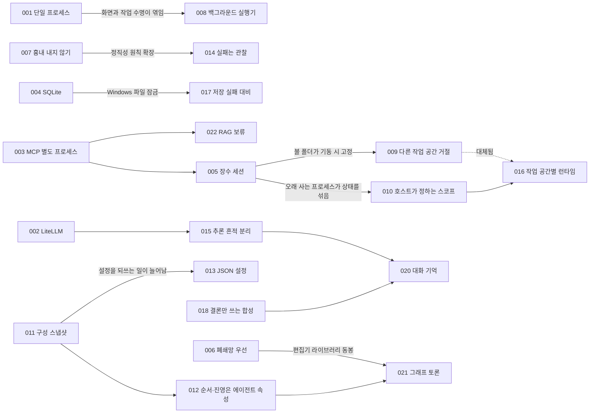

# 5강. 아키텍처 결정 기록 (ADR)

> 이전: [4-7. 실패를 설계하기](../04-core-techniques/07-failure-design.md) · 다음: [ADR-001](ADR-001-python-single-process.md)

코드는 시스템이 **무엇을** 구현했는지는 명확히 보여 주지만, **왜** 그렇게 구현했는지는 설명해 주지 못합니다. 6개월 뒤 누군가 "대화 구성 스냅샷에 왜 민감한 API 키까지 함께 저장했습니까? 보안상 위험하지 않습니까?"라고 질문한다면, 그 답변은 소스 코드 어디에서도 찾을 수 없습니다. 아키텍처 결정 기록(Architecture Decision Record, ADR)은 그러한 "왜"라는 질문에 대한 설계 맥락과 판단 근거를 간결하게 남기는 의사결정 문서입니다.

이 강에서는 MADO의 커밋 이력과 릴리스 노트, 아키텍처 논의 과정에서 도출된 핵심 결정 22건을 엄선하여 ADR 형식으로 체계화했습니다. 실제 프로젝트 초기에는 의사결정 시점마다 ADR을 작성하지 못했습니다. 따라서 이 문서들은 커밋 메시지와 당시의 장애 보고서에 남겨진 기록을 바탕으로 **사후에 체계적으로 복원한 역사적 기록**입니다.

---

## ADR의 형식

Michael Nygard가 제안한 경량 아키텍처 결정 기록 표준 형식을 준용합니다. 각 문서는 네 가지 필수 영역으로 구성됩니다.

| 영역 | 수록 내용 | 작성 지침 |
| :--- | :--- | :--- |
| **상태 (Status)** | 이 결정의 현재 유효성 여부 | 채택 일자와 함께 기록하며, 후속 결정으로 변경되었다면 대체된 대상 ADR을 명시합니다. |
| **맥락 (Context)** | 당시 직면했던 상황, 기술적 제약, 설계 압박 | 배경을 모르는 제3자가 읽더라도 "당시 상황이라면 나라도 고민했겠다"고 공감할 수 있도록 사실과 제약 조건 중심으로 서술합니다. |
| **결정 (Decision)** | 채택하기로 확정한 아키텍처 방안 | 명확하고 단호한 어조로 기술하며, 검토했던 대안들 중 무엇을 배제했는지도 함께 명시합니다. |
| **결과 (Consequences)** | 결정으로 얻은 이점과 감수해야 할 기회비용 | 긍정적인 성과만 나열하면 홍보 문서에 불과합니다. 시스템이 치러야 할 비용과 이후 파생된 후속 과제까지 솔직하게 기록합니다. |

ADR은 **기존 내용을 수정하지 않고 불변의 문서로 누적 보존합니다.** 의사결정 사항이 번복되거나 개선되더라도 기존 ADR을 덮어쓰거나 삭제하지 않고, 상태를 "대체됨(Superseded)"으로 갱신한 뒤 새로운 번호의 ADR을 발행합니다. 그래야만 "과거에는 왜 그런 방식을 선택했는가?"라는 의문에 투명하게 답할 수 있습니다. 본 강의의 ADR-009와 ADR-016이 바로 그러한 승계 관계를 보여주는 대표적인 사례입니다.

## 상태 범례

| 상태 | 의미 |
| :--- | :--- |
| 제안됨 (Proposed) | 현재 검토 및 논의 중이며, 아직 최종 승인되지 않은 상태입니다. |
| 채택됨 (Accepted) | 공식 결정되어 현재 시스템 아키텍처에 유효하게 적용 중인 상태입니다. |
| 대체됨 (Superseded) | 후속 ADR의 채택으로 효력을 다했으나, 설계 역사로 보존된 상태입니다. |
| 보류 (Deferred) | 결정을 의도적으로 유보한 상태입니다. 재검토 조건과 시점을 명시합니다. |
| 폐기 (Deprecated) | 더 이상 유효하지 않으나 별도의 직접적인 대체 결정은 없는 상태입니다. |

## 목록

| 번호 | 제목 | 날짜 | 상태 | 관련 버전 |
| :--- | :--- | :--- | :--- | :--- |
| [001](ADR-001-python-single-process.md) | 파이썬 단일 프로세스로 API와 화면을 함께 서빙한다 | 08-26 | 채택됨 | 초기 |
| [002](ADR-002-litellm-gateway.md) | 모든 LLM 호출은 LiteLLM을 거친다 | 08-26 | 채택됨 | 초기 |
| [003](ADR-003-mcp-tool-protocol.md) | 도구는 MCP 서버로, 앱과 다른 프로세스에서 돌린다 | 08-26 | 채택됨 | 초기 |
| [004](ADR-004-sqlite-persistence.md) | 저장소는 SQLite 파일 하나로 한다 | 08-26 | 채택됨 | 초기 |
| [005](ADR-005-long-lived-mcp-sessions.md) | MCP 세션은 한 번 열어 오래 유지한다 | 08-26 | 채택됨 | 초기 |
| [006](ADR-006-airgap-first-packaging.md) | 폐쇄망 반입을 전제로 두 종류의 패키지를 만든다 | 08-26 ~ 28 | 채택됨 | 초기 |
| [007](ADR-007-no-simulated-answers.md) | 연결에 실패한 LLM의 답을 흉내 내지 않는다 | 08-28 | 채택됨 | 초기 |
| [008](ADR-008-background-debate-runner.md) | 토론 실행을 브라우저 화면에서 떼어 낸다 | 08-28 | 채택됨 | 초기 |
| [009](ADR-009-refuse-cross-workspace-debates.md) | 작업 공간이 다른 토론은 동시에 돌리지 않는다 | 08-28 | **대체됨** (→016) | 초기 |
| [010](ADR-010-host-defined-tool-scope.md) | 도구 상태의 격리 경계는 호스트가 정한다 | 08-28 | 채택됨 | 초기 |
| [011](ADR-011-session-config-snapshot.md) | 시작한 대화는 에이전트 설정 전체를 굳힌다 | 08-30 | 채택됨 | v0.1 |
| [012](ADR-012-agent-owned-debate-order.md) | 발언 순서와 진영은 에이전트가 들고, 전략은 순서와 지침만 정한다 | 08-30 | 채택됨 | v0.1 |
| [013](ADR-013-json-config.md) | 설정 형식을 TOML에서 JSON으로 바꾼다 | 08-30 | 채택됨 | v0.1 |
| [014](ADR-014-tool-failure-is-observation.md) | 도구 실패는 관찰 결과다, 취소만 전파한다 | 09-08 | 채택됨 | v0.5 |
| [015](ADR-015-reasoning-out-of-prompts.md) | 추론 흔적은 사람에게만 보이고 프롬프트에는 넣지 않는다 | 09-09 | 채택됨 | v0.5 |
| [016](ADR-016-per-workspace-mcp-runtime.md) | 작업 공간마다 MCP 런타임을 따로 띄운다 | 09-09 | 채택됨 | v0.6 |
| [017](ADR-017-never-lose-a-write.md) | 저장 실패로 결과물을 잃지 않는다 | 09-13 | 채택됨 | v0.7.1 |
| [018](ADR-018-orchestrator-writes-conclusions.md) | 오케스트레이터는 결론과 다이어그램만 쓴다 | 09-14 | 채택됨 | v0.7.2 |
| [019](ADR-019-owner-token-remote-access.md) | 원격 접속은 주인이 발급한 토큰 하나로 연다 | 09-15 | 채택됨 | v0.8.2 |
| [020](ADR-020-conversation-memory.md) | 긴 대화는 버리기 전에 고정하고 접는다 | 09-17 | 채택됨 | v0.8.3 |
| [021](ADR-021-graph-debate.md) | 사람이 그린 그래프로 토론 흐름을 정한다 | 09-17 | 채택됨 | v0.9.0 |
| [022](ADR-022-knowledge-base-deferred.md) | 지식베이스(RAG) 도구는 근거를 모을 때까지 보류한다 | 09-21 | **보류** | 미정 |

날짜는 모두 2026년 기준입니다.

## 결정들 사이의 관계

개별 아키텍처 결정은 고립되어 존재하지 않습니다. 하나의 결정이 새로운 기술적 과제를 드러내고, 그 문제가 다시 후속 결정을 견인합니다.



위 관계도에서 크게 두 갈래의 구조적 흐름을 관찰할 수 있습니다.

- **도구 격리의 흐름 (003 → 005 → 010/009 → 016)**: 도구를 외부 프로세스로 분리하자(003), 프로세스 기동 지연 때문에 세션을 장기간 유지해야 했고(005), 장수 프로세스가 대화 세션 간 내부 상태를 오염시키는 문제가 드러났으며(010), 접근 가능한 작업 디렉터리가 기동 시점에 고정되어 서로 다른 작업 공간의 동시 실행을 차단해야 했습니다(009). 이는 결국 작업 공간별 런타임 분리(016)라는 구조적 해결책으로 귀결되었습니다. 하나의 설계 선택이 다음 과제를 촉발하는 전형적인 아키텍처 진화 과정입니다.
- **정직성의 흐름 (007 → 014, 017, 018)**: "존재하지 않는 가짜 결과를 지어내지 않는다"는 원칙(007)은 실패를 에이전트의 관찰 결과로 변환하는 규약(014), 데이터베이스 저장 실패를 은폐하지 않는 원칙(017), 빈 합성 결과를 솔직한 실패로 명시하는 규칙(018)으로 체계적으로 확장되었습니다.

## 읽는 요령

- **맥락(Context)을 먼저 정독하고 잠시 생각을 멈추십시오.** 결정 내용을 확인하기 전에 "내가 설계자라면 이 제약 속에서 어떤 선택을 내렸을까?"를 고민해 보면, 실제 채택된 방안과 비교하며 훨씬 깊은 통찰을 얻을 수 있습니다.
- **결과(Consequences) 영역의 "치르는 비용"을 면밀히 분석하십시오.** 훌륭한 ADR은 의사결정의 대가를 숨기지 않습니다. 이 비용 항목들은 대개 차기 ADR을 유발하는 새로운 맥락이 됩니다.
- **대체된(Superseded) ADR도 반드시 확인하십시오.** ADR-009는 비록 현재 유효하지 않지만, 시스템의 가용성과 데이터 정직성이 정면으로 충돌했을 때 이 프로젝트가 무엇을 최우선 가치로 선택했는지를 가장 명확히 보여줍니다.

## 새 ADR 쓰기

여러분의 실무 프로젝트에 바로 적용할 수 있는 ADR 기본 템플릿입니다. 단일 결정당 하나의 문서로 작성하며, 가급적 한두 페이지 이내의 분량을 유지하는 것이 바람직합니다.

```markdown
# ADR-NNN. 결정을 한 문장으로

## 상태 (Status)
채택됨 · YYYY-MM-DD · 관련: ADR-xxx

## 맥락 (Context)
무슨 일이 있었나. 어떤 제약과 압력이 있었나. 검토한 선택지는 무엇이었나.

## 결정 (Decision)
우리는 ~하도록 합니다. ~는 수행하지 않습니다.

## 결과 (Consequences)
좋아지는 점:
치르는 비용:
이후에 따라온 결정:
```

"언제 ADR을 작성해야 하는가?"에 대한 실용적인 판단 기준을 마련해 둘 수 있습니다. **결정을 되돌리는 데 하루 이상의 리팩터링 비용이 발생하거나, 향후 6개월 뒤 동료가 "왜 이렇게 구현했습니까?"라고 질문할 가능성이 높은 의사결정**이라면 반드시 ADR을 작성해야 합니다. 핵심 라이브러리 선정, 데이터 영속화 모델의 구조, 예외 및 실패 처리 전략, 보안 경계 설정 등이 대표적입니다. 단순한 변수 명명이나 일상적인 파일 배치는 ADR의 작성 대상이 아닙니다.
