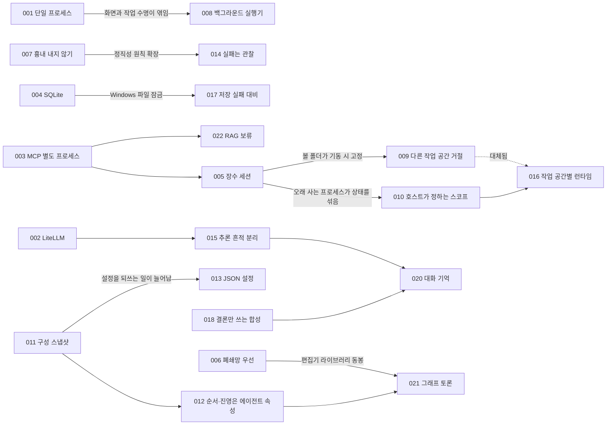

# 5강. 아키텍처 결정 기록 (ADR)

> 이전: [4-7. 실패를 설계하기](../04-core-techniques/07-failure-design.md) · 다음: [ADR-001](ADR-001-python-single-process.md)

코드는 **무엇을** 했는지 보여 주지만 **왜** 그렇게 했는지는 보여 주지 않습니다. 6개월 뒤 누군가 "이 대화
구성 스냅샷에 왜 API 키까지 넣었지? 위험한데"라고 묻는다면, 그 답은 코드 어디에도 없습니다. 아키텍처 결정
기록(Architecture Decision Record, ADR)은 그 "왜"를 남기는 짧은 문서입니다.

이 강에서는 MADO의 커밋 기록과 릴리스 노트, 설계 논의에서 중요한 결정 22건을 골라 ADR로 다시 썼습니다.
실제 프로젝트는 결정 당시에 ADR을 쓰지 않았습니다. 그래서 이 문서들은 **사후에 복원한 기록**입니다. 커밋
메시지에 남은 맥락과 당시의 장애 보고가 근거입니다.

---

## ADR의 형식

Michael Nygard가 제안한 형식을 따릅니다. 네 부분으로 이루어집니다.

| 부분 | 담는 것 | 쓰는 요령 |
| :--- | :--- | :--- |
| **상태 (Status)** | 이 결정이 지금 유효한가 | 날짜와 함께. 대체되었다면 무엇으로 대체되었는지 |
| **맥락 (Context)** | 어떤 상황, 제약, 압력이 있었나 | 결정을 모르는 사람이 읽고 "나라도 고민했겠다"고 느끼게. 당시의 사실만 |
| **결정 (Decision)** | 무엇을 하기로 했나 | "~한다"처럼 단정적으로. 선택지가 있었다면 무엇을 버렸는지도 |
| **결과 (Consequences)** | 그래서 무엇이 좋아지고 무엇을 치르나 | 좋은 점만 쓰면 광고입니다. 비용과 이후에 따라온 결정까지 |

ADR은 **고치지 않고 쌓습니다.** 결정이 바뀌면 옛 ADR을 지우지 않고 상태를 "대체됨"으로 바꾼 뒤 새 ADR을
씁니다. 그래야 "왜 예전에는 그렇게 했지?"에도 답할 수 있습니다. 이 강의 ADR-009와 ADR-016이 그런 짝입니다.

## 상태 범례

| 상태 | 뜻 |
| :--- | :--- |
| 제안됨 (Proposed) | 논의 중, 아직 결정 전 |
| 채택됨 (Accepted) | 결정되어 현재 유효 |
| 대체됨 (Superseded) | 다른 ADR로 바뀜. 역사로 남김 |
| 보류 (Deferred) | 결정을 미룸. 재논의 조건과 시점을 적음 |
| 폐기 (Deprecated) | 더 이상 유효하지 않지만 대체한 결정은 없음 |

## 목록

| 번호 | 제목 | 날짜 | 상태 | 관련 버전 |
| :--- | :--- | :--- | :--- | :--- |
| [001](ADR-001-python-single-process.md) | 파이썬 단일 프로세스로 API와 화면을 함께 서빙한다 | 08-26 | 채택됨 | 초기 |
| [002](ADR-002-litellm-gateway.md) | 모든 LLM 호출은 LiteLLM을 거친다 | 08-26 | 채택됨 | 초기 |
| [003](ADR-003-mcp-tool-protocol.md) | 도구는 MCP 서버로, 앱과 다른 프로세스에서 돌린다 | 08-26 | 채택됨 | 초기 |
| [004](ADR-004-sqlite-persistence.md) | 저장소는 SQLite 파일 하나로 한다 | 08-26 | 채택됨 | 초기 |
| [005](ADR-005-long-lived-mcp-sessions.md) | MCP 세션은 한 번 열어 오래 유지한다 | 08-26 | 채택됨 | 초기 |
| [006](ADR-006-airgap-first-packaging.md) | 폐쇄망 반입을 전제로 두 종류의 패키지를 만든다 | 08-26 ~ 28 | 채택됨 | 초기 |
| [007](ADR-007-no-simulated-answers.md) | 연결에 실패한 LLM의 답을 흉내 내지 않는다 | 08-28 | 채택됨 | 초기 |
| [008](ADR-008-background-debate-runner.md) | 토론 실행을 브라우저 화면에서 떼어 낸다 | 08-28 | 채택됨 | 초기 |
| [009](ADR-009-refuse-cross-workspace-debates.md) | 작업 공간이 다른 토론은 동시에 돌리지 않는다 | 08-28 | **대체됨** (→016) | 초기 |
| [010](ADR-010-host-defined-tool-scope.md) | 도구 상태의 격리 경계는 호스트가 정한다 | 08-28 | 채택됨 | 초기 |
| [011](ADR-011-session-config-snapshot.md) | 시작한 대화는 에이전트 설정 전체를 굳힌다 | 08-30 | 채택됨 | v0.1 |
| [012](ADR-012-agent-owned-debate-order.md) | 발언 순서와 진영은 에이전트가 들고, 전략은 순서와 지침만 정한다 | 08-30 | 채택됨 | v0.1 |
| [013](ADR-013-json-config.md) | 설정 형식을 TOML에서 JSON으로 바꾼다 | 08-30 | 채택됨 | v0.1 |
| [014](ADR-014-tool-failure-is-observation.md) | 도구 실패는 관찰 결과다, 취소만 전파한다 | 09-08 | 채택됨 | v0.5 |
| [015](ADR-015-reasoning-out-of-prompts.md) | 추론 흔적은 사람에게만 보이고 프롬프트에는 넣지 않는다 | 09-09 | 채택됨 | v0.5 |
| [016](ADR-016-per-workspace-mcp-runtime.md) | 작업 공간마다 MCP 런타임을 따로 띄운다 | 09-09 | 채택됨 | v0.6 |
| [017](ADR-017-never-lose-a-write.md) | 저장 실패로 결과물을 잃지 않는다 | 09-13 | 채택됨 | v0.7.1 |
| [018](ADR-018-orchestrator-writes-conclusions.md) | 오케스트레이터는 결론과 다이어그램만 쓴다 | 09-14 | 채택됨 | v0.7.2 |
| [019](ADR-019-owner-token-remote-access.md) | 원격 접속은 주인이 발급한 토큰 하나로 연다 | 09-15 | 채택됨 | v0.8.2 |
| [020](ADR-020-conversation-memory.md) | 긴 대화는 버리기 전에 고정하고 접는다 | 09-17 | 채택됨 | v0.8.3 |
| [021](ADR-021-graph-debate.md) | 사람이 그린 그래프로 토론 흐름을 정한다 | 09-17 | 채택됨 | v0.9.0 |
| [022](ADR-022-knowledge-base-deferred.md) | 지식베이스(RAG) 도구는 근거를 모을 때까지 보류한다 | 09-21 | **보류** | 미정 |

날짜는 모두 2026년입니다.

## 결정들 사이의 관계

결정은 홀로 서지 않습니다. 한 결정이 새 문제를 드러내고, 그 문제가 다음 결정을 부릅니다.



그림에서 두 갈래의 흐름이 보입니다.

- **도구 격리의 흐름 (003 → 005 → 010/009 → 016).** 도구를 별도 프로세스로 뺐더니(003), 세션을 오래
  유지해야 했고(005), 오래 사는 프로세스가 대화 사이에 상태를 섞었고(010), 볼 폴더가 기동 시점에 고정되어
  동시 실행을 막아야 했고(009), 결국 작업 공간별 런타임으로 풀었습니다(016). 한 결정이 다음 문제를 드러내는
  전형적인 사슬입니다.
- **정직성의 흐름 (007 → 014, 017, 018).** 지어내지 않는다는 원칙이, 실패를 결과로 바꾸는 규칙(014), 저장
  실패를 숨기지 않는 규칙(017), 빈 합성을 실패로 표시하는 규칙(018)으로 퍼져 나갔습니다.

## 읽는 요령

- **맥락부터 읽고 잠깐 멈추세요.** 결정을 보기 전에 "나라면 어떻게 했을까"를 먼저 생각해 보면, 실제 결정과
  비교하면서 훨씬 많이 배웁니다.
- **결과의 "치르는 비용"을 눈여겨보세요.** 좋은 ADR은 비용을 숨기지 않습니다. 비용 항목이 나중에 다른 ADR의
  맥락이 되는 경우가 많습니다.
- **대체된 ADR도 읽으세요.** ADR-009는 지금은 유효하지 않지만, 가용성과 정직성이 부딪혔을 때 이 프로젝트가
  무엇을 골랐는지 가장 잘 보여 줍니다.

## 새 ADR 쓰기

여러분의 프로젝트에서 쓸 수 있는 틀입니다. 한 결정에 한 문서, 한두 쪽을 넘기지 않는 것이 좋습니다.

```markdown
# ADR-NNN. 결정을 한 문장으로

## 상태 (Status)
채택됨 · YYYY-MM-DD · 관련: ADR-xxx

## 맥락 (Context)
무슨 일이 있었나. 어떤 제약과 압력이 있었나. 검토한 선택지는 무엇이었나.

## 결정 (Decision)
우리는 ~한다. ~는 하지 않는다.

## 결과 (Consequences)
좋아지는 것:
치르는 비용:
이후에 따라온 결정:
```

"언제 ADR을 써야 하나"도 간단한 기준으로 정해 둘 수 있습니다. **되돌리는 데 하루 이상 걸리거나, 반년 뒤 누군가
"왜?"라고 물을 것 같은 결정**이면 씁니다. 라이브러리 선택, 데이터 모델의 모양, 실패 처리 원칙, 보안 경계가
대표적입니다. 변수 이름이나 파일 배치는 대개 필요 없습니다.
