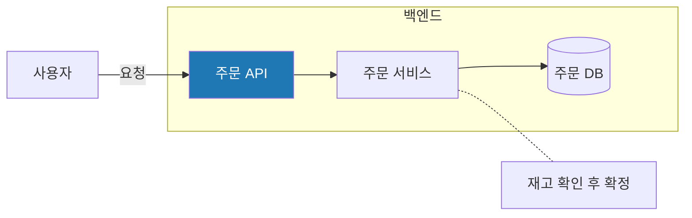
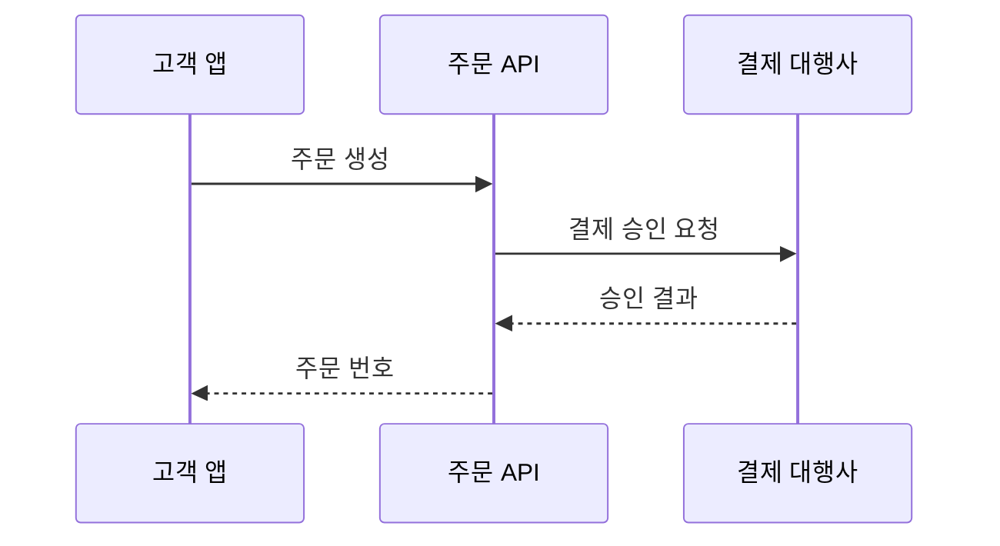

# Mermaid 체크리스트와 고친 예

MADO 의 검사기(`app/mermaid_lint.py`)가 거부하는 모양입니다. 하나라도 걸리면 합성 뒤에 다시 그리게
됩니다.

## 체크리스트

1. 첫 줄이 종류 선언인가 (`flowchart TD`, `sequenceDiagram` …). 본문에 `mermaid` 라는 머리글을 따로
   쓰지 않았는가.
2. 순서도에 시퀀스 문법(`Note …`, `participant`, `loop`, `alt`, `opt`, `->>`)이 섞이지 않았는가.
3. 괄호가 든 라벨을 큰따옴표로 감쌌는가.
4. 라벨 안에 큰따옴표가 겹치지 않았는가.
5. `subgraph` 와 `end` 의 짝이 맞는가. 제목은 `subgraph 아이디["제목"]` 모양인가.
6. 소문자 `end` 를 노드 이름으로 쓰지 않았는가.
7. `style`·`classDef` 의 색이 16진수인가.
8. 시퀀스 다이어그램에 `==>` 를 쓰지 않았는가.
9. `classDiagram`·`stateDiagram` 의 `{` 와 `}` 짝이 맞는가.

## 틀린 예 → 고친 예

### 괄호가 든 라벨

```text
틀림:  pg[결제 대행사 (PG)] --> bank
고침:  pg["결제 대행사 (PG)"] --> bank
```

### 순서도에 섞인 노트

```text
틀림:  Note right of api: 재시도 3회
고침:  api -.- note1["재시도 3회"]
```

### 순서도에 섞인 반복

```text
틀림:  loop 재시도
           api --> db
       end
고침:  subgraph retry["재시도 (최대 3회)"]
           api --> db
       end
```

### subgraph 제목

```text
틀림:  subgraph backend "백엔드"
고침:  subgraph backend["백엔드"]
```

### 예약어 end

```text
틀림:  start --> end
고침:  start --> done["완료"]
```

### 스타일 색

```text
틀림:  style api fill:rgb(31,119,180)
고침:  style api fill:#1f77b4
```

### 시퀀스 화살표

```text
틀림:  Client ==> Server: 요청
고침:  Client ->> Server: 요청
```

## 잘 되는 기본 틀




