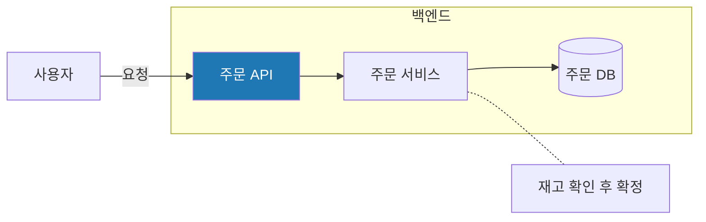
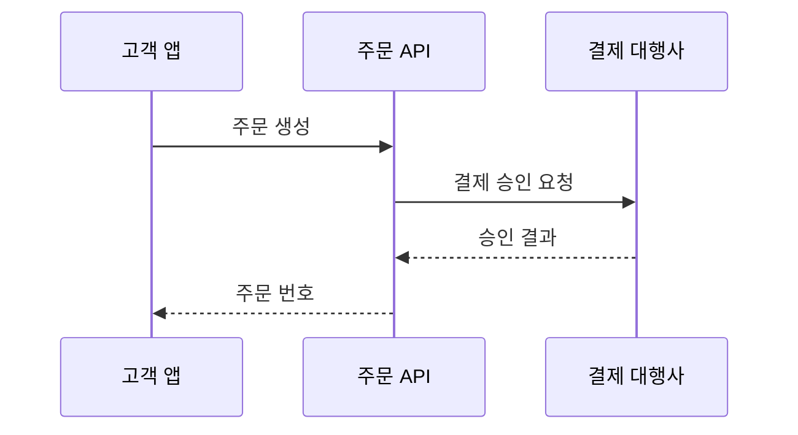

# Mermaid 점검 체크리스트 및 수정 예시

MADO의 문법 검사기(`app/mermaid_lint.py`)가 반려하는 주요 구문 오류 유형입니다. 오류 항목이 하나라도 포함되면 최종 합성 완료 후 재작성 절차를 거치게 됩니다.

## 점검 체크리스트

1. 첫 줄에 다이어그램 종류가 선언되어 있습니까 (`flowchart TD`, `sequenceDiagram` 등). 본문에 `mermaid`라는 불필요한 제목 키워드가 포함되어 있지 않습니까.
2. 순서도(`flowchart`)에 시퀀스 문법(`Note ...`, `participant`, `loop`, `alt`, `opt`, `->>`)이 혼용되지 않았습니까.
3. 괄호가 포함된 라벨을 큰따옴표로 올바르게 감쌌습니까.
4. 라벨 내부에 큰따옴표가 중복 사용되지 않았습니까.
5. `subgraph`와 `end`의 짝이 정확히 일치합니까. 서브그래프 제목이 `subgraph 아이디["제목"]` 형식입니까.
6. 소문자 `end`를 노드 식별자로 사용하지 않았습니까.
7. `style` 및 `classDef`의 색상 값이 16진수(HEX) 형식입니까.
8. 시퀀스 다이어그램에 지원되지 않는 `==>` 화살표를 사용하지 않았습니까.
9. `classDiagram` 및 `stateDiagram`의 중괄호(`{`, `}`) 짝이 정확합니까.

## 오류 예시 및 올바른 수정 예시

### 괄호가 포함된 라벨

```text
오류:  pg[결제 대행사 (PG)] --> bank
수정:  pg["결제 대행사 (PG)"] --> bank
```

### 순서도에 혼용된 노트

```text
오류:  Note right of api: 재시도 3회
수정:  api -.- note1["재시도 3회"]
```

### 순서도에 혼용된 반복문

```text
오류:  loop 재시도
           api --> db
       end
수정:  subgraph retry["재시도 (최대 3회)"]
           api --> db
       end
```

### subgraph 제목 표기

```text
오류:  subgraph backend "백엔드"
수정:  subgraph backend["백엔드"]
```

### 예약어 end 사용

```text
오류:  start --> end
수정:  start --> done["완료"]
```

### 스타일 색상 코드

```text
오류:  style api fill:rgb(31,119,180)
수정:  style api fill:#1f77b4
```

### 시퀀스 다이어그램 화살표

```text
오류:  Client ==> Server: 요청
수정:  Client ->> Server: 요청
```

## 정상 동작하는 표준 템플릿




