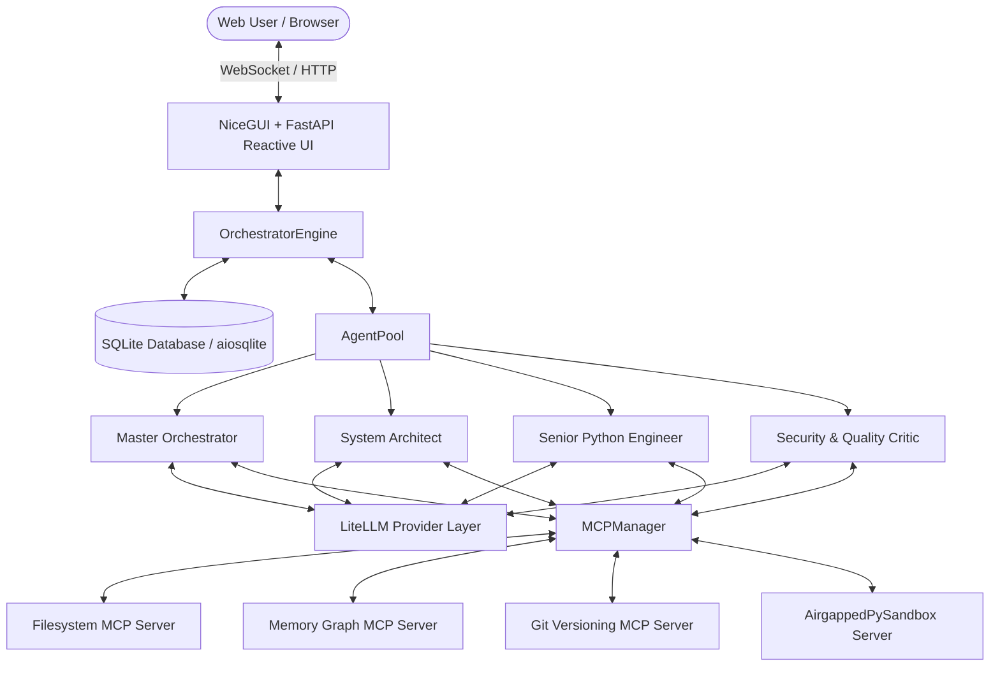

# MADO — Multi-Agent Debate & Orchestration Platform · Technical Wiki

Welcome to the **MADO: Multi-Agent Debate & Orchestration Platform** technical documentation and context wiki. This documentation repository provides comprehensive knowledge about the system architecture, agent orchestration engine, Model Context Protocol (MCP) host integration, dynamic configuration, reactive UI, and air-gapped deployment mechanisms.

---

## 🌳 Wiki Tree Structure

```text
wiki/
├── README.md                              # Main wiki index, roadmap & system summary
├── release-notes.md                       # Change history by version, linked to the topic pages
├── architecture/
│   ├── overview.md                        # High-level architecture, technology stack & data flow
│   └── database-schema.md                 # SQLite + SQLAlchemy async ORM data models & relationships
├── configuration/
│   ├── conf-json-reference.md             # Complete conf.json configuration guide & schema
│   └── environment-variables.md           # Dynamic env var substitution, defaults & nested evaluation
├── agents/
│   ├── agent-pool-and-roles.md            # AgentPool registry, built-in roles, card colour/icon & debate placement
│   ├── roster-editing.md                  # Editing conf.json from the UI: add, order, stance, disable, delete
│   ├── session-personas.md                # Persona lifecycle, freeze/lock & the self-contained session snapshot
│   └── llm-integration.md                 # LiteLLM multi-provider abstraction, tool loops & failure handling
├── mcp/
│   ├── overview-and-protocol.md           # Stdio MCP host/client architecture & persistent sessions
│   ├── bundled-servers.md                 # Filesystem, Memory, Git, Sandbox, and Sequential Thinking
│   ├── runtime-isolation.md               # Per-workspace runtime pool, concurrent sessions & process budget
│   ├── tool-security.md                   # Allow / ask / deny per action, approval cards & hard protections
│   └── error-handling-resilience.md       # Tool failure handling, Stderr streaming tee & auto-reconnect
├── orchestration/
│   ├── engine-lifecycle.md                # 3-phase execution: Planning, Debate Loop & Synthesis
│   ├── debate-strategies.md               # Sequential, Adversarial, Orchestrator-Led & Parallel Dispatch
│   ├── session-handoff.md                 # Continuing a debate in a fresh context, carrying the knowledge graph
│   ├── turn-recovery.md                   # Interrupted turns: turn records, detection, continue / finish / discard, tool-step drafts
│   ├── context-memory.md                  # Pinned user record, decision ledger & summaries when the window fills
│   └── artifact-generation.md             # Markdown reports, Mermaid diagrams & diagram self-repair
├── ui/
│   ├── nicegui-fastapi.md                 # NiceGUI + FastAPI reactive SPA architecture, routes & themes
│   └── components.md                      # Sidebar, Roster Control, Appearance Editor, Chat Feed, Artifact Viewer & Personas UI
└── operations/
    ├── getting-started.md                 # Local installation, setup scripts, execution & testing
    └── airgap-packaging.md                # Offline packaging bundle, portable runtimes & wheel installation
```

---

## 📌 Quick Topic Navigator

| Topic Area | Documentation Link | Key Subjects Covered |
| :--- | :--- | :--- |
| **Architecture** | [Overview](file:///d:/MultiAgentDebateOrchestration/wiki/architecture/overview.md)<br>[Database Schema](file:///d:/MultiAgentDebateOrchestration/wiki/architecture/database-schema.md) | FastAPI, NiceGUI, LiteLLM, Async SQLAlchemy, SQLite, Stdio MCP, StateGraph-inspired debate loops |
| **Configuration** | [conf.json Reference](file:///d:/MultiAgentDebateOrchestration/wiki/configuration/conf-json-reference.md)<br>[Environment Variables](file:///d:/MultiAgentDebateOrchestration/wiki/configuration/environment-variables.md) | JSON parsing, `//` comment keys, global `llm` inheritance, per-agent overrides, `${VAR:-default}` substitution |
| **Agents & Personas** | [Agent Pool & Roles](file:///d:/MultiAgentDebateOrchestration/wiki/agents/agent-pool-and-roles.md)<br>[Roster Editing](file:///d:/MultiAgentDebateOrchestration/wiki/agents/roster-editing.md)<br>[Session Personas](file:///d:/MultiAgentDebateOrchestration/wiki/agents/session-personas.md)<br>[LLM Integration](file:///d:/MultiAgentDebateOrchestration/wiki/agents/llm-integration.md) | Master Orchestrator, System Architect, Senior Coder, Security Critic, adding/removing agents from the UI, `debate_priority` / `debate_stance`, card colour and uploaded icons, session freeze and config snapshot |
| **MCP Tool Protocol** | [Overview & Protocol](file:///d:/MultiAgentDebateOrchestration/wiki/mcp/overview-and-protocol.md)<br>[Bundled Servers](file:///d:/MultiAgentDebateOrchestration/wiki/mcp/bundled-servers.md)<br>[Runtime Isolation](file:///d:/MultiAgentDebateOrchestration/wiki/mcp/runtime-isolation.md)<br>[Tool Security](file:///d:/MultiAgentDebateOrchestration/wiki/mcp/tool-security.md)<br>[Resilience & Errors](file:///d:/MultiAgentDebateOrchestration/wiki/mcp/error-handling-resilience.md) | Stdio client lifecycle, long-lived server processes, tool dispatch, `isError: true` feedback, stderr tee, per-workspace runtime pool and concurrent sessions, allow/ask/deny rules, approval cards, hard protections |
| **Orchestration** | [Engine Lifecycle](file:///d:/MultiAgentDebateOrchestration/wiki/orchestration/engine-lifecycle.md)<br>[Debate Strategies](file:///d:/MultiAgentDebateOrchestration/wiki/orchestration/debate-strategies.md)<br>[Session Handoff](file:///d:/MultiAgentDebateOrchestration/wiki/orchestration/session-handoff.md)<br>[Interrupted Turns](file:///d:/MultiAgentDebateOrchestration/wiki/orchestration/turn-recovery.md)<br>[Conversation Memory](file:///d:/MultiAgentDebateOrchestration/wiki/orchestration/context-memory.md)<br>[Artifact Synthesis](file:///d:/MultiAgentDebateOrchestration/wiki/orchestration/artifact-generation.md) | Round-based debate, speaker order from agent fields, speaking-order preview, orchestrator-led turn assignment, consensus criteria, continuing a session with its knowledge graph, resuming a turn cut by a restart (down to the last finished tool), pinned user record / decision ledger / summaries, multi-artifact parsing and Mermaid self-repair |
| **User Interface** | [NiceGUI & FastAPI](file:///d:/MultiAgentDebateOrchestration/wiki/ui/nicegui-fastapi.md)<br>[UI Components](file:///d:/MultiAgentDebateOrchestration/wiki/ui/components.md) | Single Uvicorn process, Quasar dark mode, real-time WebSocket updates, folding tool call logs, per-agent card colour and icon |
| **Operations** | [Getting Started](file:///d:/MultiAgentDebateOrchestration/wiki/operations/getting-started.md)<br>[Air-gap Packaging](file:///d:/MultiAgentDebateOrchestration/wiki/operations/airgap-packaging.md) | `setup_mcp.py`, `package_offline.py`, `package_source.py` incremental updates, zero-dependency air-gapped bundles, version pinning |
| **Release History** | [Release Notes](file:///d:/MultiAgentDebateOrchestration/wiki/release-notes.md) | What changed in each version, why, and which topic page covers it |

---

## 🧭 System Overview at a Glance

The MADO: Multi-Agent Debate & Orchestration Platform is a full-stack Python application designed for autonomous multi-agent collaboration, peer review, and artifact synthesis using the Model Context Protocol (MCP).



### Core Value Propositions
1. **Dynamic Configuration-Driven Profiling**: All agents, endpoints, credentials, models, MCP bindings, debate placement, and card appearance are defined in [conf.json](file:///d:/MultiAgentDebateOrchestration/conf.json) without touching source code — and can be edited from the roster panel without restarting the app.
2. **Self-Contained Sessions**: Personas and prompts can be customized per debate session. At the first user message the full `AgentConfig` of every agent — persona, model, endpoint, credentials, tool permissions, debate placement, card colour and icon — is snapshot into the database and locked. Afterwards the conversation no longer reads `conf.json`: agents can be deleted or re-pointed globally and that conversation keeps running exactly as it started.
3. **Robust Tool Calling via MCP**: Agents can inspect real files, maintain persistent knowledge graphs across token truncations, commit diffs to a Git repository, and execute Python code in an isolated IPython kernel sandbox.
4. **Air-Gap First Design**: The platform bundles offline runtimes (Node.js, CPython), reference MCP servers, and pinned wheels for zero-internet intranet deployment.
5. **Failures Stay Local**: A tool error is an observation the agent reads and corrects — it does not end a turn, a debate, or the process. An agent that cannot be reached is recorded as unreachable rather than simulated. A diagram that does not parse is sent back to its author before it becomes an artifact. See [Release Notes v0.5.0](file:///d:/MultiAgentDebateOrchestration/wiki/release-notes.md).
