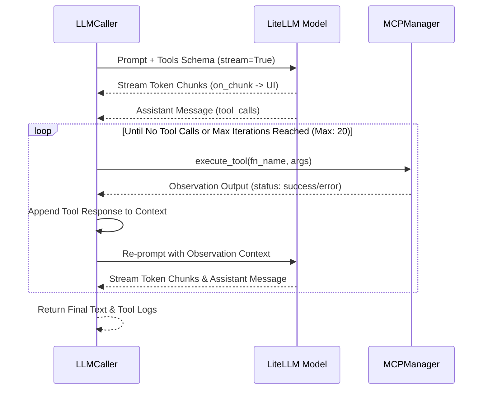

# LLM Integration & LiteLLM Gateway

The MADO: Multi-Agent Debate & Orchestration Platform integrates with Large Language Models via [LiteLLM](https://github.com/BerriAI/litellm), managed by the [`LLMCaller`](file:///d:/MultiAgentOrchestrator/app/agents/llm.py#L28-L362) class in [app/agents/llm.py](file:///d:/MultiAgentOrchestrator/app/agents/llm.py).

---

## 1. Unified Multi-Provider Abstraction

LiteLLM abstracts differences between provider APIs (OpenAI, Anthropic, Google Gemini, Azure OpenAI, AWS Bedrock, Vertex AI, Ollama, and self-hosted vLLM / LM Studio instances).

```mermaid
flowchart LR
    Agent[Specialist Agent Turn] --> LLMCaller[LLMCaller (llm.py)]
    LLMCaller --> ToolCheck{is_live?}
    
    ToolCheck -- Yes --> LiteLLM[LiteLLM Gateway]
    ToolCheck -- No / Fallback --> Sim[Intelligent Offline Simulator]
    
    LiteLLM --> Cloud[Cloud: OpenAI / Anthropic / Gemini / Azure]
    LiteLLM --> Local[Local: Ollama / vLLM / LM Studio]
    LiteLLM --> Gateway[Corporate LLM Gateway / Proxy]
```

### Parameter Mapping ([app/agents/llm.py](file:///d:/MultiAgentOrchestrator/app/agents/llm.py#L123-L183))
[`build_completion_kwargs()`](file:///d:/MultiAgentOrchestrator/app/agents/llm.py#L123-L183) translates agent settings into LiteLLM parameters:
- `model`: e.g. `"openai/gpt-4o"`, `"anthropic/claude-3-5-sonnet-20241022"`, `"ollama_chat/qwen2.5-coder:14b"`.
- `api_base`: Base endpoint URL.
- `api_key`: API token. For keyless local endpoints (Ollama, vLLM, LM Studio) that expect a non-empty string, a dummy token (`sk-no-key-required`) is provided automatically.
- `drop_params = True`: Automatically filters out unsupported flags when communicating with local models that do not accept standard OpenAI parameters.
- `timeout` and `num_retries`: Ensures network resilience.
- `extra_headers` and `extra_body`: Injects organization IDs, telemetry tags, or custom headers for corporate proxies.

---

## 2. The Multi-Turn Tool Calling Loop & Real-Time Streaming

When an agent has access to MCP tools, [`_run_litellm_loop()`](file:///d:/MultiAgentOrchestrator/app/agents/llm.py#L199-L270) runs an autonomous observation-thought loop up to `max_tool_iterations` (default: 30):



### Key Behaviors:
1. **Observation Feedback**: The tool output is appended to the message context with `role: "tool"`. The LLM observes the real output (or error message) and refines its reasoning in the next iteration.
2. **Incremental Token Streaming**: Using `acompletion(stream=True)` and `litellm.stream_chunk_builder`, partial word tokens are streamed to `on_chunk`, dynamically rendering in the UI while tools are accumulating.
3. **Tool Execution Streaming**: As each tool executes, the `on_tool_call` asynchronous callback dispatches events to the UI, rendering an accordion widget in the chat feed before the agent's text response finishes generating.
4. **Nothing in the loop may end the turn** (v0.5.0). Malformed `tool_calls` are absorbed by
   [`_parse_tool_call()`](file:///d:/MultiAgentOrchestrator/app/agents/llm.py) — object or dict
   shape, broken argument JSON, and a missing `tool_call_id` (which would make the *next*
   request a 400). Tool failures come back as `role: "tool"` observations via
   [`_execute_tool_safely()`](file:///d:/MultiAgentOrchestrator/app/agents/llm.py), and a dead
   UI callback cannot discard the observation of a tool that actually ran
   ([`_notify_tool_call()`](file:///d:/MultiAgentOrchestrator/app/agents/llm.py)). Only
   `CancelledError` propagates. See
   [MCP Resilience §4](file:///d:/MultiAgentOrchestrator/wiki/mcp/error-handling-resilience.md).


### 2.1. When a call fails, record what we sent (v0.5.3)

An endpoint does not always say why it refused. A gateway in front of vLLM was seen returning

```
Error code: 500 - {'error': "client error: 400, message='Bad Request', url='.../chat/completions'"}
```

— the upstream answered **400**, the gateway wrapped it in its own **500**, and vLLM's actual
message (`maximum context length...`, `roles must alternate...`) was discarded on the way. LiteLLM
classifies 500 as retryable, so a deterministic request-shape error was also retried twice before
surfacing. All that reached the log was the exception string, which said nothing about the request.

When the endpoint will not say why, the remaining evidence is our own. Every hard failure in
[`_complete_once()`](file:///d:/MultiAgentOrchestrator/app/agents/llm.py) — streaming and the
non-streaming retry both refused — now logs a
[`request_fingerprint()`](file:///d:/MultiAgentOrchestrator/app/agents/llm.py):

```
Request fingerprint for Senior Python Engineer (model=openai/qwen3-27b, api_base=http://gateway/v1):
  messages=12 roles=system,user,assistant,tool,assistant,tool,assistant,tool,assistant,tool,assistant,tool
  tokens~124,508 / budget 123,392 (window 128,000, max_tokens 4,096)  <-- OVER BUDGET
  tools=12 tool_choice=auto
  largest: [9] tool filesystem__read_text_file 120,000 chars; [5] tool ... 64,000 chars; [11] tool ... 30,999 chars
```

Each line answers one class of 400 without a round trip to the server's own logs:

| Line | What it settles |
|---|---|
| `roles=` (run-length encoded) | consecutive `user` turns (§5.2, §5.3); a `tool` result with no `assistant` before it |
| `tokens~ / budget` | context overflow — and whether `max_context_window` is set above the model's real limit, in which case the trim never fires and the endpoint refuses first |
| `tools= tool_choice=` | tool history sent with no tools defined (§5.3), or a `tool_choice` the endpoint rejects |
| `largest:` | which tool result inflated the request, by name and size |

**Sizes only, never content.** A tool that read a source file must not copy it into the log, and
what the diagnosis needs is the volume, not the text. Note that `tokens~` and `chars` diverge on
purpose: the token count comes from the tokenizer (`litellm.token_counter`), the sizes are raw
characters, and their ratio varies with the content.

Building the fingerprint can never fail the call — any error inside it becomes a one-line
`Request fingerprint unavailable ...` and the original exception propagates untouched.


### 2.2. A tool call that was cut off mid-argument (v0.5.3)

`max_tokens` bounds the *generation*, and a tool call is generated text. When an agent writes a
large file through `filesystem__write_file`, the arguments JSON is the output — and it can hit the
cap in the middle of a string:

```
{"path": "app/util.py", "content": "def load(path):
    if path:
```

Three things then went wrong in sequence, and only the first was handled.

1. `_parse_tool_call()` could not read the JSON, so it fell back to `{"raw": <the fragment>}` —
   correct: a malformed tool call must not end the turn.
2. The MCP server refused those arguments (`MCP error -32602: Input validation error`). Also fine
   as an observation — except the agent has no way to learn *why*, so it retries the same oversized
   write and is cut off at the same place, burning its tool budget.
3. The assistant turn was appended to the context as `message.model_dump()` — **the original,
   unrepaired arguments string.** From then on every request in that turn carried JSON we had
   ourselves failed to parse. vLLM rendered it through the model's chat template and answered
   **400**; the gateway in front of it wrapped that in a 500 and discarded the reason.

**What changed.** `_complete_once()` now returns `(message, finish_reason)` — `finish_reason` was
never inspected before, so being cut off was invisible. Since v0.6.1.2 two cases are kept apart
(see "Reaching the limit with readable calls" below): arguments that would not parse mean the call
really was cut and did not run; `length` with readable arguments means the calls **did** run.

[`_assistant_turn()`](file:///d:/MultiAgentOrchestrator/app/agents/llm.py) replaces the verbatim
`model_dump()`: every tool call is re-serialised from the arguments **we actually executed**, so
what leaves the process is always valid JSON. Unreadable arguments become a short
`{"_unreadable": "인자 N자를 읽지 못해 생략했습니다"}` — sending 14KB of truncated JSON back tells
the model nothing, costs tokens, and invites the same generation again. That normalisation also
closes a latent orphan: `_parse_tool_call()` invents a `tool_call_id` when the provider sends an
empty one, and previously only the `tool` result carried the invented id while the assistant turn
kept the empty one — a mismatched pair, which is a 400 in its own right.

Finally the agent is *told*, in words, via `TRUNCATED_TOOL_CALL_NOTICE`: which limit it hit, that
the call did not really run, and what to do instead. The `-32602` alone says none of that.

#### Reaching the limit with readable calls (v0.6.1.2)

A log line like `Truncated tool call ... finish_reason='length', tools=['filesystem__read_file']`
reads as if reading a file exceeded `max_tokens`. It cannot: `finish_reason` belongs to **one
response**, not to a tool, and a file's contents come back as the *input* of the next request. The
`tools` list named what the cut response was *asking for*. A 20-token read call reaches a
4,096-token cap only because something else in the same response used the budget — long reasoning
written before the call (prompt-mode `Thought 1..N`), a reasoning model's hidden
`reasoning_content`, another call in the same response, or a server that allows only what is left
of its context window once earlier tool results have filled it.

The old rule treated `length` alone as proof the arguments were cut. So a read call that parsed and
**ran** was followed by `TRUNCATED_TOOL_CALL_NOTICE` — "the call did not run, do not resend it" —
right under its own result, plus advice to split a file *write* the model never attempted.

The loop now separates the two:

| Situation | Executed? | The model is told |
| :--- | :--- | :--- |
| Some arguments would not parse (any `finish_reason`) | No | `TRUNCATED_TOOL_CALL_NOTICE` + `truncation_advice()` — unchanged |
| `length`, every call readable | **Yes** | `LIMIT_REACHED_AFTER_TOOL_CALLS_NOTICE`: the calls ran and their results are above; the cut point is the end of the **last** call, so check that its result is what was intended; anything planned after it in that response never went out; keep pre-call reasoning short |

The warning is not dropped for readable calls, because some providers repair a cut JSON so that it
parses while its content still ends mid-way. File-writing advice — "check the file really got all
of it", plus the append/split guidance — is added only when that last call is a write
(`is_file_writing_call()`), never after a read.

**The log now says what used the budget**, in sizes only, following the same rule as
`request_fingerprint`:

```
Response from Coder reached max_tokens after readable tool call(s); they were executed (the last one may be cut):
  finish_reason='length', max_tokens=4096, text=1,960 chars, reasoning=0 chars,
  prompt≈302 tok (window 128,000), calls=[filesystem__read_file(args 35 chars)]
```

`completion_budget_report()` separates the four causes at a glance: a large `text` is reasoning
written before the call; a large `reasoning` is a reasoning model thinking out of sight; a large
`args` is the call itself; all three small with `prompt` near `window` means the server capped the
output to what its window had left. A call whose arguments would not parse is marked `unreadable`
and logged as `Truncated tool call`. A tool-free answer cut at the limit (`Truncated answer`) carries
the same sizes.

**When reasoning ate the budget, say so.** Reasoning models count hidden reasoning against
`max_tokens`. One observed cut was 8,605 characters of reasoning plus a 17,672-character
`write_file` argument — a third of the output was thinking. "Split the write" alone invites the
same failure next round with a slightly smaller chunk, because the thinking still takes its third.
When reasoning is at least `REASONING_HEAVY_SHARE` (25%) of the response's output — measured in
characters with the same yardstick as `completion_budget_report`, so the log and the notice agree —
[`reasoning_heavy_note()`](file:///d:/MultiAgentOrchestrator/app/agents/llm.py) adds one paragraph:
keep the reasoning short and call the tool, and do not draft the file inside the reasoning (that
writes the same text twice). Below the threshold nothing is added; telling a model that barely
thinks to think less is noise. JSON escaping inflates argument sizes, so the share errs low —
toward saying less, not more. The same paragraph follows the readable-but-at-the-limit notice,
which has the same root.

**What to do instead depends on the tools that agent actually holds**, which is why
`truncation_advice()` resolves them by name tail — the same rule as `memory_write_tool()`, so a
renamed server key or a server that failed to start never produces advice to call a tool that is
not there. "Split the write across several calls" is good advice only if something can *append*:

| The agent has | It is told |
| :--- | :--- |
| an append tool (`edit_file`, `append_file`, …) | write the first part, then append with `<that tool>` by name — and *not* to continue with the overwriting tool, named too |
| only an overwriting tool (`write_file`) | splitting will not help; write several smaller **files** instead, or shorten the content |
| no file tool | just shorten the arguments |

The middle row is the one worth having. The official `@modelcontextprotocol/server-filesystem`
`write_file` *completely overwrites*, so a model that follows a naive "split it up" would resend
everything written so far on every call — 5k, then 10k, then 15k characters — growing quadratically
and hitting the same `max_tokens` again, only later. Naming the tool that can append, and the one
that cannot, is the difference between advice that works and advice that loops.

### 2.3. …and a plain answer that was cut off (v0.5.3)

A truncated *tool call* is caught by the MCP server, which refuses the arguments. A truncated
*answer* has no such objection: the turn simply ends mid-sentence, is stored that way, and the
reader cannot tell whether it was cut off or genuinely finished. Neither can the next speaker, nor
the final synthesis — and the synthesis is itself a long report from the same 4096-token budget.
The repo has quietly known this for a while: `test_unterminated_fence_is_still_extracted()` exists
because a Mermaid block in a synthesis report arrived without its closing fence.

`finish_reason` was only being consulted on the tool-calling path. Now the tool-free return — the
ordinary end of every turn — appends `TRUNCATED_ANSWER_FOOTER` when the endpoint says `length`:

```
> ⚠️ **응답 한도(max_tokens=8,192)에 걸려 이 발언은 여기서 잘렸습니다.** …
```

The two notices address different readers. `TRUNCATED_TOOL_CALL_NOTICE` goes to the *model*, in the
conversation, so it can recover on the next iteration. This footer goes to the *person*, in the
transcript, because there is nothing for the model to recover — the turn is over. The wrap-up call
can carry both this footer and `BUDGET_WRAP_UP_FOOTER`: two different limits were hit, and the knob
to raise is different for each (`max_tokens` versus `max_tool_iterations`).

### 2.5. Telling the agent the rule *before* it is cut off

§2.2 repairs a truncated tool call after the fact. That was never going to be enough on its own: one
truncated call costs a failed tool execution, a wasted tool-budget slot, arguments that cannot be
sent back, and another round to rewrite. Repair is the safety net, not the plan.

The plan is the same one every modern coding agent uses — **don't make whole-file writing the
primary path.** Those harnesses hand the model edit/patch tools first and reserve whole-file writes
for new or small files, and their prompts say to prefer targeted edits. The model is not being
clever about length; the tool surface simply does not invite a 14KB one-shot. Our architect tried
one because `write_file` was in its hand and nothing had said otherwise.

So [`file_writing_guidance()`](file:///d:/MultiAgentOrchestrator/app/agents/llm.py) adds two lines
to the system prompt of agents that hold a file-writing tool — resolved by name tail, the same rule
as `truncation_advice()`, and shaped the same three ways (append by name; split into several files
when only an overwriting tool exists; nothing at all when the agent has no file tool, so a critic's
prompt does not grow by a character).

Note what it does *not* say. An earlier version of this argument rejected a standing instruction,
correctly: "keep your arguments short" is unfollowable, because a model cannot count its own output
tokens, and trying makes the content worse instead of shorter. What goes in the prompt is not a size
but a **strategy** — which tool to reach for and what unit to split on (a section, a chapter). That
needs no token counting, so the model can actually comply.

It sits before `[Session Custom Instructions]`, which stay last: if a person tells the agent
something different for this session, theirs is the more specific instruction and should win.

### 2.4. Continuing a truncated answer (v0.6.1)

A footer is enough when the truncated thing is one turn of a debate — the next speaker can work
around it. It is not enough for the **synthesis report**, which *is* the deliverable: a report that
stops mid-sentence has to be regenerated, marker or no marker.

So a turn that ends with `finish_reason: "length"` is continued — **every turn, not only the
report.** The hook sits on the tool-free return, which is the ordinary end of every turn, so a
debate turn that used tools first is continued the same way; the piece is concatenated onto the
*truncated* segment, not onto the text from an earlier tool iteration, which stays a separate
paragraph. Synthesis, speaker selection, diagram repair and specialist turns all reach it through
the one `call_agent()` path.
[`_finish_truncated_answer()`](file:///d:/MultiAgentOrchestrator/app/agents/llm.py) appends what was
written so far as an `assistant` turn, adds `CONTINUE_ANSWER_INSTRUCTION`, and calls again — up to
`max_continuations` times (default 2, ceiling 10, `0` disables it).

Three details decide whether this reads as one document or as a stitched-together one:

- **No separator at the seam.** Other `segments` are joined by a blank line, because they are
  separate paragraphs from separate tool iterations. A continuation resumes a sentence that was cut
  in half, so the piece is concatenated directly onto the previous one.
- **The instruction says it will be glued.** Without that, models open with "이어서 설명드리겠습니다"
  or re-summarise what they already wrote, and both land in the middle of the text. It also tells
  them to keep going *inside* a code block or table if that is where the cut happened, and to close
  it properly.
- **Tools are defined but cannot be called** (`tool_choice="none"`, since v0.7.0). This is the
  model finishing a sentence, not a fresh chance to go looking for something. Until v0.7.0 the tools
  were left out altogether — which Anthropic rejects with a 400 whenever the conversation already
  holds `tool_use`/`tool_result` blocks, so continuation silently failed for Claude agents after
  any tool use. `_wrap_up_without_tools()` had already learned this; continuation had not.

It stops on any of three conditions — finished, budget spent, or the continuation call itself
failed — and **whatever arrived already is always kept**. A failed continuation must not cost the
text that preceded it. Running out of budget leaves a different footer than never trying
(`CONTINUED_BUT_STILL_TRUNCATED_FOOTER` names how many continuations were used), because the reader
is choosing between raising `max_continuations`, raising `max_tokens`, and asking for less.

> Continuation is a repair, not a plan. It costs an extra call and re-sends the partial text, and
> the seam is never quite free. If long output is the norm rather than the exception, raise
> `max_tokens` — 4096 is roughly 16,000 characters, narrow for an agent that writes whole documents
> through a tool and narrow for the synthesis report. `conf.example.json` now says so next to both
> values.

### 2.6. When the whole budget went to thinking (v0.7.0)

A reasoning model counts its hidden reasoning against `max_tokens`. When it thinks long enough, the
response ends with `finish_reason: "length"` and **no visible text at all** — the reasoning arrives
in `reasoning_content`, which `prompt` mode does not show. Continuation had nothing to continue, so
the turn became a footer and nothing else. Worse, after a tool loop the continuation used
`segments[-1]` — the text from *before* a tool call — and glued the new piece onto the wrong
paragraph.

`_finish_truncated_answer()` now receives the text of the response that hit the limit
(`last_text`). If it is empty, `_recover_empty_answer()` asks for the answer instead of a
continuation:

1. It says the body was empty because reasoning used the limit (`ANSWER_AFTER_REASONING_INSTRUCTION`).
2. It hands back the **tail** of that reasoning — at most `REASONING_CARRY_CHARS` (2,000) — with
   "conclude from here", because asking the same question again makes the model think the same
   distance and stop in the same place.
3. If the body is empty again, it asks once more to answer without deliberating (`ANSWER_NOW_AGAIN`).

It makes at most `max_continuations` calls. An answer that arrives but is itself cut is continued
normally. If nothing arrives, the footer says what happened — reasoning used the limit — rather
than calling it a cut (`REASONING_EXHAUSTED_FOOTER`). A continuation that itself returns only
reasoning is asked once more to continue without it (`CONTINUE_WITHOUT_REASONING`), and each
continuation request is now assembled fresh: previously every attempt appended another full copy of
the text so far to the conversation.

Whether the body was empty is judged on the **text the model returned**, not on the composed
segment: `native` mode prepends the reasoning as a quote block, so a composed segment can be
non-empty while the answer is missing — and continuation would then have extended the quote.

#### The answer left inside the reasoning, with no limit reached

The same empty card has a second cause that has nothing to do with `max_tokens`. When a server's
reasoning parser (vLLM with Qwen3 or DeepSeek-R1, for example) does not find the end-of-thinking
marker, or the model writes its answer inside the thinking block, the **entire** output is classified
as `reasoning_content` and the response ends normally with `finish_reason: "stop"`. `prompt` mode
discards reasoning, so the turn was blank — with no log line — even when the reasoning held a
complete `## 최종 결론`.

A tool-free response with no body text, some reasoning, and a finish other than `length` now goes
to `_answer_left_in_reasoning()`:

1. **The reasoning contains a conclusion marker** (`conclusion_from_reasoning()`): the server merely
   misclassified a finished answer. The reasoning becomes the body with no further call, and because
   it is what should have been the body, `show_steps` applies to it as usual.
2. **No marker**: the model only thought. The answer is requested with
   `ANSWER_ONLY_IN_REASONING_INSTRUCTION` — which says the answer was left in the reasoning, not that
   a limit was hit — carrying the reasoning's tail, the same way as the `length` case.
3. **Still nothing**: `ANSWER_ONLY_IN_REASONING_FOOTER` explains it, and when `show_steps` is on, the
   reasoning that did arrive is kept above it as a quote block in the same shape `native` mode uses
   (so `strip_reasoning_trace()` removes it from the next speaker's prompt). A visible trace of what
   the model thought is better than a blank card. It is not added twice when `native` mode already
   prepended it.

A normal reasoning-model answer — body text *and* reasoning — is untouched. A response with neither
body nor reasoning is also left as it is: there is nothing to recover it from.

### 2.7. A tool call that leaked into the text (v0.7.0)

When a server's tool parser cannot read the call a model produced — often because the call was cut
at `max_tokens`, sometimes because the parser does not match that model's format — the markup comes
back as ordinary `content` instead of `tool_calls`. The loop used to accept it as the answer: the
tool never ran, a cut one was "continued" as though the markup were prose, and the card kept the raw
`<tool_call>{...`.

`find_leaked_tool_call()` now looks for the common formats before a tool-free response is accepted:

| Format | Marker |
| :--- | :--- |
| Hermes, Qwen 2.5 / 3 | `<tool_call>{` |
| Mistral | `[TOOL_CALLS]` |
| Llama 3.1 built-in tools | `<|python_tag|>` |
| Llama 3.x custom functions | `<function=name>{` |
| DeepSeek V3 / R1 | `<｜tool▁calls▁begin｜>` |
| gpt-oss (harmony) | `to=functions.name` |

Markers inside fenced code blocks are ignored — an answer *explaining* a tool-call format is not a
leak — and a match only counts when the speech was actually offered tools. When a leak is found the
markup is removed from the speech, the text before it is kept, and the model is told the call was
not executed and to call the tool properly (`LEAKED_TOOL_CALL_NOTICE`, with the truncation cause and
advice when the response hit the limit). This is retried at most `MAX_LEAKED_TOOL_CALL_RETRIES` (2)
times: a repeat means the server's parser and the model's format do not match, and asking again will
not change that, so the speech ends with `LEAKED_TOOL_CALL_FOOTER`. In the tool-free wrap-up after
the tool budget is spent, a call cannot be retried, so the markup is removed and the footer added.

---

## 3. Sequential Thinking (Step-by-Step Reasoning)

Sequential Thinking enforces deliberate reasoning before answering. Configured in ``llm.sequential_thinking`` or `agents.<key>.sequential_thinking`, it supports three operational modes:

| Mode | Mechanism | Target Models |
| :--- | :--- | :--- |
| `prompt` | Injects a structured `[Sequential Thinking Protocol]` into the system prompt requiring `Thought 1..N` steps before final conclusions. | All models, including local LLMs. |
| `native` | Passes provider-native reasoning parameters (`reasoning_effort` for OpenAI o1/o3, or `thinking: {budget_tokens: N}` for Anthropic Claude 3.7 Sonnet). | Reasoning-capable cloud models. |
| `mcp` | Forces the agent to call the `sequentialthinking` tool on `@modelcontextprotocol/server-sequential-thinking`. | Models equipped with MCP tool access. |

### `show_steps` decides what *people* see, not what models read

When `show_steps = false`, [`_apply_show_steps()`](file:///d:/MultiAgentOrchestrator/app/agents/llm.py)
strips intermediate thought steps from the recorded turn, keeping only the text after
`## 최종 결론` / `## Final Conclusion`.

**Reasoning traces never reach another agent's prompt, regardless of this setting** (v0.5.0).
The two used to be the same switch: with `show_steps = true` the full `Thought 1..N` text
*was* the turn body, and `_build_context_for_agent()` copied that body into every later
speaker's context. Two things followed.

- Within a few rounds most of the transcript was other agents' reasoning, and
  `fit_context_window()` began discarding the goal and the early design discussion to make
  room for it.
- The planning, speaker-selection and task-dispatch prompts quote each turn at 250–300
  characters. Those characters were all `Thought 1: ...` preamble, so **the conclusion never
  made it in at all.**

[`strip_reasoning_trace()`](file:///d:/MultiAgentOrchestrator/app/agents/llm.py) removes the
trace at every point where a turn body becomes part of a prompt — next-speaker context,
synthesis transcript, planning prompt, speaker selection, task dispatch — while the database
and the timeline keep the full text. It handles both shapes: the `## 최종 결론` marker used by
`prompt`/`mcp` mode, and the `> **[Sequential Thinking]**` quote block that `native` mode
prepends. If an answer legitimately opens with a blockquote, or if the trace is all there is,
the original is left alone.

An agent does not get its own trace back either. `show_steps` is a switch about people;
keeping it a switch about people means enforcing the rule in exactly one place. Re-reading
your own chain from the previous round also anchors you to it, when the point of the new
round is that new evidence has arrived.

Measured on a synthetic transcript (5 thoughts + conclusion, 3 specialists × 3 rounds):
**5,556 → 1,848 tokens.**

---

## 4. Unreachable Endpoints Fail Loudly

There is no offline simulator. When an agent cannot reach its endpoint,
[`call_agent()`](file:///d:/MultiAgentOrchestrator/app/agents/llm.py) raises
`LLMUnavailableError` carrying the model, endpoint label, and the underlying error.

The engine catches it per speaker and records a message with `msg_type="error"` that
states plainly that the turn produced no response. Those messages are shown in the
timeline in a distinct colour, are excluded from every later agent's context and from
the synthesis transcript, and are listed by key in `DebateState.failed_agent_keys`.

This replaced a built-in simulator that invented persona-shaped answers on failure.
A 500 from the endpoint used to look like a successful debate, and the invented turn
then fed the next agent's prompt and the final synthesis report. Whatever partial text
arrived before the connection dropped is kept above the failure notice.


---

## 5. Shaping the Request Before It Goes Out

`call_agent()` runs two transforms on the message list, in this order, before the tool loop.

### 5.1. Trim to the context window (`fit_context_window`)

A debate transcript grows every round, and `max_context_window` was declared in `conf.json`
and read nowhere. Past a few rounds the request exceeded the model's window and the endpoint
answered **400** (`maximum context length ... however you requested ...`).

The system prompt, the goal, and the current turn instruction are kept; the middle is dropped
oldest-first until the estimate fits the budget. The model is told how many turns were elided so it
does not invent them.

Since v0.8.3 this is the **last resort**. What must survive is placed where this trim never reaches:
the user record, this turn's plan and the rolling summary in the goal message, the decision ledger at
the start of the last message (`place_ledger_last`, kept out of the system prompt so it does not break
prompt caching). Before a speech the engine folds old messages into the summary, and older speeches
arrive as digests with long code referenced, so the trim rarely fires. See
[Conversation Memory](../orchestration/context-memory.md).

**The budget** ([`context_budget()`](file:///d:/MultiAgentOrchestrator/app/agents/llm.py)) is

```
max_context_window − effective max_tokens − 512 − tool definitions
```

Two of those terms were missing until v0.7.0, and both produced requests that did not fit:

- **Tool definitions** (`tool_schema_tokens()`). They are sent with every request, and filesystem,
  memory and git alone are 35 tools and about 5,300 tokens. The output reserve was only
  `max_tokens + 512`, so a conversation filled to the budget overran the window by the size of the
  tool list — the server then either answered 400 or let the model write only what was left of its
  window, which surfaces as `finish_reason='length'` on a response that barely started. The same term
  now applies inside the tool loop (`fit_tool_loop_context`), in the pressure notices, in the context
  arbiter's numbers, in the request fingerprint, and in the synthesis transcript bound.
- **The effective `max_tokens`** (`effective_max_tokens()`). In `native` mode with a thinking budget
  at least as large as `max_tokens`, the request carries both added together. Only the request used
  that value; the budget, the notices, the logs and the footers all used the configured number.
  Everything now reads the one function, and people and models see `max_tokens_label()` — for example
  `8,192 (설정 4,096 + 사고 예산 4,096)` — so the number is both correct and traceable to the config.

Token counting uses `litellm.token_counter`. If it raises, the fallback now counts tool-call
arguments and weights characters by script (ASCII ÷ 3, everything else × 1.5). The old fallback,
`characters // 2` over `content` only, counted Korean at half its real size and an 18,000-character
`write_file` turn — whose `content` is empty — as 4 tokens.

The synthesis call is bounded separately, in
[`_build_synthesis_prompt()`](file:///d:/MultiAgentOrchestrator/app/orchestration/engine.py):
it packs the whole transcript into a *single* user message, so there are no messages for
`fit_context_window()` to drop. It fills from the most recent turn backwards — later turns
already reflect the earlier discussion, so if something must go, the front should go. Its budget is
`context_budget()` for the orchestrator's own tools, less another 512 for the instructions.

### 5.2. Merge consecutive same-role turns (`merge_consecutive_roles`)

A debate is a multi-party conversation, but the OpenAI message format has no role for
"a different agent". Every other speaker's turn becomes `user` and only the agent's own
becomes `assistant`, so three specialists produce three to five consecutive `user` messages,
growing with the round count.

OpenAI accepts that. **Anthropic, Gemini, and several OpenAI-compatible shims (llama.cpp
server, some vLLM chat templates) reject it with 400** — `roles must alternate between user
and assistant`. On such an endpoint the orchestrator's planning call succeeds (it is a single
user message) while *every specialist turn fails*, which reads as "the agents keep losing
their connection".

Consecutive `user` or `assistant` messages are merged into one, joined by a blank line. Each
turn already carries a `[Name (Role)]:` header, so who said what survives the merge. Messages
carrying `tool_calls`, and `tool` results, are never merged — that would break the
`tool_call_id` pairing.

Order matters: trim first, merge second. Trimming inserts its elision notice as a `user`
message, which would otherwise sit next to another `user` message.

### 5.3. The same two rules apply *inside* the tool loop (v0.5.2)

Sections 5.1 and 5.2 run once, before the loop. The loop then keeps appending — an assistant
message per iteration plus one `tool` result per call, and a single tool output can be tens of
kilobytes. Two things that were handled correctly before the loop were getting undone inside it.

**The in-loop trim did not merge.** [`fit_tool_loop_context()`](file:///d:/MultiAgentOrchestrator/app/agents/llm.py)
drops whole `assistant(tool_calls) + tool results` blocks, oldest first — never a bare `tool`
message, which would be a 400 of its own. But its elision notice is a `user` message inserted
directly after the head (`system` + the goal, also `user`), and unlike the pre-loop path its
result went straight out to the endpoint. That is exactly the consecutive-`user` 400 from §5.2,
reappearing only in long tool loops on the endpoints least able to tolerate it. The return value
now goes through `merge_consecutive_roles()`, so the notice folds into the goal message.

Since v0.8.3 the trim also receives the speech's *turn anchor* — the last user message at the start,
holding the decision ledger and the turn instruction. Tool blocks push it back, so a long loop used to
drop both. If a dropped block held it, it is restored inside the notice (clipped to fit if needed). See
[Conversation Memory §2.2.1](../orchestration/context-memory.md).

**The wrap-up call dropped `tools` while the history still held tool blocks.** When the tool
budget runs out — or when the user declines to widen the context and chooses to wrap up —
[`_wrap_up_without_tools()`](file:///d:/MultiAgentOrchestrator/app/agents/llm.py) asks for a
final answer with no further tool use. It used to do that by omitting `tools` entirely. The
intent was right: hand a model the list after telling it the budget is gone and it calls a tool
anyway, and that call is discarded unexecuted.

But by then `current_messages` contains the `tool_calls` assistant messages and `tool` results
of everything already executed, and **Anthropic rejects a conversation carrying `tool_use` /
`tool_result` blocks when the request defines no tools** (`Requests which include tool_use or
tool_result blocks must define tools`). OpenAI accepts it, so the symptom was selective: the
gpt-4o orchestrator was fine while a Claude specialist died with a 400 — and only on its longest,
most tool-heavy turns, which reads as a random failure.

The tools are now sent with `tool_choice: "none"`, which satisfies both requirements at once —
the tools are defined, and the model cannot call them. LiteLLM maps `"none"` onto each provider's
equivalent. `build_completion_kwargs()` takes the choice as a parameter; every other call site
still passes `"auto"`.
