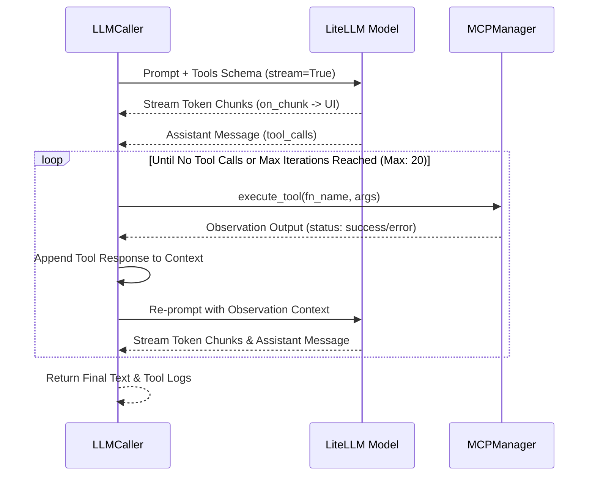

# LLM Integration & LiteLLM Gateway

The MADO: Multi-Agent Debate & Orchestration Platform integrates with Large Language Models via [LiteLLM](https://github.com/BerriAI/litellm), managed by the [`LLMCaller`](file:///d:/MultiAgentOrchestrator/app/agents/llm.py#L28-L362) class in [app/agents/llm.py](file:///d:/MultiAgentOrchestrator/app/agents/llm.py).

---

## 1. Unified Multi-Provider Abstraction

LiteLLM abstracts differences between provider APIs (OpenAI, Anthropic, Google Gemini, Azure OpenAI, AWS Bedrock, Vertex AI, Ollama, and self-hosted vLLM / LM Studio instances).

```mermaid
flowchart LR
    Agent[Specialist Agent Turn] --> LLMCaller[LLMCaller (llm.py)]
    LLMCaller --> ToolCheck{is_live?}
    
    ToolCheck -- Yes --> LiteLLM[LiteLLM Gateway]
    ToolCheck -- No / Fallback --> Sim[Intelligent Offline Simulator]
    
    LiteLLM --> Cloud[Cloud: OpenAI / Anthropic / Gemini / Azure]
    LiteLLM --> Local[Local: Ollama / vLLM / LM Studio]
    LiteLLM --> Gateway[Corporate LLM Gateway / Proxy]
```

### Parameter Mapping ([app/agents/llm.py](file:///d:/MultiAgentOrchestrator/app/agents/llm.py#L123-L183))
[`build_completion_kwargs()`](file:///d:/MultiAgentOrchestrator/app/agents/llm.py#L123-L183) translates agent settings into LiteLLM parameters:
- `model`: e.g. `"openai/gpt-4o"`, `"anthropic/claude-3-5-sonnet-20241022"`, `"ollama_chat/qwen2.5-coder:14b"`.
- `api_base`: Base endpoint URL.
- `api_key`: API token. For keyless local endpoints (Ollama, vLLM, LM Studio) that expect a non-empty string, a dummy token (`sk-no-key-required`) is provided automatically.
- `drop_params = True`: Automatically filters out unsupported flags when communicating with local models that do not accept standard OpenAI parameters.
- `timeout` and `num_retries`: Ensures network resilience.
- `extra_headers` and `extra_body`: Injects organization IDs, telemetry tags, or custom headers for corporate proxies.

---

## 2. The Multi-Turn Tool Calling Loop & Real-Time Streaming

When an agent has access to MCP tools, [`_run_litellm_loop()`](file:///d:/MultiAgentOrchestrator/app/agents/llm.py#L199-L270) runs an autonomous observation-thought loop up to `max_tool_iterations` (default: 30):



### Key Behaviors:
1. **Observation Feedback**: The tool output is appended to the message context with `role: "tool"`. The LLM observes the real output (or error message) and refines its reasoning in the next iteration.
2. **Incremental Token Streaming**: Using `acompletion(stream=True)` and `litellm.stream_chunk_builder`, partial word tokens are streamed to `on_chunk`, dynamically rendering in the UI while tools are accumulating.
3. **Tool Execution Streaming**: As each tool executes, the `on_tool_call` asynchronous callback dispatches events to the UI, rendering an accordion widget in the chat feed before the agent's text response finishes generating.
4. **Nothing in the loop may end the turn** (v0.5.0). Malformed `tool_calls` are absorbed by
   [`_parse_tool_call()`](file:///d:/MultiAgentOrchestrator/app/agents/llm.py) — object or dict
   shape, broken argument JSON, and a missing `tool_call_id` (which would make the *next*
   request a 400). Tool failures come back as `role: "tool"` observations via
   [`_execute_tool_safely()`](file:///d:/MultiAgentOrchestrator/app/agents/llm.py), and a dead
   UI callback cannot discard the observation of a tool that actually ran
   ([`_notify_tool_call()`](file:///d:/MultiAgentOrchestrator/app/agents/llm.py)). Only
   `CancelledError` propagates. See
   [MCP Resilience §4](file:///d:/MultiAgentOrchestrator/wiki/mcp/error-handling-resilience.md).


### 2.1. When a call fails, record what we sent (v0.5.2)

An endpoint does not always say why it refused. A gateway in front of vLLM was seen returning

```
Error code: 500 - {'error': "client error: 400, message='Bad Request', url='.../chat/completions'"}
```

— the upstream answered **400**, the gateway wrapped it in its own **500**, and vLLM's actual
message (`maximum context length...`, `roles must alternate...`) was discarded on the way. LiteLLM
classifies 500 as retryable, so a deterministic request-shape error was also retried twice before
surfacing. All that reached the log was the exception string, which said nothing about the request.

When the endpoint will not say why, the remaining evidence is our own. Every hard failure in
[`_complete_once()`](file:///d:/MultiAgentOrchestrator/app/agents/llm.py) — streaming and the
non-streaming retry both refused — now logs a
[`request_fingerprint()`](file:///d:/MultiAgentOrchestrator/app/agents/llm.py):

```
Request fingerprint for Senior Python Engineer (model=openai/qwen3-27b, api_base=http://gateway/v1):
  messages=12 roles=system,user,assistant,tool,assistant,tool,assistant,tool,assistant,tool,assistant,tool
  tokens~124,508 / budget 123,392 (window 128,000, max_tokens 4,096)  <-- OVER BUDGET
  tools=12 tool_choice=auto
  largest: [9] tool filesystem__read_text_file 120,000 chars; [5] tool ... 64,000 chars; [11] tool ... 30,999 chars
```

Each line answers one class of 400 without a round trip to the server's own logs:

| Line | What it settles |
|---|---|
| `roles=` (run-length encoded) | consecutive `user` turns (§5.2, §5.3); a `tool` result with no `assistant` before it |
| `tokens~ / budget` | context overflow — and whether `max_context_window` is set above the model's real limit, in which case the trim never fires and the endpoint refuses first |
| `tools= tool_choice=` | tool history sent with no tools defined (§5.3), or a `tool_choice` the endpoint rejects |
| `largest:` | which tool result inflated the request, by name and size |

**Sizes only, never content.** A tool that read a source file must not copy it into the log, and
what the diagnosis needs is the volume, not the text. Note that `tokens~` and `chars` diverge on
purpose: the token count comes from the tokenizer (`litellm.token_counter`), the sizes are raw
characters, and their ratio varies with the content.

Building the fingerprint can never fail the call — any error inside it becomes a one-line
`Request fingerprint unavailable ...` and the original exception propagates untouched.

---

## 3. Sequential Thinking (Step-by-Step Reasoning)

Sequential Thinking enforces deliberate reasoning before answering. Configured in ``llm.sequential_thinking`` or `agents.<key>.sequential_thinking`, it supports three operational modes:

| Mode | Mechanism | Target Models |
| :--- | :--- | :--- |
| `prompt` | Injects a structured `[Sequential Thinking Protocol]` into the system prompt requiring `Thought 1..N` steps before final conclusions. | All models, including local LLMs. |
| `native` | Passes provider-native reasoning parameters (`reasoning_effort` for OpenAI o1/o3, or `thinking: {budget_tokens: N}` for Anthropic Claude 3.7 Sonnet). | Reasoning-capable cloud models. |
| `mcp` | Forces the agent to call the `sequentialthinking` tool on `@modelcontextprotocol/server-sequential-thinking`. | Models equipped with MCP tool access. |

### `show_steps` decides what *people* see, not what models read

When `show_steps = false`, [`_apply_show_steps()`](file:///d:/MultiAgentOrchestrator/app/agents/llm.py)
strips intermediate thought steps from the recorded turn, keeping only the text after
`## 최종 결론` / `## Final Conclusion`.

**Reasoning traces never reach another agent's prompt, regardless of this setting** (v0.5.0).
The two used to be the same switch: with `show_steps = true` the full `Thought 1..N` text
*was* the turn body, and `_build_context_for_agent()` copied that body into every later
speaker's context. Two things followed.

- Within a few rounds most of the transcript was other agents' reasoning, and
  `fit_context_window()` began discarding the goal and the early design discussion to make
  room for it.
- The planning, speaker-selection and task-dispatch prompts quote each turn at 250–300
  characters. Those characters were all `Thought 1: ...` preamble, so **the conclusion never
  made it in at all.**

[`strip_reasoning_trace()`](file:///d:/MultiAgentOrchestrator/app/agents/llm.py) removes the
trace at every point where a turn body becomes part of a prompt — next-speaker context,
synthesis transcript, planning prompt, speaker selection, task dispatch — while the database
and the timeline keep the full text. It handles both shapes: the `## 최종 결론` marker used by
`prompt`/`mcp` mode, and the `> **[Sequential Thinking]**` quote block that `native` mode
prepends. If an answer legitimately opens with a blockquote, or if the trace is all there is,
the original is left alone.

An agent does not get its own trace back either. `show_steps` is a switch about people;
keeping it a switch about people means enforcing the rule in exactly one place. Re-reading
your own chain from the previous round also anchors you to it, when the point of the new
round is that new evidence has arrived.

Measured on a synthetic transcript (5 thoughts + conclusion, 3 specialists × 3 rounds):
**5,556 → 1,848 tokens.**

---

## 4. Unreachable Endpoints Fail Loudly

There is no offline simulator. When an agent cannot reach its endpoint,
[`call_agent()`](file:///d:/MultiAgentOrchestrator/app/agents/llm.py) raises
`LLMUnavailableError` carrying the model, endpoint label, and the underlying error.

The engine catches it per speaker and records a message with `msg_type="error"` that
states plainly that the turn produced no response. Those messages are shown in the
timeline in a distinct colour, are excluded from every later agent's context and from
the synthesis transcript, and are listed by key in `DebateState.failed_agent_keys`.

This replaced a built-in simulator that invented persona-shaped answers on failure.
A 500 from the endpoint used to look like a successful debate, and the invented turn
then fed the next agent's prompt and the final synthesis report. Whatever partial text
arrived before the connection dropped is kept above the failure notice.


---

## 5. Shaping the Request Before It Goes Out

`call_agent()` runs two transforms on the message list, in this order, before the tool loop.

### 5.1. Trim to the context window (`fit_context_window`)

A debate transcript grows every round, and `max_context_window` was declared in `conf.json`
and read nowhere. Past a few rounds the request exceeded the model's window and the endpoint
answered **400** (`maximum context length ... however you requested ...`).

The system prompt, the goal, and the current turn instruction are kept; the middle is dropped
oldest-first until the estimate fits `max_context_window - max_tokens - 512`. The model is told
how many turns were elided so it does not invent them. Token counting uses
`litellm.token_counter`, falling back to a character heuristic for unknown models.

The synthesis call is bounded separately, in
[`_build_synthesis_prompt()`](file:///d:/MultiAgentOrchestrator/app/orchestration/engine.py):
it packs the whole transcript into a *single* user message, so there are no messages for
`fit_context_window()` to drop. It fills from the most recent turn backwards — later turns
already reflect the earlier discussion, so if something must go, the front should go.

### 5.2. Merge consecutive same-role turns (`merge_consecutive_roles`)

A debate is a multi-party conversation, but the OpenAI message format has no role for
"a different agent". Every other speaker's turn becomes `user` and only the agent's own
becomes `assistant`, so three specialists produce three to five consecutive `user` messages,
growing with the round count.

OpenAI accepts that. **Anthropic, Gemini, and several OpenAI-compatible shims (llama.cpp
server, some vLLM chat templates) reject it with 400** — `roles must alternate between user
and assistant`. On such an endpoint the orchestrator's planning call succeeds (it is a single
user message) while *every specialist turn fails*, which reads as "the agents keep losing
their connection".

Consecutive `user` or `assistant` messages are merged into one, joined by a blank line. Each
turn already carries a `[Name (Role)]:` header, so who said what survives the merge. Messages
carrying `tool_calls`, and `tool` results, are never merged — that would break the
`tool_call_id` pairing.

Order matters: trim first, merge second. Trimming inserts its elision notice as a `user`
message, which would otherwise sit next to another `user` message.

### 5.3. The same two rules apply *inside* the tool loop (v0.5.2)

Sections 5.1 and 5.2 run once, before the loop. The loop then keeps appending — an assistant
message per iteration plus one `tool` result per call, and a single tool output can be tens of
kilobytes. Two things that were handled correctly before the loop were getting undone inside it.

**The in-loop trim did not merge.** [`fit_tool_loop_context()`](file:///d:/MultiAgentOrchestrator/app/agents/llm.py)
drops whole `assistant(tool_calls) + tool results` blocks, oldest first — never a bare `tool`
message, which would be a 400 of its own. But its elision notice is a `user` message inserted
directly after the head (`system` + the goal, also `user`), and unlike the pre-loop path its
result went straight out to the endpoint. That is exactly the consecutive-`user` 400 from §5.2,
reappearing only in long tool loops on the endpoints least able to tolerate it. The return value
now goes through `merge_consecutive_roles()`, so the notice folds into the goal message.

**The wrap-up call dropped `tools` while the history still held tool blocks.** When the tool
budget runs out — or when the user declines to widen the context and chooses to wrap up —
[`_wrap_up_without_tools()`](file:///d:/MultiAgentOrchestrator/app/agents/llm.py) asks for a
final answer with no further tool use. It used to do that by omitting `tools` entirely. The
intent was right: hand a model the list after telling it the budget is gone and it calls a tool
anyway, and that call is discarded unexecuted.

But by then `current_messages` contains the `tool_calls` assistant messages and `tool` results
of everything already executed, and **Anthropic rejects a conversation carrying `tool_use` /
`tool_result` blocks when the request defines no tools** (`Requests which include tool_use or
tool_result blocks must define tools`). OpenAI accepts it, so the symptom was selective: the
gpt-4o orchestrator was fine while a Claude specialist died with a 400 — and only on its longest,
most tool-heavy turns, which reads as a random failure.

The tools are now sent with `tool_choice: "none"`, which satisfies both requirements at once —
the tools are defined, and the model cannot call them. LiteLLM maps `"none"` onto each provider's
equivalent. `build_completion_kwargs()` takes the choice as a parameter; every other call site
still passes `"auto"`.
