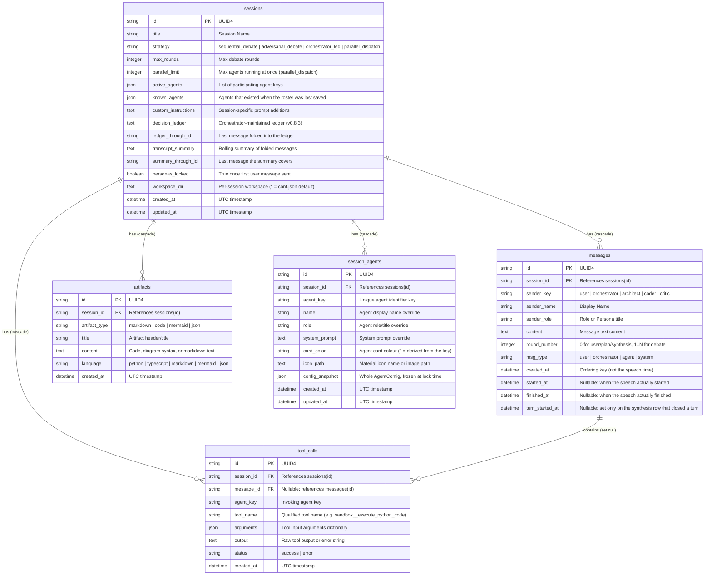

# Database Schema & Persistence

The MADO: Multi-Agent Debate & Orchestration Platform uses SQLite with the asynchronous **SQLAlchemy 2.0 ORM** powered by `aiosqlite`. All database models are defined in [app/database/models.py](file:///d:/MultiAgentDebateOrchestration/app/database/models.py), and connection pooling and engine management are handled in [app/database/session.py](file:///d:/MultiAgentDebateOrchestration/app/database/session.py).

---

## 1. Entity-Relationship Diagram (ERD)



---

## 2. Table Specifications

### 2.1. `sessions` Table ([SessionModel](file:///d:/MultiAgentDebateOrchestration/app/database/models.py#L16-L42))
Represents a single multi-agent collaboration workspace or discussion thread.

| Column | Type | Nullable | Default | Description |
| :--- | :--- | :--- | :--- | :--- |
| `id` | `VARCHAR(36)` | No | `uuid4()` | Primary key. |
| `title` | `VARCHAR(255)` | No | `'New Debate Session'` | Session title displayed in the sidebar. Defaults to first prompt snippet. |
| `strategy` | `VARCHAR(50)` | No | `'sequential_debate'` | Selected debate strategy (`sequential_debate`, `adversarial_debate`, `orchestrator_led`, `parallel_dispatch`). Rows saved under the retired `free_debate` / `sequential_review` names are mapped to `sequential_debate` on read by `resolve_strategy_name()`. |
| `max_rounds` | `INTEGER` | No | `3` | Maximum specialist debate rounds per user turn. |
| `parallel_limit` | `INTEGER` | No | `3` | How many agents may run concurrently in one round. Read only by `parallel_dispatch`; assignments beyond it queue on a semaphore rather than being dropped. Added by the lightweight migration in `session.py`, so existing databases get `3`. |
| `active_agents` | `JSON` | No | `[]` | Array of agent keys participating in this session. |
| `known_agents` | `JSON` | No | `[]` | Every agent that existed when this roster was last saved. `active_agents` is an allow-list, so without this a key missing from it cannot be told apart from an agent that did not exist yet — which made every conversation show newly added agents as switched off. |
| `custom_instructions` | `TEXT` | No | `''` | User-defined custom instructions injected into every agent prompt. |
| `decision_ledger` | `TEXT` | No | `''` | Decision ledger the orchestrator rewrites after rounds and synthesis; placed directly before each call's turn instruction. Written only when a turn completes. See [Conversation Memory](../orchestration/context-memory.md). |
| `ledger_through_id` | `VARCHAR(36)` | Yes | `NULL` | Id of the last message folded into the ledger. |
| `transcript_summary` | `TEXT` | No | `''` | Rolling summary of old messages folded when the context window filled. |
| `summary_through_id` | `VARCHAR(36)` | Yes | `NULL` | Id of the last message the summary covers; a summary whose anchor is missing is discarded. |
| `personas_locked` | `BOOLEAN` | No | `False` | Locks session personas once the first user message is received. |
| `workspace_dir` | `TEXT` | No | `''` | Workspace this conversation uses; empty means the `conf.json` default. Unlike personas it never locks — it must be changeable mid-debate. |
| `graph_id` | `VARCHAR(64)` | No | `''` | Graph file (`data/graphs/<id>.json`) used by the graph debate strategy. |
| `graph_snapshot` | `JSON` | Yes | `NULL` | The graph the latest turn actually ran, frozen at turn start — editing or deleting the file mid-debate does not affect it. |
| `created_at` | `DATETIME` | No | `utc_now` | UTC creation timestamp. |
| `updated_at` | `DATETIME` | No | `utc_now` | UTC last updated timestamp. |

### 2.2. `messages` Table ([MessageModel](file:///d:/MultiAgentDebateOrchestration/app/database/models.py#L44-L61))
Stores the sequential transcript of messages exchanged during a debate.

| Column | Type | Nullable | Default | Description |
| :--- | :--- | :--- | :--- | :--- |
| `id` | `VARCHAR(36)` | No | `uuid4()` | Primary key. |
| `session_id` | `VARCHAR(36)` | No | - | Foreign key referencing `sessions.id` (ON DELETE CASCADE). |
| `sender_key` | `VARCHAR(50)` | No | - | Identifier key of sender (`user`, `orchestrator`, `architect`, etc.). |
| `sender_name` | `VARCHAR(100)` | No | - | Display name of the sender at the time of message creation. |
| `sender_role` | `VARCHAR(100)` | No | `''` | Role of the sender at the time of message creation. |
| `content` | `TEXT` | No | `''` | Text content of the message. |
| `round_number` | `INTEGER` | No | `0` | Debate round number (`0` for user input, planning, synthesis). |
| `msg_type` | `VARCHAR(30)` | No | `'agent'` | Message classification: `'user'`, `'orchestrator'`, `'agent'`, `'system'`. |
| `created_at` | `DATETIME` | No | `utc_now` | **Ordering key, not the speech time.** The row is inserted after the LLM reply arrives, so this is roughly the *end*; in a parallel round it is overwritten with `round base time + dispatch index (ms)` so a reload replays in dispatch order. |
| `started_at` | `DATETIME` | Yes | - | Wall-clock time the speech actually started (taken before the stream opens). |
| `finished_at` | `DATETIME` | Yes | - | Wall-clock time the speech actually finished, including a speech that ended in failure. Taken outside the write lock, so waiting to commit is not counted. |
| `turn_started_at` | `DATETIME` | Yes | - | Set **only** on the synthesis speech that closed a turn: when that turn's opening request was recorded. `finished_at - turn_started_at` is the turn's total elapsed time, shown in the report footer and the Markdown export. Recorded explicitly rather than inferred, because an interjection right after planning is also a `user` row with `round_number=0`. `NULL` elsewhere, which also marks the row that closed a turn. |
| `graph_node_id` | `VARCHAR(64)` | Yes | - | Graph debate only: the node that produced this message. Needed because one agent can sit on several nodes. |
| `graph_port` | `VARCHAR(8)` | Yes | - | Graph debate only: the output port this message left through — `out` for agent and merge speeches, `yes`/`no` for a gate verdict. NULL for notes attached to a node that are not its output (the visit-cap notice). The live overlay, a refreshed page and a reopened conversation all count visits, gate branches and flowed wires from this column. |

`started_at` equals `finished_at` for records that take no time (a person's message, a speaker-selection note). Both are `NULL` for rows written before v0.6.1.2: the migration deliberately adds them without a default, because backfilling would make every old speech appear to start and finish at the moment of migration. The chat feed and the Markdown export show such rows with the single `created_at` value and without calling it a start or an end ([`app/timestamps.py` `speech_timing`](file:///d:/MultiAgentDebateOrchestration/app/timestamps.py)).

### 2.3. `tool_calls` Table ([ToolCallRecordModel](file:///d:/MultiAgentDebateOrchestration/app/database/models.py#L63-L78))
Logs every MCP tool invocation executed by an agent during a turn.

| Column | Type | Nullable | Default | Description |
| :--- | :--- | :--- | :--- | :--- |
| `id` | `VARCHAR(36)` | No | `uuid4()` | Primary key. |
| `session_id` | `VARCHAR(36)` | No | - | Foreign key referencing `sessions.id` (ON DELETE CASCADE). |
| `message_id` | `VARCHAR(36)` | Yes | `None` | Optional foreign key referencing `messages.id` (ON DELETE SET NULL). |
| `agent_key` | `VARCHAR(50)` | No | - | Agent key that initiated the tool call. |
| `tool_name` | `VARCHAR(100)` | No | - | Qualified tool name (e.g. `filesystem__write_file`). |
| `arguments` | `JSON` | No | `{}` | JSON dictionary of inputs sent to the tool. |
| `output` | `TEXT` | No | `''` | Raw string result or error output returned by the MCP server. |
| `status` | `VARCHAR(20)` | No | `'success'` | Execution result status (`'success'` or `'error'`). |
| `created_at` | `DATETIME` | No | `utc_now` | UTC execution timestamp. |

### 2.4. `artifacts` Table ([ArtifactModel](file:///d:/MultiAgentDebateOrchestration/app/database/models.py#L80-L92))
Persists individual output artifacts synthesized by the Master Orchestrator at the end of a debate.

| Column | Type | Nullable | Default | Description |
| :--- | :--- | :--- | :--- | :--- |
| `id` | `VARCHAR(36)` | No | `uuid4()` | Primary key. |
| `session_id` | `VARCHAR(36)` | No | - | Foreign key referencing `sessions.id` (ON DELETE CASCADE). |
| `artifact_type` | `VARCHAR(30)` | No | `'markdown'` | Category: `'code'`, `'markdown'`, `'mermaid'`, or `'json'`. |
| `title` | `VARCHAR(255)` | No | `'Synthesized Artifact'` | Human-readable title for the artifact viewer tab. |
| `content` | `TEXT` | No | `''` | Raw text content of the artifact. |
| `language` | `VARCHAR(50)` | No | `'markdown'` | Syntax highlighting language (e.g. `'python'`, `'mermaid'`). |
| `created_at` | `DATETIME` | No | `utc_now` | UTC creation timestamp. |

### 2.5. `session_agents` Table ([SessionAgentModel](file:///d:/MultiAgentDebateOrchestration/app/database/models.py))
Holds a session's agent personas, their card appearance, and — from the first user message onward —
the frozen operating configuration that makes a started conversation self-contained.

| Column | Type | Nullable | Default | Description |
| :--- | :--- | :--- | :--- | :--- |
| `id` | `VARCHAR(36)` | No | `uuid4()` | Primary key. |
| `session_id` | `VARCHAR(36)` | No | - | Foreign key referencing `sessions.id` (ON DELETE CASCADE). |
| `agent_key` | `VARCHAR(50)` | No | - | Key of the agent (e.g., `'architect'`). |
| `name` | `VARCHAR(100)` | No | `''` | Customized display name. |
| `role` | `VARCHAR(150)` | No | `''` | Customized role description. |
| `system_prompt` | `TEXT` | No | `''` | Customized system prompt. |
| `card_color` | `VARCHAR(40)` | No | `''` | Card colour for this conversation. Empty means "not chosen", and the colour is derived from the agent key instead. |
| `icon_path` | `TEXT` | No | `''` | Material icon name, or the path to an uploaded image under `data/agent_icons/`. |
| `config_snapshot` | `JSON` | Yes | `NULL` | The whole `AgentConfig` frozen at lock time. `NULL` marks a conversation locked before this column existed; those keep following the live `conf.json`. |
| `created_at` | `DATETIME` | No | `utc_now` | UTC creation timestamp. |
| `updated_at` | `DATETIME` | No | `utc_now` | UTC update timestamp. |

`card_color` and `icon_path` also live inside `config_snapshot`. They are duplicated into columns
because drawing a card needs them without parsing JSON, and because they must attach to rows written
before the snapshot column existed.

> **Unique Constraint**: A compound unique constraint `uq_session_agent` exists across `(session_id, agent_key)`, ensuring only one persona record exists per agent per session.

---

## 3. Session Initialization & Connection Management

The database connection engine is configured in [app/database/session.py](file:///d:/MultiAgentDebateOrchestration/app/database/session.py):

```python
engine = create_async_engine(db_url, echo=False, future=True)
if engine.dialect.name == "sqlite":
    configure_sqlite(engine, db_url)     # busy_timeout + WAL, per connection
session_factory = async_sessionmaker(engine, expire_on_commit=False, class_=AsyncSession)
```

> Until v0.7.1 this page showed a WAL comment and `connect_args` that were never in the code. The
> engine used SQLite's defaults — which is exactly what failed (see below).

### SQLite concurrency (v0.7.1)

With no configuration, Python's SQLite driver waits **5 seconds** for a lock and then raises
`database is locked`, and in the default rollback-journal mode every write transaction creates and
deletes `multiagent.db-journal`. On Windows a file that another process has open cannot be replaced,
so a brief open by a virus scanner, the search indexer, or a backup/sync agent is enough to fail a
write. Windows schedules exactly those jobs while the user is away — and a final synthesis report
was lost that way while the screen was locked.

`configure_sqlite()` sets three pragmas on every new connection:

| Pragma | Value | Why |
| :--- | :--- | :--- |
| `busy_timeout` | 30000 ms | A message write is milliseconds; anything holding the lock for 30 s is an outside process, and that much is survivable. |
| `journal_mode` | `WAL` | No journal file created and deleted per write, and readers stop blocking the writer. |
| `synchronous` | `NORMAL` | The recommended pairing with WAL: a power cut may lose the last few transactions but never corrupts the file. |

WAL coordinates processes through shared memory (`-shm`), which network file systems do not
guarantee, so **WAL is not enabled when the database is on a network location** — a UNC path, or a
Windows drive whose `GetDriveTypeW` is `DRIVE_REMOTE`. `busy_timeout` still applies there. The
`-wal`/`-shm` files next to the database were already excluded by both packaging scripts.

Measured against a real lock held for 7 seconds by another connection: before, `journal_mode=delete`,
`busy_timeout=5000`, and the write failed with `database is locked` after 5.5 s; after,
`journal_mode=wal`, `busy_timeout=30000`, and the write waited 7.0 s and succeeded.

### Never silently dropping a write (v0.7.1)

The engine used to catch a failed message commit, log one line, roll back, and move on — sensible
for keeping the debate alive, but the final synthesis took the same path, so the deliverable reached
the screen and then vanished on the next reload.

Every engine write — a speech with its tool records, the artifacts, a user message, a note — now goes
through `OrchestratorEngine._persist()`:

1. **Retry.** On failure it rolls back (skip that and every later commit in the session fails too)
   and tries again after `PERSIST_RETRY_DELAYS` (2 s, then 5 s), on top of SQLite's own 30 s wait.
   Rows are rebuilt for each attempt with the same ids, because a rollback detaches the objects that
   were added.
2. **Keep it anyway.** If every attempt fails, `save_unpersisted()` writes the content as Markdown to
   `data/unsaved/<time>-<session>-<kind>-<rand>.md`, with the session id and the error in a header.
   The final synthesis is named `synthesis` so it is the first thing a person finds.
3. **Say so.** A `persist_failed` event raises a notification that stays until it is closed — this
   tends to happen while nobody is watching, and a toast that fades is useless then.

It never raises (except cancellation): a write failure that stopped the debate would cost every
speech still to come.

### Table Auto-Creation
When the application starts up inside `lifespan()` in [app/main.py](file:///d:/MultiAgentDebateOrchestration/app/main.py#L33-L35), it calls `init_db(db_url)`. This executes:
```python
async with engine.begin() as conn:
    await conn.run_sync(Base.metadata.create_all)
```
This guarantees that all required tables and constraints are created automatically without requiring separate migration tools.

### Columns added later

`create_all` creates missing *tables*; it never adds a column to a table that already exists. So
before it runs, `_add_missing_columns()` walks the `_ADDED_COLUMNS` map, compares it against
`PRAGMA table_info`, and issues `ALTER TABLE ... ADD COLUMN` for whatever is absent — idempotent, and
skipped entirely for a table `create_all` just created.

```python
_ADDED_COLUMNS = {
    "sessions": {"personas_locked": ..., "workspace_dir": ..., "known_agents": ..., "parallel_limit": ...,
                 "decision_ledger": ..., "ledger_through_id": ..., "transcript_summary": ..., "summary_through_id": ...,
                 "graph_id": ..., "graph_snapshot": ...},
    "session_agents": {"config_snapshot": "TEXT",
                       "card_color": "VARCHAR(40) NOT NULL DEFAULT ''",
                       "icon_path": "TEXT NOT NULL DEFAULT ''"},
}
```

This is why an existing `multiagent.db` can be carried across upgrades without a migration tool.
Note the deliberate asymmetry: `config_snapshot` is nullable because `NULL` carries meaning
("locked before this column existed"), while the appearance columns default to `''` because "not
chosen" and "no row yet" want the same behaviour.
