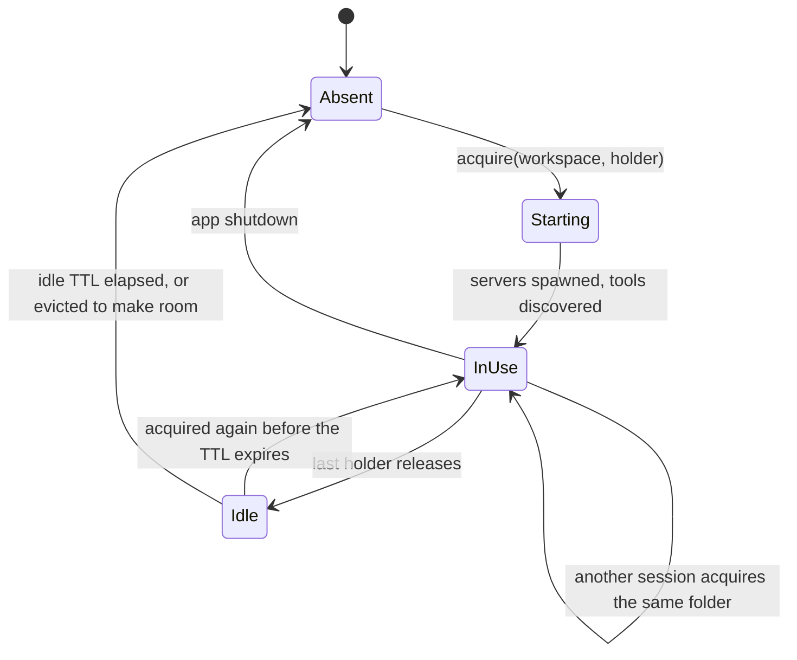

# MCP Runtime Isolation — Running Many Sessions at Once

Implementation: [app/mcp/pool.py](file:///d:/MultiAgentOrchestrator/app/mcp/pool.py)

Until v0.6.0 the platform held **one** `MCPManager` for the whole process. Because an
MCP server receives the folder it may touch **at spawn time** — `filesystem` takes it as
`argv`, `sandbox` as the `SANDBOX_WORKSPACE` environment variable — a single manager
could only ever look at one workspace. Two debates in different workspaces could not run
at the same time, and the second one was refused outright (`WorkspaceConflictError`).

This page describes what replaced it.

---

## 1. Three Layers, Only One of Which Leaks

"Isolate the MCP and Node runtimes per session" sounds like it means installing Node
several times. It does not. The layers behave very differently:

| Layer | Shared or isolated | Why |
| :--- | :--- | :--- |
| `node.exe` / `python.exe` binaries | **Shared** | Read-only while running. Copying them buys nothing and costs disk and startup time. |
| `MCP_NODE_HOME` (`node_modules`), `mcp_sandbox/` | **Shared** | Also read-only at runtime. The per-runtime environment can override `NODE_BIN` / `MCP_NODE_HOME`, so a private copy stays possible without another refactor — but nothing needs it today. |
| **Server processes and their environment** — heap, cwd, `TMP`, `WORKSPACE_DIR`, the memory-graph directory, the sandbox's IPython kernels | **Isolated** | This is the layer that actually leaked between conversations. |

So per-session isolation means: **a separate set of node/python processes per workspace,
each started with its own environment.**

---

## 2. Why the Key Is the Workspace, Not the Session

Sessions that point at the same folder already share files. Giving them separate
processes isolates nothing while multiplying the process count by the number of
conversations. Within one folder, per-conversation isolation is already handled by
request metadata — the host stamps `_meta.conversationId` on every call
([`compose_scope`](file:///d:/MultiAgentOrchestrator/app/mcp/manager.py)), which is what
keeps memory graphs and sandbox namespaces apart.

To isolate a single conversation completely, give it a dedicated workspace folder in the
roster panel. The pool then starts a separate process group for it automatically.

Process count is therefore:

```
processes ≈ (number of distinct workspaces in use) × (number of enabled MCP servers)
```

With the default configuration that is four servers (2 node + 2 python) per workspace,
plus whatever IPython kernels the sandbox holds inside its own process.

---

## 3. Lifecycle



- **`acquire(workspace, holder)`** — hands out the runtime for that folder, starting it if
  necessary. `holder` is the session id. Reference counting is by set, so acquiring twice
  from the same session counts once.
- **`release(holder)`** — drops the reference. The processes are **not** killed
  immediately; they stay warm for `MCP_RUNTIME_IDLE_TTL` so consecutive turns in the same
  folder do not pay the startup cost again (the sandbox spends seconds launching an
  IPython kernel).
- A turn borrows the runtime for its whole duration.
  [`OrchestratorEngine.run_turn`](file:///d:/MultiAgentOrchestrator/app/orchestration/engine.py)
  acquires before the debate and releases in a `finally`, so the reference is returned
  however the turn ends — completion, user stop, cancellation, or an exception. Missing a
  release would leave a runtime nobody uses alive until shutdown, taking a slot from the
  next conversation.

### Capacity

`MCP_MAX_RUNTIMES` (default 4) caps how many runtimes may exist at once. It is a **memory
budget**, not a limit on concurrent debates — any number of sessions can share a runtime.
When a new folder needs a slot the pool first reaps expired idle runtimes, then evicts the
longest-idle ones. A runtime that is still in use is never evicted; if nothing can be
freed, `acquire` raises `RuntimeCapacityError` naming the workspaces and sessions holding
the slots.

This is the successor to `WorkspaceConflictError`, but the reason changed: it is no longer
"two folders cannot be open at once", it is "there is no budget to start another group
right now."

---

## 4. The Per-Runtime Environment

[`MCPRuntimePool.runtime_env()`](file:///d:/MultiAgentOrchestrator/app/mcp/pool.py) builds
the variables layered onto every server this runtime starts:

| Variable | Value | Reason |
| :--- | :--- | :--- |
| `WORKSPACE_DIR` | this runtime's folder | Substituted into `argv`/`env` and answered in the MCP Roots response |
| `TMP` / `TEMP` / `TMPDIR` | `<workspace>/.mado/tmp` | Intermediate files with the same name would otherwise overwrite each other across debates |
| `npm_config_cache` | `<workspace>/.mado/npm-cache` | Keeps any npm activity out of the shared cache |
| `SANDBOX_MAX_NAMESPACES` | budget ÷ `MCP_MAX_RUNTIMES` | Kernels are per-runtime now; keeping conf.json's number for each would multiply them |

Deliberately **not** set:

- `HOME` / `USERPROFILE` — git reads user configuration and Python reads user site-packages
  from there. Relocating them is not isolation, it is breakage.
- `NODE_BIN` / `MCP_NODE_HOME` — read-only while running, so sharing leaks nothing.

---

## 5. What Had to Become Pure First

A second manager is useless if the first one keeps rewriting global state.

- [`RootConfig.mcp_servers_for_workspace()`](file:///d:/MultiAgentOrchestrator/app/config.py)
  used to assign `os.environ["WORKSPACE_DIR"]` so child processes would inherit it. With
  more than one runtime, whichever call came last overwrote every other runtime's path.
  It now passes the workspace through `resolve_env_vars(..., overrides)` and writes
  `WORKSPACE_DIR` explicitly into each server's `env`.
- The MCP **Roots** callback read the same global. It is now built per connection
  (`make_list_roots_handler`), so each server is told about its own folder.
- `ensure_workspace()` runs blocking `git` subprocesses. It is now called through
  `asyncio.to_thread` with a per-path lock, so starting several runtimes does not stall
  the UI and two runtimes never `git init` the same folder simultaneously.
- `MCPManager` gained a lifecycle lock; `initialize`/`shutdown`/`reconnect` used to be
  able to clear each other's client dictionary.

### A Windows detail

`Path.resolve()` on Windows can return an extended-length path (`\\?\C:\...`), especially
for a folder that does not exist yet. `as_uri()` then produces `file://?/C:/...`, which the
server rejects as an invalid URL — the filesystem server comes up with no allowed
directories and the only trace is a single `Failed to request initial roots` line.
`strip_extended_path_prefix()` in [app/config.py](file:///d:/MultiAgentOrchestrator/app/config.py)
removes the prefix before the path becomes a URI.

---

## 6. What Is Still Global

`conf.json` remains the single source of truth for every runtime. Editing MCP servers from
the UI therefore restarts **all live runtimes**
([`MCPRuntimePool.reload_all()`](file:///d:/MultiAgentOrchestrator/app/mcp/pool.py)), and
that operation stays locked while any debate is running — a debate must not lose its tools
mid-round. The lock is now about the configuration file, not about a shared process.

The agent pool, the application config object, and the `DebateRunner` are also still
process-wide. Unlike MCP servers these are plain Python state with no spawn-time bindings,
so concurrent debates share them safely.

---

## 7. Tuning

| Variable | Default | Meaning |
| :--- | :--- | :--- |
| `MCP_MAX_RUNTIMES` | `4` | How many distinct workspaces may have live server groups |
| `MCP_RUNTIME_IDLE_TTL` | `300` | Seconds an unused runtime stays warm before being stopped |
| `SANDBOX_MAX_NAMESPACES` | `16` | Total IPython kernel budget, divided across runtimes |

Raising `MCP_MAX_RUNTIMES` is legitimate, but each additional runtime is a whole group of
MCP server processes, not a thread.

---

## 8. Related Pages

- [Overview & Protocol](file:///d:/MultiAgentOrchestrator/wiki/mcp/overview-and-protocol.md) — stdio host/client architecture and persistent sessions
- [Bundled Servers](file:///d:/MultiAgentOrchestrator/wiki/mcp/bundled-servers.md) — what each server binds at spawn time
- [Engine Lifecycle](file:///d:/MultiAgentOrchestrator/wiki/orchestration/engine-lifecycle.md) — where a turn borrows and returns its runtime
- [Session Handoff](file:///d:/MultiAgentOrchestrator/wiki/orchestration/session-handoff.md) — how a knowledge graph moves between conversations
