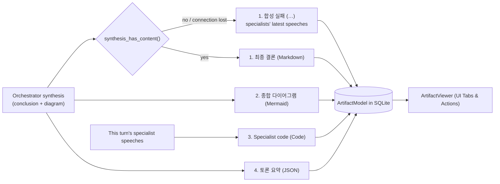
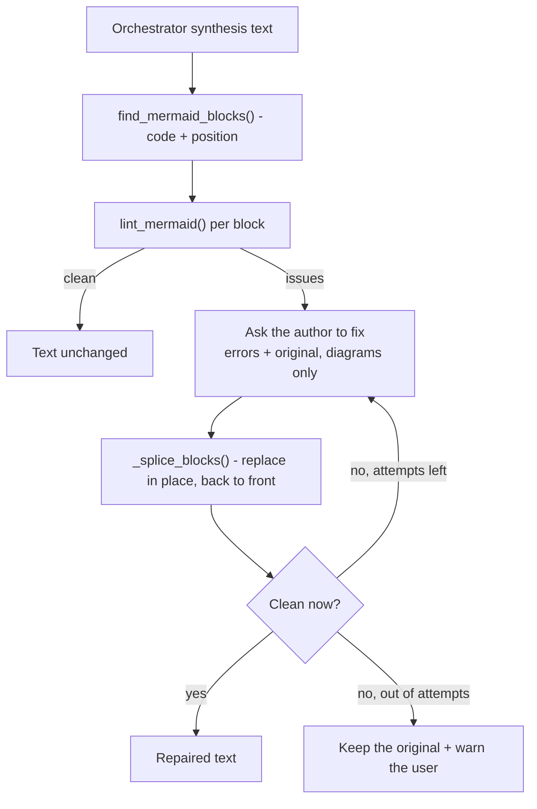

# Artifact Synthesis & Extraction

At the conclusion of a debate turn, the Master Orchestrator writes the **final conclusion and one
overall diagram** — nothing more. The engine turns that, together with the code the specialists wrote
during the turn, into discrete, typed **Artifacts** saved in the database and **appended** to the
viewer.

> **Role reduction.** Until this change the synthesis prompt (and the default orchestrator persona)
> demanded "complete runnable source code". The orchestrator re-emitted the specialists' code in full,
> filling its response limit, and that synthesis then re-entered the next turn's transcript as a code
> dump, so the context saturated a little faster every turn — one of the ways a synthesis came back
> empty. The prompt now asks for (1) the conclusion — decisions and their grounds, rejected
> alternatives, open issues and risks — and (2) one overall Mermaid diagram, and explicitly forbids
> rewriting or pasting source code: code is to be referred to by file path, module or function name.
> The prompt keeps the phrase `최종 합의 보고서`, which the rest of the pipeline and the test fake use
> to recognise a synthesis request.

---

## 1. Artifact Extraction Architecture

[`_extract_artifacts_from_synthesis()`](file:///d:/MultiAgentOrchestrator/app/orchestration/engine.py)
produces four kinds of artifact. Every title starts with the local time the turn finished
(`MM-DD HH:MM`), because artifacts now accumulate across turns and identical titles must be told apart.



---

## 2. Supported Artifact Types

### 2.1. Final Conclusion (`markdown`)
- **Type**: `markdown`
- **Title**: `MM-DD HH:MM 최종 결론` (was `종합 아키텍처 & 산출물 보고서 (Final Synthesis Report)`)
- **Content**: The orchestrator's conclusion — decisions, grounds, rejected alternatives, open issues
  and risks — with its overall diagram inline.
- **Empty or failed synthesis**: `synthesis_has_content()` decides whether the synthesis actually
  concluded anything. It ignores notice lines (`> ⚠️ …`, e.g. the response-limit notice) and a native
  reasoning block with nothing after it (`strip_reasoning_trace` deliberately keeps such a block as the
  "content", so it is removed separately here). If nothing is left, the synthesis is treated as failed:
  - the title becomes `MM-DD HH:MM 합성 실패 (빈 응답)` — or `합성 실패 (LLM 연결 끊김)` when the
    endpoint was unreachable;
  - the content is an explanation followed by `## 전문가별 마지막 발언`: each specialist's latest
    speech of **this turn**, reasoning stripped, gathered without calling an LLM;
  - `is_consensus_reached` is false, `error_message` says the conclusion was empty, and the JSON
    summary carries `"synthesis_failed": true`.

  Before this, an empty synthesis was stored under the normal report title with an empty body. Combined
  with the viewer replacing its tabs (§5), a session with many turns appeared to lose its whole debate
  result; the earlier reports were still in the database.
- **Completion time** (v0.6.1.2): the report ends with a rule and
  `*보고서 완료: YYYY-MM-DD HH:MM:SS · 총 경과 12분 5초*` — the turn's total elapsed time to the right
  of the completion time, measured from the recorded opening request (`messages.turn_started_at`).
  The report is copied, downloaded, and forwarded on its own, away from the transcript, so the
  moment the conclusion was reached has to travel **inside** it. The value is the synthesis
  speech's `finished_at` — taken after diagram self-repair, i.e. when the report text became final
  — so it matches the end time on the synthesis card and in the Markdown export exactly. It is
  appended to this artifact only; code and diagram artifacts are extracted from the original text,
  so the line never ends up inside runnable code. A failed synthesis gets no such line: that
  artifact is a failure notice, and calling it a completed report would be false.
- **Rendering**: Rendered as GitHub-flavored Markdown with table styling and syntax-highlighted code blocks.

### 2.2. Overall Diagram (`mermaid`)
- **Type**: `mermaid`
- **Title**: `MM-DD HH:MM 종합 다이어그램` (`#2`, … if the synthesis drew more than one); from the
  transcript fallback, `MM-DD HH:MM 다이어그램 #1 ({author} 제안)`.
- **Extraction Pattern**: Blocks fenced with ` ```mermaid ... ``` `, plus three fallbacks
  that exist because the diagram tab kept coming up empty:
  - **Unterminated fences** are extracted to end of text. A synthesis report truncated by
    `max_tokens` mid-diagram used to yield no artifact at all, since the old regex needed
    a matching closing fence.
  - **Unlabelled blocks** whose first line starts with a diagram keyword (`graph`,
    `flowchart`, `sequenceDiagram`, …) are treated as Mermaid.
  - **Transcript fallback**: if the synthesis report contains no diagram (or the synthesis
    failed), the most recent diagram in **this turn's** transcript is promoted to an artifact,
    titled with its author. Models routinely draw the architecture during the debate and omit it
    from the summary. Earlier turns' diagrams are not re-promoted — they are already that turn's
    artifacts.
- **Normalisation**: [`normalize_mermaid()`](file:///d:/MultiAgentOrchestrator/app/orchestration/engine.py)
  normalises line endings and quotes bracket labels containing parentheses
  (`A[결제 (Payment)]` → `A["결제 (Payment)"]`), the most common way an LLM-authored diagram
  fails to parse. Shape syntax (`[(cylinder)]`, `[[subroutine]]`, `[/parallelogram/]`) is
  left alone.
  - **Sequence-diagram notes in a flowchart** (v0.8.1): `Note right of X: text`,
    `Note left of X: text` and `Note over X,Y: text` inside a `graph`/`flowchart` are rewritten as
    `X -.- mado_note_1["text"]` (one dotted link per target), with a `classDef madoNote` and
    `class … madoNote` appended. A note means "a remark attached to this node", which a dotted
    node expresses without changing the diagram, so no LLM is needed. Targets that are not plain
    identifiers (e.g. contain spaces) are left for repair, a note with no text is dropped, inner
    `"` become `'`, and sequence/state/class diagrams — where `note` is valid — are untouched. The
    converted form was checked with the real parser.
- **Marking** (v0.8.1): every diagram artifact is linted after normalisation. One that still fails
  gets `⚠ ` in front of its title, so the problem is visible before the tab is opened. This matters
  most for the transcript fallback below, which never goes through LLM repair.
- **Syntax check & self-repair** (v0.5.0): before the synthesis is committed, every diagram
  is linted and the orchestrator is asked to fix what fails. See §3 below. **Only the synthesis is
  repaired**; a diagram taken from a specialist's speech (transcript fallback) gets normalisation
  and the ⚠ mark only.
- **Rendering**: Rendered into interactive SVG diagrams via NiceGUI's embedded Mermaid.js
  renderer. If Mermaid rejects the source anyway, the viewer catches the renderer's `error`
  event and shows the parse error plus the raw source instead of a blank panel.
- **Supported Diagrams**: Flowcharts (`graph TD/LR`), Sequence Diagrams (`sequenceDiagram`), State Diagrams (`stateDiagram-v2`), and Entity-Relationship Diagrams (`erDiagram`).

### 2.3. Specialist Code (`code`)
- **Type**: `code`
- **Title**: `MM-DD HH:MM {language} · {speaker} R{round}` (was `핵심 구현 소스코드 ({language}) #n`,
  taken from the synthesis).
- **Source**: this turn's specialist speeches (`state.messages[state.turn_message_start:]`, excluding
  the user, the orchestrator and failure notices). For each specialist only the **latest** speech that
  contained code is used, with reasoning stripped so drafts written while thinking are not picked up.
  Identical code is kept once and at most `MAX_DEBATE_CODE_ARTIFACTS` (12) are produced. Code in the
  synthesis is no longer extracted; if the orchestrator writes some anyway it stays in the report body.
- **Languages**: `python`, `py`, `typescript`, `javascript`, `bash`, `shell`, `json`, `toml`, `sql`.
- **Rendering**: Displayed with language-specific syntax highlighting, line numbers, and a dedicated **"Copy Code"** button.

### 2.4. Session Metadata & Summary (`json`)
- **Type**: `json`
- **Title**: `MM-DD HH:MM 토론 요약 (JSON)`
- **Content**: Auto-generated structured session record:
  ```json
  {
    "session_id": "9efca23a-f10d-45db-90cf-195b6cfa4521",
    "goal": "Design a real-time event streaming pipeline...",
    "strategy": "sequential_debate",
    "total_rounds": 3,
    "participating_agents": ["orchestrator", "architect", "coder", "critic"],
    "failed_agents": [],
    "synthesis_failed": false,
    "total_messages": 11,
    "consensus_reached": true
  }
  ```

---

## 3. Diagram Self-Repair (v0.5.0)

Diagrams written by an LLM fail to parse often. Until v0.5.0 a broken one became an artifact
as-is, and the user found out when they opened the tab — by which point the debate had ended
and nobody was left to fix it. Asking again meant running a whole new turn.

The synthesis is now checked **before it is recorded**, and anything broken goes back to its
author with the renderer's complaint attached.



The loop runs at most `MERMAID_REPAIR_ATTEMPTS` (2) times. Two is enough: a model handed a
precise error usually fixes it on the first pass, and one that fails twice will not succeed
on a third. **When it gives up it keeps the original** — an invented diagram is worse than a
broken one the user can see and report.

### 3.1. Why the linter is deliberately incomplete

[`app/mermaid_lint.py`](file:///d:/MultiAgentOrchestrator/app/mermaid_lint.py) is **not** a
Mermaid parser. Reimplementing the grammar in Python is a losing race, and a Node renderer
cannot be shipped in the air-gapped bundle. Each rule was instead calibrated against the real
`mermaid.parse()` running in a browser.

The asymmetry drives every design choice:

| | Cost |
| :--- | :--- |
| **Missed error** (false negative) | Same as before — the user sees it in the viewer. |
| **Wrongly flagged** (false positive) | An LLM call spent on a diagram that was fine, and a model with nothing to fix ruining a working diagram. |

So rules with any doubt were left out. `A --|label| B` is genuinely invalid — but
`A ---|label| B`, one dash longer, is **valid**, and no substring test separates them.

Rules that survived calibration:

| Rule | Catches |
| :--- | :--- |
| `paren-in-label` | Unquoted `()` inside `[..]`, `(..)`, `{..}` and `|..|` labels (flowcharts only — `actor C as 고객 (앱)` is valid in a sequence diagram) |
| `bracket-balance` | `A[결제 서비스 --> B[주문]` |
| `subgraph-unclosed` / `stray-end` | Mismatched `subgraph` / `end` |
| `end-as-node` | `start --> end` — lowercase `end` is reserved (`END` is fine) |
| `no-header` / `empty` | No diagram declaration on the first meaningful line |
| `block-unclosed` | `classDiagram` blocks with unbalanced `{}` |
| `bad-sequence-arrow` | `==>` in a sequence diagram (valid in a flowchart) |
| `nested-quotes` | `A["그는 "안녕" 이라 했다"]` |
| `sequence-syntax-in-flowchart` (v0.8.1) | Sequence-diagram syntax inside `graph`/`flowchart`: a line starting with `note`, `participant`, `actor`, `activate`, `deactivate`, `loop`, `alt`, `opt`, `par`, `critical`, `break`, `rect`, `else` or `and` (any case) followed by whitespace and a character that does not start a link (`-` `=` `.` `&` `~`), or by `:`; and the arrows `->>`, `-->>`, ` -x `, ` -) ` |

**Why `sequence-syntax-in-flowchart` exists (v0.8.1).** A user reported
`Parse error on line 46: …실패 시| LLM Note right of Validator: Expecting 'SEMI', 'NEWLINE', 'EOF',
'AMP', 'START_LINK', 'LINK', 'LINK_ID', got 'NODE_STRING'`. The expected-token list is the flowchart
grammar's: the model had put a sequence-diagram `Note` into a flowchart. In a flowchart these words
are not keywords but ordinary node ids, so `Note right …` is two node strings with no link between
them. None of the existing rules covered mixing diagram kinds, so the linter returned nothing and no
repair ran. Reproduced with the parser NiceGUI ships, which gave the identical message.

The rule's boundary was calibrated against that parser. Rejected: `Note right of A: x`,
`Note over A,B: x`, `note left of A`, `participant V as X`, `actor User`, `activate A`, `loop 재시도`,
`LOOP retry`, `loop A --> B`, `alt 성공`, `opt: x`, `rect rgb(0,0,0)`, `else x`, `and B --> C`,
`A ->> B`, `A -->> B`, `A -x B`, `A -) B`. Accepted, and therefore not flagged: `Note --> B`,
`Note[메모] --> C`, `Note` alone, `participant --> B`, `loop --> C`, `par & A --> C`, `alt` and `rect`
alone, `note.x --> B`, `activate;`, `autonumber`, `A --x B`; and `note` in `stateDiagram-v2` and
`classDiagram`. All of these are now entries in the oracle tables of `tests/test_mermaid_repair.py`.

Two constructs are explicitly *not* flagged because they are valid and naive counting says
otherwise: **shape wrappers** (`[(cylinder)]`, `[[subroutine]]`, `[/parallelogram/]`) and
**multi-line quoted labels**, where the quote closes on a later line.

Calibration result against the real renderer: **30 valid diagrams — zero flagged; 13 diagrams
the renderer rejected — all caught.**

### 3.2. Repair mechanics

- **Only the broken blocks are sent.** The report body is never rewritten — the syntax is
  wrong, not the conclusion, and a rewrite makes the length unmanageable and the decisions
  unstable.
- **Positions, not string replacement.** `find_mermaid_blocks()` returns each block's span so
  identical diagrams appearing twice cannot be confused. Splicing runs back-to-front so
  earlier replacements do not shift later offsets. The span tracks the *stripped* code — using
  the raw span swallows the trailing newline and welds the closing fence onto the last line.
- **Fewer replacements than requested is fine.** If the model skips one diagram, the ones it
  did fix are still applied.
- **Tools and sequential thinking are switched off** for the repair call, the same reasoning
  as speaker selection: a mechanical call with tools attached starts reading files instead of
  fixing syntax.
- **It runs inside `_speak(post_process=...)`**, before the DB write and before
  `message_added`. The streaming card is overwritten with the final text, so what the user
  ends up reading is the repaired version.

The UI is told either way — `mermaid_repair_started` drives the progress banner, and
`mermaid_repair_finished` raises a positive or a warning toast. A failure that is not
announced would only surface as an empty diagram tab later.

---

## 4. Standalone HTML Export

The Artifact Viewer's **HTML** button produces a single self-contained page with pan/zoom,
a source view, a theme toggle, and PNG/SVG save buttons.

Until v0.5.0 "self-contained" was not true: the page fetched the Mermaid renderer from a CDN
every time it was opened. On an air-gapped network — the platform's headline deployment
target — the script never loaded, `mermaid.initialize(...)` threw `mermaid is not defined` on
the first line, and **the entire inline script died with it**, taking the toolbar and zoom
controls along. What remained was the raw source rendered in the dark theme's white text on
the always-light diagram panel: white on white. The symptom users reported was "a blank white
page".

Three changes:

1. **The rendered SVG is embedded.** The viewer already has the diagram on screen;
   `MadoMermaid.getStandaloneSvg()` extracts it and the exported file carries it inline. When
   an SVG is embedded the CDN `<script>` tag is **not emitted at all** — a downloaded file
   contains zero external URLs.
2. **The renderer is optional.** If the SVG could not be captured the export falls back to the
   CDN, but now checks `typeof mermaid` first and wraps `initialize()` in `try`. A missing
   renderer produces a warning banner and readable source; the toolbar keeps working.
3. **The diagram panel pins its text colour** (`#0f172a`). The panel is always light, so
   inheriting the dark theme's foreground guaranteed invisible fallback text.

Two smaller fixes rode along: the Mermaid source is now HTML-escaped inside the `.mermaid`
element (Mermaid reads `textContent`, so the grammar is unaffected, but a diagram containing
`<` no longer gets eaten by the HTML parser), and save filenames are JSON-encoded so a title
with an apostrophe no longer lands as `&#x27;` in the file name.

---

## 5. Storage & UI Integration

- **Database Entity**: Each extracted item is committed as an [`ArtifactModel`](file:///d:/MultiAgentOrchestrator/app/database/models.py#L80-L92) record linked via foreign key to `sessions.id`.
- **UI Viewer**: Rendered in [`ArtifactViewer`](file:///d:/MultiAgentOrchestrator/app/ui/components/artifact_viewer.py) as tabbed cards on the right-hand panel of the workspace. Users can switch between tabs, copy snippets, or download raw files with a single click.
- **Append, never replace.** The `artifacts_synthesized` event carries only the finished turn's
  artifacts. The viewer used to render exactly that list, so every turn wiped the previous turns' tabs
  from the screen; reloading during a run did the same, because the running turn's snapshot overwrote
  the list loaded from the database. Now the event goes through `ArtifactViewer.add_artifacts()` and
  the reload path through `merge_artifacts(db_rows, snapshot)` — existing tabs stay in order, new ones
  are appended, and an id already shown is skipped. `default_tab_index()` opens the latest Markdown
  report. Verified in a browser: three tabs from turn 1, `add_artifacts(turn 2)` → six tabs with
  `12:00 최종 결론` active, adding turn 2 again → still six.
