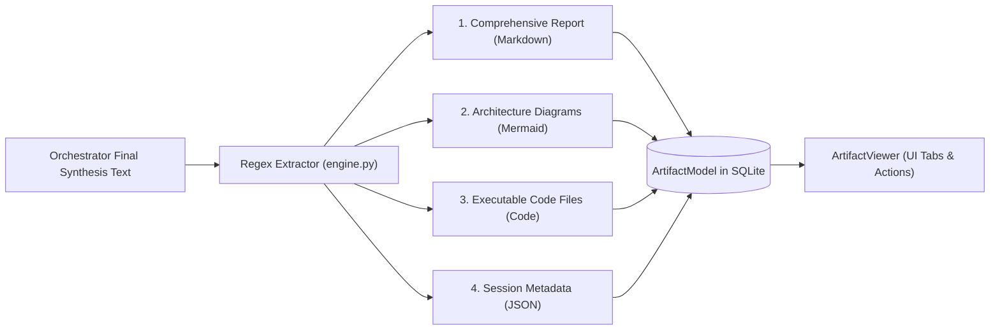
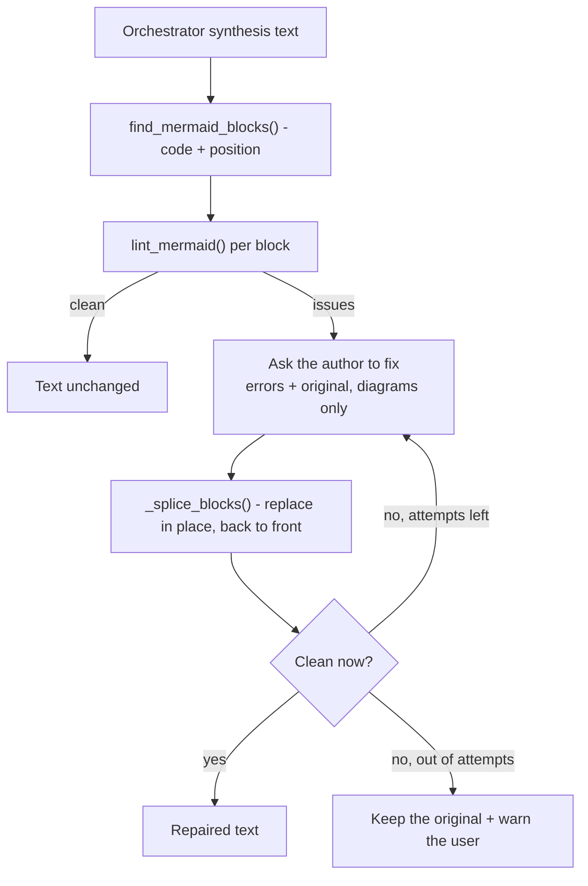

# Artifact Synthesis & Extraction

At the conclusion of a debate turn, the Master Orchestrator generates a comprehensive consensus synthesis. The engine parses this synthesis into discrete, typed **Artifacts** saved in the database and rendered interactively in the web UI.

---

## 1. Artifact Extraction Architecture

The extraction logic in [`_extract_artifacts_from_synthesis()`](file:///d:/MultiAgentOrchestrator/app/orchestration/engine.py#L372-L436) parses the Orchestrator's raw markdown text using regex tokenizers and categorizes outputs into four structured types:



---

## 2. Supported Artifact Types

### 2.1. Comprehensive Report (`markdown`)
- **Type**: `markdown`
- **Title**: `종합 아키텍처 & 산출물 보고서 (Final Synthesis Report)`
- **Content**: The full narrative report written by the Master Orchestrator, including executive summaries, decision matrices, edge-case audit findings, and verification steps.
- **Rendering**: Rendered as GitHub-flavored Markdown with table styling and syntax-highlighted code blocks.

### 2.2. Architecture Diagrams (`mermaid`)
- **Type**: `mermaid`
- **Title**: `시스템 아키텍처 다이어그램 #1`, `#2`, etc.
- **Extraction Pattern**: Blocks fenced with ` ```mermaid ... ``` `, plus three fallbacks
  that exist because the diagram tab kept coming up empty:
  - **Unterminated fences** are extracted to end of text. A synthesis report truncated by
    `max_tokens` mid-diagram used to yield no artifact at all, since the old regex needed
    a matching closing fence.
  - **Unlabelled blocks** whose first line starts with a diagram keyword (`graph`,
    `flowchart`, `sequenceDiagram`, …) are treated as Mermaid.
  - **Transcript fallback**: if the synthesis report contains no diagram, the most recent
    diagram in the debate transcript is promoted to an artifact, titled with its author.
    Models routinely draw the architecture during the debate and omit it from the summary.
- **Normalisation**: [`normalize_mermaid()`](file:///d:/MultiAgentOrchestrator/app/orchestration/engine.py)
  normalises line endings and quotes bracket labels containing parentheses
  (`A[결제 (Payment)]` → `A["결제 (Payment)"]`), the most common way an LLM-authored diagram
  fails to parse. Shape syntax (`[(cylinder)]`, `[[subroutine]]`, `[/parallelogram/]`) is
  left alone.
- **Syntax check & self-repair** (v0.5.0): before the synthesis is committed, every diagram
  is linted and the orchestrator is asked to fix what fails. See §3 below.
- **Rendering**: Rendered into interactive SVG diagrams via NiceGUI's embedded Mermaid.js
  renderer. If Mermaid rejects the source anyway, the viewer catches the renderer's `error`
  event and shows the parse error plus the raw source instead of a blank panel.
- **Supported Diagrams**: Flowcharts (`graph TD/LR`), Sequence Diagrams (`sequenceDiagram`), State Diagrams (`stateDiagram-v2`), and Entity-Relationship Diagrams (`erDiagram`).

### 2.3. Executable Code Files (`code`)
- **Type**: `code`
- **Title**: `핵심 구현 소스코드 ({language}) #1`, `#2`, etc.
- **Extraction Pattern**: Code blocks matching languages: `python`, `py`, `typescript`, `javascript`, `bash`, `shell`, `json`, `toml`, `sql`.
- **Rendering**: Displayed with language-specific syntax highlighting, line numbers, and a dedicated **"Copy Code"** button.

### 2.4. Session Metadata & Summary (`json`)
- **Type**: `json`
- **Title**: `세션 메타데이터 & 토론 요약 (JSON)`
- **Content**: Auto-generated structured session record:
  ```json
  {
    "session_id": "9efca23a-f10d-45db-90cf-195b6cfa4521",
    "goal": "Design a real-time event streaming pipeline...",
    "strategy": "sequential_debate",
    "total_rounds": 3,
    "participating_agents": ["orchestrator", "architect", "coder", "critic"],
    "total_messages": 11,
    "consensus_reached": true
  }
  ```

---

## 3. Diagram Self-Repair (v0.5.0)

Diagrams written by an LLM fail to parse often. Until v0.5.0 a broken one became an artifact
as-is, and the user found out when they opened the tab — by which point the debate had ended
and nobody was left to fix it. Asking again meant running a whole new turn.

The synthesis is now checked **before it is recorded**, and anything broken goes back to its
author with the renderer's complaint attached.



The loop runs at most `MERMAID_REPAIR_ATTEMPTS` (2) times. Two is enough: a model handed a
precise error usually fixes it on the first pass, and one that fails twice will not succeed
on a third. **When it gives up it keeps the original** — an invented diagram is worse than a
broken one the user can see and report.

### 3.1. Why the linter is deliberately incomplete

[`app/mermaid_lint.py`](file:///d:/MultiAgentOrchestrator/app/mermaid_lint.py) is **not** a
Mermaid parser. Reimplementing the grammar in Python is a losing race, and a Node renderer
cannot be shipped in the air-gapped bundle. Each rule was instead calibrated against the real
`mermaid.parse()` running in a browser.

The asymmetry drives every design choice:

| | Cost |
| :--- | :--- |
| **Missed error** (false negative) | Same as before — the user sees it in the viewer. |
| **Wrongly flagged** (false positive) | An LLM call spent on a diagram that was fine, and a model with nothing to fix ruining a working diagram. |

So rules with any doubt were left out. `A --|label| B` is genuinely invalid — but
`A ---|label| B`, one dash longer, is **valid**, and no substring test separates them.

Rules that survived calibration:

| Rule | Catches |
| :--- | :--- |
| `paren-in-label` | Unquoted `()` inside `[..]`, `(..)`, `{..}` and `|..|` labels (flowcharts only — `actor C as 고객 (앱)` is valid in a sequence diagram) |
| `bracket-balance` | `A[결제 서비스 --> B[주문]` |
| `subgraph-unclosed` / `stray-end` | Mismatched `subgraph` / `end` |
| `end-as-node` | `start --> end` — lowercase `end` is reserved (`END` is fine) |
| `no-header` / `empty` | No diagram declaration on the first meaningful line |
| `block-unclosed` | `classDiagram` blocks with unbalanced `{}` |
| `bad-sequence-arrow` | `==>` in a sequence diagram (valid in a flowchart) |
| `nested-quotes` | `A["그는 "안녕" 이라 했다"]` |

Two constructs are explicitly *not* flagged because they are valid and naive counting says
otherwise: **shape wrappers** (`[(cylinder)]`, `[[subroutine]]`, `[/parallelogram/]`) and
**multi-line quoted labels**, where the quote closes on a later line.

Calibration result against the real renderer: **30 valid diagrams — zero flagged; 13 diagrams
the renderer rejected — all caught.**

### 3.2. Repair mechanics

- **Only the broken blocks are sent.** The report body is never rewritten — the syntax is
  wrong, not the conclusion, and a rewrite makes the length unmanageable and the decisions
  unstable.
- **Positions, not string replacement.** `find_mermaid_blocks()` returns each block's span so
  identical diagrams appearing twice cannot be confused. Splicing runs back-to-front so
  earlier replacements do not shift later offsets. The span tracks the *stripped* code — using
  the raw span swallows the trailing newline and welds the closing fence onto the last line.
- **Fewer replacements than requested is fine.** If the model skips one diagram, the ones it
  did fix are still applied.
- **Tools and sequential thinking are switched off** for the repair call, the same reasoning
  as speaker selection: a mechanical call with tools attached starts reading files instead of
  fixing syntax.
- **It runs inside `_speak(post_process=...)`**, before the DB write and before
  `message_added`. The streaming card is overwritten with the final text, so what the user
  ends up reading is the repaired version.

The UI is told either way — `mermaid_repair_started` drives the progress banner, and
`mermaid_repair_finished` raises a positive or a warning toast. A failure that is not
announced would only surface as an empty diagram tab later.

---

## 4. Standalone HTML Export

The Artifact Viewer's **HTML** button produces a single self-contained page with pan/zoom,
a source view, a theme toggle, and PNG/SVG save buttons.

Until v0.5.0 "self-contained" was not true: the page fetched the Mermaid renderer from a CDN
every time it was opened. On an air-gapped network — the platform's headline deployment
target — the script never loaded, `mermaid.initialize(...)` threw `mermaid is not defined` on
the first line, and **the entire inline script died with it**, taking the toolbar and zoom
controls along. What remained was the raw source rendered in the dark theme's white text on
the always-light diagram panel: white on white. The symptom users reported was "a blank white
page".

Three changes:

1. **The rendered SVG is embedded.** The viewer already has the diagram on screen;
   `MadoMermaid.getStandaloneSvg()` extracts it and the exported file carries it inline. When
   an SVG is embedded the CDN `<script>` tag is **not emitted at all** — a downloaded file
   contains zero external URLs.
2. **The renderer is optional.** If the SVG could not be captured the export falls back to the
   CDN, but now checks `typeof mermaid` first and wraps `initialize()` in `try`. A missing
   renderer produces a warning banner and readable source; the toolbar keeps working.
3. **The diagram panel pins its text colour** (`#0f172a`). The panel is always light, so
   inheriting the dark theme's foreground guaranteed invisible fallback text.

Two smaller fixes rode along: the Mermaid source is now HTML-escaped inside the `.mermaid`
element (Mermaid reads `textContent`, so the grammar is unaffected, but a diagram containing
`<` no longer gets eaten by the HTML parser), and save filenames are JSON-encoded so a title
with an apostrophe no longer lands as `&#x27;` in the file name.

---

## 5. Storage & UI Integration

- **Database Entity**: Each extracted item is committed as an [`ArtifactModel`](file:///d:/MultiAgentOrchestrator/app/database/models.py#L80-L92) record linked via foreign key to `sessions.id`.
- **UI Viewer**: Rendered in [`ArtifactViewer`](file:///d:/MultiAgentOrchestrator/app/ui/components/artifact_viewer.py) as tabbed cards on the right-hand panel of the workspace. Users can switch between tabs, copy snippets, or download raw files with a single click.
