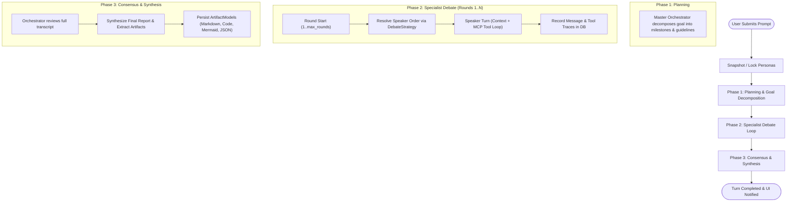

# Orchestration Engine & Execution Lifecycle

The [`OrchestratorEngine`](file:///d:/MultiAgentOrchestrator/app/orchestration/engine.py#L33-L436) coordinates the multi-agent debate workflow, turn management, database synchronization, and artifact synthesis. It implements an asynchronous state machine inspired by StateGraph patterns.

---

## 1. The 3-Phase Orchestration Workflow

Every user prompt initiates a 3-phase execution turn:



---

## 2. Phase Breakdown

### Phase 0: Borrowing the MCP Runtime
Before anything else, `run_turn()` acquires the MCP runtime for this session's workspace
and holds it for the whole turn, releasing it in a `finally` so the reference is returned
however the turn ends — completion, user stop, cancellation, or an exception. Sessions
pointing at the same folder share one runtime; a different folder gets its own group of
server processes, which is what allows debates in different workspaces to run at the same
time. Every `call_agent()` in the turn is handed that runtime explicitly. See
[Runtime Isolation](file:///d:/MultiAgentOrchestrator/wiki/mcp/runtime-isolation.md).

### Phase 1: Planning & Goal Decomposition
1. **Multi-Turn Context Restoration**: At the start of a turn, the engine loads all previous `MessageModel` records for the session from SQLite into `state.messages`. This ensures previous user prompts and agent remarks are fully restored.
2. The user's input is saved as a `MessageModel` with `sender_key = "user"` and `round_number = 0`.
3. The engine invokes the **Master Orchestrator** with a planning prompt (which incorporates a summary of past session history if multiple turns have occurred, plus the **pinned user record** — every earlier user message in full — and, in the system prompt, the saved **decision ledger**; see [Conversation Memory](context-memory.md)).
4. The Orchestrator deconstructs the request, identifies system constraints, and assigns specific responsibilities to each participating specialist. The planning prompt carries a **roster** of this turn's active specialists (the orchestrator excluded), built by `format_roster()`: one line per agent with name, role and MCP tool server names, e.g. `- Senior Python Engineer (Implementation) · 도구: filesystem`. System prompts are deliberately left out — a few dozen tokens per agent is enough to divide work, while personas cost thousands per call. Tool servers are listed so work that needs a tool (writing files) goes to an agent that has it; the sequential-thinking server is omitted because it does no work. The orchestrator is told to address each specialist by the listed name and not to assign roles outside the list. Previously the first-turn prompt hard-coded "(Architect, Coder, Critic)", so a session with a different roster had work handed to agents that did not exist, and later turns had no roster at all. Speaker selection and parallel dispatch use the same function with `with_keys=True`, since they return agent keys as JSON.
5. The plan is streamed incrementally to the UI and committed to the database. Its position is kept in `state.plan_index` so later speakers get it pinned in their goal message.

### Phase 2: Multi-Round Specialist Debate Loop
For each round $r \in [1, \text{max\_rounds}]$:
1. The active strategy (e.g. `sequential_debate`) determines the speaker order. Under `orchestrator_led` the orchestrator is asked, each round, which agents should speak.
2. For each agent in the speaker list:
   - [`_context_for_speech()`](file:///d:/MultiAgentOrchestrator/app/orchestration/engine.py) first folds old messages into the rolling summary if the request would exceed this agent's window, then [`_build_context_for_agent()`](file:///d:/MultiAgentOrchestrator/app/orchestration/engine.py) constructs the transcript labeled by speaker name and role. Its goal message pins the user record, this turn's plan and (when needed) the summary; pinned messages appear in the transcript as references.
   - The engine emits `message_stream_start` and streams response tokens via `message_stream_chunk` events in real time.
   - If the agent calls MCP tools (e.g. reading files or executing code in the sandbox), every tool invocation is stored in the database (`ToolCallRecordModel`) and streamed to the UI as a real-time event.
   - Once completed, the agent's full text response is finalized in the database (`MessageModel`) and emitted via `message_added`.
3. After every round except the last (and not after a stop request) the orchestrator updates the **decision ledger**, which every later call carries directly before its turn instruction (not in the system prompt, to keep the prompt cache).
4. Each speaker receives speeches made since it last spoke in full; older long speeches by others as their `## 요지` digest; its own, short and `@`-mentioning speeches with long code blocks referenced. See [Conversation Memory §2.4](context-memory.md).

### Phase 3: Consensus & Synthesis

`_speak()` accepts an optional `post_process` coroutine applied to the turn body **before** the
database write and before `message_added`. The synthesis call uses it to run the Mermaid
self-repair loop, so the streaming card is finalised with the corrected text and the artifacts
are extracted from it. Failures inside `post_process` are logged and the original body is kept
— post-processing must never cost a turn. See
[Artifact Synthesis §3](file:///d:/MultiAgentOrchestrator/wiki/orchestration/artifact-generation.md).

1. Once all debate rounds conclude, the engine transitions to `status = "synthesizing"`.
2. The **Master Orchestrator** receives the complete transcript of the debate.
3. The Orchestrator synthesizes the consensus, integrating architectural proposals, code revisions, and security audit recommendations.
4. [`_extract_artifacts_from_synthesis()`](file:///d:/MultiAgentOrchestrator/app/orchestration/engine.py#L372-L436) parses the output, extracting code blocks, Mermaid diagrams, and JSON summaries into individual [`ArtifactModel`](file:///d:/MultiAgentOrchestrator/app/database/models.py#L80-L92) records.
5. `artifacts_synthesized` is sent as soon as the artifacts are saved; then the ledger is updated once more with the conclusions, and the ledger and summary are saved to `sessions` (only on this path — an aborted turn saves neither).
6. The state status is marked `completed` with `is_consensus_reached = True`.

---

## 3. Real-Time Event Dispatching

The engine communicates with the UI layer through an asynchronous event callback (`EventCallback`):

```python
async def on_event(event: Dict[str, Any]) -> None:
    ...
```

### Event Specification:

| Event Type | Payload Attributes | UI Reaction |
| :--- | :--- | :--- |
| `status_changed` | `status`, `speaker`, `round` | Updates progress banner in the chat header. |
| `round_started` | `round`, `max_rounds` | Displays round transition notifications. |
| `message_stream_start` | `msg_id`, `sender_key`, `sender_name`, `sender_role` | Creates an in-flight streaming message card in the chat feed. |
| `message_stream_chunk` | `message_id`, `delta` | Appends streaming token chunks to the active markdown message card. |
| `message_added` | `message` dictionary | Finalizes or appends color-coded message bubble to feed. |
| `tool_executed` | `agent_key`, `agent_name`, `tool_call` | Appends collapsible accordion item showing input & output. |
| `mermaid_repair_started` | `agent_name`, `broken`, `total`, `attempt`, `max_attempts` | Progress banner: a diagram failed the syntax check and is being redrawn. |
| `mermaid_repair_finished` | `agent_name`, `resolved`, `attempts`, `remaining` | Positive toast when fixed; warning toast naming how many diagrams still fail. |
| `artifacts_synthesized` | `artifacts` list (this turn only) | Appended to the Artifact Viewer's tabs (`add_artifacts`); earlier turns' tabs stay. |
| `graph_started` / `graph_step_started` / `graph_gate_decided` / `graph_finished` | graph id and nodes; `step`, `max_steps`, active `nodes`; `node_id`, `decision`, `reason`, `fallback`; `reason` (`end` · `idle` · `step_cap` · `stopped`) | Graph debate only. Status line shows the step and its nodes; gate verdicts and early stops toast. `round_started` is also sent per step. |
| `ledger_update_started` / `ledger_updated` / `ledger_update_failed` | `reason`; `ledger` on success; `error` on failure | Status line; `ledger_updated` refreshes the roster's 결정 장부 panel; failure toasts and keeps the previous ledger. |
| `context_summarizing` / `context_summarized` / `context_summary_failed` | `agent_name`; `messages` / `folded`, `total` / `error` | Status line and toasts. On failure the oldest messages are dropped as before. |
| `turn_completed` | `status`, `failed_agents`, `error_message` | Re-enables user input and marks personas locked; names any agent that never answered. |
| `run_finished` | `status` (`completed` / `failed` / `cancelled`), `error` | Emitted by `DebateRunner`, not the engine. Detaches the page's subscription. |

---

## 4. Who Owns the Running Turn

`run_turn()` is never awaited from a page callback.
[`DebateRunner`](file:///d:/MultiAgentOrchestrator/app/orchestration/runner.py) owns it:
`runner.start(session_id, prompt)` spawns an `asyncio.Task` and returns immediately.

This is not a detail. Awaiting the turn inside a NiceGUI click handler tied the debate to
one browser client, and that had two consequences:

- Refreshing the page, or visiting `/personas/{id}`, deleted the client. The coroutine
  kept a slot whose parent element was then garbage-collected, so the next UI update
  raised `RuntimeError: The parent element this slot belongs to has been deleted.` — which
  propagated out of `run_turn()` and killed the debate, usually near the end of a turn.
- Even when it survived, there was no way to see progress after coming back.

`DebateRunner` keeps a `TurnRun` per session with two things:

| | Purpose |
| :--- | :--- |
| **Canonical snapshot** | Every message emitted this turn, with live-updated content, plus `streaming_ids`, current artifacts, and the busy label. A page attaching mid-debate renders this. |
| **Subscriber queues** | One bounded `asyncio.Queue` per attached page. A page that goes away just loses its queue. A page that cannot keep up is dropped, not the run. |

The runner never touches NiceGUI. The task is created with `asyncio.create_task`, which
starts with an empty `Slot` stack, so UI elements cannot be created from it even by mistake.

On the UI side ([`app/ui/app.py`](file:///d:/MultiAgentOrchestrator/app/ui/app.py)):

- `load_session_state()` renders DB messages, then merges in the run's snapshot messages
  by id for anything not yet committed, and re-registers the streaming card so incoming
  chunks have somewhere to land. A *finished* run's snapshot is ignored — the database is
  authoritative once the turn ends.
- `client.on_delete` unsubscribes. Every component (`ChatFeed`, `AgentRosterControl`,
  `ArtifactViewer`) exposes `alive` and ignores updates aimed at a deleted page.
- Server shutdown cancels outstanding runs via `DebateRunner.shutdown()`; deleting a
  session cancels its run via `forget()`.

Runs in different workspaces are no longer refused. `DebateRunner` used to raise
`WorkspaceConflictError` when a second session tried to start a debate in a different
folder, because the MCP servers were shared process-wide and switching the workspace under
a running debate would have pointed its tools at someone else's files. With one runtime per
workspace there is nothing to clash over; the only remaining refusal is
`RuntimeCapacityError` when the runtime budget is exhausted.
