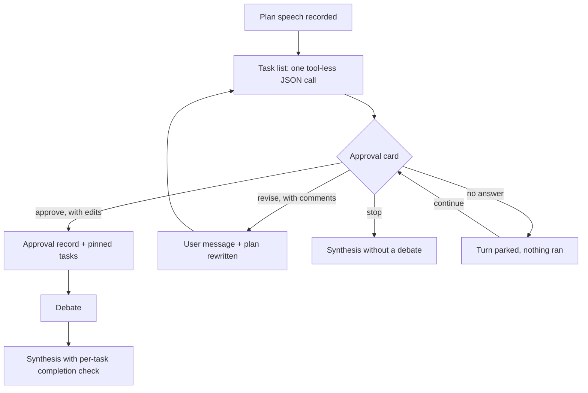

# Plan Approval: A Human Between the Plan and the Debate

After the orchestrator writes its plan (round 0), the engine opens an approval card and waits. No specialist
speaks until a human has answered. Design record:
[ADR-028](../../lectures/05-adr/ADR-028-plan-approval-gate.md).

Code: [app/orchestration/plan_gate.py](file:///d:/MultiAgentDebateOrchestration/app/orchestration/plan_gate.py)
(pure logic: parsing, settling, wording), `OrchestratorEngine._approve_plan` in
[app/orchestration/engine.py](file:///d:/MultiAgentDebateOrchestration/app/orchestration/engine.py),
`PlanApprovalRequest` in
[app/orchestration/control.py](file:///d:/MultiAgentDebateOrchestration/app/orchestration/control.py), and the
card in [app/ui/components/chat_feed.py](file:///d:/MultiAgentDebateOrchestration/app/ui/components/chat_feed.py).

---

## 1. Where it comes from

The algorithm is the one of the planning harness MCP server — `plan → human approval → execute → completion
check` — moved into the engine. That server existed for hosts that cannot be changed; it could only ask the
model to plan first, could not stop other tools from running before approval, and saw only the model's own
report of what it had done. MADO owns the loop, so the same steps become engine phases and those three
weaknesses do not exist here:

| Harness (MCP server) | MADO (engine phase) |
| :--- | :--- |
| The model must call `plan_and_think`; a prompt rule | The engine opens the card when the plan is recorded |
| Other tools can run before approval | Nobody speaks before approval, so no tool is called |
| `update_task_progress` is the model's own report | Who spoke and who failed is counted from the records |
| Approval page in a separate browser tab | Card in the same feed, in every screen showing the session |
| Completion approved by the human in a second gate | The synthesis report carries a per-task check; rework is the next request |

Handing that MCP server to the orchestrator as a tool was considered and rejected: it assumes one agent that
plans, executes and reports, while MADO's orchestrator only plans and synthesizes. After approval the server
would answer "execute task 1" while the engine asks for assignments — two instructions that contradict.

## 2. The flow



| Answer | What the engine does |
| :--- | :--- |
| **Approve** | The tasks and criteria as edited on the card become the approved assignment. Recorded as an orchestrator note with `turn_meta.kind = plan_approval` (`plan_id`, `tasks`, `changes`, `approver`). |
| **Revise** | The comments are recorded as a user message (`plan_revision`), including any task or criterion the human edited on the card — nothing typed is dropped. The orchestrator rewrites the plan from the previous plan plus the request, and the card opens again. No cap on revisions: each one takes a human click. |
| **Reject** | The card's button runs the existing abort: the request and the plan are deleted and the request text returns to the input bar. |
| **Stop** | The pending approval is closed without approving; the debate sees the stop and goes straight to synthesis. |
| **No answer** | After `plan_approval.timeout` the turn is parked (`PlanApprovalExpired`): status `failed`, phase `approval`, nothing executed. "이어서 진행" reopens the card with the same plan and the same task list. The run ends with `parked = true`, which the screen reports as a wait that ended, not as an error. |

An approval cannot carry a comment. While any comment box has text the approve button is hidden and the revise
button is shown (`plan_gate.card_actions`); `TurnControl.resolve_plan_approval` refuses the same combinations
for answers that do not come from the card.

## 3. The task list

The plan speech is prose. To let the human edit per-specialist tasks, the engine asks the orchestrator once
more — tools and sequential thinking off, like speaker nomination — for
`{"tasks": [{"agent", "task", "done_when", "alternatives"}]}`.

- `parse_tasks` always returns **every** specialist in roster order. Unknown agents are dropped, names are
  accepted in place of keys, a broken answer yields blank rows. A blank task means "follow the plan text".
- `alternatives` are for choices that are the human's preference. Picking one on the card puts its text in the
  task box; an approved task keeps no alternatives.
- The list is saved in `TurnModel.config.plan_gate` with the plan's message id, so a parked or interrupted
  turn shows the same card without another LLM call.

## 4. What approval changes downstream

| Place | Effect |
| :--- | :--- |
| Plan pin (`context_memory.build_plan_pin`) | The approved tasks follow the plan text, under a heading that says they win where the two differ. |
| Each specialist's turn prompt | Its own task and criterion are appended once more (`plan_gate.own_task`). Not in graph debates, where one agent may sit on several nodes. |
| Routing calls (nomination, parallel dispatch) | `_routing_record` carries the approved tasks so per-round assignments stay inside them. |
| Transcript | The approval note is replaced by a pointer to the pin; a plan that was rewritten is replaced by a one-line placeholder (`superseded_plans`). |
| Synthesis prompt | A block lists each task, its criterion and the **recorded** facts (speeches counted, response failures), and the report gets a third section: a per-task completion check. |

A turn that was not gated (`plan_approval.enabled = false`, no human channel, failed plan) produces exactly
the prompts it produced before.

## 5. Records and recovery

| Record | Where | Purpose |
| :--- | :--- | :--- |
| Proposed task list | `turns.config.plan_gate` | Reopen the same card after a park or a restart. |
| Revision request | `messages`, `turn_meta.kind = plan_revision`, sender `user` | The human's words; pinned in the user record as "계획 수정 요청". |
| Approval | `messages`, `turn_meta.kind = plan_approval`, sender `orchestrator` | What was approved, for which plan, and what the human changed. |
| Phase | `turns.phase = approval` | Tells the unfinished-turn bar that nothing ran and the card can be reopened. |

`turns.plan_position` returns the **last plan that was written** — a failed rewrite leaves the previous plan
in force. An approval counts only for the plan it names (`plan_id`); a turn rebuilt from records whose
approval points at another plan is treated as not approved. A revision request recorded before a crash is
answered first when the turn is continued.

## 6. Configuration

```json
"plan_approval": { "enabled": true, "timeout": 600 }
```

Read from the live `conf.json` at each plan, like tool security, so a change applies from the next request.
With no human channel (`control=None`: batch runs, tests) the gate is skipped; the test suite keeps it off
unless a test asks for the `plan_approval` fixture.
