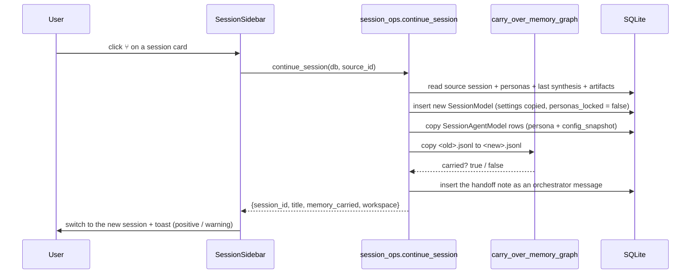

# Session Handoff — Continuing a Debate in a Fresh Context

*Added in v0.5.0.*

A long debate eventually fills every agent's context window. Rounds accumulate, `fit_context_window()` starts dropping the earliest turns, and the agents begin talking past decisions that were already made. The only remedy is a fresh conversation — but until v0.5.0 that meant losing everything the old one had accumulated.

**Session Handoff** creates a new conversation that inherits everything *except* the transcript.

---

## 1. Why the knowledge graph could not simply be "referenced"

The obvious workaround — start a new session, point it at the same workspace, and tell the agents to consult memory — **does not work**, and the reason is deliberate.

The bundled `memory` server ([mcp_servers/memory_scoped/index.mjs](file:///d:/MultiAgentOrchestrator/mcp_servers/memory_scoped/index.mjs)) stores one graph file per conversation:

```text
<MEMORY_GRAPH_DIR>/<session id>.jsonl
```

Which graph a call opens is decided by the **host**, not the model. `MCPManager.execute_tool()` stamps `_meta.conversationId` on every request, and the server resolves the graph id with metadata taking priority over arguments:

```js
// 메타데이터가 인자를 이깁니다. 스코프는 호스트가 아는 사실이고, 모델이
// graph_id 에 아무 값이나 적어도 남의 그래프를 열어서는 안 됩니다.
```

That guard exists so a model cannot read another conversation's graph by guessing an id. The side effect is that *no prompt can reach the previous session's graph* — an agent may pass `graph_id: "<old session>"` and it will be silently overridden.

**Since the host defines the boundary, the host must be the one to move it.** That is what `carry_over_memory_graph()` does.

---

## 2. What crosses over

| Carried | Not carried |
| :--- | :--- |
| Workspace directory (same folder — files and git history intact) | **Message transcript** — this is the thing being cleared |
| Knowledge graph (`<old>.jsonl` → `<new>.jsonl`) | `personas_locked` — the new session has not started yet |
| Agent roster, persona drafts, and `config_snapshot` | Artifacts (left on the source session; only *listed* in the note) |
| Strategy, `max_rounds`, `parallel_limit`, custom instructions | |
| The previous session's final conclusion (as a handoff note) | |

Copying `config_snapshot` matters for one specific case: an agent that has since been deleted from `conf.json` keeps speaking in the new session from its frozen snapshot, exactly as it did in the old one. Agents that still exist are re-frozen from the current `conf.json` at the next lock, so a model swap between sessions is honoured.

`personas_locked` is deliberately reset. The new conversation has not started, so the roster is editable again — and if the context blew up because of a model choice, that is precisely what the user will want to change.

---

## 3. The handoff note

The new session opens with a single message: an **orchestrator** turn (not a user turn — the user did not write it, and the sidebar's "started at" timestamp reads from user rows) containing:

```markdown
## 이전 세션 인수인계

- 원본 대화: **🛒 이커머스 마이크로서비스 아키텍처 토론** (발언 24건)
- 작업 공간: `D:\work\ecommerce` — 이전 세션이 만든 파일과 git 기록이 그대로 있습니다.
- 지식 그래프: **이어받았습니다.** `memory` 도구로 이전 세션이 기록한 사실을 그대로 조회할 수 있습니다.
- 이전 산출물: `최종 종합 아키텍처 보고서`, `시스템 아키텍처 다이어그램`, ...

### 이전 세션의 최종 결론

<the previous synthesis, trimmed to HANDOFF_SYNTHESIS_LIMIT>

---

위 결론은 **이미 합의된 것**입니다. 처음부터 다시 논쟁하지 말고 그 위에서 이어가세요.
확인이 필요한 것은 기억에 의존하지 말고 `filesystem`·`git` 도구로 작업 공간을 직접 보고,
`memory` 도구로 이어받은 지식 그래프를 조회하세요.
```

Three details are load-bearing:

- **The note states what did *not* come across.** If the graph copy failed or there was nothing to copy, the note says so and adds `없는 기억을 있다고 가정하지 마세요`. A half-successful handoff that hides its failure is worse than none: agents query an empty graph, come back empty-handed, and start inventing.
- **The conclusion is trimmed to 8,000 characters** (`HANDOFF_SYNTHESIS_LIMIT`). The whole point is to start with room; a note that reproduces the old transcript arrives back at the problem it was solving. The rest lives in the workspace files and the carried graph.
- **The conclusion falls back to the markdown artifact.** If the source has no orchestrator message — a synthesis call that failed after artifacts were already extracted, or an imported record — the most recent `markdown` artifact (the final report) is used instead. Without this fallback the handoff loses half its value.

---

## 4. Flow



`carry_over_memory_graph()` **copies, never moves** — reopening the source conversation must still find everything it recorded. It refuses to overwrite a target that already has content, and a failure anywhere (missing graph dir, unreadable file, OSError) returns `False` rather than raising: a graph that could not be moved is no reason to block the new conversation, as long as the note says so.

---

## 5. Where it lives

| Concern | Location |
| :--- | :--- |
| Session/persona/note creation | [`continue_session()`](file:///d:/MultiAgentOrchestrator/app/session_ops.py) |
| Note text | [`build_handoff_note()`](file:///d:/MultiAgentOrchestrator/app/session_ops.py) |
| Graph directory resolution | [`memory_graph_dir()`](file:///d:/MultiAgentOrchestrator/app/mcp/manager.py) — finds whichever server declares `MEMORY_GRAPH_DIR`, so renaming the server key does not break it |
| Graph copy | [`carry_over_memory_graph()`](file:///d:/MultiAgentOrchestrator/app/mcp/manager.py) |
| UI entry point | `⑂` button per session card in [`SessionSidebar`](file:///d:/MultiAgentOrchestrator/app/ui/components/sidebar.py) |

`memory_graph_dir()` calls `RootConfig.mcp_servers_for_workspace()`, which mutates the `WORKSPACE_DIR` environment variable as an intentional side effect (child MCP processes inherit it). Because this call is read-only, it saves and restores the previous value — otherwise resolving a path would silently re-point the servers that are currently running.

---

## 6. Constraints

- **A running debate cannot be handed off.** The `⑂` button is disabled while `DebateRunner.is_running(session_id)` — the conclusion does not exist yet, so the note would be half empty.
- **Title suffix does not stack.** Continuing a continued session yields `... (이어서)`, not `... (이어서) (이어서)`.
- **Artifacts stay on the source.** They are referenced by title in the note; the new session produces its own.
