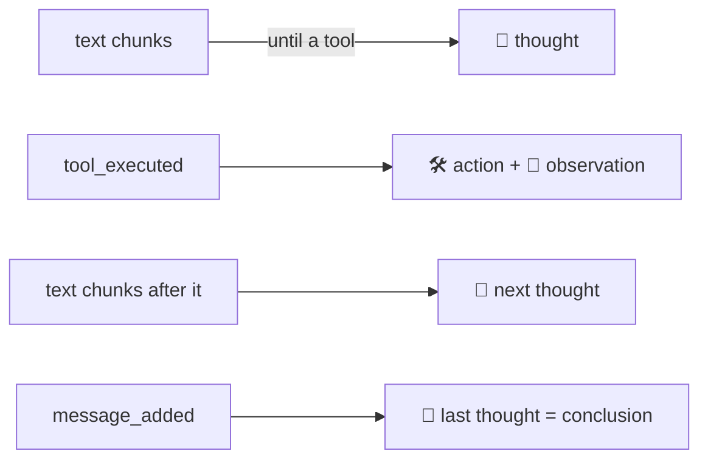

# Beginner Pages: Showing What an Agent Does, and Building One by Talking

`/trial/easy` is a separate set of pages for people who know AI only as a chatbot. It shows an agent
working (think → act → observe, with real tools), lets them build an agent through an interview instead of a
config form, and lets them hand it a task. Design record:
[ADR-029](../../lectures/05-adr/ADR-029-beginner-pages.md).

Code: [app/easy/](file:///d:/MultiAgentDebateOrchestration/app/easy/__init__.py) — `catalog.py` (plain-language
names for tools and skills, the demo agent, example tasks, example folder), `builder.py` (the interview and
saving), `sessions.py` (locked sessions, history), `loop.py` (events → steps, pure logic) and `pages/`.
There are four touch points outside the package:

- `setup_easy()` in [app/main.py](file:///d:/MultiAgentDebateOrchestration/app/main.py).
- A `쉬운 화면` button in the expert page header
  ([app/ui/app.py](file:///d:/MultiAgentDebateOrchestration/app/ui/app.py)), left of the `FastAPI + NiceGUI`
  badge. `EASY_HOME` is imported inside `create_ui()`: `app/ui/__init__.py` imports `app.ui.app`, so a top-level
  import would close a cycle through the trial pages.
- A `쉬운 화면` button in the trial header (`header()` in
  [app/trial/pages/common.py](file:///d:/MultiAgentDebateOrchestration/app/trial/pages/common.py)), shown to
  visitors and the owner alike. `EASY_HOME` is imported inside `header()` too, because `app.easy.pages.common`
  imports that module. The way back is the `체험 화면` button in `easy_header`.
- An `에이전트 만들기` button in the expert page's add-agent dialog
  ([app/ui/components/roster.py](file:///d:/MultiAgentDebateOrchestration/app/ui/components/roster.py)), which
  opens `FormBuilderChat` (§3).

The trial pages gain only that header button; the engine is unchanged.

---

## 1. Pages and who may use them

| Route | Page |
| :--- | :--- |
| `/trial/easy` | Welcome: chatbot vs. agent on the same question, the loop diagram, the four ingredients (persona · work instructions · tools · skills), start cards, my history and my agents |
| `/trial/easy/build` | Interview chat on the left, an editable blueprint on the right |
| `/trial/easy/run` | Pick agents (up to 4) and write a task. `?demo=1` preselects the demo agent and task; `?agent=<ref>` preselects one agent |
| `/trial/easy/s/{id}` | The run: tab "작업 진행 과정" (steps) and tab "전체 기록" (the usual `ChatFeed`) |

The pages live under `/trial/` so that trial visitors can reach them through the existing guest gate
(`app/trial/gate.py`) and log in with the existing name + PIN form (`next=` already accepts `/trial/...`).

| | Owner (loopback or access token) | Trial visitor |
| :--- | :--- | :--- |
| Login | none | trial login |
| Built agents are saved to | `conf.json` (`add_agent_to_conf_file`) | the `easy_agents` table, own use only |
| Agents offered for a run | demo agent + every `conf.json` specialist | demo agent + own agents |
| Tools in a run | as configured | `filesystem` only (`GUEST_SERVERS`) |
| Tool security mode | `tool_security.mode` from `conf.json` (approval cards as usual) | `read_only` |
| Work folder | `workspace/easy` | `workspace/easy-guest` |
| Sessions visible | all beginner sessions | own sessions only |

With `trial.enabled = false` the pages still work for the owner; visitors cannot reach them at all.

> **Allow rules beat read-only.** `policy.evaluate` checks `tool_security.allow` before the mode defaults. A
> write or exec allow rule in `conf.json` therefore applies to visitor sessions too. Visitors get no execution
> server at all, so the sandbox stays out of reach whatever the rules say; a write allow rule would still let
> them write into `workspace/easy-guest`. The shipped default is `allow: []`.

## 2. Think → act → observe from existing events

The engine already sends, in order, the text chunks of a speech (`message_stream_chunk`) and every executed
tool (`tool_executed`, emitted the moment it runs). `LoopTimeline.apply` stacks them as they arrive:



- Text that arrives after a tool is the next thought. There is no timing heuristic. An earlier version
  attached text that arrived within 0.2 s of a tool to the thought before it, to cover the engine's 0.1 s chunk
  batching. In the end-to-end run the next thought of a fast model arrived inside that window and was glued
  to the previous thought. Following arrival order costs at most the last few characters of a thought, and
  only when a tool finishes faster than the batch interval.
- `tool_executed` has no message id, so the speech is found by agent key. That is why beginner sessions are
  fixed to `sequential_debate` with one round. Further work goes into the same session as a follow-up.
- The session instructions ask every participant to say what it is about to do before calling a tool and
  to write one line on what it learned after. Without this, models often call a tool silently and the thought
  step is empty.
- Blocked and failed calls are shown as observations ("차단" / "실패"), in line with
  [ADR-014](../../lectures/05-adr/ADR-014-tool-failure-is-observation.md).
- The plan-approval record (`turn_meta.kind = plan_approval`) is shown as one line, not as a second plan.
- **Reloaded sessions** only have the speech text and its tool records, not their interleaving.
  `LoopTimeline.from_messages` marks such speeches `restored`, shows the actions first and the text as the
  conclusion, and the page says so.

Tool names are rendered in plain words by `catalog.tool_label`, e.g. `filesystem__read_text_file` +
`{"path": "sales.csv"}` → `파일 읽기: sales.csv`.

## 3. The builder

- **The helper.** A copy of the orchestrator with no tools, no skills and no sequential thinking (the same
  approach as the engine's `_tool_less`). It uses the orchestrator's endpoint and goes through the global LLM
  gate. The prompt (`builder_prompt`) lists only the tools and skills the viewer can actually pick, with
  plain names. For visitors it adds a read-only notice.
- **The blueprint block.** Every reply ends with a fenced ```` ```agent {...}``` ```` block whose keys are the
  `conf.json` field names (`name`, `role`, `system_prompt`, `allowed_mcp_servers`, `allowed_skills`,
  `card_color`, `icon`, plus `key`).
  - `split_reply` removes the block from the visible text, and `streaming_text` hides it while it streams.
  - `merge_draft` keeps the current value for unreadable fields.
  - `sanitize_draft` drops unknown servers and skills, and colours or icons outside `CARD_COLOR_CHOICES` /
    `ICON_CHOICES`.
- **Human edits win.** After the user edits the card, the next message carries the card as `[지금 설계도]`
  (`with_draft`), so the helper continues from it instead of overwriting it.
- **Owner preview.** The card shows the exact block that will be written ("conf.json 설정 미리보기").
  Model and key are left out so they inherit `llm`.
- **Saving.**
  - Owner — `save_owner_agent` runs these steps in order:
    1. Refuses while any debate runs. This is the same lock as the roster: one process-wide pool.
    2. Validates with `AgentConfig`, because the writer does not range-check.
    3. Picks a free key (`agent_key_for`: lowercase identifier, `_2`, `_3`… on collision, never
       `orchestrator`).
    4. Writes with `add_agent_to_conf_file`. `//` comments survive.
    5. Calls `reload_agent_pool()`. No restart is needed.
  - Visitor — `save_guest_agent` writes an `easy_agents` row, keeping only guest tools. A visitor can keep up
    to `MAX_GUEST_AGENTS` (20). `conf.json` is never touched.
- **From the expert page.** `FormBuilderChat` subclasses `BuilderScreen` and keeps its `send`. Its
  `read_card` returns the draft itself, and its `fill_card` draws a summary in place of the card. It opens
  from the add-agent dialog with the form's current values. **양식에 채우기** hands the draft back to that
  form, and the form's **추가** button saves it (`add_agent_to_conf_file`), not `save_owner_agent`. Details
  are in [Roster Editing §3](../agents/roster-editing.md).

## 4. Runs

`create_easy_session` builds a locked session the way the trial does
([ADR-011](../../lectures/05-adr/ADR-011-session-config-snapshot.md)):

- **Orchestrator:** its pool config, with tools removed (it only plans and synthesizes).
- **The owner's `conf.json` agents:** their own config, tools included.
- **The demo agent and visitor agents:** the orchestrator's connection settings with the blueprint's persona,
  tools and skills. Sequential thinking is off, because the page already shows the thinking as steps. Visitor
  agents are filtered to `GUEST_SERVERS`.

The work folder is created on first use by copying `app/easy/examples/` (sales CSV, meeting notes, customer
inquiries). The originals ship inside `app/`, so both packaging scripts carry them without changes. Approval
requests (plan or tool) switch the page to the "전체 기록" tab, where the existing cards are. The beginner
pages do not draw cards of their own.

## 5. Verification

- `tests/test_easy_loop.py`: step ordering, reloaded sessions, approval records, tool labels.
- `tests/test_easy_builder.py`: block parsing, filtering, keys, owner save into a temporary `conf.json`
  (comments kept, re-read, live pool), lock refusal, visitor save leaves `conf.json` byte-identical, and the
  helper has no tools.
- `tests/test_easy_sessions.py`:
  - visitor sessions are read-only, use guest tools only and run in their own folder;
  - owner agents keep their tools;
  - access isolation;
  - a full engine run whose events become thought → action → thought;
  - the reload path;
  - the guest gate, and mounting before `ui.run_with`.
- End-to-end against a scripted OpenAI-compatible server, with the real filesystem MCP server, for both
  roles. The run covered welcome → builder → save → demo run → plan approval → steps → reload. In it the owner
  wrote `report.md`, the visitor had no write tool, and the visitor could not open the owner's session.
